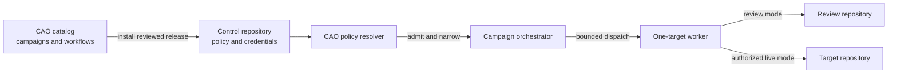
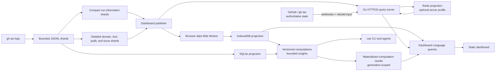

# Architecture

Central Agentic Ops (CAO) campaigns agentic operations and runs them from a
central GitHub repository against an explicitly bounded repository fleet. This
repository is both the public campaign catalog and a source-managed control plane
used to develop and exercise those campaigns.

This document is a map of the stable system boundaries and source tree. The
normative contracts live under `specs/`; operator-facing explanations live
under `docs/`.

## System context

CAO separates the decision to run an operation from the mechanism that executes
it:

- **Catalog:** publishes versioned operation campaigns.
- **Control repository:** owns rollout policy, credentials, installed
  workflows, and workflow runs.
- **Target repository:** supplies source data and may receive a declared safe
  output. It does not run control-plane workflows.
- **GitHub Agentic Workflows (gh-aw):** compiles workflow sources and owns
  execution capabilities, limits, authentication, and safe-output mechanics.

The effective authority of a run is the intersection of reviewed CAO policy,
the dispatch request, worker ceilings, credential reach, and capabilities
compiled by gh-aw. No one input can widen another.

## Runtime flows

### Operation execution

1. A schedule or manual dispatch starts an orchestrator in the control
   repository.
2. `.github/workflows/shared/control.md` and its Node.js support modules load
   `.github/workflows/cao.json` at the exact workflow revision and resolve an
   effective run envelope.
3. The orchestrator discovers, filters, ranks, and selects repositories within
   that envelope.
4. It dispatches one worker run for each selected repository.
5. Each worker revalidates the envelope, analyzes only its dispatched target,
   and emits only safe outputs declared by its compiled workflow.

Orchestrators decide rollout and selection; workers are independent,
single-target enforcement points.

### Activity, computations, and dashboard data

CAO Activity is a separate evidence pipeline. It supports observability but
grants no rollout or write authority.

Activity collects a bounded snapshot once and publishes immutable cache
artifacts. SQLite and IndexedDB are independently rebuildable projections of
the authoritative inputs. It deterministically separates compact, immutable run
information from detailed run-linked records so the browser data worker loads every run
before continuing with event shards. Raw Activity JSONL remains available only
inside the Activity cache for audits and projection rebuilds. The deployed
dashboard artifact contains the SQLite projection, inventory, and compacted
normalized run and record JSONL; browser ingestion fails closed rather than
falling back to raw Activity JSONL. Static-browser download, normalization, persistence, and queries run in a
dedicated Web Worker. The optional Redis profile ingests the same deployed
dashboard artifact in a Go HTTP(S) server, keeps Redis credentials server-side,
executes Dashboard Language in Go against Redis row sets, and returns only
canonical, bounded query payloads to the browser. It deliberately uses only
core Redis commands, not RediSearch or other Redis modules, so the hosted cost
floor is storage capacity rather than module support. Its local mode remains
loopback-only. Its host-neutral mode uses GitHub OAuth and explicit organization
or team authorization, verifies and deduplicates GitHub webhooks, and rebuilds
through a staged generation before atomically changing the active pointer.
Redis remains reconstructable from GitHub / gh-aw state and never becomes an
authority. The same server binary provides a read-only diagnostic check-up
that inspects the runtime, Redis safety and capacity, the active canonical
generation, query definitions, and the optional collection profile. It
produces the same stable check identifiers and observations as human-readable
text or versioned JSON, never contacts GitHub or mutates Redis, and requires an
explicit deep mode before reading every active row.

The Redis profile acquires evidence through exactly one of two mutually
exclusive ingestion profiles. By default the Activity workflow collects
evidence in GitHub Actions and publishes a snapshot that the server ingests.
As an alternative, the server itself collects evidence from GitHub App
installations, admitting webhook deliveries into a queue, collecting one
repository at a time with the same `gh aw logs --audit` and `activity/cao.mjs`
commands the workflow runs, and writing into an evidence lake laid out exactly
like a published snapshot. Because the layout is the same, one projector serves
both profiles and a retained lake repopulates a database on cold start without
contacting GitHub. Configuring both profiles fails at startup: a canonical
database has one writer. The main thread receives
only bounded view payloads in either profile. Versioned computations transform canonical evidence
into partitioned measures and actionable insights so consumers do not repeatedly
scan the full Activity corpus. Computation results remain derived evidence:
they preserve source quality and provenance and grant no operational authority.
The `cao computation runtime-health` command executes the first production
measure through declarative canonical queries. Future CLI measures extend the
same `computation` namespace.
Successful-Run value computations keep produced safe outputs, native
operational-grader measurements, and efficiency evidence separate; they do not
turn runtime success or output creation into accepted value.
Package-level `operational-value.mjs` programs compute repository-scoped metric
records through `cao operational-value`. Activity appends those timestamped
records to authoritative JSONL before the canonical Operational Value collection
is rebuilt in SQLite, IndexedDB, and the local Redis projection.
Package-level `problem-clustering.mjs` programs read a private Activity SQLite
snapshot and emit bounded problem records with actionable fix prompts through
`cao cluster-problems`.
Activity validates their output and atomically replaces only the contributing
package's rows in the disposable `cao_problems` SQLite projection; a failed
package computation retains its prior rows and cannot mutate canonical evidence,
while removing a package removes its rows on the next clustering run. Package
computations run as bounded, timed, cancelable subprocesses so one worker fault
does not block other contributors.
The browser materializes bounded runtime and failure-scope results by
generation, computes detailed audit causes only for selected or prioritized
partitions, and discards every result safely because canonical evidence remains
reconstructable.

## Source tree

| Path | Responsibility |
| --- | --- |
| `aw.yml` | Root catalog manifest and default CAO installation bundle. |
| `<operation>/aw.yml` | Campaign boundary and installation manifest for an operation. User-facing operations include `cao-evolution/`, `dependabot/`, `eu-cra-compliance/`, `optimization/`, `repo-assist/`, `self-care/`, `software-development-practices/`, and `uk-ai-advisory/`. |
| `<operation>/operational-value.mjs` | Optional deterministic repository-scoped operational-value computation installed with its package. |
| `<operation>/problem-clustering.mjs` | Optional bounded problem computation installed with its package. |
| `activity/` | Deterministic Activity collection, JSONL ingestion, SQLite projection, and the `cao` CLI. |
| `dashboard/` | Dashboard campaign, report/source adapters, local preview server, and static browser application. |
| `server/` | Optional host-neutral Go HTTP(S) service, deployed-artifact ingester, authenticated canonical API, webhook/rebuild control, Redis projection, and server-side Dashboard Language query engine. |
| `dashboard/site/src/data/` | Canonical browser data model, adapters, normalization, storage, and declarative query engine. |
| `research/` | Executable notebooks and experimental reference runtimes used to validate proposed computation semantics against canonical data; these are not dashboard production code. |
| `specs/computations.md` | Versioned computation, bounded insight, provenance, quality, and measure contracts. |
| `specs/repository-layout-and-installation.md` | Normative canonical runtime layout, ownership, materialization, and installation lifecycle contract. |
| `.github/workflows/*.md` | Editable gh-aw workflow sources. |
| `.github/workflows/*.lock.yml` | Generated workflow artifacts; never edit these directly. |
| `.github/workflows/shared/` | Shared policy resolution, control admission, checkout, review-bundle, and observability components. |
| `.github/workflows/cao.json` | Sole persistent, non-secret rollout policy for this source-managed control plane. |
| `.github/aw/` | gh-aw instruction, package, and generated campaign-ownership metadata only; CAO executable resources stay at their canonical catalog source paths. |
| `.github/cao/instructions.md` | CAO-specific operator and authoring guidance; it does not grant rollout authority or execution capabilities. |
| `skills/` | Portable Agent Plugin skills exposed by this repository. |
| `specs/` | Normative control, Activity, dashboard, and data contracts. |
| `docs/` | Explanatory and operator-facing documentation site. |
| `adr/` | Durable architectural decision history; normative contracts remain in `specs/` and specification-style documentation. |
| `tests/` | Unit, integration, load, and workflow-contract tests. |
| `scripts/` | Repository validation and maintenance utilities. |

Campaign manifests are the catalog's source of truth for installed workflows and
the trusted materializer bootstrap. The materializer copies executable resources
from the package's immutable full `resolvedCommit` SHA to the same top-level
paths they occupy in the catalog, replacing each bounded campaign-owned
destination so removed files cannot survive an update. Exact focused Activity
or Dashboard records retain ownership of their directories when root
materialization runs; all selected revisions are preflighted before replacement.
The Activity and Dashboard manifests are root-package components rather than
complete standalone installation entry points because gh-aw cannot invoke the
materialization hook. Source-managed and installed control repositories
therefore execute one layout. `.github/aw/` remains exclusively gh-aw-owned.

## Architectural boundaries

### Authority and execution

- CAO controls **whether and where** an operation runs; gh-aw controls **how**
  the admitted workflow runs.
- `.github/workflows/cao.json` is policy, not a credential store. Credentials
  stay in GitHub Actions secrets and are resolved inside a run.
- Review mode is the default. Live operation requires explicit campaign, worker,
  scope, and target authority.
- Target repository files cannot grant, narrow, or revoke control-plane
  authority.
- GitHub tools available to agents are read-only. Repository changes use only
  safe-output capabilities declared by the workflow.
- Missing policy, authority, credentials, access, or required evidence fails
  closed.

### Orchestrators and workers

- Orchestrators may discover and select only within resolved policy. They do not
  mutate target repositories.
- A worker processes exactly one dispatched target, cannot discover additional
  targets or dispatch more work, and cannot widen its mode.
- Dispatch envelopes carry repository identity, mode, review destination, and
  provenance. They never carry credentials.

### Evidence and presentation

- Activity records bounded evidence; it does not determine rollout, outcomes,
  or operational value.
- JSONL snapshots are authoritative inputs. Actions caches, SQLite, IndexedDB,
  and Redis generations are disposable transport or query projections, not durable
  authority.
- Missing, stale, partial, and zero evidence are distinct states.
- Computations consume canonical evidence, preserve its quality and provenance,
  and emit bounded, versioned results; they do not create authority or convert
  runtime success into verified outcomes or operational value.
- Overview counters use IndexedDB-native counts or generation-safe precomputed
  daily values. Run-table scans, failure clustering, and audit diagnosis are
  deferred to drill-down or compatible bounded materializations.
- Materialized computation results are generation-scoped disposable state.
  Runtime facts evaluate orchestrators first and enumerate worker targets only
  when orchestration is healthy enough to make worker evaluation meaningful.
  Worker facts use one evaluation partition per target so success on one target cannot mask
  failure on another. Failure scopes are precomputed; detailed audit causes
  and actions are selected-partition caches whose failure cannot invalidate
  valid upstream results.
- Dashboard selection, filtering, joins, grouping, aggregation, ordering, and
  pagination are declared in Dashboard Language. They execute in the data Web
  Worker for static deployment and in the Go query server for the Redis
  profile; compatible server plans push filtering, aggregation, ordering, and
  limiting into Redis.
- UI effects and components render query results; they do not reconstruct
  business relationships or query source data.
- The local Redis profile binds to loopback and serves HTTP for local debugging
  or HTTPS only with operator-supplied certificate files.
- The hosted Redis profile runs behind an explicitly trusted HTTPS proxy,
  authenticates users through GitHub OAuth plus explicit organization or team
  authorization, limits rebuild control to explicit administrators, verifies
  webhook signatures, deduplicates deliveries, and coordinates bounded
  request-independent rebuilds through Redis so multiple stateless replicas
  cannot replace the projection concurrently. Its client exposes the active
  GitHub login and supports explicit account switching through a fresh OAuth
  account-selection flow without combining account authority. Hosted transport
  is fail-closed: Redis always uses TLS, a public listener terminates TLS
  directly, and forwarded host/protocol headers are trusted only across a
  loopback-bound proxy boundary. Logout atomically removes active session
  authority before remote token revocation; transient GitHub failures retain
  encrypted credentials only in a durable Redis revocation queue drained by a
  bounded maintenance worker. Encrypted records identify their key so controlled
  rotation can retain the previous key until sessions and revocations drain.
  Refreshed sessions use an atomic compare-and-swap so logout cannot be undone
  by a concurrent OAuth refresh.
- Browsers and external clients never receive Redis endpoints or credentials.
  Redis generations are staged and validated before atomic activation; a failed
  rebuild leaves the previous generation active, and an empty Redis instance is
  healthy but not ready until rebuilt from authoritative GitHub / gh-aw inputs.

### Source and generated artifacts

- Edit `.github/workflows/*.md`, then compile with `gh aw compile`; do not edit
  `.lock.yml` files by hand.
- Keep executable campaign resource destinations aligned with their catalog
  source paths; do not add a parallel installed-runtime tree under `.github/aw/`.
- Update installed campaign records through gh-aw campaign commands rather than
  editing `.github/aw/campaigns/*.json`.
- Keep policy and workflow changes together because admission resolves policy
  at the exact workflow SHA.

## Technology choices

- **GitHub Actions and gh-aw** provide the execution environment, workflow
  compiler, agent harness, authentication, and safe-output processing.
- **Node.js 24 and ECMAScript modules** implement dependency-light control,
  collection, data, and local tooling.
- **JSONL** is the bounded evidence interchange; **SQLite** supports local tools
  and agents; **IndexedDB** supports the static browser dashboard; **Redis**
  supports the optional disposable server projection with generation-scoped row
  sets and no module requirement.
- **Go** implements the isolated host-neutral HTTP(S) ingestion, reconciliation,
  rebuild, and query service.
- **Dashboard Language** keeps data operations declarative and off the browser
  main thread.
- **Astro/Starlight** builds the documentation site. The operational dashboard
  is a separately bundled static application published through GitHub Pages.

## Where to read next

- `specs/control-architecture.md` defines authority, admission, and execution
  invariants.
- `specs/activity.md` defines evidence collection and snapshot semantics.
- `specs/dashboard-data.md` defines the canonical data architecture.
- `specs/dashboard.md` defines the dashboard product contract.
- `specs/repository-layout-and-installation.md` defines canonical runtime layout and installation conformance.
- `docs/architecture.md` explains the control plane for operators.
- `AGENTS.md` records repository conventions and focused validation commands.

Update this file when a top-level subsystem, dependency direction, authority
boundary, or source-of-truth location changes. Record narrower design rationale
in `adr/`, but put current requirements and conformance rules in the relevant
normative specification.
