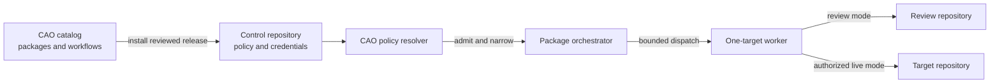
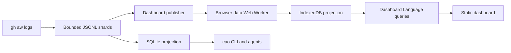

# Architecture

Central Agentic Ops (CAO) packages agentic operations and runs them from a
central GitHub repository against an explicitly bounded repository fleet. This
repository is both the public package catalog and a source-managed control plane
used to develop and exercise those packages.

This document is a map of the stable system boundaries and source tree. The
normative contracts live under `specs/`; operator-facing explanations live
under `docs/`.

## System context

CAO separates the decision to run an operation from the mechanism that executes
it:

- **Catalog:** publishes versioned operation packages.
- **Control repository:** owns rollout policy, credentials, installed
  workflows, and workflow runs.
- **Target repository:** supplies source data and may receive a declared safe
  output. It does not run control-plane workflows.
- **GitHub Agentic Workflows (gh-aw):** compiles workflow sources and owns
  execution capabilities, limits, authentication, and safe-output mechanics.

The effective authority of a run is the intersection of reviewed CAO policy,
the dispatch request, worker ceilings, credential reach, and capabilities
compiled by gh-aw. No one input can widen another.

## Runtime flows

### Operation execution

1. A schedule or manual dispatch starts an orchestrator in the control
   repository.
2. `.github/workflows/shared/control.md` and its Node.js support modules load
   `.github/workflows/cao.json` at the exact workflow revision and resolve an
   effective run envelope.
3. The orchestrator discovers, filters, ranks, and selects repositories within
   that envelope.
4. It dispatches one worker run for each selected repository.
5. Each worker revalidates the envelope, analyzes only its dispatched target,
   and emits only safe outputs declared by its compiled workflow.

Orchestrators decide rollout and selection; workers are independent,
single-target enforcement points.

### Activity and dashboard data

CAO Activity is a separate evidence pipeline. It supports observability but
grants no rollout or write authority.

Activity collects a bounded snapshot once and publishes immutable cache
artifacts. SQLite and IndexedDB are independently rebuildable projections of
the authoritative inputs. Browser download, normalization, persistence, and
queries run in a dedicated Web Worker. The main thread receives only bounded
view payloads.

## Source tree

| Path | Responsibility |
| --- | --- |
| `aw.yml` | Root catalog manifest and default CAO installation bundle. |
| `<operation>/aw.yml` | Package boundary and installation manifest for an operation. User-facing operations include `cao-evolution/`, `dependabot/`, `eu-cra-compliance/`, `optimization/`, `repo-assist/`, `self-care/`, `software-development-practices/`, and `uk-ai-advisory/`. |
| `activity/` | Deterministic Activity collection, JSONL ingestion, SQLite projection, and the `cao` CLI. |
| `dashboard/` | Dashboard package, report/source adapters, local preview server, and static browser application. |
| `dashboard/site/src/data/` | Canonical browser data model, adapters, normalization, storage, and declarative query engine. |
| `.github/workflows/*.md` | Editable gh-aw workflow sources. |
| `.github/workflows/*.lock.yml` | Generated workflow artifacts; never edit these directly. |
| `.github/workflows/shared/` | Shared policy resolution, control admission, checkout, review-bundle, and observability components. |
| `.github/workflows/cao.json` | Sole persistent, non-secret rollout policy for this source-managed control plane. |
| `.github/aw/` | Runtime resources and installed package ownership records used by workflows in this repository. |
| `skills/` | Portable Agent Plugin skills exposed by this repository. |
| `specs/` | Normative control, Activity, dashboard, and data contracts. |
| `docs/` | Explanatory and operator-facing documentation site. |
| `adr/` | Durable architectural decision history; normative contracts remain in `specs/` and specification-style documentation. |
| `tests/` | Unit, integration, load, and workflow-contract tests. |
| `scripts/` | Repository validation and maintenance utilities. |

Package manifests are the catalog's source of truth for package contents.
Package source may install files into different destinations, so ownership is
defined by manifests rather than by directory proximity.

## Architectural boundaries

### Authority and execution

- CAO controls **whether and where** an operation runs; gh-aw controls **how**
  the admitted workflow runs.
- `.github/workflows/cao.json` is policy, not a credential store. Credentials
  stay in GitHub Actions secrets and are resolved inside a run.
- Review mode is the default. Live operation requires explicit package, worker,
  scope, and target authority.
- Target repository files cannot grant, narrow, or revoke control-plane
  authority.
- GitHub tools available to agents are read-only. Repository changes use only
  safe-output capabilities declared by the workflow.
- Missing policy, authority, credentials, access, or required evidence fails
  closed.

### Orchestrators and workers

- Orchestrators may discover and select only within resolved policy. They do not
  mutate target repositories.
- A worker processes exactly one dispatched target, cannot discover additional
  targets or dispatch more work, and cannot widen its mode.
- Dispatch envelopes carry repository identity, mode, review destination, and
  provenance. They never carry credentials.

### Evidence and presentation

- Activity records bounded evidence; it does not determine rollout, outcomes,
  or operational value.
- JSONL snapshots are authoritative inputs. Actions caches, SQLite, and
  IndexedDB are disposable transport or query projections, not durable
  authority.
- Missing, stale, partial, and zero evidence are distinct states.
- Dashboard selection, filtering, joins, grouping, aggregation, ordering, and
  pagination are declared in Dashboard Language and execute in the data Web
  Worker.
- UI effects and components render query results; they do not reconstruct
  business relationships or query source data.

### Source and generated artifacts

- Edit `.github/workflows/*.md`, then compile with `gh aw compile`; do not edit
  `.lock.yml` files by hand.
- Update installed package records through gh-aw package commands rather than
  editing `.github/aw/packages/*.json`.
- Keep policy and workflow changes together because admission resolves policy
  at the exact workflow SHA.

## Technology choices

- **GitHub Actions and gh-aw** provide the execution environment, workflow
  compiler, agent harness, authentication, and safe-output processing.
- **Node.js 24 and ECMAScript modules** implement dependency-light control,
  collection, data, and local tooling.
- **JSONL** is the bounded evidence interchange; **SQLite** supports local tools
  and agents; **IndexedDB** supports the static browser dashboard.
- **Dashboard Language** keeps data operations declarative and off the browser
  main thread.
- **Astro/Starlight** builds the documentation site. The operational dashboard
  is a separately packaged static application published through GitHub Pages.

## Where to read next

- `specs/control-architecture.md` defines authority, admission, and execution
  invariants.
- `specs/activity.md` defines evidence collection and snapshot semantics.
- `specs/dashboard-data.md` defines the canonical data architecture.
- `specs/dashboard.md` defines the dashboard product contract.
- `docs/architecture.md` explains the control plane for operators.
- `AGENTS.md` records repository conventions and focused validation commands.

Update this file when a top-level subsystem, dependency direction, authority
boundary, or source-of-truth location changes. Record narrower design rationale
in `adr/`, but put current requirements and conformance rules in the relevant
normative specification.
