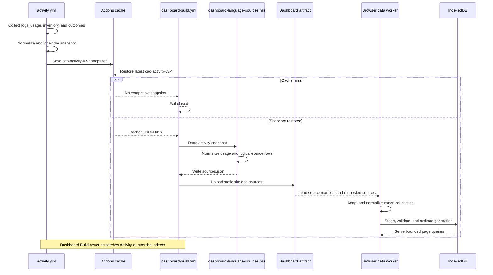

# CAO Activity

CAO Activity is the shared data collector for Central Agentic Ops. CAO needs to
combine installed workflow definitions, recent GitHub Actions runs, and `gh aw`
logs and artifacts. Without a shared collector, every report would have to find
and interpret that information again. That would waste limited GitHub API
capacity and could give different views answers captured at different times.

Activity collects the information once, turns it into consistent records, and
saves a fixed snapshot for reuse. Dashboard reports can then build from the same
point-in-time input without repeating the collection work. The snapshot also
records whether its data is available, complete, and fresh, so a dashboard can
distinguish a real zero from missing data. Stale or incomplete data must still
be refreshed; the snapshot is not permanent historical authority.

## How Activity works



The sequence separates collection from rendering. Activity owns GitHub data
acquisition, indexing, normalization, and publication of the immutable cache
snapshot. Dashboard Build has read-only Actions access: it restores the latest
compatible snapshot and fails on a cache miss instead of starting a competing
Activity run. The adapter mines each retained usage record into Dashboard
Language table rows, including engine, model, token, cache-token, AI Credit,
estimated-cost, and source-health fields.

The browser reads the built report; it does not call GitHub APIs directly. Its
data worker keeps noncanonical logical sources in memory and persists only the
normalized Repository, Workflow, Run, Job, Session, and Event generation in
IndexedDB. Overview applies the selected horizon to bounded query results and
uses source health to distinguish a real zero from missing data.

## What `activity/aw.yml` installs

The package manifest installs two GitHub Actions workflows:

- `.github/workflows/activity.yml` is the scheduled and manually dispatchable
  snapshot publisher.
- `.github/workflows/cao-maintenance.yml` performs maintenance operations such
  as clearing CAO-managed caches.

It also installs the JavaScript resources used to collect admission and failure
evidence, download logs, record GitHub telemetry, build run-health snapshots,
and execute the activity pipeline. The package requires `gh-aw` v0.89.1 or
newer and is currently experimental.

The root CAO package installs Activity automatically. A focused installation can
use `githubnext/gh-aw-cao/activity@<catalog-release>`.

## Collection pipeline

The activity workflow runs `run-activity.mjs` as one `actions/github-script`
step. The pipeline sequentially:

1. restores the latest compatible CAO activity cache;
2. removes retained agent directories from cached run folders;
3. runs `gh aw logs --audit --artifacts usage` once for compiled workflows in the checked-out control repository;
4. retains compact run summaries plus normalized audit and agent/runtime/model/version metadata;
5. records control policy and control-plane inventory;
6. builds the deployed-workflow and run-health index; and
7. saves an immutable snapshot for downstream consumers.

The indexer transforms local files and the downloaded snapshot. It does not
perform additional GitHub API discovery.

### Audit and agent metadata

The `--audit` flag remains part of the single `gh aw logs` acquisition. With
`--artifacts usage`, gh-aw provides compact `audit.json`, `aw_info.json`, and
`run_summary.json` evidence without requiring heavyweight agent transcripts.
Activity retains bounded aggregates for behavior, engine configuration,
firewall analysis, MCP and tool usage, metrics, observability, recommendations,
and session analysis. It also retains non-secret agent, model, runtime, gh-aw,
firewall, and gateway identifiers from `aw_info.json`.

Before publication, the normalizer removes fields whose names indicate
arguments, authorization, bodies, content, credentials, inputs, messages,
outputs, prompts, responses, secrets, tokens, or transcripts. It also bounds
nesting, collection size, and string length. Tool-call Events may be derived
from aggregate `run_summary.json` calls when older raw timeline files are not
present. Audit evidence does not grant repository authority and is not used to
fill missing workflow-run fields through GitHub API calls.

## Snapshot contract

The workflow publishes files under `$RUNNER_TEMP/cao-activity/`, including:

```text
aic-usage.json
control-plane-inventory.json
control-settings.json
dashboard-records.json
deployed-workflows.json
gh-aw-logs.json
gh-aw-logs-state.json
operational-values.json
```

Snapshots use the immutable cache key
`cao-activity-v2-${github.run_id}-${github.run_attempt}` and restore prefix
`cao-activity-v2-`. Consumers that dispatch Activity wait for that exact run and
reconstruct its immutable key from the run ID and attempt.

The cache improves collection efficiency; it is not durable historical
authority. Consumers must fetch missing evidence when the restored snapshot is
absent, stale, incomplete, or outside their required repository scope.

## Failure and retained snapshot behavior

`gh aw` artifacts are authoritative when present. If `gh aw logs` fails,
Activity preserves a compatible cached snapshot and marks the current refresh
unavailable and incomplete. It does not fan out into workflow-run, run-detail,
or Jobs API fallback calls. Cached observations remain distinguishable from
evidence collected during the current refresh.

On a cold-cache failure, Activity writes an empty snapshot and marks run health
unavailable. Dashboard consumers must use source metadata rather than
interpreting an empty row array as complete zero activity.

## Dashboard views

### Overview

The [Overview](dashboard-overview.md) turns `runs`, `work-items`, and
`security-findings` into four attention counts: failed runs, blocked work,
items awaiting review, and security findings. The lower half of the diagram
above shows that derivation; the rules below define each branch precisely.

#### Failed runs

Activity records recent runs under each workflow's `runHealth.runRecords` in
`deployed-workflows.json`. The report builder turns those records into `runs`
rows. Overview counts rows whose conclusion is `failure`, `startup-failure`,
`stale`, or `timed-out`.

#### Blocked work

The report builder creates `work-items` by matching each installed workflow to
its newest run and newest reported outcome. A work item is blocked when its
latest run was denied or blocked by admission, or ended with `failure`,
`timed-out`, `startup-failure`, or `action-required`. Overview counts those
blocked rows.

#### Awaiting review

This metric uses the same `work-items`. A work item enters `review` when its
newest reported outcome is pending and its latest run is not already blocked,
queued, or in progress. Overview counts `review` rows.

#### Security findings

Activity extracts threat-detection results from collected `gh aw` run data.
The report builder checks the prompt-injection, secret-leak, and malicious-patch
verdicts. Each detected category becomes one `security-findings` row, and
Overview counts all of those rows.

Each generated source also says whether its data is available, complete, and
fresh. Overview shows an em dash or an incomplete-data message instead of
treating missing data as zero.

## GitHub API data

GitHub API quota observations are written separately to `cao-gh.jsonl` and
published as the 30-day `cao-gh` artifact. Entries contain stable operation and
non-secret credential classifications; credentials and cache file metadata are
never recorded.

## Local debugging

Copy `activity/.env.example`, set its non-secret paths and inputs, and run the
activity through Actions Toolkit shims:

```console
npm run activity:local -- activity/.env
```

To invoke an entrypoint directly with installed Toolkit packages, run:

```console
npm run activity:local:node -- activity/index.mjs
```

The maintainer-level file schema and run record contract are documented in
[`activity/README.md`](../activity/README.md).
