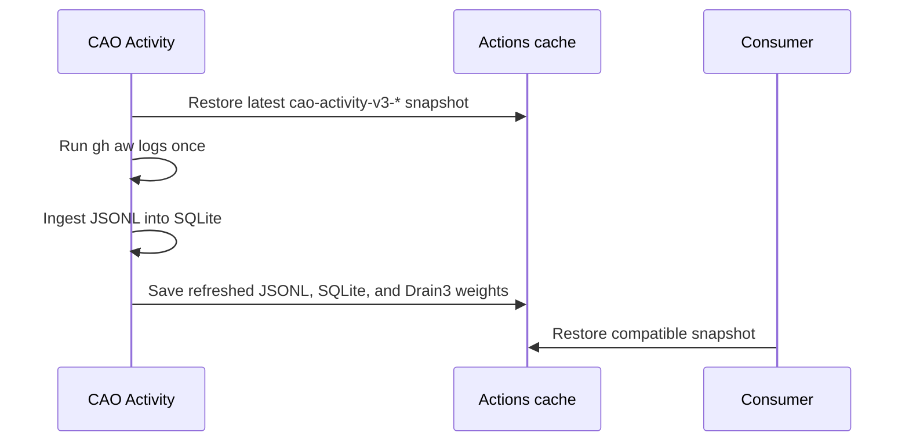

# CAO Activity

CAO Activity is the shared, bounded `gh aw logs` collector for Central Agentic
Ops. It prevents consumers from independently acquiring the same compiled
workflow history. It also materializes the canonical log projection in SQLite
so local tools and agents can query the snapshot without re-ingesting it.

## How Activity works



The scheduled and manually dispatchable `.github/workflows/activity.yml`
checks out the trusted control-repository source, restores its cache, collects
compiled workflow evidence with `gh aw logs --audit --artifacts usage`, ingests
the resulting JSONL through the dashboard's Node.js canonical data pipeline,
and stores both data files plus the generated Drain3 weights. Restored weights
are passed to the next `gh aw logs` invocation so log clustering can continue
learning across runs. Downloaded artifacts are job-local inputs and are not
cached.

Activity uses the `central-agentic-ops-activity` concurrency group with
`cancel-in-progress: false`, so a running refresh is never cancelled mid-flight
by the next scheduled trigger; GitHub Actions queues at most one pending
refresh behind it.

Runs collect a rolling 30-day window and recent artifact detail. The canonical
stores preserve every run summary available in the collected JSONL while
expiring detailed jobs, sessions, and events after 30 days.

## Cache contract

The cache holds:

```text
$RUNNER_TEMP/cao-activity/gh-aw-logs.jsonl
$RUNNER_TEMP/cao-activity/gh-aw-logs.sqlite
$RUNNER_TEMP/cao-gh-aw-logs/drain3_weights.json
```

Its immutable key is
`cao-activity-v3-${github.run_id}-${github.run_attempt}`; its restore prefix is
`cao-activity-v3-`. Consumers dispatched by Activity must restore the exact
completed run's cache key. The cache is evictable and is not historical
authority: consumers must enforce their own freshness, completeness, and scope
requirements. Agent jobs install the SQLite CLI before restoring this directory,
so they can query the normalized database directly.

## Installation

`activity/aw.yml` installs the Activity and maintenance workflows plus the
shared JSONL parser. The root CAO package installs Activity and the dashboard
ingestion runtime automatically.
