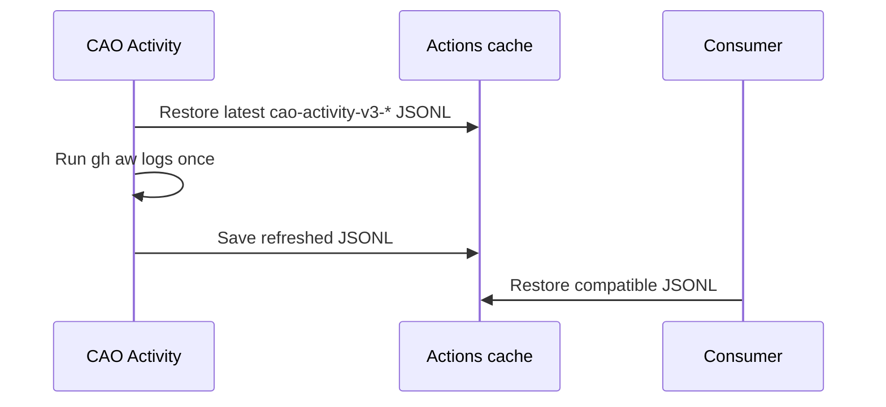

# CAO Activity

CAO Activity is the shared, bounded `gh aw logs` collector for Central Agentic
Ops. It prevents consumers from independently acquiring the same compiled
workflow history. It does not index, normalize, report on, or otherwise
post-process the collected logs.

## How Activity works



The scheduled and manually dispatchable `.github/workflows/activity.yml`
checks out the trusted control-repository source, restores its cache, runs one
bounded `gh aw logs --audit --artifacts usage` command for compiled workflows,
and stores the resulting JSONL. Downloaded artifacts are job-local inputs to
that command and are not cached.

Activity uses the `central-agentic-ops-activity` concurrency group with
`cancel-in-progress: false`, so a running refresh is never cancelled mid-flight
by the next scheduled trigger; GitHub Actions queues at most one pending
refresh behind it. A scheduled run also skips its own refresh (before
restoring the cache or downloading logs) when a successful scheduled run
already completed within the last 12 minutes, avoiding redundant work when a
prior run finished close to the next tick. Manual `workflow_dispatch` runs are
never skipped.

## Cache contract

The cache holds only:

```text
$RUNNER_TEMP/cao-activity/gh-aw-logs.jsonl
```

Its immutable key is
`cao-activity-v3-${github.run_id}-${github.run_attempt}`; its restore prefix is
`cao-activity-v3-`. Consumers dispatched by Activity must restore the exact
completed run's cache key. The cache is evictable and is not historical
authority: consumers must enforce their own freshness, completeness, and scope
requirements.

## Installation

`activity/aw.yml` installs the Activity and maintenance workflows plus the
shared JSONL parser. The root CAO package installs Activity automatically; a
focused installation can use `githubnext/gh-aw-cao/activity@<catalog-release>`.
