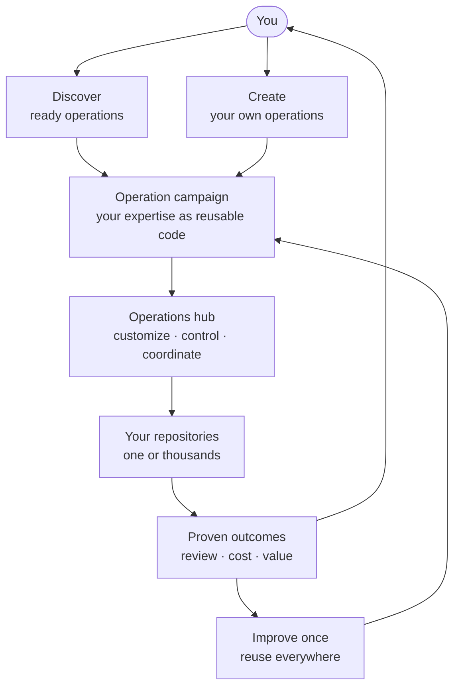

Central Agentic Ops brings **agentic operations as code** to GitHub.

## Campaign Once. Operate Everywhere.

Turn engineering expertise into a reusable operation campaign. Choose a ready
operation or build your own, customize it once, run it safely across any set of
repositories, and prove the value it delivers.

:::note[More than an agent factory or control plane]
An agent factory builds agents. A control plane governs them. CAO turns a
successful agent task into a reusable organizational capability.
:::

## All You Need

To get started, you need:

- a GitHub account with access to your organization;
- GitHub Actions and Copilot enabled;
- one repository to try it on.

The [Quickstart](getting-started.md) guides you through the rest.

## The Big Picture

## What “Central” Means

Central does not mean one global installation. Each organization, team, region,
or trust boundary can run its own operations hub. Work is centralized within
that boundary and distributed across the enterprise.

## The System Improves With You

The **CAO Evolution** operation closes the loop. It uses retained outcomes and
review evidence to spot recurring capabilities your installed operations do not
cover, then suggests one relevant operation from the official catalog or a
custom operation to author. It never installs or enables the suggestion: your
maintainers review that change and choose its rollout.

## Why It Is Different

- **Operations as code:** campaign a desired repository outcome, not only a
  prompt or agent persona.
- **Ready or custom:** adopt a proven operation or create one unique to your
  organization.
- **Fleet-scale:** improve once and reuse across thousands of repositories
  without copying workflows everywhere.
- **Measured outcomes:** connect each run to evidence, cost, and operational
  value instead of counting agent activity.

[Start with the Quickstart](getting-started.md), [author your first
operation](author-your-first-operation.md), or [browse ready
operations](catalog.md).
