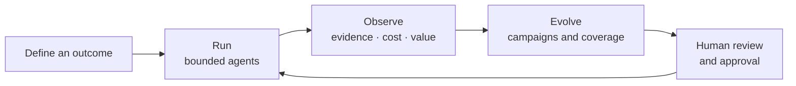

Central Agentic Ops (CAO) is a control plane for agentic work at enterprise scale. It runs governed campaigns across authorized repositories and connects every run to evidence, cost, and results.

## Common Use Cases

CAO supports many kinds of bounded agentic campaigns. It often delivers the clearest immediate value on necessary work that individual development teams should not have to carry manually:

- **Maintenance:** dependency upkeep, configuration drift, stale automation, and repository hygiene.
- **Compliance:** evidence collection, control assessment, policy checks, and bounded remediation.
- **Operational toil:** repetitive investigations, updates, and follow-up work that compete with product delivery.

These jobs are easy to defer one repository at a time and expensive to ignore across an enterprise. CAO lets a central team encode the outcome once and return reviewable results to repository teams instead of asking every team to adopt and operate another process.

## How CAO Scales

Scaling CAO is not simply running many prompts in parallel. It means operating the same campaign safely across a large, changing repository fleet:

- discover only repositories admitted by policy;
- dispatch bounded workers with one target each;
- keep credentials, modes, and output permissions explicit;
- correlate activity, cost, outputs, and outcomes;
- improve the campaign from evidence without silently expanding its authority.

A campaign can start with one repository and retain the same control model as it grows to thousands.

## Run, Observe, Evolve

```mermaid
flowchart LR
  outcome["Define an outcome"]
  run["Run<br/>bounded agents"]
  observe["Observe<br/>evidence · cost · value"]
  evolve["Evolve<br/>campaigns and coverage"]
  approve["Human review<br/>and approval"]

  outcome --> run --> observe --> evolve --> approve --> run
```

### Run

A control repository owns campaign definitions, credentials, rollout policy, and workflow runs. It may be public only when its policy, run metadata, dashboard data, evidence, and review outputs can also be public. Orchestrators select eligible repositories within policy. Workers receive one dispatched target and only the tools and safe outputs declared by their workflow.

### Observe

CAO correlates orchestrator and worker activity with review items, operational evidence, cost, and measured value. Operators can see whether a campaign ran, what it produced, where it stopped, and whether the intended outcome occurred.

### Evolve

Evidence reveals recurring failures, missing capabilities, and campaigns that need refinement. CAO can recommend what to improve, adopt, or author next. Maintainers still review and approve workflow changes, campaign installation, and rollout.

## The Operating Boundary

CAO separates four responsibilities:

| Part | Responsibility |
| --- | --- |
| **Catalog** | Publishes reusable campaigns |
| **Control repository** | Owns policy, credentials, workflows, and runs |
| **Orchestrator** | Selects and dispatches repositories within policy |
| **Worker** | Handles one authorized repository and emits declared safe outputs |

“Central” does not mean one global installation. An organization, enterprise, team, region, or trust boundary can operate its own control repository. Control is centralized within that boundary; execution is distributed across enrolled repositories.

Credential reach never grants authority by itself. The effective boundary is the intersection of checked-in policy, the dispatch request, worker limits, credential reach, and compiled workflow capabilities.

## Review Before Live

Campaigns begin in `review` mode. In review, proposed outputs stay in the declared review destination and the target repository does not change. Operators can inspect the evidence, behavior, and cost before explicitly approving live output for a bounded scope.

This makes CAO suitable for work that must be automated without making agent autonomy open-ended.

## One Operator Interface

The installer adds a repository-local `./cao.sh` command. Operators use it to add and update campaigns, configure authentication, switch between preview and live policy, enable or disable campaign workflows, inspect runtime health, and query activity evidence.

Workflow execution remains with gh-aw: use `gh aw run` to start a campaign and `gh run` to watch it. See [CAO Commands](cao-cli.md) for the complete operator loop.

## Where to Go Next

- [Set up the control plane](setup-quickstarts.md) for the exact repositories it may need to reach.
- [Learn the CAO commands](cao-cli.md) for configuration, campaign control, and operational queries.
- [Browse ready campaigns](catalog.md) for an outcome you can install.
- [Build a campaign](author-your-first-operation.md) when your outcome is not in the catalog.
- Read the [control plane overview](architecture.md) for the detailed execution and safety architecture.
