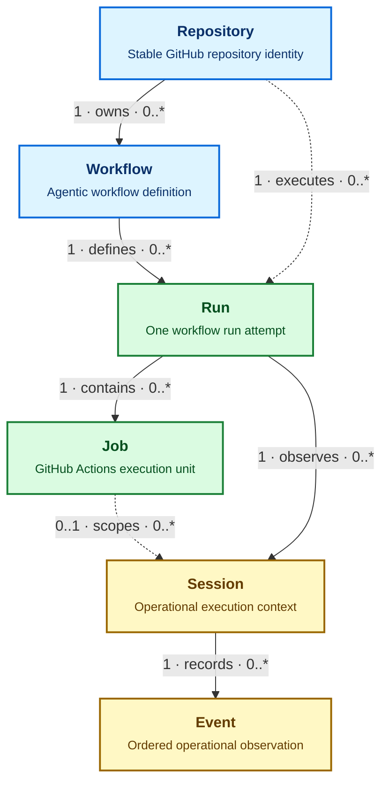

The dashboard converts GitHub, gh-aw, activity, log, SQL, and published JSON observations into one source-neutral model. Views query this model instead of interpreting upstream formats directly.

> [!NOTE]
> IndexedDB persists normalized Repository, Workflow, Run, Job, Session, and Event records, plus an ingestion transaction audit trail. The dedicated data worker owns source download, hydration, canonical ingestion, and queries. It retains noncanonical logical sources in memory for the current page session and sends the main thread only bounded page-scoped projections; source-shaped rows are never duplicated into IndexedDB or sent as one whole-dashboard object graph.

## Entity map



Blue entities describe ownership, green entities describe GitHub Actions execution, and yellow entities describe operational telemetry. Solid arrows are the primary hierarchy. Dotted arrows are denormalized or optional relationships used for efficient queries.

## Entities

| Entity | Canonical identity | Parent relationships | Purpose |
| --- | --- | --- | --- |
| **Repository** | `github:repository:<github-id>` | None | Represents one GitHub repository across renames. |
| **Workflow** | `github:workflow:<github-id>` | Repository | Represents one workflow across path or filename changes. |
| **Run** | `github:run:<run-id>:attempt:<attempt>` | Repository and Workflow | Distinguishes every attempt of a GitHub Actions run. |
| **Job** | `github:job:<github-id>` | Run | Represents one execution job within a run. |
| **Session** | Stable source ID or deterministic source coordinate | Run; optionally Job | Groups one coherent operational execution context. |
| **Event** | Stable source ID or deterministic source coordinate | Session | Records messages, tools, network, policy, safe-output, API, and runtime activity. |

Names, paths, timestamps, and ingestion order are not canonical identities. Stable upstream IDs take precedence; deterministic source coordinates are used only when an upstream system provides no stable ID.

The current dashboard publication does not include immutable GitHub repository or workflow IDs. Its compatibility adapter therefore uses namespaced deterministic source coordinates for those entities. These IDs are explicitly transitional and MUST be replaced by immutable GitHub IDs when publication supplies them.

## Sessions and events

A Session is an operational transaction log, not only an AI conversation. Its ordered Event stream can combine observations from agents, tools, MCP servers, gateways, firewalls, policy engines, safe-output processing, GitHub APIs, and the workflow runtime.

Events use a source sequence when one exists. Otherwise, source timestamp plus a deterministic ID tie-breaker defines order. Related calls, policy checks, responses, and results share a `correlationId` where available.

The activity collector requests the compact gh-aw `usage` artifact with audit generation enabled. The offline adapter prefers authoritative agent `events.jsonl`, MCP Gateway `gateway.jsonl` or `rpc-messages.jsonl`, and firewall `audit.jsonl` records when an older cache contains them; otherwise it derives tool-call Events from `run_summary.json`. It also retains normalized audit aggregates and `aw_info.json` agent, model, runtime, compiler, firewall, and gateway versions. Run evidence is scanned once, checkout and prompt trees are excluded, and raw messages, prompts, arguments, response bodies, and artifact bodies are not shipped to Pages.

SQL uses the versioned `gh-aw-cao.dashboard-sql-export` interchange contract. Database owners map their schema to the contract and export static JSON before deployment. Local and deployed environments use the same contract, validator, adapter, and canonical queries; the static dashboard never opens a database connection.

## Browser database updates

Observations can arrive at different times and enrich an existing entity. Explicit source precedence and observation time resolve conflicting fields; arrival order alone never decides the result.

The `gh-aw-logs.jsonl` cache is the dashboard's published operational input. The worker downloads it from the dashboard origin and processes its schema-v2 envelopes through a versioned ingestion expression. Raw `workflow_runs` payload rows create Repository, Workflow, and Run observations. Enriched `run` envelopes update the same Run identities and create deterministic agentic Sessions and Events. `github_api_rate_limit` envelopes create Events only when explicit collection context identifies their owning run; browser ingestion does not fabricate that ownership. Unknown kinds and unsupported non-empty schema versions fail explicitly.

The complete normative [cached gh-aw JSONL mapping](https://github.com/githubnext/gh-aw-cao/blob/main/specs/dashboard-gh-aw-jsonl-mapping.md) describes source fields, canonical entities, identity, ownership, and accounting.

The canonical database is `gh-aw-cao-dashboard-data`, schema version 9. It has stores for `packages`, `repositories`, `workflows`, `runs`, `jobs`, `sessions`, and `events`; all use their canonical `id` as the key. The `transactions` store records ingestion outcomes and is indexed by `createdAt` and `kind`. Schema upgrades discard incompatible schemas before version 5, replace the legacy `operations` audit store with `transactions` for versions 5 and 6, remove the former `workItems` and `findings` stores in version 8, and add `packages` in version 9.

For each ingestion, the worker reads the existing canonical batch, merges the incoming records, expires time-bounded records outside the 30-day retention window, and prunes orphaned descendants and unreferenced structural parents. The effective retention horizon is the later of the browser clock and the newest incoming observation, so a browser with a slow clock cannot prune current producer data. The worker then replaces each canonical collection: it deletes records absent from the retained batch and puts every retained record. This makes expired records disappear while allowing fresh partial collections to retain compatible history.

Every merged batch must satisfy these mandatory relationships:

- Workflow → Repository
- Run → Repository and Workflow
- Job → Run
- Session → Run and, when present, Job
- Event → Session

Work items and findings are represented by Events rather than separate canonical tables. Independent domains, such as usage, outcomes, admissions, security, and MCP evidence, retain their published schemas in worker memory rather than being forced into unrelated entity tables. They are reconstructable from the static source artifact and are selected only when a page requests them.

Source download, adaptation, normalization, IndexedDB writes, and page queries run in a dedicated Web Worker, keeping large object graphs and conversions off the rendering thread. A successful JSONL ingestion writes an `ingest-jsonl` transaction containing its timestamp, input-record count, and retained-record count. A failed JSONL ingestion writes an `ingest-jsonl-failed` transaction with the error type when possible, and does not write a partial incoming batch. The audit trail is diagnostic derived state, not an authoritative log.

The browser path fully replaces the legacy data system. Worker errors abort the update instead of rerunning ingestion through an older path, and an unusable source raises an explicit loading error. There is no shadow, dual-read, alias, or fallback route. Views render only after the worker returns that page's query projection.

Before ingestion, the browser inspects its storage estimate and requests persistent storage when the API is available. Either request may be denied or fail without affecting correctness.

Ingestion diagnostics use stable categories such as `NORMALIZATION_FAILED`, `TRANSACTION_ABORTED`, and `QUOTA_EXCEEDED`. A failed JSONL update never writes partial incoming data.

IndexedDB stores this canonical data as disposable derived state. Clearing browser storage triggers reconstruction from authorized published inputs; it does not delete authoritative information.

## Local SQLite database

Node.js 24 can run the same ingestion and query layer against a persistent SQLite file. The local adapter implements only the IndexedDB operations used by the canonical dashboard store; the browser continues to use native IndexedDB.

Ingest an extracted gh-aw log directory with its run context:

```bash
npm run dashboard:data -- ingest \
  --database /tmp/cao-dashboard.sqlite \
  --context dashboard/site/test/fixtures/gh-aw-logs/context.json \
  --logs dashboard/site/test/fixtures/gh-aw-logs/run-303
```

Alternatively, ingest the schema-v2 JSONL produced by `gh aw logs`:

```bash
npm run dashboard:data -- ingest-jsonl \
  --database /tmp/cao-dashboard.sqlite \
  --input _activity/gh-aw-logs.jsonl
```

Pass `--context CONTEXT_JSON` when the JSONL's `github_api_rate_limit`
records should become canonical Events. The context supplies the owning
collection Repository, Workflow, and Run; without it, those unowned records
remain unmapped.

Download the JSONL and SQLite projection currently published by the deployed
CAO Pages site:

```bash
npm run dashboard:data:download
```

This writes `_activity/gh-aw-logs.jsonl` and
`_activity/gh-aw-logs.sqlite`. Set `DASHBOARD_DATA_URL` or pass `--url URL`
to use another deployment, and pass `--output DIRECTORY` to select another
destination. Both files are downloaded unchanged; this command does not run
ingestion locally.

Query a canonical collection, optionally selecting an ID, filtering fields, or limiting output:

```bash
npm run dashboard:data -- query \
  --database /tmp/cao-dashboard.sqlite \
  --collection runs \
  --where conclusion=failure \
  --limit 20
```

Diagnose and repair the local database:

```bash
npm run dashboard:data -- doctor \
  --database /tmp/cao-dashboard.sqlite
```

The doctor reports SQLite integrity, foreign-key and schema health, table and
transaction counts, malformed records, and canonical relationship errors. It
applies the canonical 30-day retention window, removes malformed and orphaned
derived records, rebuilds damaged IndexedDB metadata, and runs SQLite
reindexing, optimization, and compaction when repairs are required. Before
changing data, it creates a timestamped `.doctor-backup-*.sqlite` backup next
to the database. Use `--ttl-days DAYS` to select a different positive retention
window.

Run `npm run dashboard:data -- help` for the collection list and full command syntax. The SQLite file remains local derived state and does not change the static dashboard's deployment boundary.

For normative requirements, failure behavior, and implementation phases, see the [Dashboard Data Architecture Specification](https://github.com/githubnext/gh-aw-cao/blob/main/specs/dashboard-data.md).