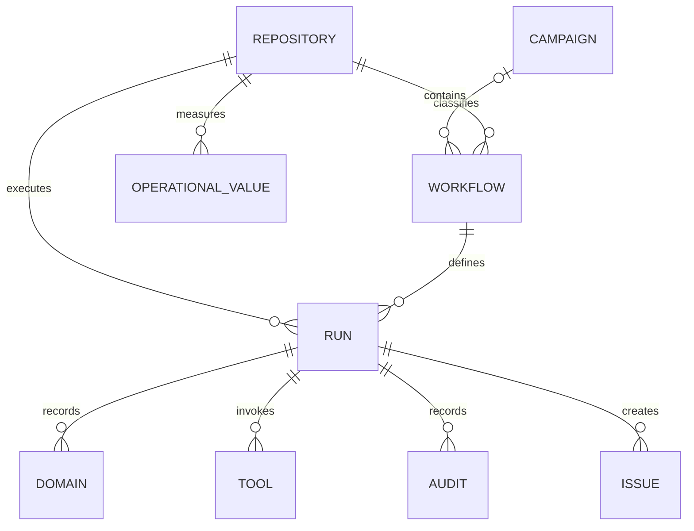

The data model gives every retained campaign, repository, workflow, run, and
run-owned record a stable identity and explicit relationships. Read this page when you
need to understand what a dashboard record represents or how records connect.
Views query this source-neutral model instead of interpreting upstream formats
directly.

See [Data ingestion](/gh-aw-cao/dashboard-data-ingestion/) for collection, JSONL publication, retention, browser updates, and SQLite projections.

## Entity map

The main path follows activity from a repository through its workflows and
runs to four specialized run-owned record types. A Campaign may classify a
Workflow independently of that execution hierarchy. The table below provides
the exact identities and parent relationships.

## Entities

| Entity | Canonical identity | Parent relationships | Purpose |
| --- | --- | --- | --- |
| **Campaign** | Namespaced deterministic ID from the stable campaign slug | None | Classifies an installed starter campaign and its maintenance state. |
| **Repository** | `github:repository:<github-id>` | None | Represents one GitHub repository across renames. |
| **Workflow** | `github:workflow:<github-id>` | Repository | Represents one workflow across path or filename changes. |
| **Run** | `github:run:<owner>/<repository>:<run-id>` | Repository and Workflow | Converges observations for one repository-scoped GitHub Actions run while retaining the latest observed attempt. |
| **Domain** | Namespaced deterministic source ID | Run | Records allowed and blocked firewall observations. |
| **Tool** | Namespaced deterministic source ID | Run | Records MCP, Bash, and skill calls. |
| **Audit** | Namespaced deterministic source ID | Run | Records lifecycle, policy, grader, agent, and other execution observations. |
| **Issue** | `github:issue:<owner>/<repository>:<number>` | Run | Records issue and pull-request safe outputs. |
| **Operational Value** | Deterministic repository, value ID, and timestamp identity | Repository | Records a package-defined numeric repository metric. |

Names, paths, timestamps, and ingestion order are not canonical identities. Stable upstream IDs take precedence; deterministic source coordinates are used only when an upstream system provides no stable ID.

The current dashboard publication does not include immutable GitHub repository or workflow IDs. Its compatibility adapter therefore uses namespaced deterministic source coordinates for those entities. These IDs are explicitly transitional and MUST be replaced by immutable GitHub IDs when publication supplies them.

## Maintenance inventory

The top-level Maintenance page combines two distinct inventory concerns:

- **CAO packages** use Campaign records and compare `campaign-version` with
  `campaign-current-version`. These are installed campaign revisions resolved
  from the control repository's catalog sources.
- **Agentic Workflow compilers** use workflow inventory and compare
  `gh-aw-version` with `gh-aw-current-version` for each repository.

These records do not constitute an inventory of vendored agents or project
skills. Runtime skill calls are retained as Tool records with
`toolType="skill"` and `isSkill=true`, but a call observation does not prove
that a skill is installed, pinned, or updateable. A future agent-assets view
must publish explicit scope and provenance (for example, a `gh skill` source,
revision, or lock record) before it can report maintenance state.

## Run-owned records

A Run owns ordered Domain, Tool, Audit, and Issue records combining observations
from agents, tools, MCP servers, gateways, firewalls, policy engines,
safe-output processing, GitHub APIs, and the workflow runtime. These records
remain independently addressable rather than being stored in one growing
array. Skills are Tools with `toolType="skill"`; issues and pull requests share
the Issue type and use `isPullRequest` to distinguish them.

Run-owned records use a source sequence when one exists. Otherwise, source timestamp plus a deterministic ID tie-breaker defines order. Related calls, policy checks, responses, and results share a `correlationId` where available.

The activity collector requests the compact gh-aw `usage` artifact with audit generation enabled. The offline adapter prefers authoritative agent `events.jsonl`, MCP Gateway `gateway.jsonl` or `rpc-messages.jsonl`, and firewall `audit.jsonl` records when an older cache contains them; otherwise it derives tool records from `run_summary.json`. It also retains normalized audit aggregates and `aw_info.json` agent, model, runtime, compiler, firewall, and gateway versions. Run evidence is scanned once, checkout and prompt trees are excluded, and raw messages, prompts, arguments, response bodies, and artifact bodies are not shipped to Pages.

SQL uses the versioned `gh-aw-cao.dashboard-sql-export` interchange contract. Database owners map their schema to the contract and export static JSON before deployment. Local and deployed environments use the same contract, validator, adapter, and canonical queries; the static dashboard never opens a database connection.

## Update and retain browser data

Observations can arrive at different times and enrich an existing entity. Explicit source precedence and observation time resolve conflicting fields; arrival order alone never decides the result.

The activity shard manifest is the dashboard's published operational input. Normalized run-information and record shards are JSONL streams: a metadata envelope is followed by one canonical record envelope per line. The worker imports every run-information stream before downloading the larger record streams and writes bounded batches as response bytes arrive; it never parses a normalized shard as one JSON object. Run records include immutable agent, model, duration, firewall, MCP, operational-grader, and audit-priority aggregates; every Domain, Tool, Audit, and Issue includes its owning `runId`. Run queries may refresh between phases, but that intermediate state is not a complete snapshot and record-dependent queries remain stale until record ingestion succeeds. Legacy schema-v2 JSONL remains a compatibility input. `github_api_rate_limit` envelopes create Audits only when explicit collection context identifies their owning run; browser ingestion does not fabricate that ownership. Unknown kinds and unsupported non-empty schema versions fail explicitly.

The complete normative [cached gh-aw JSONL mapping](https://github.com/githubnext/gh-aw-cao/blob/main/specs/dashboard-gh-aw-jsonl-mapping.md) describes source fields, canonical entities, identity, ownership, and accounting.

The canonical model is version 14. The browser database is
`gh-aw-cao-dashboard-data`, IndexedDB version 22. Its canonical stores are
`campaigns`, `repositories`, `workflows`, `runs`, `domains`, `tools`, `audits`,
`issues`, and `operationalValues`; all use `id` as the key. The `transactions` store records
ingestion outcomes and is indexed by `createdAt`. Two additional disposable
stores, `dailyOverviewAggregates` and `overviewAggregateMetadata`, implement the
versioned Overview fast path. Schema upgrades rebuild all stores from
authoritative dashboard inputs.

For each ingestion, the worker reads the existing canonical batch, merges the incoming records, expires time-bounded records outside the 30-day retention window, and prunes orphaned descendants and unreferenced structural parents. The effective retention horizon is the later of the browser clock and the newest incoming observation, so a browser with a slow clock cannot prune current producer data. The worker then reconciles each canonical collection: it deletes records absent from the retained batch and writes changed records. This makes expired records disappear while allowing fresh partial collections to retain compatible history.

Browser storage remains disposable derived state rather than a generation-atomic
authority. Writes use bounded transactions, so interruption can leave a
partially updated database; transaction identities cause the missing shards to
retry, and record-dependent subscriptions remain on their prior result until a
complete record phase succeeds. Storage capping drops complete run subtrees,
including run-owned detail whose owning run was evicted. Removing a published shard
does not itself tombstone an indefinitely retained Run; source retractions need
an explicit deletion contract or a schema rebuild.

Every merged batch must satisfy these mandatory relationships:

- Workflow → Repository
- Run → Repository and Workflow
- Domain, Tool, Audit, and Issue → Run

Work items and findings are projected from Issue and Audit records rather than stored in separate canonical tables. Independent logical sources, such as usage, outcomes, admissions, security, and MCP evidence, retain their published schemas in worker memory rather than being forced into unrelated entity tables. They are reconstructable from the static source artifact and are selected only when a page requests them.

Source download, adaptation, normalization, IndexedDB writes, and page queries
run in a dedicated Web Worker, keeping large object graphs and conversions off
the rendering thread. Successful inputs write content-addressed ingestion
receipts with their ingestion version, payload identity, and retained or
committed record counts. Failures write a diagnostic receipt when possible.
Because canonical writes use bounded transactions, a later failure may leave
already committed records; it never writes a successful receipt, and the shard
remains retryable. The audit trail is diagnostic derived state, not an
authoritative log.

The browser path fully replaces the legacy data system. Worker errors abort the update instead of rerunning ingestion through an older path, and an unusable source raises an explicit loading error. There is no shadow, dual-read, alias, or fallback route. Views render only after the worker returns that page's query projection.

Before ingestion, the browser inspects its storage estimate and requests persistent storage when the API is available. Either request may be denied or fail without affecting correctness.

Ingestion diagnostics use stable categories such as `NORMALIZATION_FAILED`,
`TRANSACTION_ABORTED`, and `QUOTA_EXCEEDED`. A failed update never becomes
current merely because an earlier bounded transaction committed.

IndexedDB stores this canonical data as disposable derived state. Clearing browser storage triggers reconstruction from authorized published inputs; it does not delete authoritative information.

## Query the model locally

Node.js 24 can apply the same ingestion and query layer to a persistent SQLite
file. The database remains local, disposable derived state and does not change
the static dashboard's deployment boundary.

See [Data ingestion](dashboard-data-ingestion.md#use-local-sqlite) for download,
ingestion, query, and repair commands.

For normative requirements, failure behavior, and implementation phases, see the [Dashboard Data Architecture Specification](https://github.com/githubnext/gh-aw-cao/blob/main/specs/dashboard-data.md).