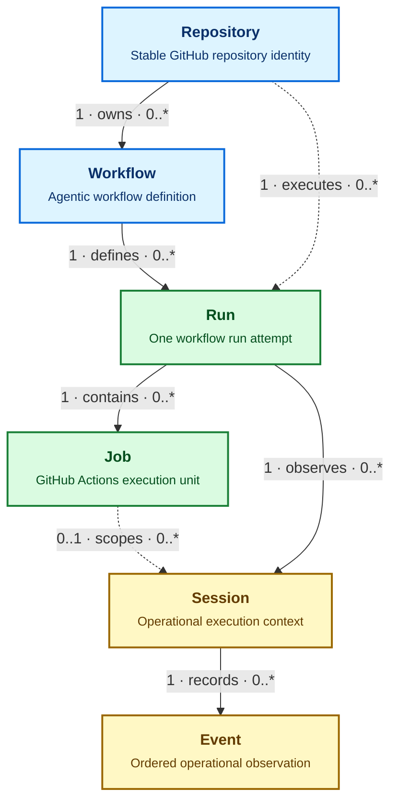

# Dashboard data model

The dashboard converts GitHub, gh-aw, activity, log, SQL, and published JSON observations into one source-neutral model. Views query this model instead of interpreting upstream formats directly.

> [!NOTE]
> IndexedDB persists only normalized Repository, Workflow, Run, Job, Session, and Event generations plus activation and checkpoint metadata. The dedicated data worker owns source download, hydration, canonical ingestion, and queries. It retains noncanonical logical sources in memory for the current page session and sends the main thread only bounded page-scoped projections; source-shaped rows are never duplicated into IndexedDB or sent as one whole-dashboard object graph.

## Entity map

Blue entities describe ownership, green entities describe GitHub Actions execution, and yellow entities describe operational telemetry. Solid arrows are the primary hierarchy. Dotted arrows are denormalized or optional relationships used for efficient queries.

## Entities

| Entity | Canonical identity | Parent relationships | Purpose |
| --- | --- | --- | --- |
| **Repository** | `github:repository:<github-id>` | None | Represents one GitHub repository across renames. |
| **Workflow** | `github:workflow:<github-id>` | Repository | Represents one workflow across path or filename changes. |
| **Run** | `github:run:<run-id>:attempt:<attempt>` | Repository and Workflow | Distinguishes every attempt of a GitHub Actions run. |
| **Job** | `github:job:<github-id>` | Run | Represents one execution job within a run. |
| **Session** | Stable source ID or deterministic source coordinate | Run; optionally Job | Groups one coherent operational execution context. |
| **Event** | Stable source ID or deterministic source coordinate | Session | Records messages, tools, network, policy, safe-output, API, and runtime activity. |

Names, paths, timestamps, and ingestion order are not canonical identities. Stable upstream IDs take precedence; deterministic source coordinates are used only when an upstream system provides no stable ID.

The current dashboard publication does not include immutable GitHub repository or workflow IDs. Its compatibility adapter therefore uses namespaced deterministic source coordinates for those entities. These IDs are explicitly transitional and MUST be replaced by immutable GitHub IDs when publication supplies them.

## Sessions and events

A Session is an operational transaction log, not only an AI conversation. Its ordered Event stream can combine observations from agents, tools, MCP servers, gateways, firewalls, policy engines, safe-output processing, GitHub APIs, and the workflow runtime.

Events use a source sequence when one exists. Otherwise, source timestamp plus a deterministic ID tie-breaker defines order. Related calls, policy checks, responses, and results share a `correlationId` where available.

The activity collector requests the compact gh-aw `usage` artifact with audit generation enabled. The offline adapter prefers authoritative agent `events.jsonl`, MCP Gateway `gateway.jsonl` or `rpc-messages.jsonl`, and firewall `audit.jsonl` records when an older cache contains them; otherwise it derives tool-call Events from `run_summary.json`. It also retains normalized audit aggregates and `aw_info.json` agent, model, runtime, compiler, firewall, and gateway versions. Run evidence is scanned once, checkout and prompt trees are excluded, and raw messages, prompts, arguments, response bodies, and artifact bodies are not shipped to Pages.

SQL uses the versioned `gh-aw-cao.dashboard-sql-export` interchange contract. Database owners map their schema to the contract and export static JSON before deployment. Local and deployed environments use the same contract, validator, adapter, and canonical queries; the static dashboard never opens a database connection.

## Consistency and generations

Observations can arrive at different times and enrich an existing entity. Explicit source precedence and observation time resolve conflicting fields; arrival order alone never decides the result.

Every canonical row belongs to a generation. A replacement generation is normalized and validated separately while queries continue reading the active generation. It becomes active only after all mandatory relationships resolve:

- Workflow → Repository
- Run → Repository and Workflow
- Job → Run
- Session → Run and, when present, Job
- Event → Session

Independent domains such as usage, outcomes, findings, admissions, security, and MCP evidence retain their published schemas in worker memory rather than being forced into unrelated entity tables. They are reconstructable from the static source artifact and are selected only when a page requests them. Canonical activation and recovery apply atomically to the normalized entity hierarchy.

Source download, adaptation, normalization, IndexedDB writes, and page queries run in a dedicated Web Worker, keeping large object graphs and conversions off the rendering thread. Browser writes are committed in bounded transactions. A durable checkpoint is written only after every canonical batch in the current dashboard-source document commits. Interrupted ingestion leaves the generation in `staging`; a restart can repeat committed writes idempotently and continue to activation. Activation requires the checkpoint, moves through `validating`, updates the versioned active pointer atomically, and marks the previous generation `retired` without immediately deleting it.

The browser path fully replaces the legacy data system. Worker errors abort the replacement instead of rerunning ingestion through an older path, an unusable generation raises an explicit loading error, and the former whole-source browser cache has been removed. There is no shadow, dual-read, alias, or fallback route. Views render only after the requested generation is active and the worker returns that page's query projection.

Before ingestion, the browser inspects its storage estimate and requests persistent storage when the API is available. Either request may be denied or fail without affecting correctness; quota recovery still protects the active generation and retries only after deleting expendable failed or retired generations.

Ingestion diagnostics use stable categories such as `NORMALIZATION_FAILED`, `TRANSACTION_ABORTED`, `QUOTA_EXCEEDED`, `GENERATION_INCOMPLETE`, and `GENERATION_VALIDATION_FAILED`. A failed or incomplete replacement never changes the active-generation pointer.

IndexedDB stores this generation as disposable derived state. Clearing browser storage triggers reconstruction from authorized published inputs; it does not delete authoritative information.

For normative requirements, failure behavior, and implementation phases, see the [Dashboard Data Architecture Specification](https://github.com/githubnext/gh-aw-cao/blob/main/specs/dashboard-data.md).