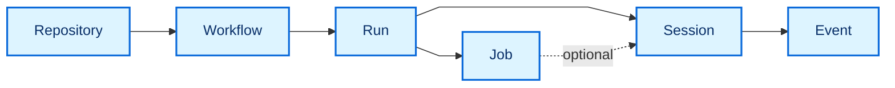

The data model gives every retained repository, workflow, run, job, session,
and event a stable identity and explicit relationships. Read this page when you
need to understand what a dashboard record represents or how records connect.
Views query this source-neutral model instead of interpreting upstream formats
directly.

See [Data ingestion](/gh-aw-cao/dashboard-data-ingestion/) for collection, JSONL publication, retention, browser updates, and SQLite projections.

## Entity map

The main path follows activity from a repository to the events recorded for a
workflow run. A run can also contain Jobs, and a Session can optionally belong
to one of those Jobs. The table below provides the exact identities and parent
relationships.

## Entities

| Entity | Canonical identity | Parent relationships | Purpose |
| --- | --- | --- | --- |
| **Repository** | `github:repository:<github-id>` | None | Represents one GitHub repository across renames. |
| **Workflow** | `github:workflow:<github-id>` | Repository | Represents one workflow across path or filename changes. |
| **Run** | `github:run:<run-id>:attempt:<attempt>` | Repository and Workflow | Distinguishes every attempt of a GitHub Actions run. |
| **Job** | `github:job:<github-id>` | Run | Represents one execution job within a run. |
| **Session** | Stable source ID or deterministic source coordinate | Run; optionally Job | Groups one coherent operational execution context. |
| **Event** | Stable source ID or deterministic source coordinate | Run and Session | Records messages, tools, network, policy, safe-output, API, and runtime activity. |

Names, paths, timestamps, and ingestion order are not canonical identities. Stable upstream IDs take precedence; deterministic source coordinates are used only when an upstream system provides no stable ID.

The current dashboard publication does not include immutable GitHub repository or workflow IDs. Its compatibility adapter therefore uses namespaced deterministic source coordinates for those entities. These IDs are explicitly transitional and MUST be replaced by immutable GitHub IDs when publication supplies them.

## Sessions and events

A Session is an operational transaction log, not only an AI conversation. Its ordered Event stream can combine observations from agents, tools, MCP servers, gateways, firewalls, policy engines, safe-output processing, GitHub APIs, and the workflow runtime.

Events use a source sequence when one exists. Otherwise, source timestamp plus a deterministic ID tie-breaker defines order. Related calls, policy checks, responses, and results share a `correlationId` where available.

The activity collector requests the compact gh-aw `usage` artifact with audit generation enabled. The offline adapter prefers authoritative agent `events.jsonl`, MCP Gateway `gateway.jsonl` or `rpc-messages.jsonl`, and firewall `audit.jsonl` records when an older cache contains them; otherwise it derives tool-call Events from `run_summary.json`. It also retains normalized audit aggregates and `aw_info.json` agent, model, runtime, compiler, firewall, and gateway versions. Run evidence is scanned once, checkout and prompt trees are excluded, and raw messages, prompts, arguments, response bodies, and artifact bodies are not shipped to Pages.

SQL uses the versioned `gh-aw-cao.dashboard-sql-export` interchange contract. Database owners map their schema to the contract and export static JSON before deployment. Local and deployed environments use the same contract, validator, adapter, and canonical queries; the static dashboard never opens a database connection.

## Update and retain browser data

Observations can arrive at different times and enrich an existing entity. Explicit source precedence and observation time resolve conflicting fields; arrival order alone never decides the result.

The activity shard manifest is the dashboard's published operational input. The worker accepts phased ingestion only when every run-information shard has one event shard with the same filename stem. It imports every compact run-information shard before downloading the larger event shards. Run records include immutable agent, model, duration, firewall, MCP, operational-value, and audit-priority aggregates; every Event includes its owning `runId` in addition to `sessionId`. Run queries may refresh between phases, but that intermediate state is not a complete snapshot and event-dependent queries remain stale until event ingestion succeeds. Legacy schema-v2 JSONL remains a compatibility input. `github_api_rate_limit` envelopes create Events only when explicit collection context identifies their owning run; browser ingestion does not fabricate that ownership. Unknown kinds and unsupported non-empty schema versions fail explicitly.

The complete normative [cached gh-aw JSONL mapping](https://github.com/githubnext/gh-aw-cao/blob/main/specs/dashboard-gh-aw-jsonl-mapping.md) describes source fields, canonical entities, identity, ownership, and accounting.

The canonical database is `gh-aw-cao-dashboard-data`, schema version 10. It has stores for `packages`, `repositories`, `workflows`, `runs`, `jobs`, `sessions`, and `events`; all use their canonical `id` as the key. The `transactions` store records ingestion outcomes and is indexed by `createdAt` and `kind`. Because this database is disposable derived state, schema upgrades rebuild its stores from authoritative dashboard inputs; version 10 resets source-scoped Repository and Workflow identities to canonical coordinates.

For each ingestion, the worker reads the existing canonical batch, merges the incoming records, expires time-bounded records outside the 30-day retention window, and prunes orphaned descendants and unreferenced structural parents. The effective retention horizon is the later of the browser clock and the newest incoming observation, so a browser with a slow clock cannot prune current producer data. The worker then reconciles each canonical collection: it deletes records absent from the retained batch and writes changed records. This makes expired records disappear while allowing fresh partial collections to retain compatible history.

Browser storage remains disposable derived state rather than a generation-atomic
authority. Writes use bounded transactions, so interruption can leave a
partially updated database; transaction identities cause the missing shards to
retry, and event-dependent subscriptions remain on their prior result until a
complete event phase succeeds. Storage capping drops complete run subtrees,
including event detail whose owning run was evicted. Removing a published shard
does not itself tombstone an indefinitely retained Run; source retractions need
an explicit deletion contract or a schema rebuild.

Every merged batch must satisfy these mandatory relationships:

- Workflow → Repository
- Run → Repository and Workflow
- Job → Run
- Session → Run and, when present, Job
- Event → Run and Session

Work items and findings are represented by Events rather than separate canonical tables. Independent domains, such as usage, outcomes, admissions, security, and MCP evidence, retain their published schemas in worker memory rather than being forced into unrelated entity tables. They are reconstructable from the static source artifact and are selected only when a page requests them.

Source download, adaptation, normalization, IndexedDB writes, and page queries run in a dedicated Web Worker, keeping large object graphs and conversions off the rendering thread. A successful JSONL ingestion writes an `ingest-jsonl` transaction containing its timestamp, input-record count, and retained-record count. A failed JSONL ingestion writes an `ingest-jsonl-failed` transaction with the error type when possible, and does not write a partial incoming batch. The audit trail is diagnostic derived state, not an authoritative log.

The browser path fully replaces the legacy data system. Worker errors abort the update instead of rerunning ingestion through an older path, and an unusable source raises an explicit loading error. There is no shadow, dual-read, alias, or fallback route. Views render only after the worker returns that page's query projection.

Before ingestion, the browser inspects its storage estimate and requests persistent storage when the API is available. Either request may be denied or fail without affecting correctness.

Ingestion diagnostics use stable categories such as `NORMALIZATION_FAILED`, `TRANSACTION_ABORTED`, and `QUOTA_EXCEEDED`. A failed JSONL update never writes partial incoming data.

IndexedDB stores this canonical data as disposable derived state. Clearing browser storage triggers reconstruction from authorized published inputs; it does not delete authoritative information.

## Query the model locally

Node.js 24 can apply the same ingestion and query layer to a persistent SQLite
file. The database remains local, disposable derived state and does not change
the static dashboard's deployment boundary.

See [Data ingestion](dashboard-data-ingestion.md#use-local-sqlite) for download,
ingestion, query, and repair commands.

For normative requirements, failure behavior, and implementation phases, see the [Dashboard Data Architecture Specification](https://github.com/githubnext/gh-aw-cao/blob/main/specs/dashboard-data.md).