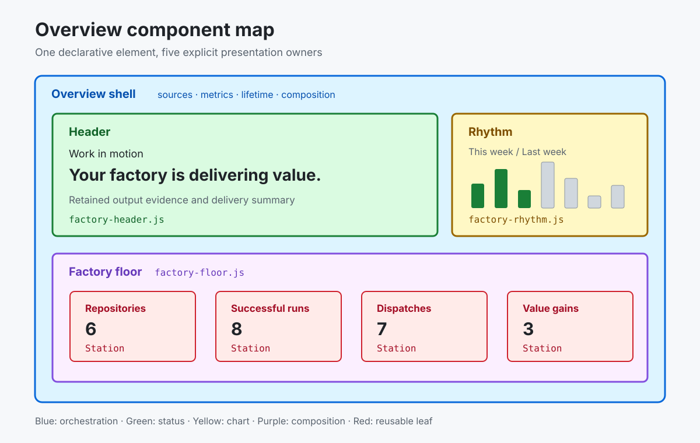
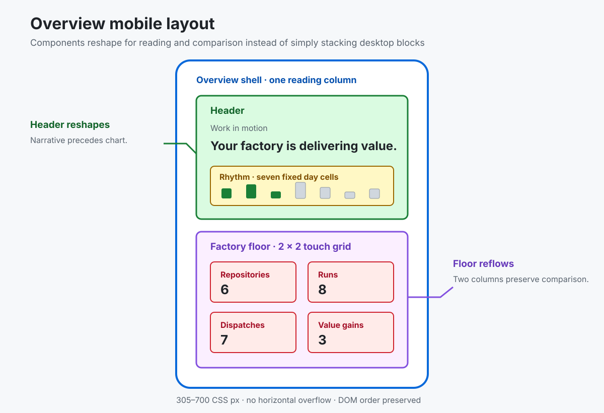

The Overview page remains one Dashboard Language `outcomes-overview` element. Its JavaScript components present worker-produced query results; they do not filter rows, join sources, or derive business records.

## Desktop composition

<picture>
	<source media="(prefers-color-scheme: dark)" srcset="./assets/dashboard-overview-desktop-dark.svg">
	<source media="(prefers-color-scheme: light)" srcset="./assets/dashboard-overview-desktop-light.svg">
	
</picture>

## Mobile composition

Mobile is a distinct composition, not the desktop layout reduced to one column. The Header establishes reading order, Rhythm retains a seven-day comparison, and the Floor uses two columns so related metrics remain scannable.

<picture>
	<source media="(prefers-color-scheme: dark)" srcset="./assets/dashboard-overview-mobile-dark.svg">
	<source media="(prefers-color-scheme: light)" srcset="./assets/dashboard-overview-mobile-light.svg">
	
</picture>

## Component boundaries

| Component | Owner | Responsibility | Locked states |
| --- | --- | --- | --- |
| Overview shell | `factory-overview.js` | Source bindings, reactive lifetime, shared metrics, labels, composition | initial render, progressive source arrival, reset |
| Header | `factory-header.js` | Motion label, worker-classified heading, outcome summary | idle, active, attention, strain, value, unavailable |
| Rhythm | `factory-rhythm.js` | Seven-day current/previous week chart | reached day, future day, zero, malformed payload |
| Floor | `factory-floor.js` | Four-station composition and aggregate accessible description | active, idle, partial evidence |
| Station | `factory-station.js` | Icon, label, count, detail, link, animation | loading, unavailable, zero, populated |

## Responsive contract

| Component | Wide layout | At or below 900px | At or below 700px |
| --- | --- | --- | --- |
| Overview shell | Bordered six-pixel-radius surface | Retains its bounded surface | Becomes full-bleed without border or radius |
| Header | Narrative and Rhythm share two columns | Narrative precedes Rhythm in one reading column | Uses compact padding and a smaller heading |
| Rhythm | Seven equal day cells with a nine-pixel gap | Keeps all seven cells in one row | Reduces the gap to five pixels; never becomes seven stacked rows |
| Floor | Four Stations in one comparison row | Retains the four-column comparison | Reflows to a 2 × 2 grid rather than a four-item vertical stack |
| Station | Full-size icon and count | Retains label, count, detail, and link | Uses compact icon and count sizing while preserving touch targets |

DOM order remains Header then Floor at every width. Responsive CSS changes visual composition only; it must not duplicate content, reorder focus, hide evidence, or introduce horizontal page overflow. The supported mobile contract is checked at 390px and the minimum 305px layout width in Playwright.

## Story and test convention

This package does not use Storybook. The repository-native equivalent has three layers:

1. Direct component cases in `test/unit/factory-overview-components.test.js` act as headless stories and lock each component's DOM, state, and accessible output.
2. `?fixtures=1#page-overview` is the integrated visual story rendered by the real presenter and styles.
3. The focused Overview scenario in `test/e2e/smoke.spec.js` locks browser layout, navigation, links, and responsive behavior.

Add a state to the direct component cases before changing its implementation. Add Playwright coverage only when the behavior depends on layout, focus, navigation, workers, or viewport size. Prefer role, accessible-name, state, and destination assertions over broad DOM snapshots.

Factory status priority is declared by the `overview-factory-status` query. The Header validates and presents its `factory-heading` field but does not infer business state from run or value counts. Component tests also abort an owning signal and verify that subsequent state changes cannot update the released DOM.

## Refactoring sequence

Refactor leaf-first: Rhythm, Station, Floor, Header, then Overview shell. For each component, characterize the current state, make one extraction or behavior change, run its focused test, and only then continue to the next component. Keep the Dashboard Language queries and `outcomes-overview` declaration stable unless the requested behavior changes the data contract.