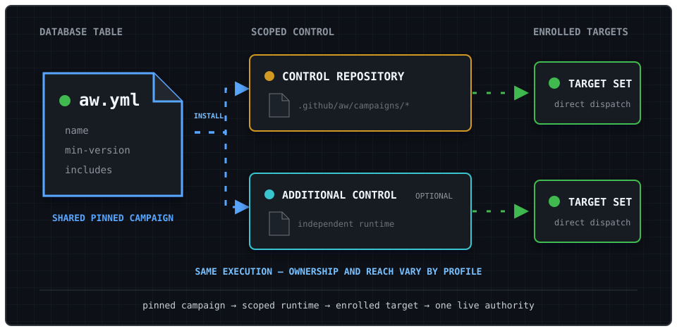

Use this page when deciding where control repositories run, who owns each layer, and how target repositories consent to live operation. For the architectural summary, start with the [Control Plane Overview](architecture.md).

## Deployment Topologies

Central Agentic Ops does not require a GitHub enterprise account. An organization or OSS maintainer can run one private organization-owned control repository for repositories in that organization. Enterprise deployment adds an enterprise-operated control repository for cross-organization AWs and may also use independent organization control repositories for organization-shared AWs. Because a GitHub enterprise account does not directly own repositories, its control repository is still hosted in a designated organization.

The execution topology is the same in every profile. A pinned package is installed into a scoped control repository, which dispatches directly to enrolled targets. The profile changes who governs each runtime and which repositories its credentials and inventory can reach.



| Deployment profile | Runtime ownership | Default reach | GitHub Enterprise required |
| --- | --- | --- | --- |
| **Organization or OSS** | One private control repository owned by the organization | Automatically discovered repositories in that organization | No |
| **Several organizations, one operator** | One independent control repository per organization, all installing the same pinned package | Each runtime discovers and operates within its own organization | No |
| **Enterprise** | One enterprise-operated control repository in a designated host organization, with optional organization runtimes | Explicit credential-scoped reach across organizations; organization runtimes retain local reach | Yes |

For several organizations without GitHub Enterprise, keep credentials, target inventory, rollout, and kill switches organization-local. No relay or enterprise-level coordinator is required. Assign exactly one runtime as live mutation authority for each target and package.

:::tip[Start with the smallest topology]
If every target belongs to one organization, use one organization-owned control repository. Add an enterprise runtime only when governance and credential reach genuinely cross organization boundaries.
:::

A single control repository can address an explicitly named repository in another organization only when that owner is allowlisted and a credential authorized by that organization can perform the operation. The current runtime does not automatically discover across owners or mint and reconcile credentials across multiple organization installations, so do not treat ownership of several organizations or an enterprise account as an implicit cross-organization credential or inventory.

### Workflow Sources

| Source | Published by | Execution and reach |
| --- | --- | --- |
| **Enterprise-shared AW** | Enterprise platform, security, or automation governance | Runs in the enterprise central control repository and dispatches per-repository worker workflows against configured targets across organizations. |
| **Organization-shared AW** | Organization platform or repository operations team | Runs in an organization central control repository and dispatches per-repository worker workflows against configured targets in that organization. |
| **Repository-local AW** | Repository maintainers | Runs in its own repository and remains outside this control plane unless explicitly enrolled. |

"Enterprise-shared" and "organization-shared" identify both governance scope and runtime ownership. They do not mean that Agentic Workflow definitions are installed into downstream target repositories. In the CentralRepoOps pattern, Orchestrator and worker workflow definitions stay together in their owning central repository; each worker workflow checks out one target and sends declared cross-repository safe outputs to the configured destination.

## Operating Ownership

| Level | Owner | Controls | Does not control |
| --- | --- | --- | --- |
| **Catalog package** | Catalog maintainers; enterprise governance for an enterprise-owned catalog | Package source, `aw.yml`, workflow definitions, release approval, and compatibility policy | Installation credentials, organization-local extensions, or target repository acceptance |
| **Enterprise runtime** | Enterprise platform or automation team | Enterprise control repository, cross-organization credentials, enrolled target inventory, rollout, budgets, kill switch, monitoring, and incidents | Organization runtime configuration or repository protection policy |
| **Organization runtime** | Organization platform or repository operations team | Organization control repository, pinned packages, organization-local workflows, enrolled targets, local credentials, rollout, budgets, kill switch, monitoring, and incidents | Enterprise runtime configuration or the upstream enterprise package |
| **Target repository** | Repository maintainers | Code, branch protection, rulesets, CODEOWNERS, environments, merge acceptance, and repository-local automation | Central runtime credentials, catalog releases, or control-plane activation policy |
| **GitHub governance** | Organization administrators, plus enterprise administrators when present | Actions policy, App and PAT access, available custom-property definitions, rulesets, and administrative revocation | Package-specific reasoning or repository maintenance decisions |

These levels are complementary, but they have no implicit precedence. Catalog ownership grants publication authority, not execution authority. Installing a package grants a runtime the ability to execute only within its credential scope and approved target inventory; it does not transfer ownership of target repositories.

Before a package enters `live`, assign exactly one control repository as live mutation authority for each `(target repository, package)` pair in control-owned policy. Enterprise and organization runtimes may both produce review output, but they must not concurrently mutate the same target for the same package. A live worker validates its control repository's policy at the exact workflow SHA; target files cannot alter or veto that decision. Separate GitHub Actions repositories still do not provide shared cancellation or a cross-repository concurrency group for runs already in progress.

## Catalog Ownership and Discovery

Use one authoritative catalog for a shared package rather than duplicating its ownership across installations. The catalog repository's root `aw.yml` is the canonical package descriptor: it names the package, sets its minimum gh-aw version, and declares the workflows included in the full package. It is not a runtime authority or target-enrollment descriptor. Catalog maintainers publish pinned releases. An organization may install those releases directly or publish separately named local packages and repository-local workflows, but it must not silently fork the identity of a shared package. Each control repository retains ownership of its local extensions, credentials, targets, rollout, and incident response. In an enterprise deployment, enterprise-owned operations dispatch directly from the enterprise control repository to allowlisted repositories; the catalog does not dispatch through organization control repositories.

When gh-aw installs the package, it writes a generated manifest under `.github/aw/packages/` in the control repository. That manifest records the installed package and file inventory used by the package lifecycle. Together, the source `aw.yml` and generated installation manifest provide package and installation provenance. They do not establish runtime authority, live status, or credential health; those remain operating records. Do not add a mutation workflow merely to register them.

GitHub repository custom properties may project selected fields from those records so enterprise operators can search installations, target rulesets, and audit adoption. They are an optional index, not the source of truth. Deployment-specific values such as operating role, owner, and lifecycle status remain local control-repository metadata.

| Custom property | Example | Purpose |
| --- | --- | --- |
| `central-ops-role` | `enterprise`, `organization`, or `independent` | Identifies the runtime's governance scope. |
| `central-ops-catalog` | `githubnext/gh-aw-cao` | Projects the authoritative catalog source. |
| `central-ops-version` | Release tag or commit SHA | Projects the catalog revision installed by the control repository. |
| `central-ops-owner` | `organization/platform-team` | Identifies the team responsible for operation and incidents. |
| `central-ops-status` | `review`, `active`, or `suspended` | Records the installation lifecycle state. |

The `central-agentic-ops-control-plane` repository topic is an optional lightweight discovery aid. Where custom properties are available, they provide the structured searchable projection. If neither mechanism covers an installation, an enterprise may maintain a small derived registry containing only organization, control repository, catalog revision, owner, and status. Rebuild that registry from repository-owned records where practical; it must not become a dispatcher or contain credentials, policy overrides, runtime health, or dispatch state.

## Target Enrollment

An allowed owner and a reachable credential are security boundaries, not evidence that a repository agreed to central operation. Before `live` operation, the target repository owner and runtime operator must record:

- the target repository and approved packages;
- the control repository assigned as live mutation authority for each package;
- the approving repository owner or team;
- the approval and review date;
- the revocation path.

Store this evidence in an enterprise- or organization-approved inventory, such as governed custom properties or a reviewed registry. The current workflows do not query or reconcile that inventory automatically. Until they do, scope the GitHub App installation or fine-grained PAT to enrolled repositories and treat broad owner discovery as review-only. Owner allowlists remain mandatory but are not sufficient for live enrollment.

The target repository enforces its live mutation authority in `.github/workflows/cao.json`:

```json
{
  "version": 1,
  "target-authority": {
    "packages": {
      "dependabot": { "authority": "acme/central-ops" },
      "optimization": { "authority": "acme/central-ops" }
    }
  }
}
```

Protect this file on the default branch with a ruleset and CODEOWNERS approval from the target repository owner. A live worker resolves that branch to an exact commit SHA; missing, malformed, or mismatched authority fails closed before the agent starts. The file records consent and authority only; keep credentials in Actions secrets and control policy in the control repository's JSON document. Review runs do not require target authority because they cannot mutate the target.

## Downstream Fan-Out and Provenance

Each central control repository fans out enabled packages to selected targets, subject to repository allowlists, credential scope, enrollment, live mutation ownership, and dispatch limits. Orchestrator and worker workflows run from that central repository. Each worker workflow checks out one target repository, inspects only that target, and creates only declared safe outputs in the configured downstream destination. A target repository may receive review output from both enterprise and organization control repositories without storing either source's Agentic Workflow definitions, but only its assigned runtime may perform live mutation for a given package.

The standard `central_repo`, `control_plane_run_url`, and `correlation_id` fields identify the originating central runtime and run. Because `central_repo` differs between enterprise and organization control repositories, downstream safe outputs retain their runtime source.

Cross-organization reach is explicit, allowlisted, and credential-scoped. Fully qualified `target_repo` values can address repositories outside the control repository's owning organization only when the owner appears in `control-plane.scope.allowed-owners` and the configured GitHub App or PAT can perform the operation. The safe default permits only the control repository's owner. The current bounded discovery path enumerates only that owner; automatic enterprise-wide discovery is not provided. This discovery limitation does not require copying workflows into organization or target repositories.

Repository-local workflow names cannot shadow central workers. Shared control resolves an orchestrator's declared worker slug only by its exact `.github/workflows/<slug>.lock.yml` path in the owning control repository. Target analytics use `workflow_path`, not display name, as identity so same-named target workflows remain separate. Target workflow definitions and logs are untrusted evidence, never policy. Persistent optimization history branches include `central_repo`, keeping enterprise and organization control-plane state separate when both target the same repository.

## Repository Outcome Projection

Repository reporting is organized by the repository whose state, opportunity, or outcome was analyzed. It includes work from every visible Agentic Workflow acting on that repository, whether the workflow runs locally or as a worker in a centrally managed operation. Operation membership determines orchestration and governance; it does not determine whether an outcome appears in the repository view.

Keep these dimensions separate in every report record:

| Dimension | Meaning | Stable identity |
| --- | --- | --- |
| **Subject repository** | Repository whose state, opportunity, or outcome was analyzed | `owner/repository` |
| **Producer workflow** | Workflow run that produced the evidence | `(runtime_repository, workflow_path)` |
| **Output repository** | Repository containing the durable issue, pull request, comment, or review artifact | `owner/repository` |
| **Package membership** | Optional package and worker relationship used for central orchestration | `(runtime_repository, operation_slug, worker_path)` |

For a repository-local workflow, the runtime and subject repositories are normally the same and operation membership is absent. For a central worker, the runtime repository is the control repository, the subject is the selected target, and the output repository may be the review repository or the target according to the effective mode.

Operational-value opportunities are deduplicated within `(subject_repository, opportunity_key, evaluator_digest)`. The producer remains attributable through `(runtime_repository, workflow_path)`. Ownership remains policy and provenance metadata: definition owner, runtime owner, subject owner, output owner, and live mutation authority must not be collapsed into one ambiguous `owner` field.

## Governance Boundary

Central Agentic Ops controls the catalog workflows that participate in it. It defines their authentication, rollout, repository selection, dispatch, routing, and safe-output behavior. It is not a general enforcement boundary for all automation in an enterprise.

:::caution[The control plane is not a universal policy boundary]
Use GitHub rulesets, Actions policy, protected environments, CODEOWNERS, and credential scoping to govern automation outside participating catalog workflows.
:::

The control plane does not:

- prevent a repository from defining or running other GitHub Actions or Agentic Workflows;
- prevent an authorized user from manually running workflows outside the control plane;
- guarantee that a catalog worker cannot be directly dispatched by a user who already has sufficient Actions access;
- block another GitHub App, PAT, integration, or administrator from changing a repository;
- coordinate locks or cancellation across independent control repositories after live runs have started;
- reconcile custom properties, external approval records, or credential scope with control policy;
- replace repository rulesets, branch protection, protected environments, CODEOWNERS, Actions policies, or enterprise audit controls;
- make compliance claims for workflows and repositories that are not enrolled in its operating process.

Enterprises that need the control plane to be the approved operating path must enforce that policy with GitHub-native administration. Typical measures include restricting allowed Actions and reusable workflows, requiring review for `.github/workflows/` changes, protecting deployment environments, limiting who can dispatch workflows, narrowing App and PAT repository access, protecting control-plane configuration, and monitoring enterprise audit events.

These controls are complementary: Central Agentic Ops supplies orchestration and gradual rollout for participating workflows, while GitHub organization and enterprise policy determines who may run or introduce automation outside that path.