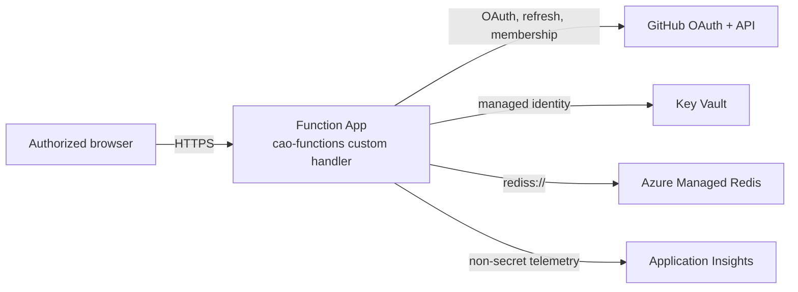

> [!WARNING]
> **Experimental:** The Azure deployment is an experimental baseline, not a turnkey or certified production service. Parameters, app settings, and resources can change between releases. Treat `server/azure/main.bicep`, the OAuth policy, the Redis topology, and the Key Vault access model as a starting point for your own review. Don't use the deployment with real users until your organization completes security, compliance, privacy, network, load, cost, monitoring, incident-response, backup, and rollback reviews.

## About the Azure deployment

The Azure deployment runs the Go dashboard server from the `server/` directory as an Azure Functions custom handler. Browsers connect only to the Function App, over HTTPS on the same origin. The Function App:

- Signs users in with GitHub OAuth.
- Authorizes users by their membership in GitHub organizations or teams that you allow.
- Reads secrets through Key Vault references.
- Runs bounded [Dashboard Language](dashboard-language.md) queries against data in Azure Managed Redis. Redis holds a disposable copy of the dashboard data.



## Prerequisites

### Azure resources

The `server/azure/main.bicep` template creates the following resources in one resource group.

| Service | Configuration | Purpose |
| --- | --- | --- |
| Azure Functions | Linux Function App on runtime `~4` with `FUNCTIONS_WORKER_RUNTIME=custom`. HTTPS only, TLS 1.2 or later, FTPS off, always on, at least one instance, and a system-assigned managed identity. | Hosts the Go HTTP handler |
| App Service plan | Elastic Premium `EP1` | Keeps the Function App always on |
| Azure Managed Redis | `Microsoft.Cache/redisEnterprise`. Default `Balanced_B0` with capacity 1, TLS 1.2, encrypted client protocol, `NoEviction` policy, public network access off, and no Redis modules. | Stores dashboard data, sessions, rate limits, and webhook deduplication records |
| Key Vault | Role-based access control, 90-day soft delete, and purge protection | Stores the OAuth client secret, session secrets, Redis URL, Functions storage connection string, and optional collection secrets |
| Storage account | `Standard_LRS`, HTTPS only, TLS 1.2, and no public blob access | Stores Azure Functions runtime state only |
| Application Insights | Optionally linked to a Log Analytics workspace | Collects operational telemetry that contains no secrets |

### Other requirements

- An Azure subscription and resource group where you can create these resources and assign the **Key Vault Secrets User** role.
- The Azure CLI with Bicep support.
- Go 1.27.1 and Node.js 24, to build the deployment package.
- A GitHub OAuth app. Personal access tokens and GitHub App user tokens aren't supported.
- At least one GitHub organization, or team in `ORGANIZATION/TEAM-SLUG` format, whose active members can read the dashboard.
- A private network path from the Function App to Azure Managed Redis, and from any host that runs ingestion. The template turns off public network access for Redis but doesn't create a virtual network or private endpoint. You must add private networking that fits your tenant.
- A dashboard payload from the `cao-dashboard.yml` workflow in your control repository. To produce one, first complete [the GitHub Actions only deployment](deployment-actions.md). If you don't want to publish to Pages, set `control-plane.campaigns.dashboard.deploy` to `false`.

The optional collection profile also needs a container image of the collector, a GitHub App, and Azure Container Apps. For more information, see [Using the optional collection profile](#using-the-optional-collection-profile).

## Deploying the dashboard

In the following steps, replace `FUNCTION-APP-NAME` with a globally unique name for your Function App.

1. Register a GitHub OAuth app. Set its **Authorization callback URL** to `https://FUNCTION-APP-NAME.azurewebsites.net/auth/callback`. Store the client secret in your secret manager for use in a later step. For more information, see [Creating an OAuth app](https://docs.github.com/en/apps/oauth-apps/building-oauth-apps/creating-an-oauth-app) in the GitHub documentation.

   > [!CAUTION]
   > Never commit the client secret to a repository.

1. Generate a session secret of at least 32 random characters.

   ```bash
   openssl rand -base64 48
   ```

1. Create the resource group and deploy the template. Replace the placeholders with your own values.

   ```bash
   az group create --name cao-dashboard --location REGION
   az deployment group create \
     --resource-group cao-dashboard \
     --template-file server/azure/main.bicep \
     --parameters \
       functionAppName=FUNCTION-APP-NAME \
       storageAccountName=STORAGE-ACCOUNT-NAME \
       keyVaultName=KEY-VAULT-NAME \
       redisEnterpriseName=REDIS-NAME \
       allowedHosts='["FUNCTION-APP-NAME.azurewebsites.net"]' \
       githubAllowedOrganizations='["ORGANIZATION"]' \
       githubClientId=OAUTH-CLIENT-ID
   ```

   The Azure CLI prompts you for `githubClientSecret`, `sessionSecret`, and `redisConnectionString`. Enter them at the prompt or supply them from your secret manager. Don't store them in a parameters file in your repository.

   > [!NOTE]
   > The Redis access key doesn't exist until Azure creates Azure Managed Redis. For the first deployment, enter a temporary `rediss://` value. After Redis is provisioned, get the database access key and redeploy with `rediss://:ACCESS-KEY@REDIS-HOST:10000/0`. The template stores this URL only as the `cao-redis-url` Key Vault secret.

1. Review the deployment outputs. The template outputs only values that aren't secret: `functionHostName`, `githubOAuthRedirectUri`, `redisEnterpriseHostName`, `redisDatabaseName`, `keyVaultUri`, and `collectionEnabled`. Confirm that `githubOAuthRedirectUri` matches the callback URL of your OAuth app.
1. Add private networking so that the Function App can reach Redis while public access to Redis stays off.
1. From a trusted checkout of this repository, build the site and the handler.

   ```bash
   npm --prefix dashboard/site ci
   npm --prefix dashboard/site run build -- dist ../../.github/workflows/cao.json "$(git rev-parse HEAD)"
   GOOS=linux GOARCH=amd64 CGO_ENABLED=0 go -C server build -trimpath -o ../package/cao-functions ./cmd/cao-functions
   ```

1. Assemble an Azure Functions package that contains:

   - The `cao-functions` executable.
   - The built site, in a `site/` directory.
   - The Dashboard Language document, at `site/dashboard.json`. To use another path, set `CAO_AZURE_DASHBOARD_QUERIES`.
   - A `host.json` file. Set `customHandler.description.defaultExecutablePath` to `cao-functions` and `enableForwardingHttpRequest` to `true`, and leave the HTTP `routePrefix` empty.
   - One anonymous `httpTrigger` function with the catch-all route `{*path}`.

   The `scripts/azure-local/azure-local.sh` script generates this layout. Use it as a reference.
1. Publish the package with Azure Functions zip deployment, for example with `az functionapp deployment source config-zip`.
1. Load the dashboard data. In the default profile, the Function App doesn't load data by itself. From a host with private network access to Redis, run ingestion against the namespace that the Function App uses.

   ```bash
   go -C server run ./cmd/cao-dashboard ingest \
     --source /ABSOLUTE/PATH/TO/VERIFIED-DASHBOARD-ARTIFACT \
     --redis-url "$CAO_REDIS_URL" \
     --redis-namespace azure-dashboard
   ```

   > [!CAUTION]
   > Read `CAO_REDIS_URL` from Key Vault into the process environment only. Don't let it appear in shell history, tickets, or logs.

1. Verify the deployment.

   1. Confirm that `GET /api/health` succeeds.
   1. Confirm that `GET /api/readiness` returns `200`. It returns `503` until data is loaded.
   1. Sign in with GitHub and open a dashboard view.
   1. Confirm that the dashboard refuses a user who isn't in an allowed organization or team.

> [!TIP]
> To test the Functions HTTP interface on Linux without Azure credentials, run `./scripts/azure-local/azure-local.sh run`. The script starts Azure Functions Core Tools, Azurite, and Redis.

## Configuration reference

### App settings

The template creates the following app settings.

| App setting | Source | Description |
| --- | --- | --- |
| `CAO_DASHBOARD_HOSTING` | Fixed value `azure-functions` | Selects Azure hosting mode. |
| `CAO_AZURE_ALLOWED_HOSTS` | `allowedHosts` parameter | Exact public host names that the server trusts in forwarded `Host` headers. |
| `CAO_AZURE_REQUIRE_HTTPS` | Fixed value `true` | Requires `X-Forwarded-Proto: https`. |
| `CAO_REDIS_URL` | Key Vault secret `cao-redis-url` | Redis connection string. Must use `rediss://`. Azure always rejects plaintext connections. |
| `CAO_REDIS_NAMESPACE` | Fixed value `azure-dashboard` | Prefix for Redis keys. |
| `CAO_GITHUB_CLIENT_ID` | `githubClientId` parameter | Client ID of the OAuth app. |
| `CAO_GITHUB_CLIENT_SECRET` | Key Vault secret `github-oauth-client-secret` | Client secret of the OAuth app. |
| `CAO_GITHUB_REDIRECT_URL` | Derived from `functionAppName` | `https://FUNCTION-APP-NAME.azurewebsites.net/auth/callback` |
| `CAO_GITHUB_ALLOWED_ORGS` | `githubAllowedOrganizations` parameter | Organizations whose active members can sign in. |
| `CAO_GITHUB_ALLOWED_TEAMS` | `githubAllowedTeams` parameter | Teams, in `ORGANIZATION/TEAM-SLUG` format, whose active members can sign in. |
| `CAO_SESSION_SECRET` | Key Vault secret `cao-session-secret` | Current session encryption key. At least 32 characters. |
| `CAO_SESSION_SECRET_PREVIOUS` | Key Vault, only when `previousSessionSecret` is set | Previous session key, used during rotation. |
| `APPLICATIONINSIGHTS_CONNECTION_STRING` | Application Insights | Where the Functions host sends telemetry. |
| `AzureWebJobsStorage` | Key Vault secret `azure-webjobs-storage` | Storage for the Functions runtime. |

The `cao-functions` handler also reads these optional settings.

| App setting | Default | Description |
| --- | --- | --- |
| `CAO_AZURE_SITE_DIRECTORY` | `site` | Directory of the built site. |
| `CAO_AZURE_DASHBOARD_QUERIES` | `SITE-DIRECTORY/dashboard.json` | Path to the Dashboard Language document. |

### Template parameters

Besides the parameters in the deployment command, the template accepts:

- `location` and `hostingPlanName`.
- `redisSkuName`, from `Balanced_B0` through `MemoryOptimized_M10`, and `redisCapacity`. Size Redis for your data volume and the number of generations that you keep. The server uses only core Redis commands.
- `logAnalyticsWorkspaceResourceId`.
- The collection parameters. For more information, see [Using the optional collection profile](#using-the-optional-collection-profile).

### Startup checks

In Azure mode, the server doesn't start unless all of the following are configured:

- A `rediss://` Redis URL and a namespace.
- Allowed hosts and HTTPS enforcement.
- The OAuth client ID, client secret, and redirect URL.
- A session secret of at least 32 characters.
- At least one allowed organization or team.

Azure mode never accepts PATs or the local bearer capability.

## Monitoring the deployment

### Functions host telemetry

The template sets `APPLICATIONINSIGHTS_CONNECTION_STRING`, so Functions host requests, failures, and logs go to Application Insights. To query and retain telemetry in a workspace, link a Log Analytics workspace with the `logAnalyticsWorkspaceResourceId` parameter.

### OpenTelemetry traces

The Go server uses vendor-neutral OpenTelemetry and doesn't include the Azure Monitor SDK. It emits the following spans, which contain only counts, revisions, and durations:

- A span for every HTTP request, through `otelhttp`.
- `cao_dashboard.query.execute` for each query.
- `cao_dashboard.ingest.run` for each ingestion.

To send the spans to Application Insights:

1. Run an OpenTelemetry Collector with the `azuremonitorexporter`, configured with your Application Insights connection string.
1. Add the following app settings to the Function App.

   | App setting | Description |
   | --- | --- |
   | `OTEL_EXPORTER_OTLP_ENDPOINT` or `OTEL_EXPORTER_OTLP_TRACES_ENDPOINT` | Turns on the OTLP/HTTP trace exporter. If neither is set, the server doesn't export spans. |
   | `OTEL_EXPORTER_OTLP_HEADERS` | Authentication headers for the collector. Store the value as a Key Vault reference. |
   | `OTEL_SERVICE_NAME` | Service name. Defaults to `cao-dashboard`. |
   | `OTEL_SDK_DISABLED` | Set to `true` to turn off tracing even when an endpoint is set. |

If a client sends a `traceparent` header, the server continues that trace. Every API response includes `X-Trace-Id` and `X-Span-Id` headers so that you can correlate requests.

### Debug logs

To turn on debug logs, set `DEBUG` to a namespace or pattern:

- Namespaces: `cao:server`, `cao:query`, `cao:ingest`, `cao:redis`, and `cao:cli`.
- Patterns: for example, `cao:*,-cao:redis` for everything except Redis.

The `cao:functions:startup` namespace logs the site directory, query path, and listen address of `cao-functions`.

Logs go to standard error. They include operation names, counts, timings, and fixed identifiers such as `oauth branch=OPERATION.OUTCOME`. They never include tokens, credentials, query payloads, or source records. To see matching sign-in events in the browser, add `?debug=auth` to the dashboard URL.

### Health checks and diagnostics

| Check | Description |
| --- | --- |
| `GET /api/health` | Liveness check. |
| `GET /api/readiness` | Readiness check. Returns `503` until data is loaded. |
| `GET /api/v1/health` | Versioned health check. |
| `cao-dashboard doctor --redis-url "$CAO_REDIS_URL" --redis-namespace azure-dashboard` | Read-only check of Redis, dashboard data, queries, and collection. Add `--deep` to read every active source, `--format json` for automation, or `--strict` to fail on warnings. |

Rate limits don't apply to the health and readiness checks.

### Agentic workflow traces

You configure traces for orchestrators and workers separately, in the control repository. For more information, see [Optional observability](configuration.md#optional-observability).

## Using the optional collection profile

By default, the server serves the data that the Activity workflow publishes and doesn't collect anything itself. To have Azure collect the data instead, set the `collectorImage` parameter. The `server/azure/collector.bicep` template then adds:

- An Azure Container Apps environment.
- Collection workers that KEDA scales on Redis Streams backlog. The minimum is set by `minimumWorkers` (default `0`) and the maximum by `collectorMaximumWorkers` (default `20`).
- A backfill job.
- A user-assigned managed identity with access to Key Vault.
- An Azure Files share for collected evidence. The SKU is set by `collectorLakeStorageSku` (default `Premium_LRS`).

The collection profile requires these parameters: `collectorGithubAppId`, `collectorPrivateKey`, `githubWebhookSecret`, `collectorRedisPassword`, `githubAdminUsers`, and `collectorControlRepository`.

In this profile, the Function App only admits webhooks (`CAO_COLLECT_ADMIT_ONLY=true`). It verifies and deduplicates deliveries to `POST /api/github/webhook`, then queues the work. It never holds the app's private key.

1. Point the GitHub App webhook at `https://HOST/api/github/webhook`.
1. Install the GitHub App on the repositories to collect from. Enrollment follows app installations. If you uninstall the app from a repository, CAO stops collecting from it and deletes its evidence.
1. Monitor collection with `GET /api/admin/collection/status` and with the Container Apps logs in Log Analytics.

> [!NOTE]
> Use either the default profile or the collection profile, not both. If both `CAO_SOURCE_DIRECTORY` and `CAO_COLLECT_APP_ID` are set, the server doesn't start.

## What this deployment guarantees

- **No secrets in the browser.** The browser never receives Redis URLs or credentials, GitHub access or refresh tokens, or Key Vault secret values.
- **Secrets in Key Vault.** Every app setting that holds a secret is a versionless Key Vault reference, resolved by managed identity. Template outputs contain no secrets.
- **Authorized access.** Users must sign in with GitHub OAuth and be active members of an allowed organization or team. Membership is checked again on every token refresh.
- **Protected sessions.** Session cookies are `Secure`, `HttpOnly`, and `SameSite=Lax`. Requests that change state need a CSRF token bound to the session.
- **Encrypted Redis traffic.** Redis traffic uses `rediss://` with certificate and host name verification. You can't turn off TLS verification.
- **Bounded queries.** Queries have limits on definitions, joins, predicates, rows, and operations. A query never returns a partial result without reporting it.
- **Consistent rate limits.** Rate limits are enforced atomically in Redis across all instances. If Redis can't enforce them, requests fail with `503`.
- **Safe ingestion.** Ingestion prepares a complete generation of data and then switches to it in one step. If ingestion or a rebuild fails, the previous generation stays active.

## What this deployment does not guarantee

- **Production readiness.** This deployment is experimental. CAO offers no support commitment or SLA. Availability depends on your Azure resources.
- **Networking.** The template doesn't create virtual networks, private endpoints, a web application firewall, or Azure Front Door. You're responsible for network isolation and ingress.
- **Automatic data loading.** In the default profile, nothing loads new data into Redis. Schedule ingestion yourself, or use the collection profile.
- **Live updates.** Server-sent events at `GET /api/v1/events` are best effort. Cold starts, scale-in, idle timeouts, and plan limits can end them. Clients then fall back to `POST /api/v1/refresh`. WebSockets aren't supported.
- **Durability.** Redis holds disposable data, and CAO doesn't back it up. Rebuild it from the retained artifact or from the collected evidence. For long-term retention, see [Create a historical archive](dashboard-data-ingestion.md#create-a-historical-archive).
- **Per-repository authorization.** Authorized users can read all of the active data. There's no filtering by repository or source.
- **Low idle cost.** The EP1 plan and Azure Managed Redis cost money even when no one uses the dashboard.
- **Credential rollback.** Rolling back the package doesn't roll back OAuth, session, or Redis credentials.

## Rotating secrets and rolling back

| Task | Procedure |
| --- | --- |
| Rotate the session secret | Redeploy with the old key as `previousSessionSecret` and the new key as `sessionSecret`. Wait for active sessions and queued revocations to finish, then redeploy without `previousSessionSecret`. |
| Rotate the Redis key | Regenerate the access key in Azure, add a new version of the `cao-redis-url` secret, and restart the Function App. |
| Rotate the OAuth client secret | Generate a new secret in GitHub, add a new version of the Key Vault secret, and restart the Function App. |
| Roll back the application | Redeploy the last known-good package. If the data in Redis is unusable, clear only the `azure-dashboard` namespace and ingest the retained artifact again. |

If you suspect an incident, see [Incident response](operations.md#incident-response). For the complete threat model and list of controls, see the [hosted Azure architecture](https://github.com/githubnext/gh-aw-cao/blob/main/server/README.md#hosted-azure-architecture) in `server/README.md` and the [Azure Functions profile](https://github.com/githubnext/gh-aw-cao/blob/main/server/SECURITY.md#azure-functions-profile) in `server/SECURITY.md`.

## Further reading

- [About deployment options](deployment.md)
- [Deploying the dashboard with GitHub Actions](deployment-actions.md)
- [Deploying the dashboard to Coolify](deployment-coolify.md)
- [Data ingestion](dashboard-data-ingestion.md)
- [Data model](dashboard-data-model.md)
- [`server/README.md`](https://github.com/githubnext/gh-aw-cao/blob/main/server/README.md)
- [`server/SECURITY.md`](https://github.com/githubnext/gh-aw-cao/blob/main/server/SECURITY.md)
- [`scripts/azure-local/README.md`](https://github.com/githubnext/gh-aw-cao/blob/main/scripts/azure-local/README.md)
