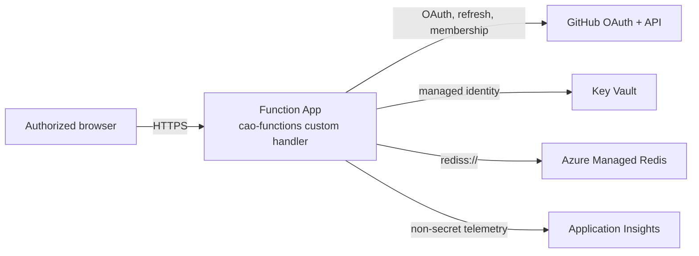

> [!WARNING]
> **Experimental:** The Azure deployment is an experimental production-readiness profile, not a turnkey or certified production service. Treat `server/azure/main.bicep`, the OAuth policy, the Redis topology, and the Key Vault access model as a reviewed baseline. Keep it out of live use until your tenant has completed security, compliance, privacy, network-access, load and cost, monitoring, incident-response, and backup and rollback reviews. Parameters, app settings, and resource shapes may change between releases.

The Azure option runs the Go dashboard server (`server/`) as an Azure Functions custom handler. The browser talks only to the Function App over same-origin HTTPS. The Function App authenticates users with GitHub OAuth, authorizes them by explicit GitHub organization or team membership, reads secrets through Key Vault references, and executes bounded Dashboard Language queries against a disposable projection in Azure Managed Redis.



## Prerequisites

`server/azure/main.bicep` provisions the following resources in one resource group:

| Service | Configuration in the template | Purpose |
| --- | --- | --- |
| Azure Functions | Linux Function App, runtime `~4`, `FUNCTIONS_WORKER_RUNTIME=custom`, HTTPS only, TLS 1.2 minimum, FTPS disabled, always on, one minimum instance, system-assigned managed identity | Hosts the Go HTTP handler |
| App Service plan | Elastic Premium `EP1` | Always-on plan for the Function App |
| Azure Managed Redis | `Microsoft.Cache/redisEnterprise`, default `Balanced_B0` capacity 1, TLS 1.2, encrypted client protocol, `NoEviction`, public network access disabled, no Redis modules | Disposable dashboard projection, sessions, rate limits, webhook deduplication |
| Key Vault | RBAC authorization, soft delete (90 days), purge protection | OAuth client secret, session secrets, Redis URL, Functions storage connection string, optional collection secrets |
| Storage account | `Standard_LRS`, HTTPS only, TLS 1.2, no public blob access | Azure Functions runtime state only |
| Application Insights | Optional Log Analytics workspace | Non-secret operational telemetry |

You also need the following:

- An Azure subscription and a resource group where you can create these resources and assign the **Key Vault Secrets User** role.
- The Azure CLI with Bicep support.
- A **GitHub OAuth App** (not a PAT, not a GitHub App user token) whose callback URL is `https://<functionAppName>.azurewebsites.net/auth/callback`.
- At least one GitHub organization, or `org/team-slug`, whose active members may read the dashboard.
- A network path from the Function App (and from any ingestion host) to Azure Managed Redis. The template disables Redis public network access and does not create a virtual network or private endpoint, so you must add private networking that fits your tenant.
- Go 1.27.1 and Node.js 24 to build the deployment package;
- A trusted dashboard payload produced by `cao-dashboard.yml` in your control repository.

The optional collection profile additionally requires a container registry image of the collector, a GitHub App, and Azure Container Apps. For more information, see [Using the optional collection profile](#using-the-optional-collection-profile).

## Deploying the dashboard

1. Register a GitHub OAuth App and set its **Authorization callback URL** to `https://<functionAppName>.azurewebsites.net/auth/callback`. Store the client secret in a password manager for the next step. Never commit it. For more information, see [Creating an OAuth app](https://docs.github.com/en/apps/oauth-apps/building-oauth-apps/creating-an-oauth-app) in the GitHub documentation.
1. Generate a session secret of at least 32 random characters. For example, run `openssl rand -base64 48`.
1. Deploy the infrastructure. Supply secure parameters interactively or from your secret manager, never from a checked-in parameters file.

   ```bash
   az group create --name cao-dashboard --location <region>
   az deployment group create \
     --resource-group cao-dashboard \
     --template-file server/azure/main.bicep \
     --parameters \
       functionAppName=<globally-unique-name> \
       storageAccountName=<globally-unique-storage-name> \
       keyVaultName=<key-vault-name> \
       redisEnterpriseName=<redis-name> \
       allowedHosts='["<globally-unique-name>.azurewebsites.net"]' \
       githubAllowedOrganizations='["<org>"]' \
       githubClientId=<oauth-client-id>
   ```

   The CLI prompts for `githubClientSecret`, `sessionSecret`, and `redisConnectionString`. The Redis access key does not exist until Azure Managed Redis is created, so for the first deployment supply a temporary `rediss://` value, then read the database access key after provisioning and redeploy with the real `rediss://:<access-key>@<redis-host>:10000/0` URL. The template stores it only as the `cao-redis-url` Key Vault secret.
1. Record the deployment outputs. The template outputs only non-secret values: `functionHostName`, `githubOAuthRedirectUri`, `redisEnterpriseHostName`, `redisDatabaseName`, `keyVaultUri`, and `collectionEnabled`. Confirm that `githubOAuthRedirectUri` matches the OAuth App callback.
1. Add private networking so that the Function App can reach Redis while Redis public access stays disabled.
1. From a trusted checkout, build the deployment package.

   ```bash
   npm --prefix dashboard/site ci
   npm --prefix dashboard/site run build -- dist ../../.github/workflows/cao.json "$(git rev-parse HEAD)"
   GOOS=linux GOARCH=amd64 CGO_ENABLED=0 go -C server build -trimpath -o ../package/cao-functions ./cmd/cao-functions
   ```

   Assemble a Functions package containing the `cao-functions` executable, the built site in `site/`, the Dashboard Language document at `site/dashboard.json` (or set `CAO_AZURE_DASHBOARD_QUERIES`), a `host.json` whose `customHandler.description.defaultExecutablePath` is `cao-functions` with `enableForwardingHttpRequest: true` and an empty HTTP `routePrefix`, and one anonymous catch-all `httpTrigger` function with route `{*path}`. `scripts/azure-local/azure-local.sh` generates exactly this layout and is the reference.
1. Publish the package with your standard Azure Functions zip deployment. For example, run `az functionapp deployment source config-zip`.
1. Load the dashboard data. In the default profile, the Function App does not ingest artifacts by itself. From a host with private network access to Redis, run ingestion against the namespace that the Function App uses.

   ```bash
   go -C server run ./cmd/cao-dashboard ingest \
     --source /absolute/path/to/verified-dashboard-artifact \
     --redis-url "$CAO_REDIS_URL" \
     --redis-namespace azure-dashboard
   ```

   Read `CAO_REDIS_URL` from Key Vault into the process environment only; do not pass it through shell history, tickets, or logs.
1. Verify the deployment.

   - Confirm that `GET /api/health` succeeds and that `GET /api/readiness` returns `200` after an active generation exists.
   - Sign in with GitHub and open a representative dashboard view.
   - Confirm that a user outside the allowed organizations or teams is refused.

> [!TIP]
> To test the Functions HTTP surface locally without Azure credentials, run `./scripts/azure-local/azure-local.sh run` on Linux. The script starts Functions Core Tools, Azurite, and Redis.

## Configuration reference

App settings created by the template:

| App setting | Source | Meaning |
| --- | --- | --- |
| `CAO_DASHBOARD_HOSTING` | Literal `azure-functions` | Selects the Azure hosting mode |
| `CAO_AZURE_ALLOWED_HOSTS` | `allowedHosts` | Exact trusted public host names for forwarded `Host` headers |
| `CAO_AZURE_REQUIRE_HTTPS` | Literal `true` | Requires `X-Forwarded-Proto: https` |
| `CAO_REDIS_URL` | Key Vault `cao-redis-url` | `rediss://` connection; plaintext is always rejected in Azure |
| `CAO_REDIS_NAMESPACE` | Literal `azure-dashboard` | Redis key namespace |
| `CAO_GITHUB_CLIENT_ID` | `githubClientId` | OAuth App client ID |
| `CAO_GITHUB_CLIENT_SECRET` | Key Vault `github-oauth-client-secret` | OAuth App client secret |
| `CAO_GITHUB_REDIRECT_URL` | Derived | `https://<functionAppName>.azurewebsites.net/auth/callback` |
| `CAO_GITHUB_ALLOWED_ORGS` | `githubAllowedOrganizations` | Organizations whose active members are authorized |
| `CAO_GITHUB_ALLOWED_TEAMS` | `githubAllowedTeams` | `org/team-slug` values whose active members are authorized |
| `CAO_SESSION_SECRET` | Key Vault `cao-session-secret` | Current session encryption key, at least 32 characters |
| `CAO_SESSION_SECRET_PREVIOUS` | Key Vault, only when `previousSessionSecret` is set | Previous key during controlled rotation |
| `APPLICATIONINSIGHTS_CONNECTION_STRING` | Application Insights | Functions host telemetry destination |
| `AzureWebJobsStorage` | Key Vault `azure-webjobs-storage` | Functions runtime storage |

Settings read by `cao-functions` with defaults: `CAO_AZURE_SITE_DIRECTORY` (default `site`) and `CAO_AZURE_DASHBOARD_QUERIES` (default `<site>/dashboard.json`).

Other template parameters: `location`, `hostingPlanName`, `redisSkuName` (`Balanced_B0` through `MemoryOptimized_M10`), `redisCapacity`, `logAnalyticsWorkspaceResourceId`, and the collection parameters below. Size Redis from retained generations and data volume; the server uses only core Redis commands.

Azure mode fails closed at startup unless `rediss://` Redis, a namespace, allowed hosts, HTTPS enforcement, the OAuth client ID, secret, and redirect URL, a session secret of at least 32 characters, and at least one allowed organization or team are all configured. It never accepts the local bearer capability or PATs.

## Monitoring the deployment

- **Functions host telemetry.** The template sets `APPLICATIONINSIGHTS_CONNECTION_STRING`, so Functions host requests, failures, and logs flow to Application Insights. Link a Log Analytics workspace with `logAnalyticsWorkspaceResourceId` for workspace-based queries and retention.
- **OpenTelemetry traces from the Go server.** The server uses vendor-neutral OpenTelemetry. Every HTTP request is wrapped with `otelhttp`, and queries and ingestion emit `cao_dashboard.query.execute` and `cao_dashboard.ingest.run` spans with non-secret counts, revisions, and durations only. No Azure Monitor SDK is linked. To export spans, run an OpenTelemetry Collector with the `azuremonitorexporter` configured with the Application Insights connection string, and add these app settings:

  | App setting | Effect |
  | --- | --- |
  | `OTEL_EXPORTER_OTLP_ENDPOINT` or `OTEL_EXPORTER_OTLP_TRACES_ENDPOINT` | Enables the OTLP/HTTP trace exporter. Without it, spans are no-ops. |
  | `OTEL_EXPORTER_OTLP_HEADERS` | Collector authentication headers. Store as a Key Vault reference. |
  | `OTEL_SERVICE_NAME` | Overrides the default `cao-dashboard` service name. |
  | `OTEL_SDK_DISABLED` | `true` forces the no-op tracer even when an endpoint is set. |

  A client-sent `traceparent` header continues an existing trace, and every API response carries `X-Trace-Id` and `X-Span-Id` for correlation.
- **Debug logs.** Set `DEBUG` to `cao:server`, `cao:query`, `cao:ingest`, `cao:redis`, `cao:cli`, or a pattern such as `cao:*,-cao:redis`. Current `main` also logs the resolved site directory, query path, and listen address of `cao-functions` under `cao:functions:startup`. Logs go to stderr and contain operation names, counts, timings, and fixed `oauth branch=<operation>.<outcome>` identifiers, never tokens, credentials, query payloads, or source records. Append `?debug=auth` in the browser to see matching client-side authentication events.
- **Health endpoints.** `GET /api/health` (liveness), `GET /api/readiness` (503 until data is active), and `GET /api/v1/health`. Health and readiness probes are exempt from rate limits.
- **Diagnostics.** `cao-dashboard doctor --redis-url "$CAO_REDIS_URL" --redis-namespace azure-dashboard` runs a read-only check of Redis, canonical data, queries, and collection. Add `--deep` to read every active source, `--format json` for automation, and `--strict` to fail on warnings.
- **Agentic workflow traces** are configured separately in the control repository. For more information, see [Optional observability](configuration.md#optional-observability).

## Using the optional collection profile

By default the server serves snapshots published by the Activity workflow and collects nothing. Setting `collectorImage` selects the collection profile instead: `server/azure/collector.bicep` adds an Azure Container Apps environment, KEDA-scaled collection workers (`redis-streams` backlog trigger, `minimumWorkers` default `0`, `collectorMaximumWorkers` default `20`), a backfill job, a user-assigned identity with Key Vault access, and a premium Azure Files evidence lake (`collectorLakeStorageSku`, default `Premium_LRS`).

The collection profile requires `collectorGithubAppId`, `collectorPrivateKey`, `githubWebhookSecret`, `collectorRedisPassword`, `githubAdminUsers`, and `collectorControlRepository`. The Function App then runs admission-only (`CAO_COLLECT_ADMIT_ONLY=true`): it verifies and deduplicates `POST /api/github/webhook` deliveries and enqueues work, but holds no App private key. Point the GitHub App webhook at `https://<host>/api/github/webhook`. Enrollment follows App installations; uninstalling the App withdraws scope and erases that repository's evidence. Monitor the profile through `GET /api/admin/collection/status` and the Container Apps logs in Log Analytics.

The two profiles are alternatives, never layers. Configuring both `CAO_SOURCE_DIRECTORY` and `CAO_COLLECT_APP_ID` is rejected at startup.

## What this deployment guarantees

- The browser never receives Redis URLs or credentials, GitHub access or refresh tokens, or Key Vault secret values.
- Every secret-bearing app setting is a versionless Key Vault reference resolved by managed identity; template outputs contain no secrets.
- Access requires GitHub OAuth and active membership in an allowed organization or team, revalidated on every token refresh. Session cookies are `Secure`, `HttpOnly`, and `SameSite=Lax`; mutating requests require a session-bound CSRF token.
- Redis traffic uses `rediss://` with certificate and hostname verification; there is no insecure TLS option.
- Queries are bounded by definition, join, predicate, row, and operation limits and never return silent partial success.
- Rate limits are enforced atomically in Redis across instances and fail closed with `503` when Redis cannot enforce them.
- Ingestion stages a complete generation and activates it atomically. A failed ingestion or rebuild leaves the previous generation active.

## What this deployment does not guarantee

- **Production readiness.** The profile is experimental and has no CAO support commitment or SLA. Availability is that of your Azure resources.
- **Networking.** The template does not provision virtual networks, private endpoints, WAF, or Front Door. You own network isolation and ingress.
- **Automatic ingestion.** In the default profile nothing pushes new payloads into Redis; you must schedule ingestion yourself or use the collection profile.
- **Live updates.** Server-Sent Events at `GET /api/v1/events` are best-effort; cold starts, scale-in, idle timeouts, and plan limits can end them. Clients fall back to `POST /api/v1/refresh`. WebSockets are not supported.
- **Durability.** Redis is disposable derived state and is not backed up by CAO. Rebuild it from the retained artifact or evidence lake.
- **Per-repository authorization.** Authorized users can read the full active generation; there is no per-repository or per-source filtering.
- **Cost.** The EP1 plan and Azure Managed Redis are always-on costs regardless of traffic.
- **Credential rotation.** Rotating secrets is an operator procedure; rolling back a package does not roll back OAuth, session, or Redis credentials.

## Rotating secrets and rolling back

- **Session secret.** Redeploy with the old key as `previousSessionSecret` and the new key as `sessionSecret`, wait for active sessions and queued revocations to drain, then redeploy without `previousSessionSecret`.
- **Redis key.** Regenerate the access key in Azure, publish a new `cao-redis-url` secret version, and restart the Function App.
- **OAuth secret.** Rotate in GitHub, publish a new Key Vault secret version, and restart the Function App.
- **Application.** Redeploy the previous known-good package. If the projection is unusable, clear only the `azure-dashboard` namespace and re-ingest the retained artifact.

For the complete threat model and control list, see [`server/README.md`](https://github.com/githubnext/gh-aw-cao/blob/main/server/README.md#hosted-azure-architecture) and [`server/SECURITY.md`](https://github.com/githubnext/gh-aw-cao/blob/main/server/SECURITY.md#azure-functions-profile).

## Further reading

- [Deployment options](deployment.md)
- [Coolify](deployment-coolify.md)
- [`server/README.md`](https://github.com/githubnext/gh-aw-cao/blob/main/server/README.md)
- [`server/SECURITY.md`](https://github.com/githubnext/gh-aw-cao/blob/main/server/SECURITY.md)
- [`scripts/azure-local/README.md`](https://github.com/githubnext/gh-aw-cao/blob/main/scripts/azure-local/README.md)
