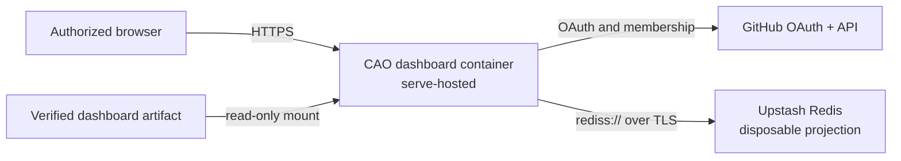

> [!WARNING]
> **Experimental:** The hosted dashboard and its Upstash Redis configuration are experimental and aren't certified for production use. Before you expose the deployment to users, complete your own security, privacy, capacity, cost, monitoring, and recovery reviews.

## About the Upstash deployment

Upstash supplies the managed Redis database for the hosted dashboard. It doesn't run the dashboard application. Run the CAO container on [Coolify](deployment-coolify.md), a virtual machine, Kubernetes, or another container platform, and connect it to Upstash by using the database's TLS Redis URL.

The deployment uses the existing host-neutral `serve-hosted` profile:

- The CAO server connects to Upstash over the Redis TCP protocol with TLS.
- The browser connects only to the CAO server. It never receives the Upstash endpoint or credentials.
- The server uses core Redis commands and Lua scripts. It doesn't use the Upstash REST API or require Redis modules.
- Upstash stores a disposable projection of the dashboard data, server-side sessions, rate limits, webhook delivery markers, and rebuild coordination state.



## Prerequisites

| Requirement | Details |
| --- | --- |
| Application host | A container platform or host that can run `server/Dockerfile` behind HTTPS. To use the checked-in Compose profile, follow the [Coolify deployment](deployment-coolify.md). |
| Upstash Redis | A dedicated Upstash Redis database with TLS enabled. Place it near the application host to reduce query and ingestion latency. |
| Capacity | Enough database storage and command capacity for the retained dashboard generations, sessions, rate limits, and rebuild traffic. |
| Eviction | Disable eviction. If Upstash reaches its data limit, writes must fail instead of silently evicting active generation data or security state. |
| Dashboard artifact | A complete payload from the `cao-dashboard.yml` workflow, including `payload-hashes.json` and every file that it lists. |
| GitHub OAuth app | An OAuth app with the callback URL `https://PUBLIC-HOST/auth/callback`. |

The application host needs outbound access to the Upstash Redis endpoint and to the GitHub OAuth and API endpoints.

## Deploying the dashboard

1. Create a dedicated Redis database in the [Upstash console](https://console.upstash.com/).
1. Disable eviction for the database.
1. Copy the database's TLS Redis connection string. Use the `rediss://` connection string for the Redis TCP endpoint, not the REST URL or REST token.
1. Store the complete connection string as the secret `CAO_REDIS_URL` on your application host.

   > [!CAUTION]
   > The connection string contains a credential. Don't commit it, pass it as a command-line argument, include it in a URL shown to users, or write it to logs.

1. Set `CAO_REDIS_NAMESPACE` to a unique value, such as `upstash-dashboard`.
1. Leave `CAO_ALLOW_PRIVATE_PLAINTEXT_REDIS` unset or set it to `false`. Upstash connections must use TLS.
1. Configure the remaining `serve-hosted` settings, including the allowed host, trusted proxy boundary, GitHub OAuth app, authorization policy, session secret, administrators, webhook secret, and source directory. For the complete list, see the [hosted service profile](https://github.com/githubnext/gh-aw-cao/blob/main/server/README.md#hosted-service-profile).
1. Build or select the CAO container image and provide the verified dashboard artifact to the container as read-only input.

   To deploy with Coolify, use `server/coolify/compose.yml` and follow [Deploying the dashboard to Coolify](deployment-coolify.md#deploying-the-dashboard). Set its `CAO_REDIS_URL` secret to the Upstash TLS Redis connection string. Don't enable the private plaintext Redis exception.

1. Start the container. On startup, `serve-hosted` verifies the artifact, prepares a Redis generation, and atomically makes the complete generation active.
1. Verify the deployment.

   1. Confirm that `GET /api/readiness` returns `200`.
   1. Sign in with an authorized GitHub account.
   1. Run a bounded dashboard query.
   1. Confirm that an unauthorized account is refused.
   1. Review the Upstash metrics for errors, command volume, storage, and latency during ingestion and query traffic.

## Configuration reference

The Upstash-specific settings are:

| Variable | Required | Secret | Description |
| --- | --- | --- | --- |
| `CAO_REDIS_URL` | Yes | Yes | The Upstash Redis TCP connection string. It must use `rediss://`. Don't use the REST URL or token. |
| `CAO_REDIS_NAMESPACE` | No | No | Prefix for every key owned by this deployment. Defaults to `hosted-dashboard`; use a unique value when a database is shared. |
| `CAO_ALLOW_PRIVATE_PLAINTEXT_REDIS` | No | No | Leave unset or `false`. This exception is only for a private deployment-managed Redis network and must not be used with Upstash. |

The CAO Redis client supports credentials in the standard TLS Redis URL, verifies the endpoint certificate and host name, reuses a bounded pool of connections, and doesn't log the connection string. The hosted service requires Redis scripting for atomic generation activation, sessions, leases, and rate limits. Before using a new Upstash plan or database type, confirm that it supports the Redis TCP endpoint and `EVAL`.

## Monitoring the deployment

### Health and diagnostics

Use `GET /api/health` for liveness and `GET /api/readiness` for readiness. Readiness remains unavailable until the server can reach Upstash and an active generation exists.

Run the read-only diagnostics from the application container:

```bash
/app/cao-dashboard doctor --redis-namespace upstash-dashboard
```

`CAO_REDIS_URL` must be present in the process environment. Add `--deep` to inspect every active source, `--format json` for automation, or `--strict` to fail on warnings.

### Upstash usage

Monitor database storage, rejected commands, latency, connection count, and command volume in Upstash. Ingestion writes every retained source row and can create a short command-volume spike. Dashboard queries, OAuth sessions, and rate limits continue to use Redis after ingestion.

Configure capacity alerts before the database reaches its storage or command limits. The server fails closed when Redis can't enforce authentication-related state or rate limits.

### Logs and traces

Container logs include Redis operation names, counts, timings, and status, but not the Upstash URL, credentials, source records, or query payloads. To enable selected debug namespaces, set `DEBUG` to a value such as `cao:server,cao:redis`.

The server exports vendor-neutral OpenTelemetry traces when standard `OTEL_*` environment variables are configured. Keep exporter credentials in your application's secret manager.

## Rotating the Upstash credential

1. Create or obtain the replacement Upstash credential.
1. Update the `CAO_REDIS_URL` secret on the application host without logging its value.
1. Restart or redeploy every CAO server replica.
1. Confirm readiness, OAuth sign-in, a bounded query, webhook verification, and rate-limit behavior.
1. Revoke the previous credential after every replica uses the replacement.

Credential rotation doesn't require a data migration when the endpoint and database stay the same.

## What this deployment guarantees

- **Encrypted Redis transport.** The CAO server requires the Upstash connection to use `rediss://` and verifies the TLS certificate and host name.
- **Server-side credentials.** The browser never receives the Redis endpoint, password, or REST token.
- **Fail-closed security state.** Requests fail when Redis can't enforce hosted rate limits or required session state.
- **Recoverable projection.** Redis data can be rebuilt from the retained, hash-verified dashboard artifact.

## What this deployment does not guarantee

- **Application hosting.** Upstash runs Redis, not the CAO container, HTTPS ingress, artifact storage, or reverse proxy.
- **Private networking.** The application connects to the managed Upstash endpoint over the network. TLS protects the connection, but you must review the provider and network boundary.
- **Capacity or cost.** You must select and monitor an Upstash plan that fits ingestion, retained generations, and request traffic.
- **Backups.** CAO doesn't back up Redis. Redis is disposable derived state; retain the authoritative dashboard artifact.
- **Automatic artifact refresh.** Upstash doesn't fetch CAO artifacts. Refresh behavior belongs to the application deployment and control repository.

## Recovering the deployment

If the Redis projection becomes unusable, stop the CAO replicas, delete only the configured CAO namespace, and restart from the retained verified artifact. Don't delete unrelated keys when the database is shared.

To roll back the application, redeploy the last known-good image digest through the same protected deployment environment. Then verify readiness, OAuth authorization, a bounded query, webhook handling, and rate limits. Rolling back the image doesn't roll back Upstash credentials or session secrets.

## Further reading

- [About deployment options](deployment.md)
- [Deploying the dashboard to Coolify](deployment-coolify.md)
- [Data ingestion](dashboard-data-ingestion.md)
- [Data model](dashboard-data-model.md)
- [Monitor and recover](operations.md)
- [`server/README.md`](https://github.com/githubnext/gh-aw-cao/blob/main/server/README.md)
- [`server/SECURITY.md`](https://github.com/githubnext/gh-aw-cao/blob/main/server/SECURITY.md)
