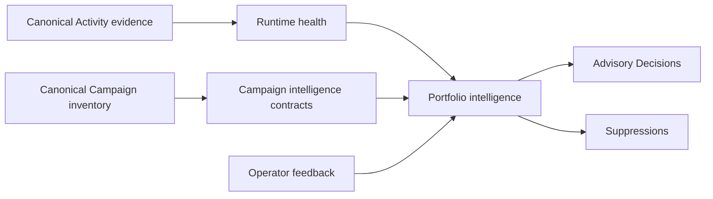

# CAO intelligence

The CAO intelligence layer turns canonical Activity and Campaign inventory
evidence into compact, deterministic findings for operators. It answers:

- What is failing or missing now?
- Which observations describe the same underlying condition?
- Which conditions require attention now or soon?
- Which signals should be suppressed because they are outside scope or recovery
  is already underway?
- What evidence and assumptions support each recommendation?

Intelligence is a derived, review-only layer. It does not admit Work, acquire a
claim, dispatch a worker, change rollout mode, grant credentials, or mutate a
repository. A high-priority Decision is evidence for human review, not
permission to execute.

For the normative contract, see the
[Intelligence Specification](https://github.com/githubnext/gh-aw-cao/blob/main/specs/intelligence.md).

## Data flow



The layer currently exposes two CLI computations:

1. [Runtime health](computation-runtime-health.md) evaluates orchestrators and
   worker-target partitions against the latest observed success boundary.
2. [Portfolio intelligence](computation-intelligence.md) correlates current
   failure signals into stable, review-only Decisions and applies
   fingerprint-bound operator feedback.

Both computations consume the downloaded canonical snapshot. They do not query
GitHub during evaluation.

## Run the current layer

Download or refresh the deployed snapshot:

```bash
./cao.sh download
```

Evaluate the complete portfolio:

```bash
./cao.sh computation runtime-health
./cao.sh computation intelligence
```

Narrow either computation to one Campaign:

```bash
./cao.sh computation runtime-health --campaign dependabot
./cao.sh computation intelligence --campaign dependabot
```

Each command writes JSON to standard output. Diagnostics and runtime warnings
stay on standard error, so the result can be redirected safely:

```bash
./cao.sh computation intelligence > intelligence.json
```

See [CAO Commands](cao-cli.md) for common CLI options.

## Campaign intelligence contracts

Every evaluated Campaign receives a stable, versioned intelligence contract.
The contract has 17 semantic fields covering:

- the repository-native problem and eligible opportunity;
- intended outcome and accepted outcome evidence;
- target population and intervention class;
- trigger, schedule, rationale, and maximum detection delay;
- resource and human-attention envelopes;
- overlap identity and output/approval policy;
- maturation, deduplication, backoff, and stop conditions; and
- operational-value definition.

The compiler copies only declared or canonical facts. It does not reinterpret a
Campaign description, README, workflow execution, or generated issue as an
outcome contract. Undeclared fields remain `null`; numeric evidence
distinguishes `zero`, `missing`, `available`, and `malformed`.

Current inventory commonly provides only a resource envelope and, for
explicitly targeted Campaigns, a target population. Such contracts correctly
report `partial` completeness. A partial contract can support operational
warnings, but it cannot justify claims about expected value, outcome
attainment, schedule fitness, or Campaign overlap.

## Author a Campaign declaration

Place `intelligence.json` next to the Campaign's `aw.yml`:

```json
{
  "contractVersion": "1.0.0",
  "campaign": "dependabot",
  "fields": {
    "intendedOutcome": {
      "statement": "Reduce open dependency security risk."
    },
    "stopConditions": {
      "conditions": ["No actionable dependency-maintenance work remains."]
    }
  }
}
```

After gh-aw installs or updates the Campaign, run the standard CAO materializer.
It copies the declaration from the reviewed Campaign revision to:

```text
.github/cao/intelligence/dependabot.json
```

The envelope is strict:

- `campaign` must match the lowercase Campaign slug;
- `contractVersion` must be supported;
- `fields` may contain only the 17 defined semantic fields;
- unknown values must be omitted, not declared as `null`; and
- the catalog and installed copies must be canonically identical.

Malformed, mismatched, or conflicting declarations fail inventory construction
closed. The declaration is descriptive evidence only; placing `mode`, targets,
credentials, or output authority in it cannot widen reviewed CAO policy.

The Dependabot Campaign is the initial evidence-grounded pilot. Its declaration
references the existing operational-value definition and preserves `backoff`
as unknown because no explicit backoff contract has been authored.

## Evidence quality

Every Campaign contract, Decision, and portfolio result preserves normalized
quality dimensions:

| Dimension | What it describes |
| --- | --- |
| Availability | Whether required evidence exists and can be used. |
| Completeness | Whether all required fields or observations are present. |
| Freshness | The declared state and observation time. |
| Coverage | Measured numerator and eligible denominator, when known. |
| Maturity | Whether enough time has elapsed to evaluate the evidence. |
| Provenance | Which canonical sources produced the result. |
| Attribution coverage | How much evidence can be assigned to its subject. |
| Contradiction state | Whether evidence conflicts. |

Invalid quality values fail closed as `malformed`. Missing denominators remain
`null`; they are not replaced with observed counts. `fresh` and `stale` require
a valid observation time and an applicable freshness rule.

## Decisions and feedback

A Decision has a stable identity for its semantic condition and a separate
input fingerprint for the exact evidence that produced it. This distinction
allows CAO to:

- reuse unchanged Decisions during deterministic replay;
- recognize changed evidence without inventing a new semantic identity;
- apply feedback only to the exact evidence an operator reviewed; and
- retain feedback against older evidence as stale, inspectable history.

Terminal feedback (`accepted`, `rejected`, `superseded`, `recovered`, or
`expired`) suppresses only an unchanged Decision. Nonterminal feedback
(`deferred` or `unresolved`) remains attached without suppressing it.

Feedback is descriptive evidence. `accepted` means the recommendation was
accepted for the reviewed fingerprint; it does not mean the intended
repository outcome was attained, and it grants no execution authority.

## What the current layer can and cannot conclude

The current implementation can reliably conclude that a bounded operational
condition is recurring, group related failure evidence, identify recovery and
scope suppressions, and preserve human review.

It cannot yet determine which intervention creates the most operational value.
That requires explicit Campaign outcomes, schedules, budgets, attention
limits, overlap identities, and stop conditions, followed by deterministic
resource, schedule, overlap, and portfolio-selection measures.

The planned delivery sequence is:

1. ingest the missing Campaign intelligence facts;
2. add resource, schedule, overlap, attention, and Campaign-design measures;
3. apply hard gates and explicit capacity constraints;
4. present Decision Briefs through Dashboard Language;
5. add authoring validation and historical simulation; and
6. integrate a later coordination layer for bounded dispatch.

The intelligence contracts and fingerprints are intentionally independent of
that future coordination storage.
