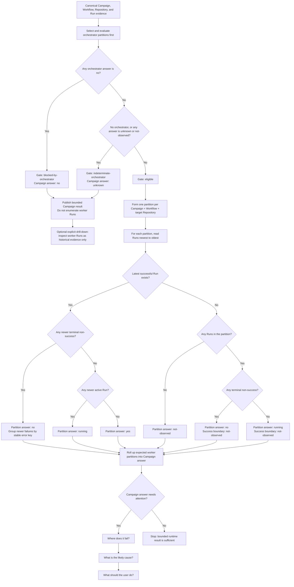

# Central Agentic Ops Computations Specification

**Version:** 0.9.0
**Status:** Working Draft
**Latest Version:** https://github.com/githubnext/gh-aw-cao/blob/main/specs/computations.md
**Editors:** GitHub Next

## Abstract

This specification defines the computation layer that transforms Central
Agentic Ops (CAO) evidence into bounded measures and actionable insights.
Computations reduce the need for people and user interfaces to repeatedly scan
the complete Activity corpus. They operate on canonical evidence, preserve
quality and provenance, and produce compact, versioned results that can be
incrementally refreshed and independently explained.

This specification defines five independently versioned measures. **Does it
run?** establishes current runtime facts. **How well does it run?** reports
successful Run production, native operational-value measurements, and resource
cost without inventing a composite score. **Where does it fail?** correlates
current errors across campaigns and targets. **What is the likely cause?**
enriches that scope with bounded audit evidence. **What should the user do?**
turns the supported result into one deterministic next action. Healthy
workflows stop after the first measure; only results that need attention
advance through deeper and more expensive analysis.

## Table of contents

1. [Status and conformance](#1-status-and-conformance)
2. [Scope and authority](#2-scope-and-authority)
3. [Computation model](#3-computation-model)
4. [Insight requirements](#4-insight-requirements)
5. [Measure: Does it run?](#5-measure-does-it-run)
   - [Companion measure: How well does it run?](#511-companion-measure-how-well-does-it-run)
6. [Measure: Where does it fail?](#6-measure-where-does-it-fail)
7. [Measure: What is the likely cause?](#7-measure-what-is-the-likely-cause)
8. [Measure: What should the user do?](#8-measure-what-should-the-user-do)
9. [Refresh and invalidation](#9-refresh-and-invalidation)
10. [Consumer requirements](#10-consumer-requirements)
11. [Conformance tests](#11-conformance-tests)
12. [Informative example](#12-informative-example)
13. [Normative references](#13-normative-references)
14. [Change log](#14-change-log)

## 1. Status and conformance

This document is a Working Draft and may be updated, replaced, or made
obsolete. Sections 2 through 11 are normative. Examples and explicitly
identified notes are informative.

The key words "MUST", "MUST NOT", "REQUIRED", "SHALL", "SHALL NOT", "SHOULD",
"SHOULD NOT", "RECOMMENDED", "NOT RECOMMENDED", "MAY", and "OPTIONAL" are to
be interpreted as described in [RFC 2119](https://www.rfc-editor.org/rfc/rfc2119).

This specification defines three conformance classes:

1. A **conforming computation engine** evaluates a measure according to its
   versioned definition and the common requirements in this specification.
2. A **conforming computation publisher** persists or publishes computation
   results without changing their meaning, quality state, or provenance.
3. A **conforming computation consumer** uses computation results without
   presenting them as stronger, fresher, or more complete than their evidence.

## 2. Scope and authority

### 2.1 Scope

This specification covers:

- the boundary between canonical evidence and derived insights;
- versioning, partitioning, refresh, and bounded-output requirements;
- evidence quality, provenance, and explainability;
- the result envelope shared by CAO measures; and
- the normative staged measures defined in Sections 5 through 8.

This specification does not define:

- Activity collection or source adaptation;
- rollout or target-writing authority;
- dashboard presentation or interaction;
- workflow success criteria beyond the native runtime conclusion;
- verification, outcome acceptance, or operational value; or
- automatic remediation.

### 2.2 Authority

A computation is derived evidence. It MUST NOT:

- grant or widen CAO policy, credentials, workflow permissions, repository
  scope, or target-writing authority;
- mutate a target repository;
- replace its authoritative Activity inputs;
- treat runtime success as verified outcome, accepted outcome, or operational
  value; or
- conceal unavailable, partial, stale, or out-of-scope evidence behind a
  success-shaped result.

Computations MAY identify a next investigation step. Such a step is guidance,
not authorization to perform the action.

## 3. Computation model

### 3.1 Terms

**Canonical evidence**
: Source-neutral Campaign, Repository, Workflow, Run, Domain, Tool, Audit, and
  Issue records defined by the
  [Dashboard Data Architecture Specification](dashboard-data.md).

**Measure**
: A named and versioned deterministic method that evaluates canonical evidence
  for a declared scope.

**Partition**
: The smallest independently recomputable scope of a measure. A partition has a
  stable key, such as one Campaign, one Workflow, and, for a worker, one target
  Repository. An evaluation partition is a bounded batch-computation unit, not
  an online event-processing unit.

**Insight**
: A bounded derived result that answers an operator question and identifies
  evidence and, when justified, a next action.

**Evidence reference**
: A stable canonical entity identifier and optional source link used to inspect
  the evidence supporting a result.

**Evidence boundary**
: The generation, scope, time window, and quality metadata that delimit the
  evidence evaluated by a computation.

### 3.2 Required flow

The computation boundary is:

```text
authoritative Activity snapshot
        |
        v
canonical normalization and projection
        |
        v
versioned computation over bounded partitions
        |
        v
bounded measure results and actionable insights
        |
        v
dashboard, CLI, agents, and other consumers
```

A computation engine MUST consume canonical evidence or an equivalent
projection that preserves the same identities, relationships, source
precedence, and quality semantics. It MUST NOT make a presentation component
parse raw Activity records or reconstruct Campaign-to-Workflow or
Workflow-to-Run relationships.

### 3.3 Measure definition

Every measure definition MUST declare:

- a stable `measureId`;
- a semantic `measureVersion`;
- the operator question it answers;
- required canonical entities and fields;
- its partition key;
- its ordering, grouping, and tie-breaking rules;
- its quality and freshness requirements;
- its result schema;
- its output bounds;
- the source changes that invalidate a result; and
- whether it can be evaluated incrementally.

Changing an input's meaning, the evaluation algorithm, grouping identity,
quality rule, or result meaning MUST change `measureVersion`. Editorial changes
that do not affect results MAY retain the version.

### 3.4 Result envelope

Every result MUST contain:

```json
{
  "measureId": "does-it-run",
  "measureVersion": "1.0.0",
  "partitionKey": {
    "campaignId": "campaign:dependabot",
    "workflowId": "github:workflow:98765",
    "targetRepositoryId": "github:repository:12345"
  },
  "answer": "no",
  "summary": {},
  "insights": [],
  "evidence": {
    "generation": "activity-run-id:attempt",
    "scope": {},
    "windowStart": "2026-09-01T00:00:00Z",
    "windowEnd": "2026-09-22T08:00:00Z",
    "availability": "available",
    "completeness": "complete",
    "freshness": "fresh",
    "coverage": 1
  },
  "computedAt": "2026-09-22T08:01:00Z"
}
```

`computedAt` records when the deterministic result was evaluated. It MUST NOT
be used as a substitute for source observation time or evidence freshness.

### 3.5 Determinism and identity

Given the same measure version, canonical generation, partition, and
configuration, a computation MUST produce the same semantic result.

Results MUST use canonical Campaign, Workflow, and Run identities. Display
names, filenames, timestamps, or nearby records MUST NOT create an association
when the canonical relationship is missing.

A computation MUST define a total order for every ordered output. A source
timestamp alone is insufficient because timestamps can collide.

### 3.6 Bounded and incremental evaluation

A computation engine MUST NOT require a consumer to load or inspect the
complete raw corpus to answer a measure.

The engine:

- MUST evaluate independently recomputable partitions;
- SHOULD persist a checkpoint containing the source generation, measure
  version, partition key, and input fingerprint;
- SHOULD recompute only partitions whose relevant inputs or quality metadata
  changed;
- MUST invalidate every affected partition when its measure version changes;
- MUST produce bounded result payloads;
- MUST report omitted result and evidence-reference counts when a configured
  bound is reached; and
- MUST retain enough aggregate counts that truncation does not turn a partial
  list into an incorrect total.

An implementation MAY scan all retained Run summaries while initially building
a partition. It MUST NOT require all detailed run-linked records to be loaded
when the declared measure does not use them.

### 3.7 Overview execution tier

The Overview page is a latency-critical summary surface. Its data request MUST
complete within 200 milliseconds on the repository's representative
large-dataset performance fixture. Rendering, network transfer, initial
database opening, and ingestion are measured separately; the 200-millisecond
budget applies to worker query planning, storage execution, and result
construction after the active database is available.

Every Overview value MUST use one of these execution paths:

1. **Native counter:** an unfiltered whole-store or compatible index count
   compiled by the query/storage planner to IndexedDB `count()`.
2. **Precomputed daily value:** an additive time-window measure read from the
   generation-safe daily Overview aggregate projection defined by the
   [Dashboard Data Architecture Specification](dashboard-data.md#72-daily-overview-aggregate-projection).
3. **Precomputed bounded summary:** a generation-safe materialized computation
   summary whose read is bounded independently of Run-table size.

A native counter query MUST compile to `IDBObjectStore.count()` or, when an
index supplies the exact declared semantics, `IDBIndex.count()`. It MUST NOT
call `getAll()`, open a cursor, materialize entity rows, or execute a
JavaScript row reducer merely to count records.

Additive time-window values such as runs, successful runs, failed runs,
dispatches, and failed dispatches MUST use precomputed UTC daily values and
scan `O(days in window)`, not `O(runs in window)`. Daily values MUST be derived
from canonical records during ingestion, published with the same generation
discipline as canonical data, and return semantics identical to the canonical
query.

Distinct counts, averages, current-streak evaluation, error grouping,
cross-campaign or cross-target clustering, audit correlation, and action
routing MUST NOT execute on the Overview request path. An Overview MAY display
one of these values only when a compatible bounded summary was precomputed
before navigation. Otherwise, the value MUST be deferred to drill-down.

The Overview failed-runs value is a historical time-window counter. It MUST NOT
trigger `does-it-run` or represent unresolved failures. Navigation from that
counter MAY start the staged computation chain, but the Overview request MUST
complete without waiting for any stage of the chain.

`where-does-it-fail`, `what-is-the-likely-cause`, and
`what-should-the-user-do` are drill-down computations. They MAY run after
navigation, or MAY consume previously materialized compatible results. They
MUST NOT block Overview first render, Overview counter updates, or Overview
time-range changes.

Planner diagnostics MUST identify `native-count`, `daily-aggregate`,
`materialized-computation`, or `drill-down` as the execution path and MUST
report duration, storage request count, records scanned, records returned,
generation, and fallback reason. Falling back from an eligible Overview fast
path to a Run-table scan is non-conforming even when the result is correct.

### 3.8 Quality and provenance

Each result MUST independently report:

- **availability:** whether required evidence could be read;
- **completeness:** whether the declared scope and window were fully evaluated;
- **freshness:** whether the evidence meets the measure's freshness policy; and
- **coverage:** the evaluated portion of the declared population when it can be
  measured.

Unknown, unavailable, stale, partial, and complete-zero results MUST remain
distinct. A computation MUST NOT answer `yes` solely because no failures were
found.

Every insight MUST identify:

- the measure and version that produced it;
- its partition;
- the evidence generation and boundary;
- the rule that produced the insight;
- aggregate counts before output truncation; and
- stable evidence references sufficient to investigate the result.

Raw prompts, messages, credentials, tool arguments, response bodies, and other
secret or unbounded payloads MUST NOT be copied into computation results.

## 4. Insight requirements

An actionable insight MUST contain:

- a stable `insightId` derived from the measure version, partition, and insight
  grouping key;
- a `state`;
- a concise `reason`;
- a `nextAction` or an explicit statement that no action is justified;
- the expected actor when known;
- ordered evidence references;
- the latest supporting observation time; and
- a quality state inherited from the result.

An insight MUST distinguish observed values from derived classifications.
Inference rules MUST be named and versioned by the measure definition.

A next action MUST NOT claim that a retry, code change, policy change, or
permission change is safe merely because the computation found an error.

## 5. Measure: Does it run?

### 5.1 Definition

| Property | Value |
| --- | --- |
| Measure ID | `does-it-run` |
| Measure version | `2.0.0` |
| Operator question | Does each orchestrator and worker in this campaign run successfully? |
| Primary partition | Campaign and Workflow for orchestrators; Campaign, Workflow, and target Repository for workers |
| Required entities | Campaign, Repository, Workflow, Run |
| Optional fields | Stable failure classification and bounded failure diagnostics |
| Output | One evaluation-partition result and zero or more error-group insights per partition |

This measure reports runtime health only. An answer of `yes` means that no
unsuccessful completed attempt is observed after the latest successful attempt
within the evaluated evidence. It does not mean that the workflow produced,
verified, or delivered a useful outcome.

### 5.2 Inputs

The required canonical inputs are:

- Campaign: `id`, `slug`;
- Workflow: `id`, `campaignId`, `role`, `state`, `path`, and `name`;
- Run: `id`, `workflowId`, `githubRunId`, `attempt`, `status`, `conclusion`,
  `createdAt`, `startedAt`, `completedAt`, and `updatedAt`; and
- evidence-generation quality metadata.

Worker absence may affect the Campaign answer only when authoritative
orchestrator evidence identifies the worker-target invocation as required or
dispatched. That evidence MUST identify the Campaign, worker Workflow, target
Repository, orchestrator Run, disposition, and observation time.

When present, the computation MAY also use the producer-supplied
`targetRepository`, `failureKind`, `classification`, `failureJob`,
`failureStep`, and bounded `failureMessage` fields. These diagnostic fields
MUST NOT override native Run status or conclusion.

### 5.3 Workflow selection

For the requested Campaign, the engine MUST select every Workflow whose
canonical `campaignId` equals the Campaign `id` and whose `role` is
`orchestrator` or `worker`.

Standalone workflows, repository workflows without canonical campaign
classification, and workflows attributed only by name similarity MUST NOT be
included.

An inactive or disabled campaign Workflow MUST remain in the result. Its
configured state is relevant to the answer and MUST NOT be hidden by the
absence of runs.

Selecting a Workflow definition MUST NOT imply that the Workflow was expected
to run for every selected or configured target. Worker invocation is often
conditional on candidate eligibility, prior campaign state, or the presence of
work. The engine MUST preserve the distinction between:

- `dispatched`: the orchestrator requested this worker-target invocation;
- `required`: reviewed configuration independently requires this
  worker-target invocation in the evidence boundary;
- `not-selected`: the orchestrator intentionally did not select the invocation;
- `no-eligible-work`: the invocation was unnecessary because its documented
  prerequisite produced no eligible work; and
- `indeterminate`: the available evidence does not establish whether the
  invocation was required or dispatched.

`not-selected` and `no-eligible-work` are dispositions, not Run results. They
MUST NOT create empty Run partitions and MUST NOT make a Campaign unhealthy or
unknown. A `noop` output MUST NOT by itself be interpreted as
`no-eligible-work`, because an orchestrator may emit a summary `noop` after
dispatching other workers.

When dispatch-intent evidence is unavailable, observed worker Runs MAY still
be evaluated. The engine MUST NOT manufacture missing worker-target
partitions from the Cartesian product of configured workers and repositories.

### 5.3.1 Orchestrator gate

The engine MUST evaluate every selected orchestrator partition before
enumerating or evaluating worker-target partitions. The Campaign's
`workerEvaluationState`
MUST be:

| State | Rule |
| --- | --- |
| `eligible` | At least one orchestrator is selected and every orchestrator answers `yes` or `running`. |
| `blocked-by-orchestrator` | At least one orchestrator answers `no`. |
| `indeterminate-orchestrator` | No orchestrator is selected, or at least one orchestrator answers `unknown` or `not-observed` and none answers `no`. |

When the state is `blocked-by-orchestrator` or
`indeterminate-orchestrator`, the default Campaign computation MUST stop before
worker-target partition enumeration. It MUST NOT interpret missing worker Runs as
worker failure, target absence, or successful inactivity. The Campaign result
MUST retain the orchestrator results, identify the gate state and controlling
orchestrator result, and report worker evaluation as intentionally skipped.

Canonical worker Runs remain valid historical evidence. A drill-down MAY
evaluate a specifically requested worker-target partition, but it MUST label that
result as outside the current Campaign evaluation and MUST NOT use it to
override the orchestrator-gated Campaign answer.

This gate is both a semantic and scale optimization: orchestration failure can
prevent worker discovery or dispatch, and the already-determined Campaign
answer does not justify eagerly scanning or materializing every worker target.

### 5.3.2 Decision tree

The following figure is informative. The normative requirements in Sections
5.3.1 through 5.10 take precedence.



### 5.4 Run partition construction, selection, and ordering

For each selected Workflow, the engine MUST select Run attempts whose
`workflowId` equals the Workflow `id`.

Before evaluating success or failure, the engine MUST form independent Run
evaluation partitions:

1. all orchestrator Runs for one Campaign and Workflow form one partition; and
2. worker Runs form one partition for each distinct canonical target
   Repository, keyed by Campaign, Workflow, and target Repository.

The engine MUST NOT first combine worker Runs across targets into global
successful and unsuccessful sets. Success boundaries are local to a partition. A
success for one target MUST NOT end, hide, or shorten the current failure
streak for another target.

The partition set MUST include every canonically associated target observed for
the worker in the evidence boundary. It MUST include an empty partition only
when authoritative evidence says that the exact worker-target invocation was
`required` or `dispatched` and no associated Run was observed. A Campaign target
or configured worker alone is insufficient to create that partition.

An observed target outside an authoritative expected-target set MUST remain a
separate partition and MUST be marked `observed-extra`; it MUST NOT be used as
evidence that an expected target is healthy. When policy permits dynamic
discovery and does not declare a fixed target set, an observed dispatched target
MUST NOT be marked `observed-extra`.

The review safe-output repository is an output destination, not a target
Repository. An engine MUST NOT infer the expected target from review mode,
`safe_output_repo`, or the control repository identity.

A worker Run without a valid canonical target Repository association MUST NOT
be assigned to another target or merged into a Workflow-wide partition. The
engine MUST preserve a bounded reference to the unassigned Run, report the
worker result as `unknown`, and mark its evidence incomplete. If target
association is unavailable for all worker Runs, the engine MUST NOT evaluate a
cross-target success boundary.

After partitions are formed, each attempt MUST be classified by native state:

- `success` when native `conclusion` is exactly `success`;
- `terminal-non-success` for any other terminal conclusion; or
- `active` when queued or in progress.

This classification MAY support indexed or incremental execution, but it MUST
NOT change partition membership or replace the per-partition ordering and
latest-success evaluation below.

### 5.4.1 Efficient evaluation plan

The storage layer SHOULD provide reverse-ordered access by generation,
Workflow, target Repository where applicable, run date, GitHub run ID, and
attempt. The computation engine SHOULD:

1. read only orchestrator partitions;
2. stop entirely when the orchestrator gate is not `eligible`;
3. derive worker partitions from the authoritative expected-target set plus
   bounded observed-extra target keys;
4. use one target-ordered range cursor with seeks between partitions, or an
   equivalent bounded newest-first cursor per partition;
5. accumulate active and terminal non-success attempts; and
6. stop that cursor immediately after reading the first successful attempt.

The engine MUST NOT sort all Campaign Runs, materialize global successful and
failed sets, or load complete Run rows merely to find a success boundary. Its
normal read cost SHOULD be proportional to the number of evaluation partitions
plus the current attempts since each partition's latest success.

When no retained success exists, reading the complete partition is unavoidable
unless a compatible checkpoint already records the partition's aggregate
state. An incremental implementation SHOULD update that checkpoint when a Run
is added or corrected and SHOULD rebuild only when an out-of-order change
sorts at or before the stored boundary.

The run date is the first valid value in this order:

1. `startedAt`;
2. `createdAt`;
3. `updatedAt`.

A Run with none of these values has an unknown run date. It MUST NOT be silently
dropped. If otherwise in scope, it MUST make the partition partial and MUST be
listed separately from the ordered streak.

Eligible Run attempts MUST be sorted from newest to oldest by:

1. run date descending;
2. `githubRunId` descending; and
3. `attempt` descending.

The engine MUST evaluate attempts, not only distinct GitHub run IDs. A later
successful retry therefore ends a failure streak; an earlier failed attempt of
that same GitHub run remains older than the retry.

### 5.5 Success boundary and current streak

For each partition, starting with its newest ordered Run attempt, the engine MUST:

1. inspect each attempt in order;
2. stop at the first attempt whose native `conclusion` is exactly `success`;
3. record that attempt as `latestSuccess`;
4. exclude `latestSuccess` and every older attempt from the current streak; and
5. collect every newer attempt into `runsSinceSuccess`.

If no successful attempt exists in a partition's retained evidence, all ordered attempts
belong to `runsSinceSuccess`, `latestSuccess` is `null`, and
`successBoundary` MUST be `not-observed`. Unless the evidence contract proves
complete lifetime history, the engine MUST NOT claim that the Workflow has
never succeeded.

Queued and in-progress attempts belong to `runsSinceSuccess` but MUST NOT be
classified as errors. Cancelled, skipped, neutral, and action-required
conclusions are non-successful terminal attempts; they MUST remain distinct
from failure conclusions.

### 5.6 Answer

Each partition answer MUST be one of:

| Answer | Rule |
| --- | --- |
| `yes` | Evidence is usable, `latestSuccess` exists, and no newer terminal non-success attempt exists. |
| `no` | At least one terminal non-success attempt exists in `runsSinceSuccess`. |
| `running` | No terminal non-success exists in `runsSinceSuccess`, and at least one attempt is queued or in progress. |
| `not-observed` | Evidence is usable but no Run attempt for the orchestrator Workflow or expected worker-target partition is present. |
| `unknown` | Required evidence or a required relationship is unavailable, invalid, stale beyond policy, or too incomplete to support another answer. |

When both an in-progress attempt and a newer-than-success terminal non-success
exist, the answer MUST be `no`; the active attempt MUST be reported separately
as a possible recovery in progress.

A disabled Workflow with no runs MUST answer `not-observed` and report its
configured state. It MUST NOT answer `yes`.

### 5.7 Error identity and grouping

Each terminal non-success attempt in `runsSinceSuccess` MUST be assigned one
stable group key using the first available value in this order:

1. a producer-supplied stable `failureKind`;
2. a producer-supplied stable `classification`;
3. native `conclusion`; or
4. `unknown-error`.

Keys MUST be normalized by trimming surrounding whitespace and applying
Unicode lowercase. An empty normalized value is absent.

The engine MUST NOT use a raw failure message, prompt, log body, stack trace,
run title, or URL as a group key. Such values are unstable, high-cardinality,
and can contain sensitive content.

For each group, the engine MUST produce:

- `errorKey`;
- `count`;
- `latestObservedAt`;
- distinct affected Run-attempt count;
- conclusion counts;
- optional bounded `failureJob` and `failureStep` labels;
- an ordered bounded list of Run evidence references; and
- `omittedRunReferenceCount`.

Error groups MUST be ordered by:

1. `count` descending;
2. `latestObservedAt` descending; and
3. `errorKey` ascending.

Run references inside a group MUST use the ordering in Section 5.4.

The default publication bound SHOULD be 20 error groups and 20 Run references
per group. A publisher MAY choose a different explicit bound, but MUST publish
the chosen bound and all pre-truncation counts.

### 5.8 Evaluation-partition result

Each evaluation-partition result MUST contain:

```json
{
  "campaignId": "campaign:dependabot",
  "workflowId": "github:workflow:98765",
  "workflowRole": "worker",
  "workflowState": "active",
  "partitionKind": "worker-target",
  "targetRepositoryId": "github:repository:12345",
  "targetScopeMembership": "expected",
  "answer": "no",
  "needsAttention": true,
  "latestRun": {
    "runId": "github:run:123:attempt:1",
    "status": "completed",
    "conclusion": "failure",
    "observedAt": "2026-09-22T07:00:00Z"
  },
  "latestSuccess": {
    "runId": "github:run:120:attempt:1",
    "observedAt": "2026-09-21T07:00:00Z"
  },
  "successBoundary": "observed",
  "runsSinceSuccess": 3,
  "terminalNonSuccessesSinceSuccess": 2,
  "activeRunsSinceSuccess": 1,
  "errorGroupCount": 1,
  "errorGroups": [
    {
      "errorKey": "startup-failure",
      "count": 2,
      "latestObservedAt": "2026-09-22T07:00:00Z",
      "runReferences": [
        { "runId": "github:run:123:attempt:1" },
        { "runId": "github:run:122:attempt:1" }
      ],
      "omittedRunReferenceCount": 0
    }
  ],
  "omittedErrorGroupCount": 0
}
```

Counts MUST describe the complete evaluated partition before publication
bounds are applied.

`partitionKind` MUST be `orchestrator` or `worker-target`.
`targetRepositoryId` and `targetScopeMembership` MUST be absent for an
orchestrator. For a worker-target partition, `targetScopeMembership` MUST be
`expected`, `observed-extra`, or `unknown`.

### 5.9 Downstream handoff

The evaluation-partition result MUST set `needsAttention` to `true` for `no`,
`not-observed`, and `unknown`, and to `false` for `yes`. A `running` result
MUST set it to `false` unless another independently defined attention rule
applies.

For every error group, the result MUST provide the factual reason: the number
of attempts with that error since the latest observed success, or within
retained evidence when no success boundary is observed. It MUST retain the
group's ordered Run references.

When an active attempt exists after a failure, the evaluation-partition result MUST state that
recovery may be in progress. It MUST NOT suppress the error group until a
successful attempt is observed.

This measure MUST NOT select the user action. `what-should-the-user-do` owns
action routing, including activation actions for `not-observed` and
evidence-restoration actions for `unknown`.

### 5.10 Workflow and Campaign summaries

One Workflow summary MUST aggregate its partition results without evaluating a
new success boundary. An orchestrator summary contains one partition. A worker
summary contains one partition per target and MUST retain target identity.

The Campaign result MUST aggregate Workflow summaries without replacing their
partition results. It
MUST contain:

- selected orchestrator count;
- selected worker count;
- worker-target partition count;
- `workerEvaluationState`;
- counts by answer;
- workflows with omitted or unknown-date runs;
- the latest source observation time;
- quality metadata; and
- partition-result references ordered by answer priority, role, and stable
  Workflow and target Repository identity.

Answer priority is `unknown`, `no`, `not-observed`, `running`, then `yes`.
Within the same answer, orchestrators MUST precede workers because an
orchestrator failure can prevent worker dispatch. This ordering is an
investigation priority, not a causal conclusion.

The Campaign MUST answer:

- `no` when `workerEvaluationState` is `blocked-by-orchestrator`;
- `unknown` when `workerEvaluationState` is `indeterminate-orchestrator`;
- `no` when any expected or unknown-membership partition answers `no`;
- `unknown` when none answer `no` and any expected or unknown-membership
  partition answers `unknown`;
- `not-observed` when all expected partitions answer `not-observed`;
- `running` when none answer `no` or `unknown` and any expected partition answers
  `running`; and
- `yes` only when every required or dispatched partition answers `yes`.

An `observed-extra` partition MUST be displayed and counted separately, but MUST
NOT make the configured Campaign healthy or unhealthy. When expected-target
evidence is unavailable, observed worker partitions have `unknown` membership and
participate in the Campaign answer with partial evidence.

Configured workers with `not-selected` or `no-eligible-work` dispositions MUST
be reported separately from evaluated partitions. Their absence MUST NOT
prevent a Campaign answer of `yes`.

The worker-partition answer rules apply only when `workerEvaluationState` is
`eligible`. A skipped worker evaluation is not an empty, zero, healthy,
`not-observed`, or failed worker result.

If the Campaign has no canonically classified orchestrator or worker, the
Campaign answer MUST be `unknown`, not `yes`.

### 5.11 Companion measure: How well does it run?

#### 5.11.1 Definition

| Property | Value |
| --- | --- |
| Measure ID | `how-well-does-it-run` |
| Measure version | `1.0.0` |
| Operator question | What did successful Runs produce, what operational value was measured, and what resources did they consume? |
| Primary partition | Campaign, Workflow, and target Repository for workers; Campaign and Workflow for orchestrators |
| Required entities | Campaign, Workflow, successful Run |
| Optional entities | Issue, Audit, Tool, Domain |
| Output | Independent production, value-measurement, and efficiency facts |

This measure MUST consume only Run attempts whose native `conclusion` is
exactly `success`. It is a companion to `does-it-run`, not a replacement for
runtime health. A successful Run MUST NOT be treated as useful, accepted, or
valuable merely because it completed successfully.

The default computation MUST evaluate only partitions whose current
`does-it-run` answer is `yes`, or `running` when an observed successful boundary
exists. It MUST skip `no`, `unknown`, `not-observed`, and orchestrator-gated
worker partitions before loading detailed Issue, Audit, Tool, or Domain
evidence. A consumer MAY request an explicit historical value analysis for a
failed partition, but MUST label it as historical and MUST NOT let it replace
the current failure-diagnosis path.

The engine MUST preserve the same Campaign, Workflow, target Repository, and
target-scope partition identities used by `does-it-run`. One target's outputs
or value measurements MUST NOT be attributed to another target.

#### 5.11.2 Evidence window and selection

Every result MUST declare `evidenceWindowStart` and `evidenceWindowEnd`.
Production and value facts MUST use a window compatible with the retention of
their Run-owned records. A publisher MAY use a shorter explicit window or Run
bound, but MUST report that bound and MUST NOT present partial detail as
complete lifetime evidence.

Orchestrator production MUST be reported separately from worker production.
Dispatch, planning, or coordination outputs from an orchestrator MUST NOT be
counted as target operational value unless an independent value definition
explicitly assigns that meaning.

#### 5.11.3 Production evidence

Producer-supplied per-Run safe-output counts MAY establish that output was
produced when detailed records have expired, but MUST remain separately labeled
from retained distinct output entities. Safe-output observations MUST be
deduplicated by owning Run and the first
available stable output identity in this order:

1. `correlationId`;
2. canonical external URL;
3. canonical Issue identifier; or
4. producer-supplied stable output identifier.

Repeated shard observations of one output MUST NOT increase the output count.
Lifecycle observations with different types or statuses MAY remain distinct,
but the result MUST separately report the distinct output-entity count.

`productionState` MUST be:

| State | Rule |
| --- | --- |
| `produced` | At least one distinct safe-output entity is observed. |
| `none-observed` | Every selected successful Run has explicit output evidence and no output is observed. |
| `unknown` | Output evidence is absent or incomplete and no output is observed. |

The result MUST report output counts by native safe-output kind and SHOULD
retain bounded output references. Creating an issue, pull request, comment, or
other safe output proves production only. It MUST NOT prove acceptance,
delivery, usefulness, implementation, or operational value.

#### 5.11.4 Operational-value evidence

The engine MUST use only producer-supplied operational-value grader results.
It MUST preserve the native metric value, metric order, unit, direction,
grader identity, evaluator identity when present, and status. It MUST NOT
normalize, clamp, replay, combine, or infer missing values.

`valueMeasurementState` MUST be:

| State | Rule |
| --- | --- |
| `measured` | At least one operational-value grader result has `status=pass` and a finite native value. |
| `evaluation-error` | No finite passed value exists and at least one operational-value grader errored. |
| `unavailable` | No finite passed value or error exists and at least one grader reports unavailable evidence. |
| `not-configured` | No operational-value grader result is observed. |

A passed grader means that value was measured; it does not mean that the value
was positive or sufficient. A native zero MUST remain measured zero. Consumers
MUST interpret values only with their declared unit, direction, and
campaign-specific definition.

#### 5.11.5 Efficiency evidence

Efficiency facts MAY include native Run AIC, duration, model requests, token
classes, and other source-defined resource aggregates. The result MUST keep
cost grain explicit and MUST NOT add overlapping invocation and Run aggregates.

For each comparable numeric field, the result MAY report count, total, median,
and bounded Run references. Missing cost evidence is `unknown`, not zero.
Efficiency MUST NOT be called value. Cost per accepted or verified outcome MAY
be computed only when the outcome identity, acceptance evidence, and cost
attribution are complete and comparable.

#### 5.11.6 Result and consumer requirements

Each partition result MUST report at least:

- the measure ID and version;
- Campaign, Workflow, role, and worker target identity;
- evidence-window bounds;
- successful Run count;
- output-evidence coverage, production state, distinct output count, native
  output-kind counts, and bounded output references;
- value-measurement state, native grader-status counts, native measured values,
  units, and directions;
- efficiency-evidence state and native bounded aggregates;
- bounded successful Run references; and
- omitted counts for every bounded list.

The measure MUST NOT emit one composite quality or value score. A consumer MUST
present production, value measurement, and efficiency as separate axes. When
acceptance or disposition evidence is unavailable, the consumer MUST label
created outputs as unverified production.

## 6. Measure: Where does it fail?

### 6.1 Definition

| Property | Value |
| --- | --- |
| Measure ID | `where-does-it-fail` |
| Measure version | `1.0.0` |
| Operator question | Is the current error shared across campaigns, campaign-wide, or target-specific? |
| Primary partition | Equivalent current error group |
| Required input | Version 1.x `does-it-run` results, Campaign scope, and target evaluation evidence |
| Output | One diagnostic-scope result per equivalent current error |

This measure MUST consume bounded `does-it-run` results instead of rescanning
all source Runs. It MAY resolve referenced Campaign, Workflow, Run, target, and
quality records needed to validate scope.

The measure MUST run only for current error groups emitted by a
`does-it-run` result whose answer is `no`. It MUST NOT alter the upstream
workflow answer, current streak, error identity, counts, or evidence
references.

### 6.2 Equivalent current errors

Two current error groups are equivalent when they have the same normalized
`errorKey` and compatible bounded diagnostic dimensions. When both groups
provide `failureJob` or `failureStep`, unequal values in either field MUST keep
them separate. A raw failure message MUST NOT establish equivalence.

Only Runs in the upstream current streak may contribute. Historical failures
older than the latest successful attempt MUST NOT influence diagnostic scope.

### 6.3 Result

Each result MUST contain:

- upstream `does-it-run` result and error-group identities;
- `diagnosticScope`;
- `confidence`, one of `supported`, `tentative`, or `unknown`;
- affected and evaluated Campaign counts;
- affected and evaluated target counts;
- target coverage state;
- the rule that selected the scope;
- evidence references; and
- unanswered diagnostic questions.

`diagnosticScope` MUST be one of:

| Scope | Meaning |
| --- | --- |
| `shared-platform` | An equivalent current error is observed in at least two Campaigns. |
| `campaign-definition` | The error is isolated to one Campaign and affects its orchestrator or every sufficiently evaluated target. |
| `target-specific` | The error is isolated to one Campaign and affects only a proper subset of sufficiently evaluated targets. |
| `undetermined` | Available evidence cannot support one of the narrower scopes. |

These values identify investigation boundaries, not root causes.

### 6.4 Cross-campaign correlation

For each equivalent current error, the engine MUST count distinct Campaigns,
not Workflows or Runs.

When an equivalent error affects two or more Campaigns within comparable
evidence boundaries, the diagnostic scope MUST be `shared-platform`. The result
MUST identify `gh-aw` runtime/compiler behavior and CAO shared control,
collection, or workflow infrastructure as investigation areas. It MUST NOT
select either project as the root cause solely because multiple Campaigns share
an error.

Cross-campaign correlation MUST use `unknown` confidence when Campaign
classification, evidence windows, or freshness are not comparable.

### 6.5 Target denominator

When an error is isolated to one Campaign, the next diagnostic question is:
**Does this error occur across all Campaign targets?**

The denominator MUST be the Campaign's expected target set for the evidence
boundary, derived from reviewed Campaign and control-policy evidence. It MUST
NOT be inferred only from repositories that produced Runs.

A target is **sufficiently evaluated** for one Workflow when:

1. it belongs to the expected target set;
2. the Workflow was expected or dispatched to run for that target; and
3. a canonically associated terminal Run provides either the equivalent error
   or a non-error comparison result.

The result MUST report:

- `expectedTargetCount`;
- `evaluatedTargetCount`;
- `affectedTargetCount`;
- `unaffectedTargetCount`;
- `unevaluatedTargetCount`; and
- `targetCoverage`, one of `complete`, `partial`, `unavailable`, or
  `not-applicable`.

The engine MUST NOT conclude that an error affects all targets when coverage is
not `complete`. It MUST select `undetermined` and identify reproduction on the
unevaluated targets as the unresolved question.

For an orchestrator Run, target coverage is `not-applicable`. An orchestrator
executes in the control repository rather than once per target, and its failure
can prevent target dispatch.

### 6.6 Scope decision

The engine MUST apply this order:

1. If comparable evidence shows the error in at least two Campaigns, select
   `shared-platform`.
2. If Campaign classification or required evidence is unavailable, select
   `undetermined`.
3. If the error affects an orchestrator, select `campaign-definition`.
4. Determine expected and sufficiently evaluated targets.
5. If target coverage is not complete, select `undetermined`.
6. If every evaluated target is affected and at least two targets were
   evaluated, select `campaign-definition`.
7. If a non-empty proper subset is affected and at least two targets were
   evaluated, select `target-specific`.
8. Otherwise, select `undetermined`.

The result MUST include the first unresolved question that prevented a narrower
classification. A `campaign-definition` result MUST NOT claim that Campaign
source is defective. A `target-specific` result MUST list bounded affected and
unaffected target references and their complete pre-truncation counts.

## 7. Measure: What is the likely cause?

### 7.1 Definition

| Property | Value |
| --- | --- |
| Measure ID | `what-is-the-likely-cause` |
| Measure version | `1.0.0` |
| Operator question | Which observed component or condition best explains this diagnostic scope? |
| Primary partition | One `where-does-it-fail` result |
| Required input | Diagnostic scope, referenced Runs, and bounded canonical audit evidence |
| Output | Ordered cause candidates with confidence and evidence |

This measure MUST consume one bounded `where-does-it-fail` result. It MAY load
only Audit, Tool, Domain, Run metadata, and comparison records referenced by
the affected and unaffected partitions. It MUST NOT scan unrelated detailed
records.

### 7.2 Audit evidence

The measure MAY evaluate these stable audit dimensions:

- finding or observability event type, severity, and bounded status;
- missing-tool identity;
- missing-data type;
- no-op status;
- MCP server, tool, status, and correlation identity;
- skill identity and activation status;
- firewall domain and allowed or blocked decision;
- non-secret runtime, compiler, engine, firewall, and gateway versions; and
- explicit source provenance.

Finding titles, recommendation text, no-op messages, stack traces, raw error
messages, prompts, arguments, response bodies, and credentials MUST NOT be used
as correlation keys. Bounded explanatory text MAY be attached to a candidate
only when publication policy permits it.

Missing audit evidence MUST remain unavailable. An empty audit collection MUST
NOT mean that no cause exists unless availability, completeness, and freshness
are established for that evidence class.

### 7.3 Cause categories

Each candidate MUST use one category:

| Category | Supporting observations |
| --- | --- |
| `permission` | Bounded authorization or installation-access evidence differs between affected and unaffected scope. |
| `tool-or-integration` | The same MCP server, tool, or missing-tool observation aligns with failures. |
| `network-or-firewall` | Blocked domains or network statuses align with failures. |
| `missing-input-data` | Required data is absent in the affected scope. |
| `campaign-configuration` | A common Campaign input, capability, or configuration observation aligns with campaign-wide failure. |
| `workflow-structure` | A common orchestrator, worker, setup, or execution-phase observation aligns with failure. |
| `repository-content` | A content, language, layout, branch, or generated-file difference aligns with target-specific failure. |
| `shared-runtime` | A shared runtime, compiler, engine, firewall, or gateway version aligns across Campaigns. |
| `unknown` | No supported candidate can be derived. |

The category is a hypothesis supported by evidence, not a proven cause.

### 7.4 Candidate requirements

Every candidate MUST contain:

- a stable candidate ID;
- category;
- `confidence`, one of `supported`, `tentative`, or `unknown`;
- concise reason;
- observed dimensions that support it;
- affected and comparison counts;
- bounded evidence references;
- contradictory evidence when present; and
- the next unanswered question.

Candidates MUST be ordered by confidence, number of distinct affected
partitions, recency, and stable candidate ID. A candidate MUST NOT be
`supported` unless a structured observation aligns with the diagnostic scope
and available comparison evidence does not contradict it.

For `shared-platform`, the measure SHOULD compare common runtime versions, MCP
failures, firewall conditions, and shared setup findings across Campaigns. For
`campaign-definition`, it SHOULD compare common missing tools, missing data,
no-op conditions, skills, and Campaign configuration. For `target-specific`,
it SHOULD compare affected and unaffected target permissions, tools, network
conditions, and repository-content observations.

If the diagnostic scope is `undetermined`, or audit evidence cannot support a
candidate, the measure MUST emit one `unknown` candidate identifying the
missing evidence needed to proceed.

## 8. Measure: What should the user do?

### 8.1 Definition

| Property | Value |
| --- | --- |
| Measure ID | `what-should-the-user-do` |
| Measure version | `1.0.0` |
| Operator question | What is the next bounded action justified by the evidence? |
| Primary partition | One upstream attention result |
| Required input | `does-it-run` and, when available, diagnostic-scope and cause-candidate results |
| Output | One actionable item |

This measure routes existing results into an action. It MUST NOT rescan raw
Activity data or independently infer a different failure scope or cause.

### 8.2 Routing and early termination

The computation chain MUST use this routing:

1. `does-it-run: yes` stops with no attention item.
2. `does-it-run: running` stops unless a current error group also exists.
3. `does-it-run: no` proceeds through `where-does-it-fail`,
   `what-is-the-likely-cause`, and this measure.
4. `does-it-run: not-observed` routes directly to an activation action.
5. `does-it-run: unknown` routes directly to an evidence-restoration action.

A downstream unavailable result MUST NOT invalidate a valid upstream result.
It MUST reduce confidence and produce the narrowest action justified by the
remaining evidence.

### 8.3 Action mapping

When a `supported` cause candidate exists, the measure MUST use the first
applicable category action:

| Cause category | Required action |
| --- | --- |
| `permission` | Verify the named authorization, installation access, or repository permission for the affected scope. |
| `tool-or-integration` | Inspect the named server or tool and its latest correlated failed call. |
| `network-or-firewall` | Compare the named domain and network decision with applicable firewall policy. |
| `missing-input-data` | Obtain or restore the named required input before rerunning diagnosis. |
| `campaign-configuration` | Inspect the named Campaign input, capability, or shared configuration. |
| `workflow-structure` | Inspect the named orchestrator, worker, setup, or execution phase. |
| `repository-content` | Compare the named content or layout condition between affected and unaffected targets. |
| `shared-runtime` | Compare the named runtime or compiler version and inspect equivalent failures for a regression. |

When no supported cause candidate exists, the measure MUST choose the first
applicable scope or evidence action:

| Condition | Required action |
| --- | --- |
| Evidence unavailable, stale, or too incomplete | Refresh or restore the named evidence boundary before diagnosis. |
| Workflow not observed | Verify Campaign activation, workflow triggers, policy admission, and evidence window. |
| `shared-platform` | Compare shared runtime versions and inspect the latest equivalent failures across Campaigns. |
| `campaign-definition` with orchestrator failure | Inspect orchestrator structure, shared setup, configuration, and declared permissions. |
| `campaign-definition` across targets | Inspect common worker definition, Campaign inputs, capabilities, and permissions. |
| `target-specific` | Compare affected and unaffected repository permissions, content, settings, and audit dimensions. |
| `undetermined` target coverage | Reproduce or evaluate the error on the named unevaluated targets. |
| No supported candidate | Inspect the latest referenced Run and collect the missing structured audit evidence. |

The output MUST contain:

- stable actionable-item ID;
- `what`, `state`, `why`, and `nextAction`;
- expected actor;
- Campaign, Workflow, error-group, and target scope;
- upstream result identities and versions;
- confidence and evidence quality;
- bounded evidence references; and
- any authority or evidence prerequisite.

The action MUST NOT automatically retry a run, edit a workflow, change policy,
grant permission, modify a target, or claim that such a change is safe.

## 9. Refresh and invalidation

### 9.1 Materialization profile

The dashboard implementation MUST maintain generation-scoped materialized
results for `does-it-run` and `where-does-it-fail`.

`does-it-run` MUST be materialized once canonical Campaign, Repository,
Workflow, and Run information for the generation is committed. It MUST
materialize orchestrator partitions first. It MUST materialize worker-target
partitions only when the orchestrator gate is `eligible`; otherwise it MUST
publish the bounded gate result without enumerating worker Runs. A changed Run,
Workflow, target association, expected-target set, or orchestrator gate MUST
invalidate and recompute only its affected partitions and downstream dependents
unless the changed evidence predates a stored success boundary. A gate
transition to `eligible` MUST schedule the affected Campaign's worker-target
partitions. A transition away from `eligible` MUST make those worker results
ineligible for the current Campaign answer and native attention counts without
deleting canonical Runs.

`where-does-it-fail` MUST be materialized outside the Overview request path
after the generation's Campaign classification, expected target scope, and
target evaluation evidence are available. It MUST store one bounded result per
equivalent current error group. A changed upstream error group, Campaign
classification, target denominator, or target evaluation state MUST invalidate
only affected clusters and their downstream dependents.

`what-is-the-likely-cause` SHOULD be computed lazily for a selected or
explicitly prioritized diagnostic result. An implementation MAY precompute it
in background work after detailed audit evidence is complete, but MUST NOT
eagerly scan audit records for every historical failure.

`what-should-the-user-do` MUST be computed and cached with the corresponding
cause result. For `not-observed` and `unknown`, it MUST be materialized directly
from `does-it-run` without waiting for failure-scope or audit computation.

Every materialized result MUST include:

- canonical generation;
- measure ID and version;
- stable partition key and partition hash;
- input fingerprint;
- computation stage;
- result availability and quality;
- bounded result payload;
- `computedAt`; and
- source observation boundary.

Materialized results are disposable derived state. They MUST NOT replace
canonical evidence, grant authority, or survive deletion as the only copy of
information required to reconstruct them.

### 9.2 Phased availability

The dashboard MUST expose computation stages independently:

| Phase | Earliest availability | Required behavior |
| --- | --- | --- |
| Runtime fact | Canonical run-information phase committed | Make materialized `does-it-run` results queryable with the phase's honest quality state. |
| Failure scope | Campaign, target-scope, and runtime facts available | Publish `where-does-it-fail` results without waiting for detailed audit ingestion. |
| Likely cause | Required detailed audit evidence available | Compute selected or prioritized partitions and cache successful results. |
| User action | Required upstream result available | Publish one action; preserve a narrower upstream action when deeper evidence is unavailable. |

A later phase MUST NOT delay or invalidate a valid earlier phase. Failure,
cancellation, or quota exhaustion during audit ingestion MUST leave runtime and
failure-scope results available with their existing quality state. Consumers
MUST distinguish a pending deeper phase from an empty or complete-zero result.

When a new canonical generation becomes active, a computation result from an
older generation MUST NOT be joined to it. The prior generation's results MAY
remain readable only while that prior generation remains a valid retained
generation.

### 9.3 Lazy computation and cache reuse

Drill-down navigation MUST first read materialized runtime and failure-scope
results. It MUST NOT rescan the complete Run table before rendering those
results.

If a compatible cause or action result is absent, the data worker MUST compute
only the selected partition, expose a pending state, and publish the completed
result atomically. The active drill-down MUST remain subscribed with an
abort-scoped lifetime so a completed result updates the view without
renavigation.

A cached result is compatible only when generation, measure ID, measure
version, partition key, input fingerprint, and required evidence-quality state
match. Otherwise the result MUST be treated as stale and recomputed. An aborted
or failed computation MUST NOT replace a known-good compatible result.

The `does-it-run` partition input fingerprint MUST cover:

- Campaign identity;
- Workflow identity, campaign relationship, role, state, and path;
- target Repository identity and target-scope membership for a worker partition;
- every retained Run identity, status, conclusion, ordering timestamp, and
  error-group input for that partition; and
- evidence generation and quality metadata.

The partition MUST be recomputed when any fingerprint input changes, a Run is
added or removed, quality metadata changes, or the measure version changes.

The canonical ingestion or projection layer SHOULD maintain the partition
fingerprint incrementally while it already processes Run summaries. The
computation engine SHOULD consume that fingerprint and MUST NOT rescan
historical Runs solely to reconstruct a cache key.

An implementation MAY maintain, per orchestrator or worker-target partition, the
latest observed successful attempt and the newer streak. It MUST rescan the
affected partition when a late or corrected observation sorts at or before the
stored success boundary.

The `where-does-it-fail` fingerprint MUST cover its upstream result identities
and versions, equivalent current error groups, expected Campaign targets,
target evaluation state, Campaign classification, and quality metadata.

The `what-is-the-likely-cause` fingerprint MUST cover its upstream result,
referenced structured audit dimensions, comparison evidence, and audit quality
metadata.

The `what-should-the-user-do` fingerprint MUST cover every upstream result and
version used by its routing rule. A changed upstream result MUST invalidate
only the affected downstream partitions.

## 10. Consumer requirements

A consumer:

- MUST present `does-it-run` as runtime health, not outcome or value;
- MUST preserve each result, version, confidence, and quality state;
- MUST disclose truncation and pre-truncation counts;
- MUST provide a path from an actionable item through every upstream result to
  retained Run and audit references;
- MUST NOT reconstruct a different streak, error grouping, diagnostic scope,
  cause candidate, or action in UI code;
- MUST NOT infer a healthy result from an empty insight list; and
- SHOULD load deeper-stage results only for partitions that require them.

Dashboard implementations MUST declare the computation query in Dashboard
Language and execute it in the data Web Worker. Effects and components MAY
render and navigate results, but MUST NOT reimplement these measures.

An Overview consumer MUST request only native counters, precomputed daily
values, and compatible bounded summaries. It MUST initiate clustering or audit
diagnosis only after drill-down navigation and MUST keep the active drill-down
subscribed to its worker query with an abort-scoped lifetime.

## 11. Conformance tests

A conforming test suite for `does-it-run` MUST cover:

- **T-DIR-001:** the latest attempt succeeds;
- **T-DIR-002:** one and multiple failures occur after a success;
- **T-DIR-003:** multiple error groups use deterministic ordering;
- **T-DIR-004:** no success exists in the retained evidence;
- **T-DIR-005:** a successful retry follows an earlier failed GitHub run;
- **T-DIR-006:** queued or in-progress recovery follows a failure;
- **T-DIR-007:** cancellation, skip, neutral, and action-required conclusions
  remain distinct;
- **T-DIR-008:** an active Workflow has no Runs;
- **T-DIR-009:** a disabled Workflow has no Runs;
- **T-DIR-010:** Campaign-to-Workflow or Workflow-to-Run relationships are
  missing;
- **T-DIR-011:** equal timestamps use deterministic tie-breaking;
- **T-DIR-012:** a Run has no usable ordering timestamp;
- **T-DIR-013:** unavailable, partial, stale, and complete-zero evidence remain
  distinct;
- **T-DIR-014:** error-group and Run-reference bounds preserve complete counts;
- **T-DIR-015:** evidence arrives before a stored success boundary;
- **T-DIR-016:** Campaign ordering places orchestrators before workers;
- **T-DIR-017:** a Campaign has no classified orchestrator or worker;
- **T-DIR-018:** one worker target succeeds after another target fails, and the
  success does not reset the failing target's streak;
- **T-DIR-019:** expected worker targets with no Runs produce distinct
  `not-observed` partitions;
- **T-DIR-020:** an observed target outside the expected set remains a separate
  `observed-extra` partition and does not determine configured Campaign health;
- **T-DIR-021:** a worker Run without a canonical target association is not
  merged into another target partition; and
- **T-DIR-022:** a late Run invalidates only its target partition unless shared
  Workflow or target-scope evidence changes;
- **T-DIR-023:** an orchestrator failure short-circuits worker enumeration and
  produces `blocked-by-orchestrator`;
- **T-DIR-024:** an unknown or unobserved orchestrator produces
  `indeterminate-orchestrator` without classifying absent worker Runs;
- **T-DIR-025:** successful and running orchestrators make worker evaluation
  `eligible`; and
- **T-DIR-026:** an explicitly requested historical worker result cannot
  override an orchestrator-gated Campaign answer;
- **T-DIR-027:** review mode does not substitute the control or safe-output
  repository for the selected target;
- **T-DIR-028:** configured workers and targets do not produce a Cartesian set
  of empty partitions without authoritative invocation expectations;
- **T-DIR-029:** `not-selected` and `no-eligible-work` worker dispositions do
  not affect Campaign health;
- **T-DIR-030:** a confirmed dispatch without an associated Run produces a
  `not-observed` partition; and
- **T-DIR-031:** a summary `noop` emitted alongside dispatches does not erase or
  reclassify those dispatches.

A conforming test suite for `how-well-does-it-run` MUST cover:

- **T-HW-001:** a failed, unknown, not-observed, or orchestrator-gated partition
  is skipped before detailed value-evidence loading;
- **T-HW-002:** a healthy worker-target partition remains isolated from another
  target's successful Runs and outputs;
- **T-HW-003:** repeated observations of one safe-output entity count once;
- **T-HW-004:** a positive producer Run output count preserves `produced` when
  detailed output records have expired;
- **T-HW-005:** explicit complete zero-output evidence produces
  `none-observed`, while missing evidence produces `unknown`;
- **T-HW-006:** output creation does not become acceptance, verification, or
  operational value;
- **T-HW-007:** a finite passed operational-value result preserves its native
  value, including zero, unit, and direction;
- **T-HW-008:** grader error and unavailable states do not become measured
  zero;
- **T-HW-009:** missing AIC or duration remains unknown rather than zero;
- **T-HW-010:** Run and invocation cost aggregates are not double counted; and
- **T-HW-011:** the result exposes production, value measurement, and
  efficiency separately and contains no composite score.

A conforming test suite for `where-does-it-fail` MUST cover:

- **T-WDF-001:** equivalent errors occur across two or more Campaigns;
- **T-WDF-002:** a cross-Campaign error lacks comparable evidence windows;
- **T-WDF-003:** one Campaign has complete coverage and every target is
  affected;
- **T-WDF-004:** one Campaign has complete coverage and only a subset of
  targets is affected;
- **T-WDF-005:** partial target coverage cannot answer the all-targets
  question;
- **T-WDF-006:** one evaluated target cannot establish target specificity;
- **T-WDF-007:** a Campaign orchestrator failure prevents worker target
  evaluation;
- **T-WDF-008:** differing failure steps prevent false cross-Campaign
  correlation; and
- **T-WDF-009:** bounded affected and unaffected target lists preserve complete
  aggregate counts.

A conforming test suite for `what-is-the-likely-cause` MUST cover:

- **T-WLC-001:** a shared MCP failure supports a tool-or-integration candidate;
- **T-WLC-002:** a shared runtime version supports but does not prove a
  shared-runtime candidate;
- **T-WLC-003:** campaign-wide missing data supports a Campaign candidate;
- **T-WLC-004:** affected and unaffected targets differ by a structured
  permission observation;
- **T-WLC-005:** blocked firewall domains correlate with only affected targets;
- **T-WLC-006:** contradictory comparison evidence lowers confidence;
- **T-WLC-007:** missing audit evidence emits an unknown candidate; and
- **T-WLC-008:** raw messages and finding text never become correlation keys.

A conforming test suite for `what-should-the-user-do` MUST cover:

- **T-WSU-001:** a healthy result produces no attention item;
- **T-WSU-002:** a not-observed result produces an activation action;
- **T-WSU-003:** an unknown result produces an evidence-restoration action;
- **T-WSU-004:** each diagnostic scope selects its declared bounded action;
- **T-WSU-005:** a supported candidate identifies its component without
  claiming proven causality;
- **T-WSU-006:** an unavailable downstream result preserves usable upstream
  evidence; and
- **T-WSU-007:** no action changes policy, permissions, workflows, or targets.

A conforming Overview performance test suite MUST cover:

- **T-PERF-001:** an unfiltered declarative entity count invokes IndexedDB
  `count()` and does not invoke `getAll()`, a cursor, or a row reducer;
- **T-PERF-002:** failed-run and other additive time-window counters use the
  daily aggregate path and scan only the requested UTC day buckets;
- **T-PERF-003:** incompatible aggregate metadata fails closed without silently
  presenting stale or differently defined values;
- **T-PERF-004:** clustering, current-streak evaluation, audit correlation, and
  action routing do not execute during Overview load or time-range changes;
- **T-PERF-005:** navigation to Failed runs starts drill-down without delaying
  the already rendered Overview;
- **T-PERF-006:** every Overview query completes within 200 milliseconds on the
  representative large-dataset fixture; and
- **T-PERF-007:** diagnostics report execution path, duration, request count,
  records scanned and returned, generation, and fallback reason.

A conforming materialization test suite MUST cover:

- **T-MAT-001:** Run-information ingestion materializes one bounded
  `does-it-run` result per orchestrator or worker-target partition;
- **T-MAT-002:** one changed worker-target partition recomputes only its partition
  and downstream dependents;
- **T-MAT-003:** failure-scope clustering completes outside the Overview request
  path;
- **T-MAT-004:** runtime and scope results remain available when audit
  ingestion or cause computation fails;
- **T-MAT-005:** drill-down renders materialized stages before lazy audit
  diagnosis completes;
- **T-MAT-006:** a lazy selected-partition result updates an active
  abort-scoped subscription;
- **T-MAT-007:** generation, measure-version, partition, fingerprint, or quality
  mismatch rejects cache reuse;
- **T-MAT-008:** an aborted or failed lazy computation does not replace a
  known-good compatible result;
- **T-MAT-009:** actions for `not-observed` and `unknown` do not wait for audit
  evidence; and
- **T-MAT-010:** deleting all materialized computation results permits complete
  reconstruction from canonical evidence;
- **T-MAT-011:** a non-eligible orchestrator gate publishes a complete bounded
  Campaign result without enumerating or materializing worker-target partitions;
  and
- **T-MAT-012:** a gate transition to `eligible` materializes the Campaign's
  worker-target partitions and updates subscribed consumers;
- **T-MAT-013:** an indexed partition read visits only attempts newer than the
  latest success plus that success during the normal case; and
- **T-MAT-014:** runtime computation does not sort all Campaign Runs or
  materialize global successful and failed Run sets.

| Requirement area | Test IDs | Required |
| --- | --- | --- |
| Success boundary and answer | T-DIR-001–T-DIR-013 | Yes |
| Bounded and incremental results | T-DIR-014–T-DIR-015 | Yes |
| Campaign aggregation | T-DIR-016–T-DIR-026 | Yes |
| Successful-Run production, value, and efficiency | T-HW-001–T-HW-011 | Yes |
| Failure-scope diagnosis | T-WDF-001–T-WDF-009 | Yes |
| Audit cause candidates | T-WLC-001–T-WLC-008 | Yes |
| Action routing | T-WSU-001–T-WSU-007 | Yes |
| Overview execution tier | T-PERF-001–T-PERF-007 | Yes |
| Materialization lifecycle | T-MAT-001–T-MAT-014 | Yes |

## 12. Informative example

Given these Run attempts for one worker:

| Newest first | Conclusion | Failure kind |
| --- | --- | --- |
| Run 105 | `in_progress` | — |
| Run 104 | `failure` | `rate-limit` |
| Run 103 | `failure` | `rate-limit` |
| Run 102 | `failure` | `startup-failure` |
| Run 101 | `success` | — |
| Run 100 | `failure` | `startup-failure` |

The current streak contains Runs 105 through 102. Run 101 is the success
boundary and Run 100 is outside the current streak. The answer is `no`, recovery
may be in progress, and the ordered error groups are:

1. `rate-limit`: two attempts;
2. `startup-failure`: one attempt.

The consumer can answer the operator's question from this bounded result and
load the referenced Runs only when investigation is necessary.

Because the answer is `no`, `where-does-it-fail` evaluates the `rate-limit`
group. If the same group is current in another Campaign with comparable
evidence, its scope is `shared-platform`. If it is isolated to this Campaign,
the measure evaluates the complete expected target set. Failure on every target
produces `campaign-definition`; failure on a subset produces
`target-specific`; incomplete coverage produces `undetermined`.

`what-is-the-likely-cause` then inspects only the referenced bounded audit
evidence. A repeated MCP server failure could produce a
`tool-or-integration` candidate. `what-should-the-user-do` turns that candidate
into one action: compare the shared MCP integration and inspect the latest
referenced failures. The action retains links to all three upstream results.

## 13. Normative references

- [CAO Activity Specification](activity.md)
- [CAO Dashboard Data Architecture Specification](dashboard-data.md)
- [CAO Dashboard Specification](dashboard.md)
- [Cached gh-aw JSONL Mapping](dashboard-gh-aw-jsonl-mapping.md)

## 14. Change log

### Version 0.9.0 (Working Draft)

- Separated configured workers from worker-target invocations that were
  required or dispatched in an evidence boundary.
- Prohibited deriving target identity from review-mode output routing.
- Prohibited Cartesian worker-target expansion without authoritative
  invocation evidence.
- Added explicit `not-selected`, `no-eligible-work`, and `indeterminate`
  invocation dispositions.
- Clarified that a summary `noop` can coexist with dispatches and does not mean
  that the Campaign performed no work.
- Advanced `does-it-run` to version `2.0.0` because corrected partition
  selection can change Campaign answers produced from the same Run evidence.

### Version 0.8.0 (Working Draft)

- Added `how-well-does-it-run@1.0.0` over successful Run partitions.
- Separated produced outputs, native operational-value measurements, and
  resource efficiency without a composite score.
- Required stable safe-output deduplication and prohibited treating creation as
  acceptance or value.
- Preserved native operational-value units, directions, zero values, and grader
  error or unavailable states.

### Version 0.7.0 (Working Draft)

- Required orchestrator-first evaluation as a semantic and scale gate.
- Defined eligible, blocked, and indeterminate worker-evaluation states.
- Prohibited worker absence classification when orchestration may have
  prevented discovery or dispatch.
- Defined gate-aware materialization, invalidation, and drill-down behavior.
- Added an informative decision tree for orchestrator gating, target partitions,
  success boundaries, and deeper diagnosis.
- Standardized on evaluation-partition terminology.
- Defined newest-first indexed traversal, early success-boundary termination,
  cursor seeking, and ingestion-maintained fingerprints.

### Version 0.6.0 (Working Draft)

- Defined target-aware worker partitions in the initial `does-it-run` measure
  version; no legacy Workflow-wide worker partition is supported.
- Required partition construction before success-boundary evaluation so one
  target's success cannot mask another target's current failures.
- Defined expected, observed-extra, and unknown target-scope membership.
- Updated materialization, invalidation, summaries, and conformance tests for
  worker-target partitions.

### Version 0.5.0 (Working Draft)

- Required generation-scoped materialization of runtime facts and failure
  scopes.
- Defined phased availability after run-information, target-scope, and audit
  evidence.
- Defined selected-partition lazy cause computation and cached user actions.
- Defined cache compatibility, atomic publication, and failure preservation.

### Version 0.4.0 (Working Draft)

- Required Overview counters to compile to IndexedDB-native `count()` or use
  precomputed daily values.
- Added a 200-millisecond Overview worker-query budget.
- Prohibited Run-table scans, clustering, and audit diagnosis on the Overview
  request path.
- Deferred the staged computation chain to drill-down or compatible background
  materialization.

### Version 0.3.0 (Working Draft)

- Split runtime fact, failure scope, likely cause, and user action into four
  independently versioned measures.
- Added audit-driven cause categories, confidence, comparison evidence, and
  explicit unknown handling.
- Added early termination so healthy workflows do not trigger deeper analysis.
- Added deterministic action routing without automatic remediation.

### Version 0.2.0 (Working Draft)

- Added cross-Campaign correlation for shared-platform investigation.
- Added complete expected-target denominators and cross-target correlation.
- Added campaign-definition, target-specific, and undetermined diagnostic
  scopes.
- Added conformance test identifiers and a compliance checklist.

### Version 0.1.0 (Working Draft)

- Defined the common computation and insight contracts.
- Defined version 1.0.0 of the **Does it run?** measure.
