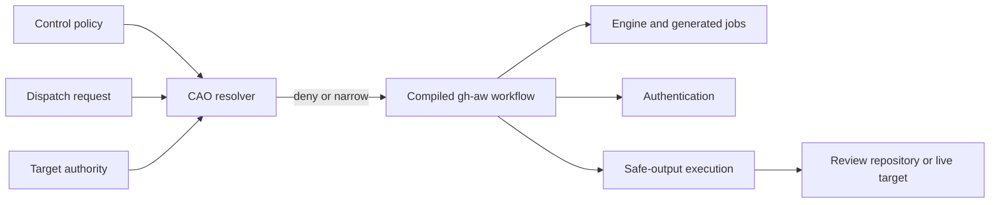

# Central Agentic Ops Control Architecture Specification

**Version:** 1.0.0  
**Status:** Working Draft  
**Latest Version:** https://github.com/githubnext/gh-aw-cao/blob/main/specs/control-architecture.md  
**Editors:** GitHub Next

## Abstract

This specification defines the Central Agentic Ops (CAO) control architecture and its JSON configuration model. CAO governs whether and where an installed GitHub Agentic Workflows (gh-aw) operation may run, including rollout and target authority. gh-aw governs how an authorized workflow executes, including engine limits, generated job topology, authentication, and safe-output execution. This specification defines the cumulative authority model, deterministic resolution lifecycle, conformance requirements, and compliance tests that preserve that boundary.

## Status of This Document

This document is a Working Draft and may be updated, replaced, or made obsolete. It is the canonical normative specification for the Central Agentic Ops control architecture; documentation under `docs/` is explanatory and MUST NOT override this specification. Implementations MUST identify the exact version against which they claim conformance. Sections 2 through 9 are normative. Section 1, examples, references, and the change log are informative unless they contain an explicit normative statement.

## Table of Contents

1. [Introduction](#1-introduction)
2. [Conformance](#2-conformance)
3. [Terminology](#3-terminology)
4. [Architecture and Authority](#4-architecture-and-authority)
5. [JSON Configuration](#5-json-configuration)
6. [Resolution Lifecycle](#6-resolution-lifecycle)
7. [Failure and Revocation](#7-failure-and-revocation)
8. [Compliance Testing](#8-compliance-testing)
9. [Security and Privacy Considerations](#9-security-and-privacy-considerations)
10. [Appendices](#10-appendices)
11. [References](#11-references)
12. [Change Log](#12-change-log)

## 1. Introduction

### 1.1 Purpose

CAO installs and operates agentic workflow packages from a central control repository across an explicitly bounded set of target repositories. This specification separates organizational operating authority from workflow execution capability so neither layer can silently grant authority owned by the other.

### 1.2 Scope

This specification covers:

- `.github/workflows/cao.json` as the sole persistent non-secret CAO policy authority;
- package and worker enablement, repository scope, rollout, output-mode ceilings, and cross-run package admission;
- target-owned consent for live work;
- deterministic policy resolution, narrowing, provenance, and revocation; and
- the authority boundary between CAO and gh-aw.

This specification does not define gh-aw workflow syntax, AI engine behavior, generated job implementation, credential formats, safe-output primitive semantics, or GitHub repository governance controls.

### 1.3 Design Goals

1. One reviewable, version-controlled JSON authority for CAO policy.
2. Fail-closed authorization before model invocation.
3. Independent target consent for live work.
4. Deterministic narrowing to one effective run envelope.
5. No duplication of gh-aw execution controls in CAO policy.
6. Auditable policy and target-authority provenance.
7. No compatibility path for legacy CAO policy variables.

### 1.4 Architectural Summary



CAO is an authorization and rollout layer. gh-aw is the execution layer. A run proceeds only through the intersection of both layers and, for live work, target-owned consent.

## 2. Conformance

### 2.1 Requirements Notation

The key words "MUST", "MUST NOT", "REQUIRED", "SHALL", "SHALL NOT", "SHOULD", "SHOULD NOT", "RECOMMENDED", "NOT RECOMMENDED", "MAY", and "OPTIONAL" in this document are to be interpreted as described in [RFC 2119](https://www.ietf.org/rfc/rfc2119.txt).

### 2.2 Conformance Classes

1. **Conforming Policy Document:** A `.github/workflows/cao.json` document satisfying Section 5 and the published JSON Schema.
2. **Conforming CAO Resolver:** A deterministic implementation satisfying Sections 5 through 7 without granting gh-aw capabilities.
3. **Conforming gh-aw Integration:** A compiled workflow integration preserving gh-aw ownership of the execution concerns in Section 4.2.
4. **Conforming Control Repository:** A protected repository using a Conforming CAO Resolver and dispatching only within resolved authority.
5. **Conforming Target Repository:** A protected repository recording package-specific live authority in the required JSON document.

An implementation is conforming only when it satisfies every MUST and MUST NOT applicable to its claimed class. A partially conforming implementation MAY report individual test results but MUST NOT claim conformance to that class.

### 2.3 Compliance Levels

| Level | Name | Required conformance |
| --- | --- | --- |
| 1 | Configuration | Conforming Policy Document |
| 2 | Controlled Execution | Level 1, CAO Resolver, gh-aw Integration, and Control Repository |
| 3 | Authorized Live Operation | Level 2 and a Conforming Target Repository for every live target-package pair |

Review-only operation MAY conform to Level 2 without target-authority declarations. Live operation MUST NOT claim Level 3 unless every live target-package pair satisfies Level 3.

## 3. Terminology

**CAO:** Central Agentic Ops, the policy and rollout control layer defined here.

**gh-aw:** GitHub Agentic Workflows, the workflow compiler and execution framework governed by its source workflow contract.

**Control repository:** The repository from which CAO packages, policy, and workflow runs are operated.

**Target repository:** A repository selected for analysis or mutation by one worker run.

**Target authority:** A target-owned declaration naming the one control repository authorized to perform live work for a package.

**Rollout authority:** CAO authority to enable packages and workers and bound repositories, modes, inventory slices, repository counts, rollout percentages, and cross-run admission.

**Execution capability:** A capability declared by gh-aw source, including an engine, per-run limit, tool, network host, permission, generated job, authentication mechanism, or safe-output primitive.

**Credential reach:** The repositories and GitHub API operations accessible through the job-local credential selected and provisioned by gh-aw. CAO may require sufficient reach for an admitted repository but does not select, mint, or propagate the credential.

**Effective envelope:** The immutable, least-permissive result of CAO policy, parent dispatch bounds, one-run narrowing, worker ceilings, credential reach, compiled gh-aw capabilities, and target authority where required.

## 4. Architecture and Authority

### 4.1 Mandatory Ownership Boundary

CAO governs **whether and where** an operation may run. gh-aw governs **how** an authorized workflow executes.

| Concern | CAO authority | gh-aw authority |
| --- | --- | --- |
| Enablement | Package and worker gates | Execution of an admitted workflow |
| Repository scope | Eligible owners, targets, and review destinations | Use of the admitted repository |
| Output mode | Package and worker review/live ceilings | Declared safe-output behavior for the effective mode |
| Rollout | Scan, partition, batch, percentage, repository-count, and monthly package admission | Execution of admitted runs |
| Target authority | Target-owned package consent for live work | No authority to create or bypass consent |
| Engine limits | No authority | Engine, model, per-run turns, AI Credits, and timeout |
| Job topology | No authority | Generated jobs, dependencies, and runtime harness |
| Authentication | Require sufficient reach but store or mint no credentials | Credential selection, job-local token minting, and propagation |
| Safe outputs | Maximum mode, destination, and target boundary | Primitive declaration, validation, and execution |

**CAO-ARC-001:** CAO MAY deny a run or narrow its rollout or target scope.

**CAO-ARC-002:** CAO MUST NOT grant or expand an engine, model, per-run turn limit, per-run AI Credit limit, tool, network host, permission, generated job, credential, authentication mechanism, or safe-output primitive beyond the compiled gh-aw workflow.

**CAO-ARC-003:** A gh-aw execution capability MUST NOT be interpreted as CAO rollout authority or target consent.

**CAO-ARC-004:** CAO policy, target authority, credential reach, dispatch narrowing, and compiled gh-aw capabilities MUST be cumulative boundaries. No boundary substitutes for another.

### 4.2 gh-aw Execution Ownership

gh-aw source owns engine and model selection, `max-turns`, `max-ai-credits`, timeouts, tools, network access, permissions, generated job topology, authentication mechanics, and safe-output primitives.

**CAO-GHA-001:** CAO configuration and resolution MUST NOT define, override, or raise a gh-aw engine or native per-run limit.

**CAO-GHA-002:** The CAO resolver MUST execute as a contributed step in the existing gh-aw job topology. It MUST NOT add a parallel policy job, rewire generated dependencies, or replace gh-aw control flow.

**CAO-GHA-003:** CAO policy MUST NOT contain credentials or authentication bootstrap values. The resolver MUST NOT mint a second token or transport credentials through policy records, dispatch inputs, artifacts, prompts, or job outputs.

**CAO-GHA-004:** CAO MUST NOT synthesize, enable, or bypass a safe-output primitive absent from the compiled workflow. gh-aw MUST NOT execute a declared safe output outside the mode, destination, or target admitted by CAO.

### 4.3 Trust Sources

| Record | Trust source | Authority granted |
| --- | --- | --- |
| Control policy | Exact workflow commit on the protected control default branch | Rollout and repository ceilings |
| Target authority | Exact commit from the protected target default branch | Consent for one package to perform live work |
| Dispatch request | GitHub Actions event payload | Request-only narrowing for one run |
| Credentials | GitHub Actions secrets or a run-scoped token | Authentication capability only |
| gh-aw source | Protected workflow source compiled by gh-aw | Execution capabilities and native limits |
| Effective envelope | Deterministic resolver output | Derived authorization for one run |

Possession of credentials MUST NOT imply rollout authority. Inclusion in CAO scope MUST NOT imply live target consent.

### 4.4 Central Execution Topology

Orchestrators and workers execute from the private control repository. Target repositories provide data and receive declared safe outputs; they MUST NOT receive or execute the control repository's workflow definitions.

**CAO-EXE-001:** An orchestrator MUST discover, filter, rank, and select repositories only within its effective rollout envelope. It MUST dispatch only eligible workers declared by its compiled gh-aw workflow and MUST NOT perform target-repository mutation itself.

**CAO-EXE-002:** A worker MUST process exactly the dispatched `target_repo`. It MUST NOT perform organization-wide discovery, select another target, dispatch downstream workers, or escalate its effective mode.

**CAO-EXE-003:** Every worker dispatch MUST carry `target_repo`, `safe_output_mode`, `safe_output_repo`, `correlation_id`, `central_repo`, and `control_plane_run_url`; it MAY carry a package-specific `batch_label`. Credentials MUST NOT be included in this envelope.

The orchestrator is the rollout decision point. Each worker is an independent enforcement point that revalidates the envelope before execution.

## 5. JSON Configuration

### 5.1 Location and Validation

**CAO-CFG-001:** Persistent non-secret CAO policy MUST exist only at `.github/workflows/cao.json`.

**CAO-CFG-002:** The file MUST be UTF-8 JSON with an object root and `version` equal to integer `1`.

**CAO-CFG-003:** The document MUST contain at least one of `control-plane` or `target-authority` and MUST conform to `.github/cao/cao.schema.json`, based on JSON Schema Draft 2020-12.

**CAO-CFG-004:** Unknown properties, duplicate object keys, malformed package, worker, or workflow identifiers, and GitHub Actions expressions MUST be rejected.

**CAO-CFG-005:** Implementations MUST NOT read `CENTRAL_AGENTIC_OPS_*` Actions variables as policy defaults, overrides, aliases, or compatibility fallbacks.

The `$schema` property SHOULD identify `https://raw.githubusercontent.com/githubnext/gh-aw-cao/main/.github/cao/cao.schema.json`.

### 5.2 Document Roles

A control repository uses `control-plane`. A target repository uses `target-authority`. A repository serving both roles MAY contain both. The document MUST NOT contain secrets, private keys, access tokens, or authentication headers.

### 5.3 Control-Plane Model

| Property | Purpose | Omission behavior |
| --- | --- | --- |
| `scope` | Eligible owners and optional repository restriction | Resolver safe defaults |
| `inventory` | Scan, cell, and batch ceilings | Schema defaults |
| `web` | Presentation settings for deterministic web surfaces | Packaged defaults |
| `defaults` | Mode, repository, rollout, and monthly admission defaults | Schema defaults |
| `packages` | Explicit package and worker workflow declarations | Undeclared packages and workers are disabled |
| `publishing` | Deterministic reviewed-output publication | Disabled |

`allowed-owners` and `allowed-repositories` are cumulative when both are non-empty. Wildcards MUST NOT be accepted in version 1.

| Inventory property | Constraint |
| --- | --- |
| `max-scan-repositories` | Integer from 1 through 100000 |
| `cell-count` | Integer from 1 through 1000 |
| `cell-index` | Non-negative integer smaller than `cell-count` |
| `batch-size` | Integer from 1 through 100000 |
| `batch-index` | Non-negative integer |

Inventory partitioning MUST be deterministic for the same inventory and effective values.

The optional `web.favicon` value MUST be an absolute HTTPS URL without credentials, query, or fragment, or a non-traversing `./` relative path. Web presentation settings MUST NOT grant or widen rollout authority.

| Package property | Constraint | Authority type |
| --- | --- | --- |
| `mode` | `review` or `live` | Output-mode ceiling |
| `max-repositories` | Integer from 1 through 1000 | Rollout ceiling |
| `rollout-percent` | Integer from 1 through 100 | Rollout ceiling |
| `monthly-ai-credit-budget` | Non-negative integer; `0` disables budget admission | Cross-run package admission |

`monthly-ai-credit-budget` MUST NOT replace, raise, or reinterpret gh-aw `max-ai-credits` or `max-turns`. When the value is positive, the orchestrator MUST read unique month-to-date AI Credit usage for the package orchestrator and workers, reserve the orchestrator's declared maximum, and admit only complete worker sets that fit the remaining budget. The budget-derived target cap MUST be intersected with all repository, rollout, and dispatch caps. Unreadable or invalid usage evidence MUST set the budget target cap to zero and prevent dispatch; it MUST NOT be estimated. A value of `0` disables monthly admission without changing native gh-aw per-run limits.

An absent package is disabled. A package's `workers` map declares its worker identities and exact workflow slugs; undeclared workers are disabled. Every worker requires `workflow`, defaults to enabled, may set `enabled: false`, and may set `max-mode` only to narrow the resolved package or exact-target mode. Package, worker, and workflow identifiers use lowercase kebab-case, and workflow identities must be unique within a package.

### 5.4 Target Authority

`target-authority.packages` maps a package identifier to exactly one `authority` repository in `owner/repository` form.

**CAO-TGT-001:** The declaration MUST grant consent only to the named control repository, for the named package, and for live work against the declaring target.

**CAO-TGT-002:** Target authority MUST NOT grant package enablement, repository eligibility, output mode, credential access, workflow permission, or execution capability.

Review mode does not require target authority because it cannot mutate the target repository.

### 5.5 Precedence and Narrowing

Persistent values resolve in this order:

```text
schema defaults < control-plane.defaults < package policy < exact target policy < optional worker ceiling
```

Dispatch values are intersected with the persistent result. They are requests and MUST NOT become persistent authority.

| Dispatch input | Permitted effect |
| --- | --- |
| `safe_output_mode` | Preserve mode or lower `live` to `review` |
| `target_repo` | Select one authorized repository |
| `safe_output_repo` | Select one authorized review destination |
| `max_repos` | Lower the repository ceiling |
| `rollout_percent` | Lower the rollout percentage |
| Cell and batch inputs | Select a valid partition within the authorized universe |

**CAO-CFG-006:** A widening dispatch request MUST fail with a stable policy reason. It MUST NOT be silently accepted, persisted, or converted into broader authority.

## 6. Resolution Lifecycle

### 6.1 Resolver Requirements

Every operational orchestrator and worker MUST import the shared CAO control component before model invocation. Orchestrators MUST also import the shared orchestrator component, and workers MUST also import the shared worker component.

**CAO-RES-001:** The resolver MUST use dependency-free Node.js and MUST NOT execute code fetched from a control or target repository.

**CAO-RES-002:** Package, role, and worker identifiers MUST come from static workflow source, not dispatch inputs, environment variables, repository content, or display names.

**CAO-RES-003:** Control policy MUST be fetched at the exact `github.workflow_sha` used by the running workflow.

**CAO-RES-004:** For live workers, target authority MUST be validated from an exact commit resolved from the target's current default branch before model invocation.

### 6.2 Resolution Sequence

The resolver MUST:

1. record the workflow revision;
2. fetch, parse, and validate control policy at that revision;
3. resolve static package, role, and worker identity;
4. resolve defaults, enablement, scope, rollout, inventory, mode ceilings, and monthly admission;
5. intersect dispatch-request narrowing;
6. validate target authority for a live worker;
7. verify that the job-local credential supplied by gh-aw can access the admitted repositories and required APIs, without selecting, minting, or storing that credential in CAO policy;
8. write effective policy and provenance; and
9. emit native gh-aw `noop` for expected denial or continue through normal gh-aw execution.

### 6.3 Effective Record

The resolver MUST write exactly one derived record to `/tmp/gh-aw/agent/control-precompute.json`. Every authorized record MUST include authorization status and reason, package, role, worker when applicable, effective mode and routing, control repository, workflow and policy commit SHA, lowercase SHA-256 policy digest, schema version, and resolution time.

An orchestrator record MUST additionally include inventory version and batch identity; configured and effective repository and rollout caps; monthly budget, month-to-date usage, remaining budget, budget-derived target cap, and any budget error; repository discovery status; the bounded candidate repositories; and eligible worker workflows with skip reasons. A worker record MUST additionally include the target, worker enablement and mode ceiling, the standard dispatch envelope, and target-authority repository, commit SHA, and digest for live mode.

Consumers MUST treat the record's `candidate_repositories`, `worker_workflows`, `effective_max_repos`, `safe_output_mode`, `safe_output_repo`, and budget fields as authoritative. They MUST NOT reconstruct those values from workflow inputs.

The record MUST NOT be treated as persistent configuration. Environment variables MAY transport derived values, but changing them MUST NOT alter the validated record.

### 6.4 Worker Revalidation

A worker MUST treat parent policy data as provenance, not current authority, and independently resolve current policy after dispatch and before model invocation. Its authority is the least permissive intersection of the parent envelope, current CAO policy, worker ceilings, credential reach, compiled gh-aw workflow, and current target authority for live mode.

A newer policy MAY revoke or narrow an outstanding dispatch before worker execution. It MUST NOT widen the dispatched envelope. Continuous policy polling during model or safe-output execution is not required; immediate revocation after worker precomputation requires workflow cancellation, credential revocation, or another external execution control.

## 7. Failure and Revocation

The resolver MUST fail closed for missing or invalid policy, unknown identities, invalid bounds, widening requests, unauthorized destinations, unavailable required authentication, unreadable enabled-budget evidence, or absent, malformed, inaccessible, or mismatched live target authority.

An expected denial MUST write a stable reason to the effective record, emit gh-aw's native `noop`, and perform no model invocation. An integrity failure MUST fail visibly before model execution and MUST NOT print secrets or unnecessary untrusted content.

Operators MAY revoke authority through policy narrowing, target-authority removal, or credential revocation. Workers MUST revalidate current policy so revocation after orchestration can stop pending work. Workflow disablement, run cancellation, and organization Actions policy are emergency execution controls, not alternative CAO policy stores.

## 8. Compliance Testing

### 8.1 Test Procedure

A compliance suite MUST record the implementation revision and claimed level, use isolated fixtures, test permitted and denied cases, verify effective provenance, verify that denial causes no model invocation, and report every applicable test as passed or failed.

### 8.2 Required Tests

| Test ID | Requirement | Expected result | Level |
| --- | --- | --- | --- |
| T-CFG-001 | Validate minimal control and target documents | Accepted | 1 |
| T-CFG-002 | Add unknown properties, duplicate keys, expressions, or unknown identifiers | Rejected | 1 |
| T-CFG-003 | Supply only legacy CAO variables | Ignored as policy and denied | 1 |
| T-CFG-004 | Put execution fields such as engine, `max-ai-credits`, permissions, or safe outputs in CAO JSON | Rejected | 1 |
| T-ARC-001 | Use broad credentials against a target outside CAO scope | Denied | 2 |
| T-ARC-002 | Declare gh-aw capabilities without CAO target authority | No rollout or target authority inferred | 2 |
| T-ARC-003 | Exceed monthly admission while a per-run gh-aw limit remains available | Admission denied; native limit unchanged | 2 |
| T-EXE-001 | Inspect an orchestrator dispatch and worker run | Standard envelope present, credentials absent, worker bound to one target | 2 |
| T-RES-001 | Resolve when workflow SHA differs from latest default branch | Policy at workflow SHA used | 2 |
| T-RES-002 | Request live under a review ceiling | Rejected as widening | 2 |
| T-RES-003 | Request lower rollout limits | Accepted as narrowing | 2 |
| T-RES-004 | Narrow policy after dispatch but before worker start | Worker uses narrower policy | 2 |
| T-RES-005 | Broaden policy after dispatch but before worker start | Worker remains bounded by parent envelope | 2 |
| T-RES-006 | Trigger expected denial | Effective record and native `noop`; no model invocation | 2 |
| T-RES-007 | Inspect authorized orchestrator and worker records | Required role-specific fields and provenance present | 2 |
| T-GHA-001 | Inspect generated workflow topology and authentication | Native gh-aw jobs and token path remain authoritative | 2 |
| T-GHA-002 | Request an undeclared safe output | Primitive unavailable regardless of CAO mode | 2 |
| T-GHA-003 | Resolve review mode for a live-capable workflow | No target mutation | 2 |
| T-SEC-001 | Compile an operational workflow without the protected environment | Rejected before deployment | 2 |
| T-TGT-001 | Run live with matching target-owned package authority | Admitted subject to all other boundaries | 3 |
| T-TGT-002 | Remove, mismatch, or change the authorized package | Denied before model invocation | 3 |

### 8.3 Compliance Checklist

| Requirement group | Test IDs | Level | Status |
| --- | --- | --- | --- |
| JSON document and schema | T-CFG-001 through T-CFG-004 | 1 | Required |
| One-way authority boundary | T-ARC-001 through T-ARC-003 | 2 | Required |
| Central execution topology | T-EXE-001 | 2 | Required |
| Deterministic resolution | T-RES-001 through T-RES-007 | 2 | Required |
| gh-aw execution ownership | T-GHA-001 through T-GHA-003 | 2 | Required |
| Protected execution boundary | T-SEC-001 | 2 | Required |
| Live target authority | T-TGT-001 through T-TGT-002 | 3 | Required |

## 9. Security and Privacy Considerations

Policy and workflow source MUST be protected on the control repository's default branch. The control repository MUST provide a protected GitHub Actions environment named `central-agentic-ops` whose deployment branch policy admits only that branch. Every operational source workflow MUST declare `environment: central-agentic-ops`, and operational secrets MUST be environment secrets rather than unrestricted repository secrets. gh-aw MUST propagate that environment boundary to generated jobs. Target-authority declarations MUST be protected by the target's default-branch controls.

Implementations MUST use least-privilege credentials, MUST NOT expose secrets in effective records or logs, and MUST NOT execute fetched policy as code. JSON MUST be parsed with a structured parser; `eval` or equivalent interpretation is prohibited.

Review mode SHOULD be the default. Live execution requires the cumulative intersection of CAO live authorization, worker live capability, sufficient credentials, declared gh-aw safe outputs, and current target consent.

The effective record SHOULD contain only identifiers and provenance required for authorization and audit. It MUST NOT contain prompt content, repository source, credentials, or unrelated personal data. Access and retention SHOULD follow the operator's security and data-retention policies.

## 10. Appendices

### Appendix A: Examples

#### A.1 Minimal Review Policy

```json
{
  "$schema": "https://raw.githubusercontent.com/githubnext/gh-aw-cao/main/.github/cao/cao.schema.json",
  "version": 1,
  "control-plane": {
    "scope": {
      "allowed-repositories": ["acme/payments-api"]
    },
    "packages": {
      "dependabot": {
        "workers": {
          "release-train-updater": {
            "workflow": "dependabot-release-train-updater"
          }
        }
      }
    }
  }
}
```

#### A.2 Matching Target Authority

The target repository records its own consent:

```json
{
  "$schema": "https://raw.githubusercontent.com/githubnext/gh-aw-cao/main/.github/cao/cao.schema.json",
  "version": 1,
  "target-authority": {
    "packages": {
      "optimization": {
        "authority": "acme/central-agentic-ops"
      }
    }
  }
}
```

This declaration cannot start a run, select an engine, grant permissions, mint a token, or enable a safe output.

#### A.3 Non-Conforming Capability Expansion

The following is invalid because these execution capabilities belong to gh-aw and are absent from the CAO schema:

```json
{
  "version": 1,
  "control-plane": {
    "engine": "copilot",
    "max-ai-credits": 500,
    "permissions": { "contents": "write" },
    "safe-outputs": { "create-pull-request": {} }
  }
}
```

### Appendix B: Resolution Outcomes and Errors

The following stable `reason` values are produced by the version 1 policy resolver. They are authorization outcomes, not exception codes.

| Reason | Meaning | Required behavior |
| --- | --- | --- |
| `authorized` | The package and, where applicable, installed worker passed initial policy resolution | Continue remaining authorization checks |
| `control-plane-absent` | The document contains no control-plane policy | Deny and emit native `noop` |
| `package-undeclared` | The requested package is absent | Deny and emit native `noop` |
| `package-disabled` | The requested package is explicitly disabled | Deny and emit native `noop` |
| `worker-disabled` | The requested worker is explicitly disabled | Deny and emit native `noop` |

Invalid JSON, schema violations, unknown static identities, widening requests, unavailable required evidence, and target-authority integrity failures are fatal policy errors. A conforming implementation MUST fail before model invocation for these errors. It SHOULD report a stable, non-secret diagnostic, but this specification does not standardize exception message text.

## 11. References

### 11.1 Normative References

- **[RFC 2119]** Bradner, S. [Key words for use in RFCs to Indicate Requirement Levels](https://www.ietf.org/rfc/rfc2119.txt). March 1997.
- **[JSON]** Bray, T. [The JavaScript Object Notation Data Interchange Format](https://www.rfc-editor.org/rfc/rfc8259). RFC 8259, December 2017.
- **[JSON Schema 2020-12]** [JSON Schema Core](https://json-schema.org/draft/2020-12/json-schema-core) and [Validation](https://json-schema.org/draft/2020-12/json-schema-validation).
- **[CAO Schema]** [Central Agentic Ops Policy Schema](../.github/cao/cao.schema.json).

### 11.2 Informative References

- **[CAO Architecture]** [How the Control Plane Works](../docs/architecture.md).
- **[CAO Configuration]** [Configure the Control Plane](../docs/configuration.md).
- **[gh-aw]** [GitHub Agentic Workflows](https://github.com/github/gh-aw).
- **[Semantic Versioning]** [Semantic Versioning 2.0.0](https://semver.org/spec/v2.0.0.html).

## 12. Change Log

### Version 1.0.0 (Working Draft)

- Defined the JSON-governed CAO control architecture.
- Assigned rollout and target authority to CAO.
- Assigned engine limits, generated job topology, authentication, and safe-output execution to gh-aw.
- Defined the central orchestrator and worker execution contract, credential reach, runtime records, monthly admission, revalidation timing, and protected environment boundary.
- Added conformance classes, compliance levels, tests, examples, and security and privacy considerations.