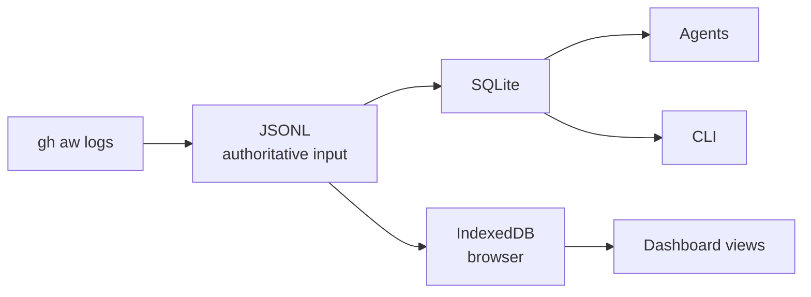
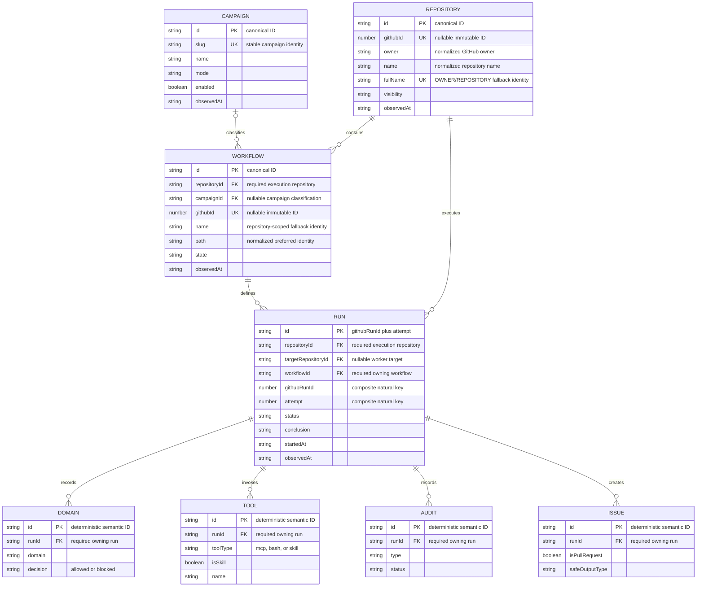

# Central Agentic Ops Dashboard Data Architecture Specification

**Version:** 1.6.0
**Status:** Working Draft
**Repository:** `githubnext/gh-aw-cao`
**Target implementation:** Dashboard data subsystem
**Date:** 2026-09-22

| Browser storage | IndexedDB keeps all available run summaries and expires detailed run-linked records after 30 days. |
| --- | --- |

IndexedDB SHALL retain all available canonical Repository, Workflow, and Run
summaries so dashboard trends and run history can cover the complete published
source. It SHALL retain detailed Domain, Tool, Audit, and Issue records for the
bounded 30-day operational window. Expiring run-linked records MUST NOT remove
their retained Run or the Run's structural parents.

---

## Abstract

This specification defines a new dashboard-side data architecture for Central Agentic Ops.

The implementation SHALL introduce a clean architectural boundary between existing upstream data collection/publication and dashboard application state.

Existing GitHub, gh-aw, activity snapshot, log, SQL, and generated JSON representations SHALL be treated as input sources.

The dashboard SHALL normalize those sources into a new canonical domain model:

```text
Repository
  └── Workflow
       └── Run
            ├── Domain
            ├── Tool
            ├── Audit
            └── Issue
```

The browser SHALL maintain this canonical model in IndexedDB.

IndexedDB SHALL be treated exclusively as disposable, reconstructable, derived state and MUST NOT become authoritative storage.

Domain records SHALL contain allowed and blocked firewall observations. Tool
records SHALL contain MCP, Bash, and skill calls, with skills identified as a
special tool type. Audit records SHALL contain all other execution observations.
Issue records SHALL contain both issues and pull requests, distinguished by an
`isPullRequest` flag. Every record in these four tables SHALL reference its
owning Run.

The architecture SHALL support eventual consistency, idempotent conversion, large datasets, bounded-memory ingestion, immutable source generations, integrity verification, interruption recovery, staging generations, atomic generation activation, browser storage failures, schema evolution, Node.js testing, and real-browser testing.

Dashboard views SHALL consume only the canonical query layer and SHALL NOT parse upstream source formats directly.

---

# 1. Status of This Document

This document is a Draft implementation specification.

It defines the target architecture for a clean dashboard data subsystem.

The implementation SHALL fully replace dashboard-side source-shaped/view-shaped state, caches, direct reads, and fallback rendering with the canonical subsystem defined here.

Development MAY proceed incrementally from the source-adapter boundary inward. The completed implementation MUST NOT retain a shadow, dual-read, alias, compatibility-cache, or fallback path to the replaced browser data system.

Functioning upstream collectors and Pages deployment MAY remain as authoritative data producers. This allowance does not permit the legacy browser data architecture to remain active.

---

# 2. Requirements Notation

The key words **MUST**, **MUST NOT**, **REQUIRED**, **SHALL**, **SHALL NOT**, **SHOULD**, **SHOULD NOT**, **RECOMMENDED**, **NOT RECOMMENDED**, **MAY**, and **OPTIONAL** in this document are to be interpreted as described in RFC 2119.

---

# 3. Architectural Decision

## 3.1 Clean Dashboard-Side Start

The new dashboard data layer SHALL be designed independently of existing dashboard presentation structures.

Existing dashboard source schemas SHALL be treated as source inputs.

They SHALL NOT define the new canonical domain model.

The architectural boundary SHALL be:

```text
EXISTING / UPSTREAM

GitHub
gh-aw
activity snapshots
logs
SQL
published dashboard JSON
        |
        v
====================================
NEW DASHBOARD DATA ARCHITECTURE
====================================
        |
        v
source adapters
        |
        v
canonical normalization
        |
        v
canonical model
        |
        v
IndexedDB
        |
        v
query layer
        |
        v
views
```

## 3.2 Upstream Stability

The initial implementation SHOULD NOT rewrite working:

* GitHub collection;
* workflow discovery;
* activity collection;
* gh-aw log generation;
* policy enforcement;
* Pages deployment;
* existing source publication.

Those components SHALL initially be treated as data producers.

## 3.3 Source Inputs

The current dashboard source JSON MAY be used to bootstrap the new architecture.

However:

> Existing source representations are inputs. They are not the new product contract.

Accepting an existing representation at an adapter boundary MUST NOT expose that representation directly to views or preserve a second browser state path.

---

# 4. Core Invariants

The following requirements are architectural invariants.

## INV-001 — Canonical model

The dashboard MUST have one canonical internal domain model.

## INV-002 — Source independence

The canonical model MUST NOT mechanically mirror any single source representation.

## INV-003 — Views are source-agnostic

Views MUST NOT parse:

* raw logs;
* GitHub responses;
* SQL rows;
* firewall files;
* current source JSON schemas.

## INV-004 — IndexedDB is derived state

IndexedDB MUST be disposable and reconstructable.

## INV-005 — Authoritative inputs remain external

Deletion of IndexedDB MUST NOT cause permanent information loss.

## INV-006 — Deterministic normalization

Identical authoritative observations MUST normalize to identical logical entities.

## INV-007 — Idempotent ingestion

Reprocessing identical input MUST NOT create duplicate entities or run-linked records.

## INV-008 — Eventual consistency

Partial observations MAY arrive at different times and MUST converge toward a coherent canonical state.

## INV-009 — Fail-safe activation

An incomplete replacement dataset MUST NEVER replace a known-good active dataset.

## INV-010 — Bounded processing

Correctness MUST NOT require loading the complete historical dataset into browser memory.

## INV-011 — Test parity

Node tests and browser runtime SHOULD exercise the same canonical and persistence interfaces.

## INV-012 — Full replacement

Views MUST read only the active canonical generation. The completed implementation MUST NOT fall back to a legacy cache, source object, generation, alias, or renderer data path.

---

# 5. Target Architecture



The SQLite and IndexedDB projections SHALL be independently reconstructable
from authoritative external inputs. Neither projection SHALL become the source
for the other. Publishing SQLite MAY support headless consumers, but browser
ingestion SHALL continue to use the published JSONL and inventory inputs.

The deployed dashboard payload SHALL publish only compacted normalized
run-information and run-record JSONL shards for browser ingestion. Raw Activity
JSONL MAY remain in the private Activity cache for audit and rebuild operations,
but MUST NOT be copied into the dashboard artifact or listed in its deployed
payload manifest. The browser MUST fail closed when compacted run-information
shards are absent; it MUST NOT fall back to raw Activity JSONL.

SQLite and IndexedDB SHALL use the same adapters, identities, normalization,
and relationship validation. They MAY use different retention windows because
SQLite can serve a historical archive while IndexedDB remains a bounded browser
cache.

IndexedDB and the Activity SQLite database SHALL retain all available canonical
Repository, Workflow, and Run summaries. They SHALL retain detailed Domain,
Tool, Audit, and Issue records for the bounded 30-day operational window.
Expiring run-owned records MUST NOT remove their retained Run or the Run's
structural parents.

## 5.1 Completeness and archives

The scheduled Activity collection SHALL be treated as a rolling operational
snapshot, not as a complete historical archive. Completeness SHALL be reported
separately for:

* run-summary coverage from `workflow_runs` envelopes;
* enriched artifact coverage from `run` envelopes; and
* the requested historical time range.

Repeated source observations are expected when cached JSONL is refreshed.
Ingestion SHALL report repeated raw and enriched observations, deduplicate them
by the canonical identities defined in this specification, and MUST NOT create
duplicate canonical records.

A full-detail local archive SHALL use a separate SQLite file with a retention
window that covers the requested history. A later rolling Activity refresh MUST
NOT silently shorten that archive to the dashboard's default detail window.

Expired or unavailable GitHub Actions artifacts SHALL be reported as missing
enrichment. Their run summaries MAY still be present and MUST NOT be described
as fully enriched runs.

## 5.2 Maintenance inventory

Campaign inventory inputs MAY report `campaign-version`,
`campaign-current-version`, and `campaign-update-state` for an installed gh-aw
starter campaign. `campaign-update-state` MUST be `update-available`,
`up-to-date`, or `unknown`; missing or incomparable version evidence MUST
normalize to `unknown`. The campaign slug remains the stable identity, and a
refresh MUST enrich the existing Campaign record rather than create a
version-specific Campaign.

Workflow inventory inputs SHALL continue to report `gh-aw-version`,
`gh-aw-current-version`, and `gh-aw-update-state` as compiler evidence.
Repository maintenance projections MUST group that evidence by canonical
Repository identity. A repository requires an upgrade when at least one
workflow reports `update-available`; mixed workflow versions MUST remain
visible and MUST NOT be collapsed to a fabricated single version.

The SQLite Campaign projection and the IndexedDB `campaigns` object store MUST
preserve the same three campaign-maintenance fields with identical missing-data
semantics. Both projections remain disposable and reconstructable from campaign
inventory inputs. Schema migration MUST rebuild these derived records, and a
failed refresh MUST retain the last complete active generation rather than
publish partial maintenance state. Campaign and repository maintenance actions
MUST use these canonical query results and MUST NOT inspect upstream manifests
or browser storage directly.

## 5.3 Activity acquisition and source roles

Activity acquisition SHALL use one runtime observation path:

```text
cao.json repository scope
  -> one gh aw logs --repo call per resolved repository
  -> repository-specific --cached-jsonl wildcard shards
  -> canonical JSONL ingestion
  -> SQLite and IndexedDB projections
  -> Dashboard Language queries
```

`cao.json` and its resolved control settings SHALL define collection authority
and repository scope. They MUST NOT be treated as evidence that a Workflow or
Run exists, executed, or executed in a campaign target repository.

Inventory inputs SHALL provide static declarations and maintenance evidence:
Campaign configuration, enrolled Repository metadata, declared control-plane
Workflow metadata, and bounded GitHub Actions workflow registry metadata for
each resolved Repository. Registry metadata MAY enrich Workflow path, display
name, active or disabled state, native identifier, and link without an observed
Run. Repository-owned registry Workflows MUST remain standalone and MUST NOT
inherit Campaign membership, worker status, admission, or rollout authority from
repository enrollment. Cached gh-aw JSONL SHALL provide observed runtime
evidence: Repository, Workflow, Run, Domain, Tool, Audit, and Issue observations.
A declared or registered Workflow MAY exist without an observed Run. Queries MUST
preserve that distinction and registry coverage metadata rather than fabricate
runtime or inventory completeness. Deleted registry entries SHALL NOT appear as
current Workflows, and local compilation SHALL NOT convert missing or unknown
registry evidence into an active runtime state.

Each resolved Repository SHALL have an independent `--cached-jsonl` wildcard
prefix in the shared shard directory. Repeated collection SHALL reuse known
shards, and canonical ingestion SHALL skip a shard whose content hash already
exists in the Transaction ledger. Repository collection MAY be serial to bound
concurrent GitHub API pressure and reuse shared analysis state. The consolidated
The `gh-aw-logs-shards/` directory SHALL retain the authoritative collection
transport. Dashboard publication SHOULD additionally provide
`gh-aw-logs-normalized/` JSON payloads containing content-addressed canonical
batches generated from those shards. Browsers SHALL prefer those payloads to
avoid source adaptation and normalization, use their `payload-hashes.json`
identities to skip unchanged downloads and imports, and fall back to the source
JSONL shards when normalized payloads are unavailable.

## 5.4 Canonical join contract

### 5.4.1 Campaign resource navigation projections

Campaign resource pages SHALL resolve one campaign slug from the active route and
apply it as an equality predicate inside the dashboard query worker. Generated
issue and pull-request views SHALL select retained Outcome observations by
`outcome-category`; workflow-run views SHALL join canonical Run and Workflow
records through Workflow identity; repository views SHALL group the canonical
Repositories reached through campaign-classified Workflows. Missing campaign
relationships MUST produce an honest empty or unavailable result and MUST NOT
fall back to unscoped records.

The local SQLite projection and browser IndexedDB projection SHALL expose
equivalent Campaign-to-Workflow, Workflow-to-Run, and Workflow-to-Repository
relationships to these queries. Campaign resource navigation is presentation
configuration, not canonical operational evidence, and MUST NOT be persisted as
mutable browser state. Both projections remain disposable and reconstructable;
no schema migration is required for navigation-only changes.

The cached JSONL source does not expose immutable Repository and Workflow IDs
for every envelope. Until it does, Repository identity SHALL use normalized
`OWNER/REPOSITORY`; Workflow identity SHALL be scoped to that Repository and
use authoritative workflow path when available, otherwise a source-namespaced
workflow name. Run identity SHALL use GitHub run ID plus attempt.

The mandatory execution joins are:

```text
Workflow.repositoryId -> Repository.id
Run.repositoryId      -> Repository.id
Run.workflowId        -> Workflow.id
Domain.runId           -> Run.id
Tool.runId             -> Run.id
Audit.runId            -> Run.id
Issue.runId            -> Run.id
```

`Run.repositoryId` SHALL identify the repository where GitHub Actions executed
the run. Campaign targets, dispatch envelopes, safe-output destinations, and
other repository-shaped payload fields MUST NOT override it. An inventory
Workflow and a runtime Workflow SHALL converge only when their canonical
Repository and workflow-path identities match.

Dashboard source projections MAY expose `organization` and `repository` as
denormalized join keys. Dashboard Language queries SHALL perform all selection,
grouping, aggregation, and joins in the data Web Worker. The Repositories view
SHALL begin with Repository inventory, aggregate Workflow and Run facts by
`organization` and `repository`, and left-join those results so an enrolled
Repository remains visible when it has no retained runtime observations.

## 5.5 Token-optimization evidence contract

The `optimization-token-optimizer` operation has one bounded task: evaluate one
assigned, evidence-complete token-efficiency opportunity for one target
Repository and Workflow, then measure whether an accepted intervention lowers
AI Credit (AIC) per comparable accepted outcome without reducing reliability or
outcome quality.

Activation requires a complete assignment, an authorized target Repository, an
authoritative Workflow identity, a frozen evidence window, an assignment Run,
and an experiment identity. The required effect is one immutable opportunity
observation and, when maintainers accept a recommendation, one intervention
whose experiment can mature into a comparison. A complete analysis with no
defensible opportunity is a no-op, not a zero-value intervention. Success is a
matured comparison with positive verified attainment. Uncertainty remains
explicit when evidence is incomplete, incomparable, unmatured, or unavailable.

### 5.5.1 Authoritative sources and grain

Token-optimization evidence SHALL enter through the Activity publication and
the existing source-adapter boundary. An optimizer or dashboard MUST NOT
independently redownload the same run corpus when the Activity generation is
complete for its scope and window.

The current source authority for gh-aw runtime fields is
[`logs-jsonl.schema.json`](https://github.com/github/gh-aw/blob/main/schemas/logs-jsonl.schema.json).
Its schema revision SHALL be retained in provenance. The adapter SHALL apply the
following source contract:

| Evidence | Authoritative input and grain | Required handling |
| --- | --- | --- |
| Invocation AIC and raw token classes | API-proxy token-usage record collected through enriched gh-aw artifacts; one API invocation | Emit one invocation-grain usage observation. Never repeat its AIC across token-class rows. |
| Run/model usage aggregate | `run.token_usage_summary`, including `by_model`; one Run or Run-and-model aggregate | Preserve aggregate grain. It MUST NOT fabricate invocation rows. Prefer complete invocation evidence for invocation queries, otherwise expose aggregate-only completeness. Never add aggregate and invocation AIC together. |
| Turns and requests | `run.turns` and `run.token_usage_summary.total_requests`; one Run | Keep turns and model requests distinct. Absence is unknown, not zero. |
| Cache evidence | Invocation token-usage fields or `token_usage_summary` cache fields at their declared grain | Preserve cache-read and cache-write tokens separately. `cache_efficiency` is a source observation, not a replacement for either token class. |
| Tool activity | `run.mcp_tool_usage.tool_calls[]`, with the documented audit fallback; one tool call | Preserve server, tool, status, timestamp, sizes, and correlation identity. A configured tool inventory is separate static evidence and MUST NOT be inferred from observed calls. |
| Run reliability | Canonical Run status and conclusion from `workflow_runs` and enriched `run` envelopes; one Run attempt | Failure rate uses distinct completed attempts only. Missing conclusions do not enter either numerator or denominator. |
| Experiment assignment | `run.experiments.assignments`; one experiment assignment per Run | Preserve experiment name and variant exactly. Cumulative counts are diagnostics and MUST NOT create assignments. |
| Accepted target outcome | Safe-output lifecycle plus authoritative GitHub disposition or the accepted-evidence rule of the frozen evaluator; one durable target-workflow outcome | Creating a safe output does not establish acceptance. Accepted identity and disposition MUST be distinct from the producing Run. |
| Recommendation disposition | Safe-output lifecycle, explicit supersession relation, implementation Run or pull request, and authoritative GitHub disposition; one optimizer recommendation | Preserve `applied`, `superseded`, `outdated`, `duplicate`, `unapplied`, `failed-start`, or `rejected`. A generated issue, assignment attempt, or open state alone does not establish acceptance or implementation. |
| Optimization overhead | Invocation or non-overlapping Run-aggregate AIC for auditor, optimizer, verifier, and replacement recommendations attributable to one frozen opportunity and intervention lineage | Deduplicate by Run attempt, preserve cost grain, and exclude unrelated repositories, workflows, opportunities, and portfolio dispatches. |
| Outcome quality | Frozen grader or eval observation with evaluator digest; one outcome or stable opportunity | Compare only observations produced by the same definition and evaluator digest. Missing quality evidence is unknown. |
| Operational value | Current gh-aw grader result; one ordered metric array per Run | Preserve metric IDs, order, native finite values or `null`, unit, and direction without normalization, clamping, replay, inferred maturity, or local baselines. |
| Workflow declaration | Workflow inventory at the exact reviewed source revision | Supply configured tools, model, trigger, budget, and campaign classification. Static declarations MUST NOT prove runtime use. |

Source provenance for every observation SHALL include collection scope, source
kind, source identifier, source schema revision, observed time, generation,
completeness, and freshness. A later source observation MAY enrich the same
canonical fact but MUST NOT erase a known value with an absent field.

### 5.5.2 Identities and relationships

The canonical opportunity identity SHALL encode the six fields frozen by the
token-optimization observation contract:

```text
token-opportunity:
  <percent-encoded targetRepo>:
  <percent-encoded workflowPath>:
  <evidenceWindowStart>:
  <evidenceWindowEnd>:
  <assignmentRunId>:
  <percent-encoded experimentId>
```

Percent encoding SHALL use uppercase RFC 3986 hexadecimal escapes over UTF-8.
Timestamps SHALL use normalized RFC 3339 UTC seconds. `targetRepo` SHALL be the
normalized `OWNER/REPOSITORY` coordinate until an immutable GitHub Repository ID
is published; `workflowPath` SHALL be the normalized path in that Repository.
Display names MUST NOT participate in identity. A control repository is
provenance, not target identity, so observations collected by multiple control
repositories converge only when all six identity fields match.

An intervention identity SHALL be
`token-intervention:<opportunity-id>:<percent-encoded intervention-id>`, where
`intervention-id` is the immutable safe-output identity or reviewed experiment
change identity. A comparison identity SHALL be
`token-comparison:<intervention-id>:<evaluator-digest>:<evidence-cutoff>`.
Experiment variants SHALL relate to the same intervention through the frozen
experiment identity and SHALL retain `control` or `optimized` as roles separate
from their producer-defined variant names.

The mandatory relationships are:

```text
Opportunity.targetRepositoryId -> Repository.id
Opportunity.targetWorkflowId   -> Workflow.id
Opportunity.assignmentRunId    -> Run.id
Opportunity.experimentId       -> Experiment.id
Intervention.opportunityId      -> Opportunity.id
Intervention.safeOutputId       -> Outcome.id, when published
Intervention.supersedesId       -> Intervention.id, when replacing an earlier recommendation
Intervention.supersededById     -> Intervention.id, inverse when known
Comparison.interventionId       -> Intervention.id
Comparison.operationalValueId   -> OperationalValue.observationId
Comparison.controlVariant       -> ExperimentAssignment.variant
Comparison.optimizedVariant     -> ExperimentAssignment.variant
```

Repeated collection of the same source observation SHALL be deduplicated before
normalization. Multiple source observations for one canonical opportunity SHALL
retain distinct provenance observation IDs while enriching one opportunity.
Two records with different frozen windows, assignment Runs, or experiments are
different opportunities even when they recommend the same change.

### 5.5.3 Measures, comparability, and evidence states

AIC is the primary cost measure. The canonical raw-token measures remain
`input-tokens`, `output-tokens`, `cache-read-tokens`, `cache-write-tokens`, and
`reasoning-tokens`. Provider conventions may overlap, so these fields MUST NOT
be summed into a synthesized total. Turns, requests, tool calls, duration, and
cache efficiency remain separate diagnostics.

Target-workflow outcomes and optimizer recommendations are different entities.
`accepted-target-outcome-count` is the denominator for target-workflow
efficiency. `recommendation-disposition` determines whether the proposed
intervention was actually applied. Superseded, outdated, duplicate, unapplied,
failed-start, and rejected recommendations MUST NOT count as accepted target
outcomes or successful interventions.

For one experiment variant:

```text
AIC per accepted outcome =
  sum of distinct attributable invocation AIC
  / count of distinct accepted outcome identities
```

When complete invocation evidence is unavailable, a producer MAY use distinct
Run-level `total_aic` values and SHALL mark the cost grain `run-aggregate`.
Invocation and aggregate AIC MUST NOT be mixed in one numerator. A zero or
missing accepted-outcome count, a non-positive baseline denominator, or
unattributable AIC makes the comparison unavailable rather than zero.

Control and optimized variants are comparable only when all of the following
hold:

1. both variants belong to the frozen experiment and target Workflow;
2. the workload comparison key and acceptance rule were declared before result
   evaluation and are identical for both variants;
3. both variants meet the frozen minimum comparable sample size;
4. each variant has at least one distinct accepted outcome;
5. AIC and completed-Run conclusion evidence is complete for every included Run;
6. outcome-quality evidence uses the same definition and evaluator digest; and
7. the later of fourteen days after assignment or the minimum-sample threshold
   has been reached without passing the evidence cutoff;
8. recommendation disposition is authoritative and implementation completion
   is known; and
9. optimization-overhead AIC is complete for distinct optimizer-family Run
   attempts attributable to the same opportunity and intervention lineage.

Reliability SHALL be the completed-Run failure rate for each variant and SHALL
remain separate from cost. Outcome quality SHALL retain the frozen grader or
eval value and SHALL remain separate from both reliability and cost. Workload
comparison keys MUST NOT contain prompt text, response text, tool arguments, or
raw repository content.

`evidence-state` SHALL use exactly:

| State | Meaning |
| --- | --- |
| `complete` | Required evidence is authoritative, comparable, and mature. |
| `incomplete` | A required observation within an otherwise accessible source is absent or partial. |
| `incomparable` | Both evidence sets exist but violate one or more frozen comparability rules. |
| `unmatured` | Valid evidence has not reached time or sample maturation. |
| `unavailable` | A required source, identity, or attribution cannot be accessed or established. |

Only `complete` evidence MAY produce gross or net realized savings. Every other state SHALL
produce null attainment and a non-sensitive missing reason. Complete comparable
evidence scores zero when AIC per accepted outcome does not decrease,
completed-Run failure rate increases, outcome quality decreases, the
recommendation was not applied, implementation did not complete, or net savings
are non-positive. Otherwise:

```text
gross realized savings AIC =
  max(
    baseline AIC per accepted outcome - optimized AIC per accepted outcome,
    0
  )
  * optimized accepted-outcome count

optimization overhead AIC =
  sum of distinct auditor, optimizer, verifier, and replacement-recommendation
  Run AIC attributable to this opportunity and intervention lineage

net realized savings AIC =
  gross realized savings AIC - optimization overhead AIC

verified net gain ratio =
  net realized savings AIC
    / (baseline AIC per accepted outcome
        * optimized accepted-outcome count)
```

`gross-realized-savings-aic` measures the non-negative counterfactual target
Workflow AIC avoided for the optimized variant's accepted output volume.
`optimization-overhead-aic` measures only optimizer-family work attributable to
the same frozen opportunity and intervention lineage. It includes superseded
replacement recommendations in that lineage, but excludes unrelated portfolio
discovery and recommendations for other targets. `net-realized-savings-aic` is
gross savings less that overhead and MAY be negative for diagnostics.

`verified-net-gain` is a token-optimization comparison diagnostic, not a gh-aw
operational-value metric. It retains the native ratio produced by the formula
without clamping or rescaling. Gross, overhead, and net values are null unless evidence is complete. A non-applied
recommendation, failed implementation start, reliability or quality regression,
or non-positive net result records zero verified net gain. The underlying gross
and overhead measurements remain visible so zero does not hide optimizer cost.

### 5.5.4 Opportunity and intervention vocabulary

`opportunity-kind` SHALL use this initial closed vocabulary:

| Value | Evidence boundary |
| --- | --- |
| `avoidable-agent-invocation` | A deterministic gate can safely avoid an agent invocation or turn. |
| `deterministic-data-gathering` | Observed reasoning-loop work can move to deterministic preprocessing. |
| `unused-tool-schema` | Declared tool schema is unused across the complete observation window. |
| `unbounded-context-growth` | Measured context grows beyond a declared bounded-read or working-set expectation. |
| `poor-cache-utilization` | Comparable stable context has materially low observed cache reuse. |
| `blocked-tool-retry-loop` | Correlated denied or failed operations cause repeated attempts without progress. |
| `model-or-subagent-mismatch` | Observed task shape and quality evidence support a cheaper bounded execution tier. |
| `avoidable-trigger-frequency` | Equivalent scheduled or event work can be safely batched or skipped. |
| `duplicated-work-across-repositories` | Privacy-safe resource fingerprints establish equivalent repeated work across Workflow executions. |

An opportunity kind is an evidence-backed classification, not a conclusion
derived from high cost alone. The producer SHALL preserve the evidence rule and
confidence used for classification.

`intervention-state` SHALL use exactly `proposed`, `accepted`, `running`,
`verified`, `regressed`, `inconclusive`, or `rejected`. `proposed-savings-aic`
is an estimate attached to a proposal.

`recommendation-disposition` SHALL use exactly `applied`, `superseded`,
`outdated`, `duplicate`, `unapplied`, `failed-start`, or `rejected`. Disposition
does not replace lifecycle state: for example, an intervention MAY be terminal
and `rejected` because its recommendation disposition is `duplicate`.
Supersession SHALL use explicit `supersedes-intervention-id` and
`superseded-by-intervention-id` relations emitted by the safe-output producer;
dashboard code MUST NOT infer lineage by parsing titles, bodies, or comments.

`recommendation-churn-count` is the count of distinct terminal non-applied
recommendations in one opportunity/intervention lineage.
`recommendation-churn-rate` is that count divided by all distinct terminal
recommendations in the lineage and is null when the denominator is zero.
`gross-realized-savings-aic`, `optimization-overhead-aic`,
`net-realized-savings-aic`, and `verified-net-gain` require a complete matured
comparison. Queries and views MUST NOT combine, coalesce, or label proposed
savings as gross or net realized value.

### 5.5.5 Canonical projection, SQL, and IndexedDB parity

Token-optimization observations SHALL use compact canonical Audit records in the
optimizer Run rather than new source-shaped object stores:

```text
optimization.opportunity.observed
optimization.intervention.updated
optimization.comparison.observed
```

The Audit payload SHALL contain only the stable IDs, enums, numeric measures,
evidence state, missing reason, timestamps, and relationship IDs defined above.
Repository, Workflow, Run, Outcome, experiment assignment, usage, and
operational-value facts remain in their existing canonical domains. Dashboard
logical sources SHALL be materialized from these canonical facts in the data
Web Worker; views and components MUST NOT reconstruct relationships.

The IndexedDB Audit representation SHALL use camel-case fields:
`opportunityId`, `opportunityKind`, `interventionId`, `lifecycleObservationId`,
`previousInterventionState`, `interventionState`,
`previousRecommendationDisposition`, `recommendationDisposition`,
`safeOutputId`, `implementationChangeId`, `implementationRunIds`,
`optimizerRunAttempt`, `optimizerWorkflowPath`, `optimizerWorkflowName`, `acceptedAt`,
`implementationStartedAt`, `implementationCompletedAt`, `rejectedAt`,
`supersededAt`, `missingReason`, `supersedesInterventionId`,
`supersededByInterventionId`, `comparisonId`, `experimentId`, `evidenceState`,
`costGrain`, `proposedSavingsAic`, `grossRealizedSavingsAic`,
`optimizationOverheadAic`, `netRealizedSavingsAic`, `verifiedNetGain`,
`recommendationChurnCount`, `recommendationChurnRate`,
`baselineAicPerAcceptedOutcome`, `optimizedAicPerAcceptedOutcome`,
`acceptedTargetOutcomeCount`, `baselineFailureRate`, `optimizedFailureRate`,
`outcomeQualityPreserved`, and the relationship IDs applicable to that Audit.

The `gh-aw-cao.dashboard-sql-export` representation SHALL emit the same Audits
with equivalent snake-case columns. Each SQL-export row SHALL retain
`entity_kind=audit`, `source_id`, `observed_at`, `github_run_id`, `run_attempt`, and the
applicable `optimization_*` columns. SQL and IndexedDB adapters SHALL normalize
to byte-identical canonical IDs and equivalent units, nullability, enums,
relationships, and query results. SQL tables, SQL text, and database credentials
MUST NOT be shipped to the browser.

Browser IndexedDB remains disposable. Migration of any identity, enum, or
measure semantics in this section SHALL increment the canonical schema and
rebuild token-optimization projections from authoritative inputs. A failed
rebuild SHALL retain the last complete active generation. A historical SQLite
archive MAY use longer retention but MUST apply the same adapter and
normalization rules.

The browser SHALL retain active interventions until they reach a terminal state
and SHALL retain the resulting compact comparison for at least the existing
30-day operational window. To remain bounded, a non-terminal intervention with
no authoritative observation for 90 days SHALL become `inconclusive` with
`evidence-state=incomplete`; the browser MAY then prune it under normal
relationship-safe retention. Historical backfills belong in a separate SQLite
archive, not browser IndexedDB.

Dashboard Language SHALL expose `token-efficiency-opportunities`,
`token-efficiency-interventions`, and `token-efficiency-comparisons`. All
selection, filtering, joins, workload grouping, aggregation, calculation,
ranking, ordering, and pagination SHALL execute as declarative queries in the
data Web Worker with an explicit abort-scoped subscription. JavaScript-derived
sources and main-thread compatibility calculations are prohibited.

### 5.5.6 Failure handling and data minimization

Normalization SHALL fail closed for an invalid source schema, malformed frozen
identity, unresolved mandatory relationship, duplicate canonical comparison,
unknown enum value, cyclic or cross-opportunity supersession, mixed AIC grain,
overhead attribution to an unrelated opportunity, or non-finite measure. An individual
opportunity with incomplete, incomparable, unmatured, or unavailable evidence
MAY remain queryable in that explicit state; it MUST NOT produce realized
savings or a healthy result.

Prompts, model responses, tool arguments, raw logs, credentials, safe-output
bodies, and artifact bodies MUST NOT enter token-optimization logical sources.
Cross-Run duplication MAY use a producer-generated resource fingerprint only
when it is:

* an HMAC over a normalized resource class and identifier;
* keyed before publication with a secret that is never published;
* stable only within the declared control-plane collection scope; and
* unable to reveal a path, URL, query, prompt, argument, or repository content.

Cross-repository duplication MUST remain unknown when a common scoped
fingerprint is unavailable. Hashing low-entropy identifiers without a secret is
not an acceptable privacy boundary.

---

# 6. Canonical Domain Model

## 6.1 Core Entities

Version 1 SHALL define:

```text
Repository
Workflow
Run
Domain
Tool
Audit
Issue
```

The model MAY later add:

```text
Artifact
Outcome
Evaluation
Metric
```

without changing the core execution hierarchy.

## 6.2 Entity Relationship Diagram



The ERD shows structural fields and query keys, not every optional observation
field. `PK`, `FK`, and `UK` denote primary, foreign, and unique keys. Nullable
GitHub IDs are preferred immutable identities when present. When cached JSONL
does not expose them, Repository falls back to normalized `fullName`, Workflow
falls back to `(repositoryId, path)` or a source-namespaced
`(repositoryId, name)`, and Run uses `(githubRunId, attempt)`. These composite
values are encoded into the canonical string `id`; the individual components
are not independently unique.

Repository and Workflow references on Run MAY be denormalized for browser query efficiency, but remain mandatory canonical relationships. Every Domain, Tool, Audit, and Issue MUST reference exactly one Run. Partial observations MAY exist during normalization; all mandatory relationships MUST resolve before a generation is activated.

---

# 7. Repository

A Repository represents one GitHub repository.

Example:

```js
{
  id: "github:repository:123456",
  githubId: 123456,

  owner: "githubnext",
  name: "gh-aw-cao",
  fullName: "githubnext/gh-aw-cao",

  visibility: "public",

  observedAt: "...",
  updatedAt: "...",

  generation: "..."
}
```

### Requirements

**REP-001** — Immutable GitHub repository ID SHOULD define identity when available.

**REP-002** — Repository rename MUST NOT produce a second logical repository when immutable identity remains unchanged.

**REP-003** — Repository name MUST NOT be the sole canonical identity when GitHub ID is known.

---

# 8. Workflow

Example:

```js
{
  id: "github:workflow:98765",

  repositoryId: "github:repository:123456",
  githubId: 98765,

  name: "Dashboard",
  path: ".github/workflows/cao-dashboard.yml",

  state: "active",

  observedAt: "...",
  updatedAt: "...",

  generation: "..."
}
```

### Requirements

**WF-001** — Workflow MUST reference Repository.

**WF-002** — GitHub workflow ID SHOULD be preferred for identity.

**WF-003** — Workflow filename MUST NOT be treated as immutable identity.

---

# 9. Run

Example:

```js
{
  id: "github:run:123456789:attempt:1",

  repositoryId: "...",
  targetRepositoryId: "...",
  workflowId: "...",

  githubRunId: 123456789,
  attempt: 1,

  event: "workflow_dispatch",

  status: "completed",
  conclusion: "success",

  createdAt: "...",
  startedAt: "...",
  completedAt: "...",

  agentId: "copilot",
  modelId: "gpt-5.4",
  agenticDurationSeconds: 10,
  firewallAllowedCalls: 4,
  firewallBlockedCalls: 2,
  mcpToolCalls: 2,
  mcpResponseBytes: 192,
  operationalValue: 0.8,
  highPriorityAuditItems: 1,
  mediumPriorityAuditItems: 2,

  headSha: "...",
  headBranch: "main",

  generation: "..."
}
```

### Requirements

**RUN-001** — Run attempts MUST be distinguishable.

**RUN-002** — Canonical identity SHOULD incorporate run ID and attempt.

**RUN-003** — Later observations MAY enrich incomplete Run records.

**RUN-004** — A completed Run SHOULD retain immutable `agentId`, `modelId`,
`agenticDurationSeconds`, `firewallAllowedCalls`, `firewallBlockedCalls`,
`mcpToolCalls`, `mcpResponseBytes`, `operationalValue`,
`highPriorityAuditItems`, and `mediumPriorityAuditItems` values when the
corresponding source evidence is available at import time.

**RUN-005** — An unavailable aggregate MUST remain `null`. An observed evidence
class with no matching calls or audit items SHALL produce zero. Duration is
measured in seconds, and MCP response size is measured in bytes.

**RUN-006** — A worker Run SHOULD preserve its canonical
`targetRepositoryId`. Missing target association MUST remain null and MUST NOT
default to the execution Repository. Orchestrator Runs MUST leave
`targetRepositoryId` null.

---

# 10. Run Detail

Jobs and sessions MAY remain upstream observations or published logical
sources, but they are not canonical entities and MUST NOT be persisted in
canonical SQLite or IndexedDB tables. Job-shaped performance data MAY be
projected directly from authoritative inputs. Session-shaped summaries MAY be
projected from Run and its Domain, Tool, Audit, and Issue records.

---

# 11. Run-Owned Record Classification

A Run's observations SHALL be classified into:

```text
Domain — firewall-allowed and firewall-blocked network activity
Tool — MCP, Bash, and skill calls
Audit — lifecycle, agent, policy, grader, and other audit observations
Issue — issue and pull-request safe outputs
```

Records MUST remain independently addressable and MUST NOT be stored as one
ever-growing array inside the Run record. A skill is a Tool with
`toolType="skill"`. Issues and pull requests share the Issue table; pull
requests set `isPullRequest=true`.

---

# 12. Run-Owned Records

## 12.1 Shared Record Fields

Every Domain, Tool, Audit, and Issue MUST directly reference its owning Run.
Records MAY retain common source evidence such as `sequence`, `timestamp`,
`source`, `type`, `status`, `correlationId`, and `payloadRef`.

Issue records SHALL preserve the safe-output action and canonical GitHub entity
type. The SQLite interchange SHALL expose these values as nullable
`safe_output_type` and `github_entity_type` columns. Missing entity-type
evidence MUST remain absent rather than be inferred as a generic issue.

Example:

```js
{
  id: "domain:01J...",

  runId: "github:run:123456789:attempt:1",

  sequence: 17,
  timestamp: "...",

  source: "firewall",
  type: "firewall.request.blocked",

  actor: {
    type: "system",
    name: "firewall"
  },

  summary: "Outbound request blocked",

  correlationId: null,
  payloadRef: null,
  domain: "example.com",
  decision: "blocked",
  requestCount: 1,

  generation: "..."
}
```

## 12.2 Canonical Record Types

Initial run-owned record families SHOULD include:

```text
message.user
message.agent
message.system

tool.call
tool.result
tool.error

mcp.call
mcp.result
mcp.error

gateway.request
gateway.response
gateway.retry
gateway.error

firewall.request.allowed
firewall.request.blocked
firewall.policy.matched
firewall.error

safe-output.requested
safe-output.validated
safe-output.executed
safe-output.rejected

work-item.updated
finding.detected
finding.updated

github-api.request
github-api.response
github-api.rate-limited
github-api.error

runtime.started
runtime.completed
runtime.error
```

## 12.3 Correlation

Related records SHOULD use `correlationId`.

Example:

```text
tool.call      correlationId=abc
gateway.request correlationId=abc
firewall.request.allowed correlationId=abc
gateway.response correlationId=abc
tool.result    correlationId=abc
```

## 12.4 Ordering

Canonical record order MUST NOT depend solely on ingestion order.

Ordering SHOULD use:

```text
source sequence
```

when available.

Otherwise:

```text
source timestamp
+
deterministic tie-breaker
```

MUST be used.

---

# 13. Transaction Log Principle

A Run timeline MAY resemble:

```text
001 runtime.started
002 message.user
003 message.agent
004 tool.call
005 gateway.request
006 firewall.request.allowed
007 gateway.response
008 tool.result
009 message.agent
010 safe-output.requested
011 safe-output.validated
012 safe-output.executed
013 runtime.completed
```

The same records SHALL support different projections.

### Conversation

```text
message.user
message.agent
tool.call
tool.result
```

### Security

```text
firewall.policy.matched
firewall.request.blocked
safe-output.rejected
```

### Network

```text
gateway.request
firewall.request.allowed
gateway.response
```

### Debugging

All run-owned records.

Views MUST NOT maintain independent copies of these datasets.

---

# 14. Source Adapters

## 14.1 Purpose

Adapters translate external representations into source-neutral observations.

Initial adapters SHOULD support:

```text
current dashboard source JSON
gh-aw log JSON
SQL exports conforming to the dashboard SQL export contract
```

Future adapters MAY include direct GitHub API representations.

## 14.2 Adapter Boundary

Adapters MAY understand source-specific names and structures.

Everything downstream of adapters SHOULD NOT.

## 14.3 SQL

SQL SHALL be treated as another source representation. The static dashboard SHALL NOT connect directly to a database.

Database owners SHALL map source-specific tables to the versioned `gh-aw-cao.dashboard-sql-export` interchange contract. A trusted workflow or offline tool SHALL serialize that result to JSON before Pages publication.

The IndexedDB model MUST NOT be produced by mechanically copying SQL tables.

```text
source-specific SQL tables
    |
    v
dashboard export view
  |
  v
static JSON publication
  |
  v
SQL-export adapter
    |
    v
canonical model
```

The version 1 JSON document SHALL contain:

```js
{
  contract: "gh-aw-cao.dashboard-sql-export",
  schema_version: 2,
  source: "stable-source-name",
  generation: "immutable-generation-id",
  exported_at: "RFC3339 timestamp",
  rows: []
}
```

Each row SHALL contain `entity_kind`, `source_id`, and `observed_at`. The remaining nullable columns are defined by entity kind. GitHub-backed relationships SHALL use immutable GitHub repository, workflow, and run IDs. Domains, Tools, Audits, and Issues SHALL reference their Run through `github_run_id` and `run_attempt`.

The relational interchange SHALL consist of one manifest row and denormalized entity rows. A producer MAY expose these as tables or views. Database-specific extraction queries and credentials remain upstream concerns and MUST NOT be shipped to the browser.

Token-optimization Audit rows SHALL additionally follow Section 5.5.5. SQL
producers SHALL NOT flatten invocation and Run-aggregate AIC into one repeated
measure or substitute display names for canonical relationship IDs.

## 14.4 Cached gh-aw JSONL

The normative mapping for cached schema-v2 activity shard input is
defined in [Cached gh-aw JSONL Mapping](dashboard-gh-aw-jsonl-mapping.md).

---

# 15. Normalization

Normalization SHOULD be deterministic and side-effect free.

Preferred API:

```js
const observations = parseSource(input);

const batch = normalize(observations);
```

Example result:

```js
{
  repositories: [],
  workflows: [],
  runs: [],
  domains: [],
  tools: [],
  audits: [],
  issues: []
}
```

Persistence SHALL occur separately:

```js
await writer.write(batch);
```

## 15.1 Missing Data

A missing canonical data point MUST NOT immediately be treated as zero, empty, or unavailable.

Before classifying it as missing, an implementation agent SHALL inspect the current [`gh aw logs` schema](https://github.com/github/gh-aw/blob/main/schemas/logs.schema.json) and determine whether any field in the applicable output variant contains an authoritative observation that can be normalized into the canonical model. This inspection SHALL include nested and aggregate structures, not only fields whose names match the canonical property.

This discovery and normalization SHALL run in the activity-campaign JavaScript invoked by `.github/workflows/cao-activity.yml`, before the activity snapshot is published. The workflow YAML orchestrates that JavaScript and MUST NOT embed source-field mappings.

When the schema exposes suitable data, the activity-campaign source adapter SHOULD normalize it. The mapping MUST:

1. be explicit, deterministic, and covered by a fixture-based test;
2. preserve source provenance and the schema revision used to establish the mapping;
3. respect the field's scope, units, nullability, and required or optional status;
4. distinguish an absent field from an explicit `null`, empty collection, zero, and `false`; and
5. avoid deriving run-level facts from summaries unless the schema defines that attribution.

The `gh aw logs` schema is a discovery surface for source adapters, not a canonical dashboard contract. Views MUST NOT read its fields directly, and similarity of field names alone is insufficient evidence for a mapping.

If the schema defines a suitable field but the collected log does not contain it, the activity-campaign source adapter MUST preserve the data point as unknown and record why it is missing, including whether the cause is an unsupported schema variant, an older producer, an unavailable artifact, an uncollected optional field, or invalid source data. If no semantically valid field exists, the data point MUST remain explicitly unknown rather than being guessed or coerced.

Token-optimization evidence SHALL use the more specific completeness and
comparability rules in Section 5.5. An aggregate `token_usage_summary` does not
prove invocation coverage, a safe-output creation does not prove acceptance,
and an experiment name without assignments does not prove comparable variants.

---

# 16. Canonical Identity

IDs MUST be deterministic whenever stable upstream identifiers exist.

Examples:

```text
github:repository:<id>

github:workflow:<id>

github:run:<id>:attempt:<attempt>
```

Run-owned records SHOULD use stable source identifiers where available.

Otherwise deterministic IDs MAY be derived from stable source coordinates or content identifiers.

Random IDs MUST NOT be introduced during ingestion when doing so would break idempotence.

---

# 17. Provenance

Canonical records SHOULD retain source provenance when useful.

Example:

```js
{
  provenance: {
    source: "gh-aw-log",
    sourceId: "...",
    observedAt: "...",
    sourceRevision: "..."
  }
}
```

This SHOULD allow debugging questions such as:

```text
Which observation established this conclusion?

Did the firewall or the agent report this failure?

Which source supplied this timestamp?
```

---

# 18. Eventual Consistency

The canonical model SHALL be eventually consistent.

The system MUST support observation sequences such as:

```text
T0 run discovered
T1 runtime event discovered
T2 firewall data discovered
T3 usage discovered
T4 run completes
T5 safe-output result arrives
```

No source MUST provide a fully populated logical entity in one operation.

Later observations MAY enrich existing records.

---

# 19. Conflict Resolution

When observations disagree:

1. source precedence SHOULD be explicitly defined;
2. newer authoritative observations SHOULD supersede older observations;
3. arbitrary ingestion order MUST NOT be the sole deciding rule.

Unknown or incomplete information SHOULD remain explicitly unknown rather than being guessed.

---

# 20. Published Source Generations

## 20.1 Principle

Published dashboard inputs SHOULD eventually be represented as immutable generations.

A generation SHALL contain:

```text
manifest
+
immutable chunks
```

Example:

```json
{
  "version": 2,
  "schemaVersion": 1,
  "generation": "2026-09-09T05:00:00Z",
  "createdAt": "2026-09-09T05:00:00Z",

  "datasets": [
    {
      "kind": "audits",
      "path": "audits/audits-0042.json",
      "sha256": "...",
      "bytes": 3920211,
      "records": 5000,
      "minTimestamp": "...",
      "maxTimestamp": "..."
    }
  ]
}
```

## 20.2 Migration Requirement

Chunked publication SHALL NOT be required for the first canonical-data milestone.

Initial implementation MAY consume today's source files.

Recommended transition:

```text
current source JSON
        ↓
new adapters
        ↓
canonical model
```

Then later:

```text
chunked generation
        ↓
same adapters/model
```

---

# 21. Immutable Chunks

Large datasets SHOULD eventually be partitioned:

```text
sources/
  manifest.json

  repositories/
    repositories-0001.json

  workflows/
    workflows-0001.json

  runs/
    runs-0001.json
    runs-0002.json

  domains/
    domains-0001.json

  tools/
    tools-0001.json

  audits/
    audits-0001.json

  issues/
    issues-0001.json
```

Published chunks MUST be immutable within a generation.

---

# 22. Chunk Metadata

Every production chunk SHOULD identify:

```text
kind
path
SHA-256 digest
byte size
record count
```

Where useful it MAY also identify:

```text
minimum key
maximum key
minimum timestamp
maximum timestamp
```

---

# 23. Chunk Size

Chunks MUST be bounded.

Initial tuning targets SHOULD be approximately:

```text
1,000–10,000 source records
```

or approximately:

```text
1–8 MiB per uncompressed source chunk
```

whichever threshold is reached first.

These are operational defaults, not correctness requirements.

Benchmark data MAY change them.

---

# 24. Large Payloads

Large diagnostic payloads SHOULD NOT be duplicated into hot run-owned record rows.

Prefer:

```js
{
  id: "...",
  runId: "...",
  type: "tool.result",
  summary: "...",

  payloadRef: {
    chunk: "payloads/run-123-004.json",
    key: "record-442"
  }
}
```

IndexedDB SHOULD contain data required for:

```text
filtering
sorting
navigation
aggregation
timeline rendering
correlation
```

Raw payloads MAY remain in immutable source chunks.

---

# 25. IndexedDB Role

IndexedDB SHALL be a materialized browser projection.

The governing rule is:

> IndexedDB is cacheable derived state, not authority.

A completely empty IndexedDB MUST be recoverable.

---

# 26. Database Definition

The new subsystem SHOULD use a fresh database name during migration.

Example:

```js
const DATABASE_NAME = "gh-aw-cao-dashboard-v2";
const DATABASE_VERSION = 1;
```

After the old data path is removed, the name MAY be simplified.

---

# 27. Object Stores

Version 1.2 SHOULD define:

```text
campaigns
repositories
workflows
runs
domains
tools
audits
issues
transactions
```

Future stores MAY include:

```text
payloadCache
searchIndex
aggregates
```

---

# 28. Core Indexes

Indexes SHOULD initially reflect known query paths.

### repositories

```text
none; shipped views enumerate the bounded repository inventory or address a
record by primary key
```

### workflows

```text
repositoryId
```

### runs

```text
repositoryId
workflowId
conclusion
byGenerationWorkflowOrder:
  [generation, workflowId, computationRunDate, githubRunId, attempt]
byGenerationWorkflowTargetOrder:
  [generation, workflowId, targetRepositoryId, computationRunDate, githubRunId, attempt]
```

`computationRunDate` SHALL be the normalized first valid Run timestamp in this
order: `startedAt`, `createdAt`, then `updatedAt`. It is a disposable projection
field used to implement the `runtime-health` ordering contract and MUST preserve
the source fields from which it was derived.

`byGenerationWorkflowOrder` supports orchestrator evaluation.
`byGenerationWorkflowTargetOrder` supports worker-target evaluation. The
computation engine SHALL traverse these indexes newest-first and stop each
partition after the first successful Run, except when complete-partition
evidence is required because no success is retained. It SHOULD use one
target-ordered range cursor with seeks between partitions when that reduces
storage requests. A worker Run without `targetRepositoryId` SHALL be excluded
from the target index and handled as incomplete evidence.

These two ordered indexes are REQUIRED when IndexedDB materializes
`runtime-health`; an implementation MUST NOT replace them with an all-Runs scan
and in-memory sort.

Run-information ingestion SHOULD maintain each computation partition's
fingerprint while processing its Run summaries. Runtime-fact computation MUST
NOT rescan historical Runs merely to calculate that fingerprint.

### run-linked tables

```text
domains: runId
tools: runId
audits: runId
issues: runId
```

These indexes correspond to the shipped campaign lookup, repository/workflow
navigation, failed-run, and run-detail access paths. Presentation-level
Dashboard Language fields are projected after canonical reads and do not by
themselves justify canonical secondary indexes. Indexes SHOULD NOT be added
speculatively.

Every secondary index increases storage and write amplification.

---

# 29. Generation-Aware Browser Storage

Every canonical row SHALL belong to a data generation.

Implementations SHOULD use either:

```text
[generation, id]
```

compound keys, or an equivalent partitioning strategy.

Queries MUST normally resolve only against:

```text
meta.activeGeneration
```

---

# 30. Generation Lifecycle

Generation states SHALL include:

```text
staging
validating
complete
failed
retired
```

Only a `complete` generation MAY become active.

---

# 31. Fail-Safe Generation Replacement

The browser SHALL build new generations separately from active state.

```text
GENERATION A
ACTIVE
   |
   | dashboard continues reading A
   |
   +------------------------------+

GENERATION B
STAGING
   |
   +--> fetch
   +--> verify
   +--> normalize
   +--> write
   +--> checkpoint
   +--> validate
   |
   v
COMPLETE
   |
   v
atomic active-generation update
   |
   v
GENERATION B
ACTIVE
```

### Requirements

**GEN-001** — A new generation MUST begin as `staging`.

**GEN-002** — Staging MUST NOT mutate the active generation.

**GEN-003** — Active data MUST remain queryable during ingestion.

**GEN-004** — A generation MUST pass validation before activation.

**GEN-005** — Activation MUST be a small atomic transaction.

**GEN-006** — Failure before activation MUST leave the previous generation active.

**GEN-007** — A previous known-good generation SHOULD temporarily remain available after activation where storage allows.

**GEN-008** — Retired generations MAY then be garbage-collected.

---

# 32. Bounded Ingestion

The complete source dataset MUST NOT be materialized in memory.

Processing SHALL occur incrementally:

```text
fetch chunk
    |
verify
    |
parse
    |
normalize
    |
batch write
    |
checkpoint
    |
release source objects
```

---

# 33. Write Batches

A million-record import MUST NOT use one giant IndexedDB transaction.

Canonical records SHOULD be committed in bounded batches.

Because browser IndexedDB is reconstructable cache state, implementations
SHOULD request `relaxed` durability for these bounded write transactions when
the browser supports the transaction option, and MUST retain a compatibility
path for implementations that reject it. Implementations MAY call
`transaction.commit()` after synchronously enqueueing a complete write batch.

Reconciliation SHOULD derive removals from the already loaded prior snapshot.
When no prior snapshot is available, it SHOULD traverse primary keys with a
key-only cursor rather than materializing every stored key.

An initial target MAY be:

```text
500–5,000 records per write transaction
```

The final value SHOULD be determined through load tests.

---

# 34. Ingestion Checkpoints

Every completed source chunk SHOULD create a durable checkpoint.

Example:

```js
{
  id: [
    "2026-09-09T05:00:00Z",
    "audits/audits-0042.json"
  ],

  generation: "2026-09-09T05:00:00Z",
  chunk: "audits/audits-0042.json",

  digest: "...",
  status: "committed",
  recordCount: 5000,

  committedAt: "..."
}
```

On restart, a chunk MAY be skipped only when:

```text
generation matches
AND
digest matches
AND
checkpoint status == committed
```

---

# 35. Web Worker Ingestion

Large:

```text
fetching
hashing
JSON parsing
normalization
IndexedDB writes
```

SHOULD occur in a Web Worker.

The main thread SHOULD remain available for:

```text
rendering
navigation
querying
progress UI
user input
```

Progress MAY be communicated as:

```js
{
  phase: "indexing",
  generation: "...",
  completedChunks: 42,
  totalChunks: 180,
  completedRecords: 210000
}
```

Low-overhead diagnostics SHOULD report transaction duration, request count,
records written, records deleted, keys or records scanned, records returned,
committed batches, aborted transactions, and unchanged shard skips. Diagnostic
collection MUST NOT add full-store reads to the measured workload.

---

# 36. Integrity Validation

Before activation, a generation MUST pass validation.

## 36.1 Manifest

Verify:

```text
supported manifest version
supported source schema
required fields
valid paths
```

## 36.2 Chunks

Verify:

```text
digest
parse success
record-count plausibility
```

## 36.3 Canonical records

Verify:

```text
valid canonical IDs
required fields
expected entity types
```

## 36.4 Relationships

Verify required relationships such as:

```text
Workflow -> Repository
Run -> Workflow
Domain, Tool, Audit, and Issue -> Run
```

Where eventually consistent partial relationships are intentionally allowed, that behavior MUST be explicit.

## 36.5 Completeness

All required chunks MUST have committed checkpoints.

---

# 37. Storage Quota

The browser SHOULD inspect available storage before large ingestion:

```js
const storage = await navigator.storage.estimate();
```

The browser MAY request persistent storage:

```js
await navigator.storage.persist();
```

Correctness MUST NOT depend on persistent storage being granted.

---

# 38. Quota Failure

`QuotaExceededError` MUST be handled explicitly.

When storage is insufficient:

1. active generation MUST remain active;
2. staging ingestion MUST stop;
3. staging records MAY be deleted;
4. retired generations MAY be removed;
5. expendable payload/search caches MAY be removed;
6. ingestion MAY retry if sufficient space becomes available;
7. the dashboard SHOULD surface a storage diagnostic.

A quota failure MUST NEVER activate partial data.

---

# 39. Storage Recovery Order

When space is required, cleanup SHOULD proceed in this order:

```text
1. failed staging generations
2. retired generations
3. payload cache
4. search indexes
5. warm local history
```

The only active valid generation MUST NOT be deleted merely to create a replacement.

---

# 40. Browser Eviction

The application MUST remain correct if browser storage is:

```text
evicted
manually cleared
lost in private browsing
unavailable
corrupted
```

Recovery SHALL consist of rebuilding from published authoritative inputs.

---

# 41. Retention

Enterprise-scale deployments SHOULD support local data tiers.

Example:

```text
HOT
recent runs and run-owned records
fully indexed

WARM
summaries indexed
details fetched on demand

COLD
published chunks only
not retained locally
```

Exact periods SHALL remain a product/configuration decision.

The architecture MUST NOT require every browser to retain unlimited execution history.

Ingestion SHALL upsert each collected batch onto the records already retained
instead of replacing them, so a partial collection or worker restart never drops
observations the browser still retains. The implementation retains records
observed within the last 30 days; records observed outside that window SHALL be
pruned during the next ingestion.

Retention pruning MUST remain relationship-safe: a retained record SHALL be
dropped when a mandatory parent no longer survives, and structural parents that
neither the current collection nor any retained descendant references SHALL be
collected.

Token-optimization retention SHALL also satisfy Section 5.5.5 so an active
intervention is not pruned before maturation and compact terminal evidence
remains bounded.

---

# 42. Search

IndexedDB indexes SHALL NOT be treated as a full-text search engine.

If full-text search over run-owned records is required, the implementation
SHOULD build a dedicated derived search index.

The search index MUST also be disposable and rebuildable.

---

# 43. Query Layer

Views SHALL use a stable query API.

Example:

```js
repositories.list();
repositories.get(id);

workflows.forRepository(repositoryId);

runs.forRepository(repositoryId);
runs.forWorkflow(workflowId);
runs.recentFailures();

domains.forRun(runId);
tools.forRun(runId);
audits.forRun(runId);
issues.forRun(runId);
```

Dashboard code SHOULD NOT directly scatter IndexedDB transaction logic through views.

Token-optimization pages SHALL query only the three logical sources defined in
Section 5.5.5 and their declarative derivatives. They MUST NOT scan Audit
payloads, join source rows, calculate comparability, or rank opportunities in a
presenter or component.

---

# 44. Repository Structure

The completed implementation SHALL use the stable data namespace.

Example:

```text
dashboard/
  data/
    model/
      ids.mjs
      schema.mjs

    adapters/
      dashboard-sources.mjs
      gh-aw-logs.mjs
      sql.mjs

    normalize/
      repositories.mjs
      workflows.mjs
      runs.mjs
      domains.mjs
      tools.mjs
      audits.mjs
      issues.mjs

    storage/
      indexeddb.mjs
      schema.mjs
      generations.mjs
      checkpoints.mjs

    ingest/
      manifest.mjs
      chunks.mjs
      integrity.mjs
      worker.mjs
      coordinator.mjs

    queries/
      repositories.mjs
      workflows.mjs
      runs.mjs
      domains.mjs
      tools.mjs
      audits.mjs
      issues.mjs
```

Temporary parallel namespaces such as `data-v2` or logical source names such as `canonical-runs` MUST NOT remain after migration. Published source documents MAY remain source inputs at the ingestion boundary, but presentation MUST receive only active-generation query results under stable logical source contracts.

After migration, implementations MUST NOT fall back to direct rendering of published source objects, a parallel whole-source browser cache, empty compatibility projections, or main-thread reprocessing after a worker failure. An unavailable or invalid requested generation MUST fail explicitly without bypassing normalization, validation, or activation.

---

# 45. Implementation Sequence

## Phase 1 — Canonical model

Implement only:

```text
Repository
Workflow
Run
Domain
Tool
Audit
Issue

canonical IDs
canonical timestamps
provenance
relationships
```

Do not redesign views.

### Exit criteria

* model definitions exist;
* IDs are deterministic;
* fixture tests pass.

---

## Phase 2 — Source adapters

Implement adapters for current real source inputs.

Priority:

```text
1. current dashboard sources
2. gh-aw logs JSON
3. versioned static SQL export
```

Adapters MUST produce source-neutral normalization inputs.

### Exit criteria

Real fixtures convert into canonical entities without UI involvement.

---

## Phase 3 — Pure normalization tests

Before IndexedDB, assert canonical objects directly.

Example:

```text
logs fixture
    |
adapter
    |
normalizer
    |
expected-model fixture
```

### Exit criteria

Normalization is deterministic and idempotent.

---

## Phase 4 — IndexedDB

Implement:

```text
stores
indexes
generation-aware keys
queries
```

Start with native IndexedDB semantics.

### Exit criteria

Canonical fixtures can be persisted and queried.

---

## Phase 5 — Node integration tests

Use an IndexedDB-compatible Node implementation such as `fake-indexeddb`.

Test:

```text
real fixture
   ↓
adapter
   ↓
normalization
   ↓
IndexedDB
   ↓
query layer
   ↓
assertions
```

### Exit criteria

The full new data path is testable without a browser.

---

## Phase 6 — Authoritative browser cutover

Make the canonical query layer authoritative for every view and remove the replaced browser cache, direct-source reads, aliases, and fallback behavior.

The integration MUST NOT fabricate canonical run-owned records from view-shaped summaries. Adapter-derived identities MUST remain explicitly namespaced when immutable upstream IDs are unavailable.

Compare:

```text
expected fixture semantics
vs
canonical query output
```

### Exit criteria

Every view reads the active canonical generation, replacement failures are explicit, and no legacy browser path remains.

---

## Phase 7 — Generation safety

Implement:

```text
staging generations
validation
active-generation pointer
atomic activation
rollback behavior
```

### Exit criteria

Interrupted/failed replacement cannot damage active data.

---

## Phase 8 — Scalable ingestion

Add:

```text
worker processing
bounded batches
checkpoints
quota handling
```

### Exit criteria

Large data can be processed without full-memory materialization.

---

## Phase 9 — Chunked publication

Only after the canonical path is proven, evolve upstream publication toward:

```text
manifest
immutable chunks
digests
```

### Exit criteria

Source ingestion is resumable and independently verifiable.

---

## Phase 10 — View conformance

Verify every dashboard view reads canonical queries after the authoritative cutover.

Views MUST NOT retain fallback source parsing once migrated.

---

## Phase 11 — Delete legacy dashboard data layer

When all supported views use the canonical query interface:

```text
remove replaced browser plumbing
rename data-v2 -> data
remove unused old view-shaped models
```

---

# 46. Node Testing

The new storage abstraction MUST run under Node tests.

A development-only IndexedDB implementation MAY provide the browser API.

Example:

```js
import "fake-indexeddb/auto";
```

Production browser code MUST use native browser IndexedDB.

The same application storage API SHOULD be exercised in both environments.

---

# 47. Required Model Tests

### T-MODEL-001 — Repository identity

Repository rename retains canonical identity.

### T-MODEL-002 — Workflow identity

Workflow path change does not incorrectly duplicate a known workflow.

### T-MODEL-003 — Run attempts

Reruns are distinguishable.

### T-MODEL-004 — Run-owned record composition

One Run may own:

```text
tool
domain
audit
issue
```

records.

### T-MODEL-005 — Record ordering

Out-of-order source observations result in deterministic canonical ordering.

### T-MODEL-006 — Partial entities

Incomplete entities can be enriched by later authoritative observations.

### T-MODEL-007 — Idempotence

Ingesting identical observations twice does not duplicate logical data.

### T-MODEL-008 — Unknown record

Unknown non-critical records do not invalidate the complete source dataset.

### T-MODEL-009 — Token opportunity identity

Equivalent frozen assignments from repeated collections and different control
repositories converge to one opportunity. A changed window, assignment Run, or
experiment produces a distinct opportunity.

### T-MODEL-010 — Token evidence comparability

Complete matched variants produce a native verified gain ratio. Incomplete,
incomparable, unmatured, and unavailable fixtures produce null attainment.
Reliability or outcome-quality regression produces zero.

### T-MODEL-011 — Token measure grain

Invocation and Run-aggregate fixtures never double count AIC. Raw token classes
remain separately named and are never synthesized into a total.

### T-MODEL-012 — Token observation idempotence

Repeated source observations preserve distinct provenance while producing one
canonical opportunity, intervention, and comparison identity.

---

# 48. Required Persistence Tests

### T-IDB-001 — Fresh database

A new IndexedDB database initializes correctly.

### T-IDB-002 — Query indexes

Required query paths return expected results.

### T-IDB-003 — Duplicate writes

Idempotent writes preserve record count.

### T-IDB-004 — Generation isolation

Staging records never appear in active-generation queries.

### T-IDB-005 — Atomic activation

Changing active generation exposes either A or B, never mixed state.

---

# 49. Required Failure Tests

### T-FAIL-001 — Interrupted ingestion

Stop processing after N chunks.

Restart.

Expected:

Committed chunks are reused and remaining chunks continue.

### T-FAIL-002 — Corrupt chunk

Modify chunk content without updating its digest.

Expected:

Generation never activates.

### T-FAIL-003 — Quota exceeded

Cause IndexedDB write failure.

Expected:

Previous active generation remains usable.

### T-FAIL-004 — Invalid schema

Provide unsupported source schema.

Expected:

Current active data remains available.

### T-FAIL-005 — Broken relationships

Provide invalid mandatory relationships.

Expected:

Generation validation fails.

### T-FAIL-006 — Browser termination before activation

Terminate after staging finishes but before activation.

Expected:

Previous generation remains active.

### T-FAIL-007 — Browser termination after activation

Terminate immediately after activation.

Expected:

New active-generation pointer remains internally valid.

### T-FAIL-008 — Malformed token-optimization evidence

Provide invalid identity fields, an unknown opportunity or intervention enum,
mixed AIC grains, an unresolved mandatory relationship, or a duplicate
comparison identity.

Expected:

The invalid comparison produces no realized savings. Generation activation
fails for structural corruption; evidence-level incompleteness remains visible
with its explicit non-complete state.

---

# 50. Browser Tests

Node-based IndexedDB tests SHALL NOT be the sole conformance test.

The implementation MUST include native browser tests.

At minimum:

```text
Chromium
```

SHALL be tested.

Where supported:

```text
Firefox
WebKit
```

SHOULD also be tested.

Required browser scenarios:

```text
cold start
reload using existing database
full rebuild
generation replacement
corrupt staging data
IndexedDB deletion
interrupted ingestion
```

---

# 51. Large-Data Tests

Synthetic tests SHOULD cover progressive scales.

### Baseline

```text
100 repositories
10,000 runs
100,000 run-owned records
```

### Enterprise candidate

```text
10,000 repositories
1,000,000 run-owned records
```

Additional tests MAY exceed these numbers.

The point is not an arbitrary maximum.

The goal is to measure behavior before declaring production scale.

---

# 52. Performance Measurements

Large-data tests SHOULD measure:

```text
normalization throughput
IndexedDB write throughput
cold-start duration
incremental update duration
query latency
peak memory
database size
chunk latency
activation latency
garbage-collection duration
```

Regression thresholds SHOULD be introduced after baseline measurements exist.

---

# 53. Low-Memory Requirements

Large ingestion MUST NOT require one giant JSON object graph.

The implementation SHOULD be validated under a constrained-memory browser environment.

Tests SHOULD demonstrate:

```text
bounded chunk processing
memory release between chunks
responsive main thread
page-scoped worker query results
no whole-dashboard structured clone
lazy run-owned record detail loading
```

---

# 54. Schema Versioning

The implementation SHALL distinguish:

```text
source schema version
canonical model version
IndexedDB structural version
```

These versions MUST NOT be assumed to advance together.

Example:

```text
source schema: 5
canonical schema: 2
IndexedDB version: 3
```

---

# 55. Schema Migration

Simple IndexedDB structural changes MAY use normal version upgrades.

For substantial canonical semantic changes, rebuilding derived state SHOULD be preferred over complex in-place migrations.

Because IndexedDB is not authoritative:

> Rebuildability is more important than preserving stale derived rows.

A known-good active generation SHOULD remain available until its replacement has completed.

---

# 56. Error Taxonomy

Stable ingestion error categories SHOULD include:

```text
SOURCE_FETCH_FAILED
SOURCE_CORRUPT
CHECKSUM_MISMATCH

SCHEMA_UNSUPPORTED
NORMALIZATION_FAILED
RELATIONSHIP_INVALID

TRANSACTION_ABORTED
QUOTA_EXCEEDED

GENERATION_INCOMPLETE
GENERATION_VALIDATION_FAILED

MIGRATION_FAILED
```

Errors SHOULD identify:

```text
generation
phase
source kind
chunk where applicable
human-readable detail
underlying cause where safe
```

---

# 57. Security Model

The data architecture SHALL NOT weaken existing access boundaries.

IndexedDB is NOT an authorization layer.

Any information fetched into the browser MUST already be authorized for the dashboard user.

Sensitive data MUST NOT be made safe merely by hiding it from a view.

---

# 58. Data Minimization

The canonical model SHOULD retain the fields required for dashboard behavior.

Large or highly sensitive raw payloads SHOULD remain out of the hot canonical store unless operationally required.

Do not duplicate source payloads merely because storage is available.

Token-optimization projections SHALL additionally enforce Section 5.5.6.

---

# 59. Full Rebuild Requirement

The following operation MUST always be valid:

```text
delete IndexedDB
        |
reload dashboard
        |
fetch current authoritative generation
        |
rebuild canonical model
        |
dashboard becomes usable
```

This is a primary disaster-recovery path.

---

# 60. Agent Implementation Contract

An implementation agent SHOULD receive:

1. this specification;
2. representative current dashboard JSON;
3. current dashboard source-schema specification;
4. real gh-aw log JSON;
5. representative firewall data;
6. representative safe-output data;
7. the versioned dashboard SQL export contract;
8. representative SQL and exported JSON rows;
9. expected canonical fixtures;
10. tests to satisfy.

The implementation instruction SHOULD be:

> Implement the canonical dashboard data subsystem before modifying dashboard presentation behavior.

Agents SHOULD work in this order:

```text
model
→ adapters
→ normalization
→ tests
→ IndexedDB
→ queries
→ generations
→ browser ingestion
→ views
```

---

# 61. Definition of Done — Canonical Foundation

The foundation is complete when:

* Repository, Workflow, Run, Domain, Tool, Audit, and Issue exist;
* canonical IDs are deterministic;
* run-owned records support multiple producers;
* real fixtures normalize correctly;
* duplicate ingestion is idempotent;
* no dashboard view is required for testing.

---

# 62. Definition of Done — New Data Subsystem

The subsystem is complete when:

* IndexedDB persistence works;
* query API works;
* Node tests exercise IndexedDB interfaces;
* native browser tests pass;
* active/staging generation isolation works;
* failed replacement preserves active data;
* recovery from empty IndexedDB works.

---

# 63. Definition of Done — Enterprise-Hardened

The implementation MUST NOT be described as enterprise-hardened until all of the following have passed:

```text
million-record load test
bounded-memory ingestion
real-browser IndexedDB testing
interruption recovery
chunk integrity rejection
quota-exceeded recovery
atomic generation activation
schema rebuild/upgrade
out-of-order run-owned records
duplicate ingestion
repository rename
workflow rename
run-attempt handling
known-good rollback behavior
```

---

# 64. Explicit Non-Goals for Initial Implementation

The first implementation SHOULD NOT attempt to solve:

```text
unlimited local historical retention
browser-side authoritative state
live browser SQL integration
full-text search
UI redesign
perfect source chunking
complex data migrations
multi-browser synchronization
```

Those concerns SHALL NOT delay establishment of the canonical model.

---

# 65. Cutover Principle

Before browser cutover, build and validate the canonical subsystem without connecting it to presentation:

```text
CURRENT SOURCES
        |
        +----------------> new adapters
                              |
                              v
                         canonical model
                              |
                              v
                           IndexedDB
```

At cutover, views SHALL switch directly to the canonical query layer:

```text
published inputs
  |
  v
 ingestion adapters
  |
  v
active-generation queries
        |
        v
      views
```

The replaced browser data plumbing SHALL be deleted in the same completed implementation:

```text
old dashboard-side data plumbing
        |
        X delete
```

---

# 66. Architectural Rules for Code Review

A dashboard data change SHOULD be rejected if it:

* introduces raw log parsing into a view;
* creates a second canonical representation;
* relies on ingestion order for identity;
* makes IndexedDB authoritative;
* writes staging data into the active generation;
* requires a full dataset in memory;
* silently drops unknown observations;
* introduces random IDs for otherwise stable entities;
* bypasses normalization;
* directly mirrors SQL without domain justification;
* deletes known-good data before validating its replacement.

---

# 67. Recommended First Pull Requests

Implementation SHOULD be decomposed into small reviewable changes.

### PR 1 — Canonical domain model

```text
IDs
entity definitions
pure normalizers
fixtures
tests
```

### PR 2 — Current-source adapters

```text
current dashboard JSON
gh-aw log fixture
SQL fixture
```

### PR 3 — IndexedDB persistence

```text
schema
stores
indexes
query API
Node IndexedDB tests
```

### PR 4 — Authoritative browser cutover

```text
native IndexedDB
background ingestion
canonical query integration
replaced browser data-path deletion
```

### PR 5 — Generation isolation

```text
active/staging generations
activation transaction
failure tests
```

### PR 6 — Enterprise ingestion

```text
worker
checkpoints
bounded transactions
quota handling
load tests
```

### PR 7 — Chunked publication

```text
manifest
immutable chunks
digests
```

### PR 8+ — View migration

One coherent dashboard surface at a time.

---

# 68. Final Architecture

```text
                  EXISTING SYSTEM

 GitHub / gh-aw / logs / SQL / activity collectors
                       |
                       v
              authoritative sources
                       |
                       v
==================================================
           CLEAN DASHBOARD DATA BOUNDARY
==================================================
                       |
                       v
                  adapters
                       |
                       v
                normalization
                       |
                       v
            canonical domain model

      Repository → Workflow → Run
                  ├── Domain*
                  ├── Tool*
                  ├── Audit*
                  └── Issue*
                       |
                       v
              generation ingestion
                       |
                       v
             staging IndexedDB state
                       |
                validate completely
                       |
                       v
                 atomic activation
                       |
                       v
                canonical queries
                       |
                       v
                  dashboard views
```

---

# 69. Governing Principles

The implementation SHALL be guided by the following rules:

> **Start clean at the dashboard data boundary.**

> **Existing data formats are inputs, not the new domain contract.**

> **Normalize once, index once, project many times.**

> **IndexedDB is an expendable materialized projection.**

> **Authoritative data must remain capable of rebuilding the browser completely.**

> **Each Run owns ordered Domain, Tool, Audit, and Issue records.**

> **Never replace known-good data with an incomplete generation.**

> **Large datasets must be processed incrementally with bounded memory.**

> **Optimize publication after the canonical model is proven—not before.**

> **Views should flow from the model rather than define it.**

---

# 70. Compliance Checklist

| Requirement                                    | Level                          |
| ---------------------------------------------- | ------------------------------ |
| Clean dashboard-side canonical model           | MUST                           |
| Source adapters                                | MUST                           |
| Deterministic canonical IDs                    | MUST                           |
| Idempotent normalization                       | MUST                           |
| Repository → Workflow → Run hierarchy          | MUST                           |
| Run → Domain, Tool, Audit, and Issue records   | MUST                           |
| Deterministic record classification            | MUST                           |
| IndexedDB derived state                        | MUST                           |
| Full reconstruction after database deletion    | MUST                           |
| Query layer between DB and views               | MUST                           |
| Native browser testing                         | MUST                           |
| Node IndexedDB testing                         | MUST                           |
| Staging generation                             | MUST                           |
| Atomic activation                              | MUST                           |
| Failed replacement preserves active generation | MUST                           |
| Bounded ingestion                              | MUST                           |
| Explicit quota handling                        | MUST                           |
| Chunk digest verification                      | MUST when chunking enabled     |
| Resume checkpoints                             | MUST for large-data mode       |
| Web Worker ingestion                           | SHOULD                         |
| Local retention tiers                          | SHOULD for large installations |
| Previous generation retention                  | SHOULD where storage permits   |
| Full-text derived search index                 | MAY                            |
| Chunked publishing before canonical model      | SHOULD NOT                     |

---

# 71. References

## Normative

**RFC 2119** — Key words for use in RFCs to Indicate Requirement Levels.

**IndexedDB** — Browser structured database used by the canonical materialized projection.

## Project

**Central Agentic Ops dashboard source schemas** — Existing published dashboard JSON contracts SHALL be treated as source inputs during migration.

**[`gh aw logs` schema](https://github.com/github/gh-aw/blob/main/schemas/logs.schema.json)** — The current command output contract SHALL be inspected for observations that can fill missing canonical data through source adapters.

**gh-aw operational artifacts** — Agent, tool, gateway, firewall, safe-output, and execution observations provide candidate run-owned records.

---

# 72. Daily Overview Aggregate Projection

## 72.1 Purpose

Overview time-window aggregates currently require scanning every canonical
record in the requested window (`O(records in window)`). This section
defines a derived, disposable daily projection that lets eligible
Overview queries scan `O(days in window)` instead, without weakening any
invariant in this document. IndexedDB remains reconstructable derived
state (INV-004); this projection is additional derived state, not a new
authoritative source.

## 72.2 Aggregate classification

Every Overview source MUST be classified before it is eligible for the
fast path:

* **Additive** — safe to sum per-day scalar values across the requested
  window. Initial eligible metrics: `runs`, `successful-runs`,
  `failed-runs`, `dispatches`, `failed-dispatches`, and per-conclusion run
  counts used by the Runs swimlane (all derived from the
  `runs` canonical collection, bucketed by the UTC day of
  `startedAt`, falling back to `createdAt`).
* **Snapshot/global** — not a time-window aggregate. Examples:
  `database-campaign-count`, `overview-registered-repository-summary`,
  `overview-worker-summary`. These MUST continue to use the existing
  canonical/native-count query path unless measurement justifies
  materializing them separately.
* **Non-additive** — cannot be derived by summing daily scalars.
  Examples: `overview-delivery-summary` (distinct delivered
  repositories), and any other distinct-count or average whose
  numerator/denominator is not itself stored. These MUST stay on the
  canonical query path. A distinct count MUST NOT be approximated by
  summing daily distinct counts. If a distinct-count query becomes a
  proven bottleneck, the remedy is a separate per-day membership
  projection (day → set of distinct keys), unioned and re-distincted at
  read time over a much smaller derived set — never a sum of daily
  distinct counts.
* `database-issue-count` has no time predicate in its current
  definition and remains a snapshot/global count; it becomes eligible
  for the additive path only if a time-bounded issue query is
  introduced.

## 72.3 Daily aggregate projection

The projection is a pure function of the canonical `runs` collection: no
IndexedDB read-back is required or permitted at build time. Given the
normalized batch already produced by ingestion, aggregation groups runs
by UTC calendar day (`YYYY-MM-DD`, `new Date(Date.parse(...)).toISOString().slice(0, 10)`)
and reduces the additive metrics from §72.2. Runs with duplicate `id`
values are deduplicated with replace-by-id (last observation wins),
consistent with canonical replace semantics. Runs without a parseable
`startedAt`/`createdAt` are excluded from the projection rather than
assigned to a fallback bucket. The function is deterministic and
independent of input ordering.

Only days with at least one contributing run are emitted; a day absent
from the projection is equivalent to a zero-valued day and MUST be
treated as such by readers reconstructing a requested date range.

## 72.4 Storage schema

A derived object store holds one record per generation and UTC day:

```json
{
  "id": "generation-id:2026-09-21",
  "generation": "generation-id",
  "day": "2026-09-21",
  "runs": 18234,
  "successfulRuns": 17102,
  "failedRuns": 1032,
  "dispatches": 8412,
  "failedDispatches": 203,
  "runsByConclusion": {
    "success": 17102,
    "failure": 824,
    "cancelled": 308
  }
}
```

A compound index `byGenerationDay: [generation, day]` supports
range-reading a contiguous day interval for a single generation.

A separate metadata record describes the currently usable projection:

```json
{
  "id": "daily-overview-aggregates",
  "version": 2,
  "activeGeneration": "...",
  "builtAt": "...",
  "firstDay": "2026-01-01",
  "lastDay": "2026-09-21"
}
```

`version` identifies the semantics of the materialized aggregates (field
meaning, eligibility rules, time bucketing, canonical derivation,
normalization). Any change to these semantics MUST bump `version` and
invalidate metadata written under a prior version; readers MUST treat a
version mismatch as absent metadata and fail closed to the canonical
query path.

## 72.5 Generations and crash safety

Publication follows the same generation discipline defined in
§§29–31 (Generation-Aware Browser Storage, Generation Lifecycle,
Fail-Safe Generation Replacement): a
refresh constructs a new generation, persists it in bounded
transactions, validates it, and only then atomically republishes the
metadata record's `activeGeneration`. The previously active generation
remains readable and untouched throughout. A crash at any point before
the atomic metadata update leaves the previous generation active and
usable; an interrupted generation MUST NOT become active and MAY be
garbage-collected on a later successful ingestion. The currently
published generation MUST NOT be mutated incrementally during a full
rebuild.

## 72.6 Query-layer integration

The daily aggregate fast path is owned by the query/storage execution
boundary defined in §43 (Query Layer), not by Overview view or component code. Before
using materialized data for a query, the planner MUST prove
compatibility: supported canonical source, supported aggregate,
compatible time field and UTC day semantics, supported predicates, no
unsupported joins, no unsupported compute operation, no distinct
semantics, and a compatible aggregate metadata version. If any condition
fails, the query MUST fall back to the existing canonical path.
Consumers of the query API MUST NOT be able to observe which path was
used except through diagnostic instrumentation (§72.7); results MUST be
identical.

## 72.7 Diagnostics

Query/storage instrumentation MUST distinguish `executionPath: canonical`
from `executionPath: daily-aggregate` and MUST include `query`,
`durationMs`, `requestCount`, `recordsScanned`, `recordsReturned`,
`aggregateVersion`, `generation`, and `fallbackReason` (when applicable).
Instrumentation MUST NOT emit high-cardinality or sensitive canonical
data.

## 72.8 Failure behavior

Absent, incompatible, or incomplete aggregate metadata (missing
metadata record, unresolvable `activeGeneration`, version mismatch,
schema-version mismatch, quota error, or transaction abort while
reading) MUST cause the reader to fall back to the canonical query path
rather than return partial or incorrect materialized results. Database
or schema deletion MUST allow the projection and its metadata to be
fully reconstructed from a subsequent canonical ingestion, consistent
with INV-004 and §59 (Full Rebuild Requirement).

---

# 73. Materialized Computation Projection

## 73.1 Purpose and authority

The dashboard SHALL maintain a disposable, generation-scoped projection of the
versioned measure results defined by the
[CAO Computations Specification](computations.md). The projection exists to
make Failed runs drill-down immediate and to avoid rescanning canonical Runs or
Audits for compatible repeated requests.

Materialized computation results are derived state. They MUST NOT become
authoritative evidence, grant control-plane authority, replace canonical
records, or be retained as the only information required to reconstruct a
result.

## 73.2 Object stores

The IndexedDB schema SHALL add:

1. `computationResults`, containing one bounded result per generation, measure
   version, and partition; and
2. `computationMetadata`, containing readiness and publication metadata per
   generation and measure version.

Adding these stores and indexes MUST increment the physical IndexedDB schema
version. A missing prior store is not migrated from legacy view state; the
projection SHALL be rebuilt from canonical evidence.

A `computationResults` record SHALL have this shape:

```json
{
  "id": "generation:measure-id:measure-version:partition-hash",
  "generation": "immutable-generation-id",
  "measureId": "runtime-health",
  "measureVersion": "1.0.0",
  "partitionKey": {
    "campaignId": "campaign:dependabot",
    "workflowId": "github:workflow:98765",
    "targetRepositoryId": "github:repository:12345"
  },
  "partitionHash": "content-addressed-partition-key",
  "inputFingerprint": "content-addressed-inputs",
  "stage": "runtime-fact",
  "status": "ready",
  "attentionState": "needs-attention",
  "campaignId": "campaign:dependabot",
  "workflowId": "github:workflow:98765",
  "targetRepositoryId": "github:repository:12345",
  "diagnosticScope": null,
  "quality": {
    "availability": "available",
    "completeness": "complete",
    "freshness": "fresh"
  },
  "computedAt": "2026-09-22T08:01:00Z",
  "observedThrough": "2026-09-22T08:00:00Z",
  "result": {}
}
```

`stage` SHALL be one of `runtime-fact`, `failure-scope`, `likely-cause`, or
`user-action`. `status` SHALL be one of `pending`, `ready`, `partial`,
`unavailable`, or `failed`. `attentionState` SHALL be
`needs-attention` or `no-attention`; strings are required because booleans are
not valid IndexedDB keys.

The `result` payload MUST satisfy the bound declared by its measure. It MUST NOT
contain raw prompts, credentials, arguments, response bodies, unbounded audit
objects, or another copy of canonical source rows.

A `computationMetadata` record SHALL have this shape:

```json
{
  "id": "generation:measure-id:measure-version",
  "generation": "immutable-generation-id",
  "measureId": "runtime-health",
  "measureVersion": "1.0.0",
  "stage": "runtime-fact",
  "status": "ready",
  "resultCount": 42,
  "readyCount": 42,
  "failedCount": 0,
  "builtAt": "2026-09-22T08:01:00Z",
  "sourceQuality": {
    "availability": "available",
    "completeness": "complete",
    "freshness": "fresh"
  }
}
```

Metadata counts are diagnostics and MUST NOT substitute for result records when
a consumer needs partition identity or evidence references.

For `runtime-health`, each bounded Campaign summary result SHALL contain
`workerEvaluationState` with value `eligible`, `blocked-by-orchestrator`, or
`indeterminate-orchestrator`. Measure metadata MAY be `ready` when one or more
Campaigns intentionally gate worker evaluation; an intentionally skipped
worker set is not missing or failed materialization.

## 73.3 Indexes

`computationResults` SHALL define:

| Index | Key path | Purpose |
| --- | --- | --- |
| `byGenerationMeasure` | `[generation, measureId, measureVersion]` | Enumerate one exact measure version for the active generation. |
| `byGenerationMeasurePartition` | `[generation, measureId, measureVersion, partitionHash]` | Retrieve one exact-version partition without scanning; this index MUST be unique. |
| `byGenerationAttention` | `[generation, measureId, measureVersion, attentionState]` | Count or enumerate one measure's attention results with native `IDBIndex.count()` or a bounded range. |
| `byGenerationCampaign` | `[generation, measureId, measureVersion, campaignId]` | Read bounded exact-version Campaign drill-down results. |
| `byGenerationCampaignTarget` | `[generation, measureId, measureVersion, campaignId, targetRepositoryId]` | Read one Campaign's bounded worker-target results without scanning other target partitions. |
| `byGenerationDiagnosticScope` | `[generation, measureId, measureVersion, diagnosticScope]` | Read bounded exact-version failure-scope groups. |
| `byGenerationStageStatus` | `[generation, measureId, measureVersion, stage, status]` | Report phased readiness without reading result payloads. |

Records without an optional indexed value, such as `diagnosticScope`, SHALL be
absent from that index. Callers MUST NOT encode a semantic unknown as an empty
string merely to force index membership.

An Overview attention counter MUST execute
`byGenerationAttention.count(IDBKeyRange.only([generation, "runtime-health",
"1.0.0", "needs-attention"]))` for the exact supported measure version. It
MUST NOT combine stages or measure versions, load result payloads, enumerate
keys, or scan canonical Runs.

## 73.4 Materialization phases

Materialization SHALL follow this order:

1. After canonical Campaign, Repository, Workflow, and Run information is
   committed, compute orchestrator `runtime-health` results first. Only when the
   Campaign's orchestrator gate is `eligible`, compute one result per
   worker-target partition. Implementations MUST construct partitions before
   evaluating their success boundaries; one target's success MUST NOT reset
   another target's failures. A blocked or indeterminate gate MUST publish its
   bounded Campaign result without enumerating worker Runs.
2. After Campaign classification, expected target scope, and target evaluation
   evidence are available, compute affected `where-does-it-fail` clusters
   outside the Overview request path.
3. After detailed Audit, Tool, and Domain evidence is available, leave
   `what-is-the-likely-cause` absent until selected or prioritized, unless
   background capacity explicitly admits that bounded partition.
4. Compute `what-should-the-user-do` with its cause result, or directly from
   `not-observed` and `unknown` runtime results.

The complete orchestrator-gate and worker-partition flow is illustrated by the
[computation decision tree](computations.md#532-decision-tree).

Each phase SHALL publish honest `pending`, `partial`, `unavailable`, `failed`,
or `ready` metadata. A later phase MUST NOT delay publication of an earlier
valid phase.

## 73.5 Publication and generation safety

Bulk runtime-fact and failure-scope materialization for a replacement
generation SHALL write staging records in bounded transactions, validate their
measure versions, partition uniqueness, bounds, fingerprints, relationships,
and quality, then atomically mark the corresponding metadata ready. Results
MUST NOT become queryable as ready before their metadata publication succeeds.

A query SHALL join computation results only to canonical records with the same
generation. Activating a new canonical generation MUST make prior-generation
computation results ineligible for the active query, even when measure versions
and partition keys match.

Selected-partition cause and action computations MAY publish into the active
generation after activation. The worker SHALL write the complete result and
its metadata update in one transaction. A failed or aborted write MUST preserve
any known-good compatible result.

When an orchestrator gate transitions away from `eligible`, the data worker
SHALL atomically publish the replacement Campaign summary and delete or
invalidate that Campaign's worker-target computation records so they are
absent from active attention indexes. This operation MUST NOT delete canonical
worker Runs, which remain available for explicitly requested historical
inspection.

Retired-generation computation results MAY be garbage-collected with their
canonical generation. Deleting either computation store MUST leave canonical
data intact and MUST permit complete projection reconstruction.

## 73.6 Cache compatibility and invalidation

A cached result is compatible only when all of these values match:

- active canonical generation;
- measure ID;
- measure version;
- partition key and hash;
- input fingerprint; and
- required evidence-quality state.

A mismatch MUST produce a cache miss. It MUST NOT be hidden by returning a
result from another generation or measure version.

For `runtime-health` version `1.0.0`, a worker result whose partition omits
`targetRepositoryId` is invalid. The projection MUST rebuild it as
target-aware partitions and MUST NOT read, migrate, or publish a legacy
Workflow-wide worker result.

Invalidation SHALL follow the measure fingerprints in the
[CAO Computations Specification](computations.md#9-refresh-and-invalidation).
Changing one Workflow SHOULD recompute its runtime partitions, affected failure
clusters, and downstream cause or action partitions. A target-specific Run
change SHOULD recompute only that worker-target partition. A late Run that sorts
at or before the stored success boundary MUST invalidate the affected partition.
A changed Workflow definition or expected-target set MAY invalidate every
partition for that Workflow.

## 73.7 Query and drill-down behavior

The query/storage layer owns all reads and writes of computation stores. Views,
effects, and components MUST NOT open the stores directly, join generations,
cluster results, or reconstruct measure logic.

Failed runs drill-down SHALL:

1. read materialized runtime facts and failure scopes first;
2. render those bounded results without a canonical Run-table scan;
3. expose a pending state when a compatible cause result is absent;
4. request only the selected cause partition from the data worker;
5. retain an abort-scoped subscription; and
6. update when the cause and action transaction publishes.

When an orchestrator gate is not `eligible`, the drill-down SHALL render the
orchestrator result and skipped-worker state before offering any explicit
historical worker inspection. It MUST NOT automatically enumerate worker
partitions or present skipped workers as healthy, failed, or `not-observed`.

The query planner MUST report `executionPath:
materialized-computation` for compatible reads and `executionPath: drill-down`
for selected-partition computation. Diagnostics SHALL include measure ID and
version, stage, duration, storage request count, records scanned and returned,
generation, cache status, and invalidation or fallback reason.

## 73.8 Failure behavior

Missing stores, incompatible schema or measure versions, invalid metadata,
quota errors, failed validation, transaction aborts, and unavailable evidence
MUST produce an explicit unavailable, partial, or failed computation state.
They MUST NOT produce a healthy zero or trigger a canonical Run-table scan on
Overview.

Failure of Audit ingestion or lazy cause computation MUST leave compatible
runtime-fact and failure-scope records available. A consumer MAY offer retry of
the selected bounded computation, but MUST NOT bypass the worker/query boundary
or broaden the partition.

## 73.9 Conformance tests

- **T-DCP-001:** schema creation adds both stores and every declared index.
- **T-DCP-002:** attention count uses native `IDBIndex.count()` without reading
  result payloads or Runs.
- **T-DCP-003:** runtime facts become queryable before detailed audit
  computation.
- **T-DCP-004:** failure scopes materialize outside the Overview request.
- **T-DCP-005:** a selected cause partition publishes atomically and updates an
  active subscription.
- **T-DCP-006:** a failed lazy write preserves a known-good compatible result.
- **T-DCP-007:** active queries reject prior-generation or incompatible-version
  results.
- **T-DCP-008:** one changed Workflow invalidates only affected partitions.
- **T-DCP-009:** deleting computation stores leaves canonical data intact and
  permits reconstruction.
- **T-DCP-010:** missing or failed computation state never becomes a healthy
  zero or an Overview Run-table scan.
- **T-DCP-011:** a blocked or indeterminate orchestrator gate publishes a ready
  Campaign result without enumerating worker-target partitions.
- **T-DCP-012:** a gate transition to `eligible` materializes worker-target
  partitions and updates the subscribed drill-down.
- **T-DCP-013:** a gate transition away from `eligible` removes worker-target
  results from active attention indexes without deleting canonical Runs.
- **T-DCP-014:** newest-first indexed evaluation stops after the first success
  in each partition and does not sort all Campaign Runs.

---

# 74. Change Log

## Version 1.6.0 — Orchestrator-first computation gate

* Required orchestrator runtime evaluation before worker-target enumeration.
* Defined worker-evaluation state in computation metadata.
* Required blocked and indeterminate gates to publish without scanning workers.
* Preserved worker Runs as historical evidence without allowing them to
  override the current orchestrator-gated Campaign result.
* Added ordered orchestrator and worker-target Run indexes with early
  success-boundary termination and ingestion-maintained fingerprints.
* Added canonical worker target identity to Run evidence.

## Version 1.5.0 — Target-aware computation partitions

* Defined worker computation partitions by Campaign, Workflow, and target
  Repository.
* Added target-aware result fields and a Campaign-target index.
* Required per-partition success boundaries and target-scoped invalidation.

## Version 1.4.0 — Materialized computation projection

* Defined generation-scoped computation result and metadata stores.
* Defined native-count, Campaign, scope, and readiness indexes.
* Defined phased runtime, clustering, audit, and action publication.
* Defined lazy selected-partition computation, cache compatibility,
  invalidation, failure preservation, and drill-down behavior.

## Version 1.3.0 — Daily Overview aggregate projection

* Classified Overview sources as additive, snapshot/global, or
  non-additive for daily-aggregate eligibility.
* Defined the daily overview aggregate projection, its storage schema,
  generation/versioning discipline, query-layer eligibility rules,
  diagnostics, and fail-closed behavior.

## Version 1.2.0 — Specialized run-owned records

* Replaced the Event table with Domain, Tool, Audit, and Issue tables.
* Classified MCP, Bash, and skill calls as Tools.
* Unified issues and pull requests using `isPullRequest`.
* Bumped derived browser and SQLite cache contracts without legacy recovery.

## Version 1.1.0 — Run-owned events

* Removed Job and Session from the canonical domain model and persistence.
* Linked every Event directly to its owning Run.
* Updated SQL export, IndexedDB, retention, query, and ingestion contracts.

## Version 1.0.0 — Draft

* Established clean dashboard-side data boundary.
* Classified current dashboard schemas as source inputs.
* Defined the initial canonical execution hierarchy.
* Defined heterogeneous operational transaction logs.
* Defined deterministic source adapters and normalization layer.
* Defined missing-data discovery and normalization from the `gh aw logs` schema.
* Defined IndexedDB as disposable derived state.
* Added generation-aware browser storage.
* Added staging and atomic active-generation replacement.
* Added bounded ingestion and checkpoints.
* Added immutable chunk publication model.
* Added integrity verification.
* Added Web Worker ingestion guidance.
* Added storage quota and eviction recovery.
* Added large-payload indirection.
* Defined token-optimization source authority, canonical identities,
  comparability, SQL/IndexedDB parity, retention, and fail-closed behavior.
* Added retention tiers.
* Added Node and real-browser test requirements.
* Added large-data and failure test suites.
* Added clean migration sequence and PR decomposition.
* Established enterprise-hardening definition of done.
