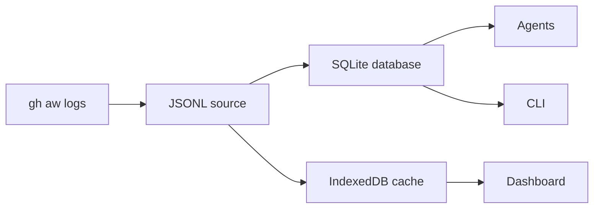
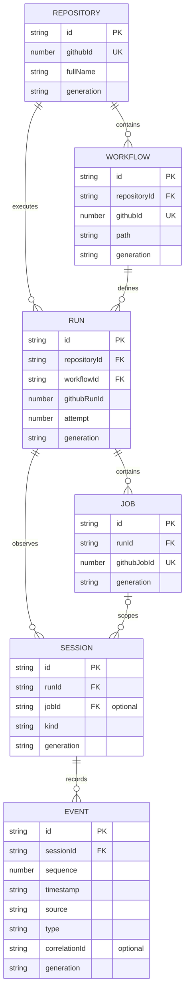

| Browser storage | IndexedDB keeps all available run summaries and expires detailed Job, Session, and Event records after 30 days. |
# Central Agentic Ops Dashboard Data Architecture Specification

**Version:** 1.0.0
**Status:** Working Draft
**Repository:** `githubnext/gh-aw-cao`
**Target implementation:** Dashboard data subsystem
**Date:** 2026-09-09

---

## Abstract

This specification defines a new dashboard-side data architecture for Central Agentic Ops.

The implementation SHALL introduce a clean architectural boundary between existing upstream data collection/publication and dashboard application state.

Existing GitHub, gh-aw, activity snapshot, log, SQL, and generated JSON representations SHALL be treated as input sources.

The dashboard SHALL normalize those sources into a new canonical domain model:

```text
Repository
  └── Workflow
       └── Run
            └── Job
                 └── Session
                      └── Event
```

The browser SHALL maintain this canonical model in IndexedDB.

IndexedDB SHALL be treated exclusively as disposable, reconstructable, derived state and MUST NOT become authoritative storage.

Sessions SHALL represent heterogeneous operational transaction logs containing agent messages, tool activity, gateway activity, firewall decisions, safe-output processing, GitHub API operations, runtime events, and other execution observations in a unified ordered stream.

The architecture SHALL support eventual consistency, idempotent conversion, large datasets, bounded-memory ingestion, immutable source generations, integrity verification, interruption recovery, staging generations, atomic generation activation, browser storage failures, schema evolution, Node.js testing, and real-browser testing.

Dashboard views SHALL consume only the canonical query layer and SHALL NOT parse upstream source formats directly.

---

# 1. Status of This Document

This document is a Draft implementation specification.

It defines the target architecture for a clean dashboard data subsystem.

The implementation SHALL fully replace dashboard-side source-shaped/view-shaped state, caches, direct reads, and fallback rendering with the canonical subsystem defined here.

Development MAY proceed incrementally from the source-adapter boundary inward. The completed implementation MUST NOT retain a shadow, dual-read, alias, compatibility-cache, or fallback path to the replaced browser data system.

Functioning upstream collectors and Pages deployment MAY remain as authoritative data producers. This allowance does not permit the legacy browser data architecture to remain active.

---

# 2. Requirements Notation

The key words **MUST**, **MUST NOT**, **REQUIRED**, **SHALL**, **SHALL NOT**, **SHOULD**, **SHOULD NOT**, **RECOMMENDED**, **NOT RECOMMENDED**, **MAY**, and **OPTIONAL** in this document are to be interpreted as described in RFC 2119.

---

# 3. Architectural Decision

## 3.1 Clean Dashboard-Side Start

The new dashboard data layer SHALL be designed independently of existing dashboard presentation structures.

Existing dashboard source schemas SHALL be treated as source inputs.

They SHALL NOT define the new canonical domain model.

The architectural boundary SHALL be:

```text
EXISTING / UPSTREAM

GitHub
gh-aw
activity snapshots
logs
SQL
published dashboard JSON
        |
        v
====================================
NEW DASHBOARD DATA ARCHITECTURE
====================================
        |
        v
source adapters
        |
        v
canonical normalization
        |
        v
canonical model
        |
        v
IndexedDB
        |
        v
query layer
        |
        v
views
```

## 3.2 Upstream Stability

The initial implementation SHOULD NOT rewrite working:

* GitHub collection;
* workflow discovery;
* activity collection;
* gh-aw log generation;
* policy enforcement;
* Pages deployment;
* existing source publication.

Those components SHALL initially be treated as data producers.

## 3.3 Source Inputs

The current dashboard source JSON MAY be used to bootstrap the new architecture.

However:

> Existing source representations are inputs. They are not the new product contract.

Accepting an existing representation at an adapter boundary MUST NOT expose that representation directly to views or preserve a second browser state path.

---

# 4. Core Invariants

The following requirements are architectural invariants.

## INV-001 — Canonical model

The dashboard MUST have one canonical internal domain model.

## INV-002 — Source independence

The canonical model MUST NOT mechanically mirror any single source representation.

## INV-003 — Views are source-agnostic

Views MUST NOT parse:

* raw logs;
* GitHub responses;
* SQL rows;
* firewall files;
* current source JSON schemas.

## INV-004 — IndexedDB is derived state

IndexedDB MUST be disposable and reconstructable.

## INV-005 — Authoritative inputs remain external

Deletion of IndexedDB MUST NOT cause permanent information loss.

## INV-006 — Deterministic normalization

Identical authoritative observations MUST normalize to identical logical entities.

## INV-007 — Idempotent ingestion

Reprocessing identical input MUST NOT create duplicate entities or events.

## INV-008 — Eventual consistency

Partial observations MAY arrive at different times and MUST converge toward a coherent canonical state.

## INV-009 — Fail-safe activation

An incomplete replacement dataset MUST NEVER replace a known-good active dataset.

## INV-010 — Bounded processing

Correctness MUST NOT require loading the complete historical dataset into browser memory.

## INV-011 — Test parity

Node tests and browser runtime SHOULD exercise the same canonical and persistence interfaces.

## INV-012 — Full replacement

Views MUST read only the active canonical generation. The completed implementation MUST NOT fall back to a legacy cache, source object, generation, alias, or renderer data path.

---

# 5. Target Architecture



SQLite and IndexedDB SHALL use the same adapters, identities, normalization,
and relationship validation. They MAY use different retention windows because
SQLite can serve a historical archive while IndexedDB remains a bounded browser
cache. Neither database SHALL become an input to the other.

IndexedDB and the Activity SQLite database SHALL retain all available canonical
Repository, Workflow, and Run summaries. They SHALL retain detailed Job,
Session, and Event records for the bounded 30-day operational window. Expiring
detail MUST NOT remove its retained Run or the Run's structural parents.

## 5.1 Completeness and archives

The scheduled Activity collection SHALL be treated as a rolling operational
snapshot, not as a complete historical archive. Completeness SHALL be reported
separately for:

* run-summary coverage from `workflow_runs` envelopes;
* enriched artifact coverage from `run` envelopes; and
* the requested historical time range.

Repeated source observations are expected when cached JSONL is refreshed.
Ingestion SHALL report repeated raw and enriched observations, deduplicate them
by the canonical identities defined in this specification, and MUST NOT create
duplicate canonical records.

A full-detail local archive SHALL use a separate SQLite file with a retention
window that covers the requested history. A later rolling Activity refresh MUST
NOT silently shorten that archive to the dashboard's default detail window.

Expired or unavailable GitHub Actions artifacts SHALL be reported as missing
enrichment. Their run summaries MAY still be present and MUST NOT be described
as fully enriched runs.

---

# 6. Canonical Domain Model

## 6.1 Core Entities

Version 1 SHALL define:

```text
Repository
Workflow
Run
Job
Session
Event
```

The model MAY later add:

```text
Artifact
Outcome
Evaluation
Metric
```

without changing the core execution hierarchy.

## 6.2 Entity Relationship Diagram



Repository and Workflow references on Run MAY be denormalized for browser query efficiency, but remain mandatory canonical relationships. A Session MUST reference a Run and MAY reference a Job. Every Event MUST reference exactly one Session. Partial observations MAY exist during normalization; all mandatory relationships MUST resolve before a generation is activated.

---

# 7. Repository

A Repository represents one GitHub repository.

Example:

```js
{
  id: "github:repository:123456",
  githubId: 123456,

  owner: "githubnext",
  name: "gh-aw-cao",
  fullName: "githubnext/gh-aw-cao",

  visibility: "public",

  observedAt: "...",
  updatedAt: "...",

  generation: "..."
}
```

### Requirements

**REP-001** — Immutable GitHub repository ID SHOULD define identity when available.

**REP-002** — Repository rename MUST NOT produce a second logical repository when immutable identity remains unchanged.

**REP-003** — Repository name MUST NOT be the sole canonical identity when GitHub ID is known.

---

# 8. Workflow

Example:

```js
{
  id: "github:workflow:98765",

  repositoryId: "github:repository:123456",
  githubId: 98765,

  name: "Dashboard",
  path: ".github/workflows/dashboard.yml",

  state: "active",

  observedAt: "...",
  updatedAt: "...",

  generation: "..."
}
```

### Requirements

**WF-001** — Workflow MUST reference Repository.

**WF-002** — GitHub workflow ID SHOULD be preferred for identity.

**WF-003** — Workflow filename MUST NOT be treated as immutable identity.

---

# 9. Run

Example:

```js
{
  id: "github:run:123456789:attempt:1",

  repositoryId: "...",
  workflowId: "...",

  githubRunId: 123456789,
  attempt: 1,

  event: "workflow_dispatch",

  status: "completed",
  conclusion: "success",

  createdAt: "...",
  startedAt: "...",
  completedAt: "...",

  headSha: "...",
  headBranch: "main",

  generation: "..."
}
```

### Requirements

**RUN-001** — Run attempts MUST be distinguishable.

**RUN-002** — Canonical identity SHOULD incorporate run ID and attempt.

**RUN-003** — Later observations MAY enrich incomplete Run records.

---

# 10. Job

Example:

```js
{
  id: "github:job:445566",

  repositoryId: "...",
  workflowId: "...",
  runId: "...",

  githubJobId: 445566,

  name: "build",

  status: "completed",
  conclusion: "success",

  startedAt: "...",
  completedAt: "...",

  generation: "..."
}
```

### Requirements

**JOB-001** — Job MUST reference Run.

**JOB-002** — Repository and Workflow references MAY be denormalized for efficient browser queries.

---

# 11. Session

## 11.1 Definition

A Session represents one coherent operational execution context.

A Session MUST NOT be defined solely as an AI conversation.

A Session SHALL be the parent of a heterogeneous operational event stream.

Example:

```js
{
  id: "session:abc123",

  repositoryId: "...",
  workflowId: "...",
  runId: "...",
  jobId: "...",

  kind: "agent",

  status: "completed",

  startedAt: "...",
  completedAt: "...",

  firstSequence: 0,
  lastSequence: 207,
  eventCount: 208,

  generation: "..."
}
```

## 11.2 Session Producers

A Session MAY contain observations from:

```text
user
agent
model
tool
MCP
gateway
firewall
policy engine
safe-output processor
GitHub API
workflow runtime
system
```

## 11.3 Session Storage

Session records SHOULD remain compact.

Events MUST NOT be stored as one ever-growing array inside the Session record.

---

# 12. Event

## 12.1 Unified Transaction Log

Every operational occurrence associated with a Session SHOULD become an Event.

Example:

```js
{
  id: "event:01J...",

  sessionId: "session:abc123",

  sequence: 17,
  timestamp: "...",

  source: "firewall",
  type: "firewall.request.blocked",

  actor: {
    type: "system",
    name: "firewall"
  },

  summary: "Outbound request blocked",

  correlationId: null,
  payloadRef: null,

  generation: "..."
}
```

## 12.2 Canonical Event Types

Initial event families SHOULD include:

```text
message.user
message.agent
message.system

tool.call
tool.result
tool.error

mcp.call
mcp.result
mcp.error

gateway.request
gateway.response
gateway.retry
gateway.error

firewall.request.allowed
firewall.request.blocked
firewall.policy.matched
firewall.error

safe-output.requested
safe-output.validated
safe-output.executed
safe-output.rejected

work-item.updated
finding.detected
finding.updated

github-api.request
github-api.response
github-api.rate-limited
github-api.error

runtime.started
runtime.completed
runtime.error
```

## 12.3 Correlation

Related events SHOULD use `correlationId`.

Example:

```text
tool.call      correlationId=abc
gateway.request correlationId=abc
firewall.request.allowed correlationId=abc
gateway.response correlationId=abc
tool.result    correlationId=abc
```

## 12.4 Ordering

Canonical event order MUST NOT depend solely on ingestion order.

Ordering SHOULD use:

```text
source sequence
```

when available.

Otherwise:

```text
source timestamp
+
deterministic tie-breaker
```

MUST be used.

---

# 13. Transaction Log Principle

A Session timeline MAY resemble:

```text
001 runtime.started
002 message.user
003 message.agent
004 tool.call
005 gateway.request
006 firewall.request.allowed
007 gateway.response
008 tool.result
009 message.agent
010 safe-output.requested
011 safe-output.validated
012 safe-output.executed
013 runtime.completed
```

The same records SHALL support different projections.

### Conversation

```text
message.user
message.agent
tool.call
tool.result
```

### Security

```text
firewall.policy.matched
firewall.request.blocked
safe-output.rejected
```

### Network

```text
gateway.request
firewall.request.allowed
gateway.response
```

### Debugging

All events.

Views MUST NOT maintain independent copies of these datasets.

---

# 14. Source Adapters

## 14.1 Purpose

Adapters translate external representations into source-neutral observations.

Initial adapters SHOULD support:

```text
current dashboard source JSON
gh-aw log JSON
SQL exports conforming to the dashboard SQL export contract
```

Future adapters MAY include direct GitHub API representations.

## 14.2 Adapter Boundary

Adapters MAY understand source-specific names and structures.

Everything downstream of adapters SHOULD NOT.

## 14.3 SQL

SQL SHALL be treated as another source representation. The static dashboard SHALL NOT connect directly to a database.

Database owners SHALL map source-specific tables to the versioned `gh-aw-cao.dashboard-sql-export` interchange contract. A trusted workflow or offline tool SHALL serialize that result to JSON before Pages publication.

The IndexedDB model MUST NOT be produced by mechanically copying SQL tables.

```text
source-specific SQL tables
    |
    v
dashboard export view
  |
  v
static JSON publication
  |
  v
SQL-export adapter
    |
    v
canonical model
```

The version 1 JSON document SHALL contain:

```js
{
  contract: "gh-aw-cao.dashboard-sql-export",
  schema_version: 1,
  source: "stable-source-name",
  generation: "immutable-generation-id",
  exported_at: "RFC3339 timestamp",
  rows: []
}
```

Each row SHALL contain `entity_kind`, `source_id`, and `observed_at`. The remaining nullable columns are defined by entity kind. GitHub-backed relationships SHALL use immutable GitHub repository, workflow, run, and job IDs. Sessions SHALL use stable source IDs, and Events SHALL reference `session_source_id`.

The relational interchange SHALL consist of one manifest row and denormalized entity rows. A producer MAY expose these as tables or views. Database-specific extraction queries and credentials remain upstream concerns and MUST NOT be shipped to the browser.

## 14.4 Cached gh-aw JSONL

The normative mapping for cached schema-v2 `gh-aw-logs.jsonl` input is
defined in [Cached gh-aw JSONL Mapping](dashboard-gh-aw-jsonl-mapping.md).

---

# 15. Normalization

Normalization SHOULD be deterministic and side-effect free.

Preferred API:

```js
const observations = parseSource(input);

const batch = normalize(observations);
```

Example result:

```js
{
  repositories: [],
  workflows: [],
  runs: [],
  jobs: [],
  sessions: [],
  events: []
}
```

Persistence SHALL occur separately:

```js
await writer.write(batch);
```

## 15.1 Missing Data

A missing canonical data point MUST NOT immediately be treated as zero, empty, or unavailable.

Before classifying it as missing, an implementation agent SHALL inspect the current [`gh aw logs` schema](https://github.com/github/gh-aw/blob/main/schemas/logs.schema.json) and determine whether any field in the applicable output variant contains an authoritative observation that can be normalized into the canonical model. This inspection SHALL include nested and aggregate structures, not only fields whose names match the canonical property.

This discovery and normalization SHALL run in the activity-package JavaScript invoked by `.github/workflows/activity.yml`, before the activity snapshot is published. The workflow YAML orchestrates that JavaScript and MUST NOT embed source-field mappings.

When the schema exposes suitable data, the activity-package source adapter SHOULD normalize it. The mapping MUST:

1. be explicit, deterministic, and covered by a fixture-based test;
2. preserve source provenance and the schema revision used to establish the mapping;
3. respect the field's scope, units, nullability, and required or optional status;
4. distinguish an absent field from an explicit `null`, empty collection, zero, and `false`; and
5. avoid deriving run-level facts from summaries unless the schema defines that attribution.

The `gh aw logs` schema is a discovery surface for source adapters, not a canonical dashboard contract. Views MUST NOT read its fields directly, and similarity of field names alone is insufficient evidence for a mapping.

If the schema defines a suitable field but the collected log does not contain it, the activity-package source adapter MUST preserve the data point as unknown and record why it is missing, including whether the cause is an unsupported schema variant, an older producer, an unavailable artifact, an uncollected optional field, or invalid source data. If no semantically valid field exists, the data point MUST remain explicitly unknown rather than being guessed or coerced.

---

# 16. Canonical Identity

IDs MUST be deterministic whenever stable upstream identifiers exist.

Examples:

```text
github:repository:<id>

github:workflow:<id>

github:run:<id>:attempt:<attempt>

github:job:<id>
```

Sessions and Events SHOULD use stable source identifiers where available.

Otherwise deterministic IDs MAY be derived from stable source coordinates or content identifiers.

Random IDs MUST NOT be introduced during ingestion when doing so would break idempotence.

---

# 17. Provenance

Canonical records SHOULD retain source provenance when useful.

Example:

```js
{
  provenance: {
    source: "gh-aw-log",
    sourceId: "...",
    observedAt: "...",
    sourceRevision: "..."
  }
}
```

This SHOULD allow debugging questions such as:

```text
Which observation established this conclusion?

Did the firewall or the agent report this failure?

Which source supplied this timestamp?
```

---

# 18. Eventual Consistency

The canonical model SHALL be eventually consistent.

The system MUST support observation sequences such as:

```text
T0 run discovered
T1 job discovered
T2 session discovered
T3 firewall data discovered
T4 usage discovered
T5 run completes
T6 safe-output result arrives
```

No source MUST provide a fully populated logical entity in one operation.

Later observations MAY enrich existing records.

---

# 19. Conflict Resolution

When observations disagree:

1. source precedence SHOULD be explicitly defined;
2. newer authoritative observations SHOULD supersede older observations;
3. arbitrary ingestion order MUST NOT be the sole deciding rule.

Unknown or incomplete information SHOULD remain explicitly unknown rather than being guessed.

---

# 20. Published Source Generations

## 20.1 Principle

Published dashboard inputs SHOULD eventually be represented as immutable generations.

A generation SHALL contain:

```text
manifest
+
immutable chunks
```

Example:

```json
{
  "version": 2,
  "schemaVersion": 1,
  "generation": "2026-09-09T05:00:00Z",
  "createdAt": "2026-09-09T05:00:00Z",

  "datasets": [
    {
      "kind": "events",
      "path": "events/events-0042.json",
      "sha256": "...",
      "bytes": 3920211,
      "records": 5000,
      "minTimestamp": "...",
      "maxTimestamp": "..."
    }
  ]
}
```

## 20.2 Migration Requirement

Chunked publication SHALL NOT be required for the first canonical-data milestone.

Initial implementation MAY consume today's source files.

Recommended transition:

```text
current source JSON
        ↓
new adapters
        ↓
canonical model
```

Then later:

```text
chunked generation
        ↓
same adapters/model
```

---

# 21. Immutable Chunks

Large datasets SHOULD eventually be partitioned:

```text
sources/
  manifest.json

  repositories/
    repositories-0001.json

  workflows/
    workflows-0001.json

  runs/
    runs-0001.json
    runs-0002.json

  jobs/
    jobs-0001.json

  sessions/
    sessions-0001.json

  events/
    events-0001.json
    events-0002.json
    events-0003.json
```

Published chunks MUST be immutable within a generation.

---

# 22. Chunk Metadata

Every production chunk SHOULD identify:

```text
kind
path
SHA-256 digest
byte size
record count
```

Where useful it MAY also identify:

```text
minimum key
maximum key
minimum timestamp
maximum timestamp
```

---

# 23. Chunk Size

Chunks MUST be bounded.

Initial tuning targets SHOULD be approximately:

```text
1,000–10,000 source records
```

or approximately:

```text
1–8 MiB per uncompressed source chunk
```

whichever threshold is reached first.

These are operational defaults, not correctness requirements.

Benchmark data MAY change them.

---

# 24. Large Payloads

Large diagnostic payloads SHOULD NOT be duplicated into hot Event rows.

Prefer:

```js
{
  id: "...",
  sessionId: "...",
  type: "tool.result",
  summary: "...",

  payloadRef: {
    chunk: "payloads/session-123-004.json",
    key: "event-442"
  }
}
```

IndexedDB SHOULD contain data required for:

```text
filtering
sorting
navigation
aggregation
timeline rendering
correlation
```

Raw payloads MAY remain in immutable source chunks.

---

# 25. IndexedDB Role

IndexedDB SHALL be a materialized browser projection.

The governing rule is:

> IndexedDB is cacheable derived state, not authority.

A completely empty IndexedDB MUST be recoverable.

---

# 26. Database Definition

The new subsystem SHOULD use a fresh database name during migration.

Example:

```js
const DATABASE_NAME = "gh-aw-cao-dashboard-v2";
const DATABASE_VERSION = 1;
```

After the old data path is removed, the name MAY be simplified.

---

# 27. Object Stores

Version 1 SHOULD define:

```text
meta
repositories
workflows
runs
jobs
sessions
events
ingestionCheckpoints
```

Future stores MAY include:

```text
payloadCache
searchIndex
aggregates
```

---

# 28. Core Indexes

Indexes SHOULD initially reflect known query paths.

### repositories

```text
githubId
fullName
```

### workflows

```text
repositoryId
[repositoryId, path]
```

### runs

```text
repositoryId
workflowId
status
[repositoryId, startedAt]
[workflowId, startedAt]
```

### jobs

```text
runId
[runId, startedAt]
```

### sessions

```text
runId
jobId
[runId, startedAt]
[jobId, startedAt]
```

### events

```text
sessionId
type
source
correlationId
[sessionId, sequence]
[sessionId, timestamp]
```

Indexes SHOULD NOT be added speculatively.

Every secondary index increases storage and write amplification.

---

# 29. Generation-Aware Browser Storage

Every canonical row SHALL belong to a data generation.

Implementations SHOULD use either:

```text
[generation, id]
```

compound keys, or an equivalent partitioning strategy.

Queries MUST normally resolve only against:

```text
meta.activeGeneration
```

---

# 30. Generation Lifecycle

Generation states SHALL include:

```text
staging
validating
complete
failed
retired
```

Only a `complete` generation MAY become active.

---

# 31. Fail-Safe Generation Replacement

The browser SHALL build new generations separately from active state.

```text
GENERATION A
ACTIVE
   |
   | dashboard continues reading A
   |
   +------------------------------+

GENERATION B
STAGING
   |
   +--> fetch
   +--> verify
   +--> normalize
   +--> write
   +--> checkpoint
   +--> validate
   |
   v
COMPLETE
   |
   v
atomic active-generation update
   |
   v
GENERATION B
ACTIVE
```

### Requirements

**GEN-001** — A new generation MUST begin as `staging`.

**GEN-002** — Staging MUST NOT mutate the active generation.

**GEN-003** — Active data MUST remain queryable during ingestion.

**GEN-004** — A generation MUST pass validation before activation.

**GEN-005** — Activation MUST be a small atomic transaction.

**GEN-006** — Failure before activation MUST leave the previous generation active.

**GEN-007** — A previous known-good generation SHOULD temporarily remain available after activation where storage allows.

**GEN-008** — Retired generations MAY then be garbage-collected.

---

# 32. Bounded Ingestion

The complete source dataset MUST NOT be materialized in memory.

Processing SHALL occur incrementally:

```text
fetch chunk
    |
verify
    |
parse
    |
normalize
    |
batch write
    |
checkpoint
    |
release source objects
```

---

# 33. Write Batches

A million-record import MUST NOT use one giant IndexedDB transaction.

Canonical records SHOULD be committed in bounded batches.

An initial target MAY be:

```text
500–5,000 records per write transaction
```

The final value SHOULD be determined through load tests.

---

# 34. Ingestion Checkpoints

Every completed source chunk SHOULD create a durable checkpoint.

Example:

```js
{
  id: [
    "2026-09-09T05:00:00Z",
    "events/events-0042.json"
  ],

  generation: "2026-09-09T05:00:00Z",
  chunk: "events/events-0042.json",

  digest: "...",
  status: "committed",
  recordCount: 5000,

  committedAt: "..."
}
```

On restart, a chunk MAY be skipped only when:

```text
generation matches
AND
digest matches
AND
checkpoint status == committed
```

---

# 35. Web Worker Ingestion

Large:

```text
fetching
hashing
JSON parsing
normalization
IndexedDB writes
```

SHOULD occur in a Web Worker.

The main thread SHOULD remain available for:

```text
rendering
navigation
querying
progress UI
user input
```

Progress MAY be communicated as:

```js
{
  phase: "indexing",
  generation: "...",
  completedChunks: 42,
  totalChunks: 180,
  completedRecords: 210000
}
```

---

# 36. Integrity Validation

Before activation, a generation MUST pass validation.

## 36.1 Manifest

Verify:

```text
supported manifest version
supported source schema
required fields
valid paths
```

## 36.2 Chunks

Verify:

```text
digest
parse success
record-count plausibility
```

## 36.3 Canonical records

Verify:

```text
valid canonical IDs
required fields
expected entity types
```

## 36.4 Relationships

Verify required relationships such as:

```text
Workflow -> Repository
Run -> Workflow
Job -> Run
Session -> Run/Job
Event -> Session
```

Where eventually consistent partial relationships are intentionally allowed, that behavior MUST be explicit.

## 36.5 Completeness

All required chunks MUST have committed checkpoints.

---

# 37. Storage Quota

The browser SHOULD inspect available storage before large ingestion:

```js
const storage = await navigator.storage.estimate();
```

The browser MAY request persistent storage:

```js
await navigator.storage.persist();
```

Correctness MUST NOT depend on persistent storage being granted.

---

# 38. Quota Failure

`QuotaExceededError` MUST be handled explicitly.

When storage is insufficient:

1. active generation MUST remain active;
2. staging ingestion MUST stop;
3. staging records MAY be deleted;
4. retired generations MAY be removed;
5. expendable payload/search caches MAY be removed;
6. ingestion MAY retry if sufficient space becomes available;
7. the dashboard SHOULD surface a storage diagnostic.

A quota failure MUST NEVER activate partial data.

---

# 39. Storage Recovery Order

When space is required, cleanup SHOULD proceed in this order:

```text
1. failed staging generations
2. retired generations
3. payload cache
4. search indexes
5. warm local history
```

The only active valid generation MUST NOT be deleted merely to create a replacement.

---

# 40. Browser Eviction

The application MUST remain correct if browser storage is:

```text
evicted
manually cleared
lost in private browsing
unavailable
corrupted
```

Recovery SHALL consist of rebuilding from published authoritative inputs.

---

# 41. Retention

Enterprise-scale deployments SHOULD support local data tiers.

Example:

```text
HOT
recent runs/sessions/events
fully indexed

WARM
summaries indexed
details fetched on demand

COLD
published chunks only
not retained locally
```

Exact periods SHALL remain a product/configuration decision.

The architecture MUST NOT require every browser to retain unlimited execution history.

Ingestion SHALL upsert each collected batch onto the records already retained
instead of replacing them, so a partial collection or worker restart never drops
observations the browser still retains. The implementation retains records
observed within the last 30 days; records observed outside that window SHALL be
pruned during the next ingestion.

Retention pruning MUST remain relationship-safe: a retained record SHALL be
dropped when a mandatory parent no longer survives, and structural parents that
neither the current collection nor any retained descendant references SHALL be
collected.

---

# 42. Search

IndexedDB indexes SHALL NOT be treated as a full-text search engine.

If message/event full-text search is required, the implementation SHOULD build a dedicated derived search index.

The search index MUST also be disposable and rebuildable.

---

# 43. Query Layer

Views SHALL use a stable query API.

Example:

```js
repositories.list();
repositories.get(id);

workflows.forRepository(repositoryId);

runs.forRepository(repositoryId);
runs.forWorkflow(workflowId);
runs.recentFailures();

jobs.forRun(runId);

sessions.list();
sessions.forRun(runId);
sessions.forJob(jobId);

events.list();
events.forSession(sessionId);
events.forSessionByType(sessionId, type);
```

Dashboard code SHOULD NOT directly scatter IndexedDB transaction logic through views.

---

# 44. Repository Structure

The completed implementation SHALL use the stable data namespace.

Example:

```text
dashboard/
  data/
    model/
      ids.mjs
      schema.mjs

    adapters/
      dashboard-sources.mjs
      gh-aw-logs.mjs
      sql.mjs

    normalize/
      repositories.mjs
      workflows.mjs
      runs.mjs
      jobs.mjs
      sessions.mjs
      events.mjs

    storage/
      indexeddb.mjs
      schema.mjs
      generations.mjs
      checkpoints.mjs

    ingest/
      manifest.mjs
      chunks.mjs
      integrity.mjs
      worker.mjs
      coordinator.mjs

    queries/
      repositories.mjs
      workflows.mjs
      runs.mjs
      jobs.mjs
      sessions.mjs
      events.mjs
```

Temporary parallel namespaces such as `data-v2` or logical source names such as `canonical-runs` MUST NOT remain after migration. Published source documents MAY remain source inputs at the ingestion boundary, but presentation MUST receive only active-generation query results under stable logical source contracts.

After migration, implementations MUST NOT fall back to direct rendering of published source objects, a parallel whole-source browser cache, empty compatibility projections, or main-thread reprocessing after a worker failure. An unavailable or invalid requested generation MUST fail explicitly without bypassing normalization, validation, or activation.

---

# 45. Implementation Sequence

## Phase 1 — Canonical model

Implement only:

```text
Repository
Workflow
Run
Job
Session
Event

canonical IDs
canonical timestamps
provenance
relationships
```

Do not redesign views.

### Exit criteria

* model definitions exist;
* IDs are deterministic;
* fixture tests pass.

---

## Phase 2 — Source adapters

Implement adapters for current real source inputs.

Priority:

```text
1. current dashboard sources
2. gh-aw logs JSON
3. versioned static SQL export
```

Adapters MUST produce source-neutral normalization inputs.

### Exit criteria

Real fixtures convert into canonical entities without UI involvement.

---

## Phase 3 — Pure normalization tests

Before IndexedDB, assert canonical objects directly.

Example:

```text
logs fixture
    |
adapter
    |
normalizer
    |
expected-model fixture
```

### Exit criteria

Normalization is deterministic and idempotent.

---

## Phase 4 — IndexedDB

Implement:

```text
stores
indexes
generation-aware keys
queries
```

Start with native IndexedDB semantics.

### Exit criteria

Canonical fixtures can be persisted and queried.

---

## Phase 5 — Node integration tests

Use an IndexedDB-compatible Node implementation such as `fake-indexeddb`.

Test:

```text
real fixture
   ↓
adapter
   ↓
normalization
   ↓
IndexedDB
   ↓
query layer
   ↓
assertions
```

### Exit criteria

The full new data path is testable without a browser.

---

## Phase 6 — Authoritative browser cutover

Make the canonical query layer authoritative for every view and remove the replaced browser cache, direct-source reads, aliases, and fallback behavior.

The integration MUST NOT fabricate Job, Session, or Event records from view-shaped summaries. Adapter-derived identities MUST remain explicitly namespaced when immutable upstream IDs are unavailable.

Compare:

```text
expected fixture semantics
vs
canonical query output
```

### Exit criteria

Every view reads the active canonical generation, replacement failures are explicit, and no legacy browser path remains.

---

## Phase 7 — Generation safety

Implement:

```text
staging generations
validation
active-generation pointer
atomic activation
rollback behavior
```

### Exit criteria

Interrupted/failed replacement cannot damage active data.

---

## Phase 8 — Scalable ingestion

Add:

```text
worker processing
bounded batches
checkpoints
quota handling
```

### Exit criteria

Large data can be processed without full-memory materialization.

---

## Phase 9 — Chunked publication

Only after the canonical path is proven, evolve upstream publication toward:

```text
manifest
immutable chunks
digests
```

### Exit criteria

Source ingestion is resumable and independently verifiable.

---

## Phase 10 — View conformance

Verify every dashboard view reads canonical queries after the authoritative cutover.

Views MUST NOT retain fallback source parsing once migrated.

---

## Phase 11 — Delete legacy dashboard data layer

When all supported views use the canonical query interface:

```text
remove replaced browser plumbing
rename data-v2 -> data
remove unused old view-shaped models
```

---

# 46. Node Testing

The new storage abstraction MUST run under Node tests.

A development-only IndexedDB implementation MAY provide the browser API.

Example:

```js
import "fake-indexeddb/auto";
```

Production browser code MUST use native browser IndexedDB.

The same application storage API SHOULD be exercised in both environments.

---

# 47. Required Model Tests

### T-MODEL-001 — Repository identity

Repository rename retains canonical identity.

### T-MODEL-002 — Workflow identity

Workflow path change does not incorrectly duplicate a known workflow.

### T-MODEL-003 — Run attempts

Reruns are distinguishable.

### T-MODEL-004 — Session composition

One session may contain:

```text
agent
tool
gateway
firewall
safe-output
```

events.

### T-MODEL-005 — Event ordering

Out-of-order source observations result in deterministic canonical ordering.

### T-MODEL-006 — Partial entities

Incomplete entities can be enriched by later authoritative observations.

### T-MODEL-007 — Idempotence

Ingesting identical observations twice does not duplicate logical data.

### T-MODEL-008 — Unknown event

Unknown non-critical events do not invalidate the complete source dataset.

---

# 48. Required Persistence Tests

### T-IDB-001 — Fresh database

A new IndexedDB database initializes correctly.

### T-IDB-002 — Query indexes

Required query paths return expected results.

### T-IDB-003 — Duplicate writes

Idempotent writes preserve record count.

### T-IDB-004 — Generation isolation

Staging records never appear in active-generation queries.

### T-IDB-005 — Atomic activation

Changing active generation exposes either A or B, never mixed state.

---

# 49. Required Failure Tests

### T-FAIL-001 — Interrupted ingestion

Stop processing after N chunks.

Restart.

Expected:

Committed chunks are reused and remaining chunks continue.

### T-FAIL-002 — Corrupt chunk

Modify chunk content without updating its digest.

Expected:

Generation never activates.

### T-FAIL-003 — Quota exceeded

Cause IndexedDB write failure.

Expected:

Previous active generation remains usable.

### T-FAIL-004 — Invalid schema

Provide unsupported source schema.

Expected:

Current active data remains available.

### T-FAIL-005 — Broken relationships

Provide invalid mandatory relationships.

Expected:

Generation validation fails.

### T-FAIL-006 — Browser termination before activation

Terminate after staging finishes but before activation.

Expected:

Previous generation remains active.

### T-FAIL-007 — Browser termination after activation

Terminate immediately after activation.

Expected:

New active-generation pointer remains internally valid.

---

# 50. Browser Tests

Node-based IndexedDB tests SHALL NOT be the sole conformance test.

The implementation MUST include native browser tests.

At minimum:

```text
Chromium
```

SHALL be tested.

Where supported:

```text
Firefox
WebKit
```

SHOULD also be tested.

Required browser scenarios:

```text
cold start
reload using existing database
full rebuild
generation replacement
corrupt staging data
IndexedDB deletion
interrupted ingestion
```

---

# 51. Large-Data Tests

Synthetic tests SHOULD cover progressive scales.

### Baseline

```text
100 repositories
10,000 runs
100,000 events
```

### Enterprise candidate

```text
10,000 repositories
1,000,000 events
```

Additional tests MAY exceed these numbers.

The point is not an arbitrary maximum.

The goal is to measure behavior before declaring production scale.

---

# 52. Performance Measurements

Large-data tests SHOULD measure:

```text
normalization throughput
IndexedDB write throughput
cold-start duration
incremental update duration
query latency
peak memory
database size
chunk latency
activation latency
garbage-collection duration
```

Regression thresholds SHOULD be introduced after baseline measurements exist.

---

# 53. Low-Memory Requirements

Large ingestion MUST NOT require one giant JSON object graph.

The implementation SHOULD be validated under a constrained-memory browser environment.

Tests SHOULD demonstrate:

```text
bounded chunk processing
memory release between chunks
responsive main thread
page-scoped worker query results
no whole-dashboard structured clone
lazy event detail loading
```

---

# 54. Schema Versioning

The implementation SHALL distinguish:

```text
source schema version
canonical model version
IndexedDB structural version
```

These versions MUST NOT be assumed to advance together.

Example:

```text
source schema: 5
canonical schema: 2
IndexedDB version: 3
```

---

# 55. Schema Migration

Simple IndexedDB structural changes MAY use normal version upgrades.

For substantial canonical semantic changes, rebuilding derived state SHOULD be preferred over complex in-place migrations.

Because IndexedDB is not authoritative:

> Rebuildability is more important than preserving stale derived rows.

A known-good active generation SHOULD remain available until its replacement has completed.

---

# 56. Error Taxonomy

Stable ingestion error categories SHOULD include:

```text
SOURCE_FETCH_FAILED
SOURCE_CORRUPT
CHECKSUM_MISMATCH

SCHEMA_UNSUPPORTED
NORMALIZATION_FAILED
RELATIONSHIP_INVALID

TRANSACTION_ABORTED
QUOTA_EXCEEDED

GENERATION_INCOMPLETE
GENERATION_VALIDATION_FAILED

MIGRATION_FAILED
```

Errors SHOULD identify:

```text
generation
phase
source kind
chunk where applicable
human-readable detail
underlying cause where safe
```

---

# 57. Security Model

The data architecture SHALL NOT weaken existing access boundaries.

IndexedDB is NOT an authorization layer.

Any information fetched into the browser MUST already be authorized for the dashboard user.

Sensitive data MUST NOT be made safe merely by hiding it from a view.

---

# 58. Data Minimization

The canonical model SHOULD retain the fields required for dashboard behavior.

Large or highly sensitive raw payloads SHOULD remain out of the hot canonical store unless operationally required.

Do not duplicate source payloads merely because storage is available.

---

# 59. Full Rebuild Requirement

The following operation MUST always be valid:

```text
delete IndexedDB
        |
reload dashboard
        |
fetch current authoritative generation
        |
rebuild canonical model
        |
dashboard becomes usable
```

This is a primary disaster-recovery path.

---

# 60. Agent Implementation Contract

An implementation agent SHOULD receive:

1. this specification;
2. representative current dashboard JSON;
3. current dashboard source-schema specification;
4. real gh-aw log JSON;
5. representative firewall data;
6. representative safe-output data;
7. the versioned dashboard SQL export contract;
8. representative SQL and exported JSON rows;
9. expected canonical fixtures;
10. tests to satisfy.

The implementation instruction SHOULD be:

> Implement the canonical dashboard data subsystem before modifying dashboard presentation behavior.

Agents SHOULD work in this order:

```text
model
→ adapters
→ normalization
→ tests
→ IndexedDB
→ queries
→ generations
→ browser ingestion
→ views
```

---

# 61. Definition of Done — Canonical Foundation

The foundation is complete when:

* Repository/Workflow/Run/Job/Session/Event exist;
* canonical IDs are deterministic;
* session events support multiple producers;
* real fixtures normalize correctly;
* duplicate ingestion is idempotent;
* no dashboard view is required for testing.

---

# 62. Definition of Done — New Data Subsystem

The subsystem is complete when:

* IndexedDB persistence works;
* query API works;
* Node tests exercise IndexedDB interfaces;
* native browser tests pass;
* active/staging generation isolation works;
* failed replacement preserves active data;
* recovery from empty IndexedDB works.

---

# 63. Definition of Done — Enterprise-Hardened

The implementation MUST NOT be described as enterprise-hardened until all of the following have passed:

```text
million-event load test
bounded-memory ingestion
real-browser IndexedDB testing
interruption recovery
chunk integrity rejection
quota-exceeded recovery
atomic generation activation
schema rebuild/upgrade
out-of-order events
duplicate ingestion
repository rename
workflow rename
run-attempt handling
known-good rollback behavior
```

---

# 64. Explicit Non-Goals for Initial Implementation

The first implementation SHOULD NOT attempt to solve:

```text
unlimited local historical retention
browser-side authoritative state
live browser SQL integration
full-text search
UI redesign
perfect source chunking
complex data migrations
multi-browser synchronization
```

Those concerns SHALL NOT delay establishment of the canonical model.

---

# 65. Cutover Principle

Before browser cutover, build and validate the canonical subsystem without connecting it to presentation:

```text
CURRENT SOURCES
        |
        +----------------> new adapters
                              |
                              v
                         canonical model
                              |
                              v
                           IndexedDB
```

At cutover, views SHALL switch directly to the canonical query layer:

```text
published inputs
  |
  v
 ingestion adapters
  |
  v
active-generation queries
        |
        v
      views
```

The replaced browser data plumbing SHALL be deleted in the same completed implementation:

```text
old dashboard-side data plumbing
        |
        X delete
```

---

# 66. Architectural Rules for Code Review

A dashboard data change SHOULD be rejected if it:

* introduces raw log parsing into a view;
* creates a second canonical representation;
* relies on ingestion order for identity;
* makes IndexedDB authoritative;
* writes staging data into the active generation;
* requires a full dataset in memory;
* silently drops unknown observations;
* introduces random IDs for otherwise stable entities;
* bypasses normalization;
* directly mirrors SQL without domain justification;
* deletes known-good data before validating its replacement.

---

# 67. Recommended First Pull Requests

Implementation SHOULD be decomposed into small reviewable changes.

### PR 1 — Canonical domain model

```text
IDs
entity definitions
pure normalizers
fixtures
tests
```

### PR 2 — Current-source adapters

```text
current dashboard JSON
gh-aw log fixture
SQL fixture
```

### PR 3 — IndexedDB persistence

```text
schema
stores
indexes
query API
Node IndexedDB tests
```

### PR 4 — Authoritative browser cutover

```text
native IndexedDB
background ingestion
canonical query integration
replaced browser data-path deletion
```

### PR 5 — Generation isolation

```text
active/staging generations
activation transaction
failure tests
```

### PR 6 — Enterprise ingestion

```text
worker
checkpoints
bounded transactions
quota handling
load tests
```

### PR 7 — Chunked publication

```text
manifest
immutable chunks
digests
```

### PR 8+ — View migration

One coherent dashboard surface at a time.

---

# 68. Final Architecture

```text
                  EXISTING SYSTEM

 GitHub / gh-aw / logs / SQL / activity collectors
                       |
                       v
              authoritative sources
                       |
                       v
==================================================
           CLEAN DASHBOARD DATA BOUNDARY
==================================================
                       |
                       v
                  adapters
                       |
                       v
                normalization
                       |
                       v
            canonical domain model

       Repository → Workflow → Run → Job
                              |
                              v
                           Session
                              |
                              v
                            Event*
                       |
                       v
              generation ingestion
                       |
                       v
             staging IndexedDB state
                       |
                validate completely
                       |
                       v
                 atomic activation
                       |
                       v
                canonical queries
                       |
                       v
                  dashboard views
```

---

# 69. Governing Principles

The implementation SHALL be guided by the following rules:

> **Start clean at the dashboard data boundary.**

> **Existing data formats are inputs, not the new domain contract.**

> **Normalize once, index once, project many times.**

> **IndexedDB is an expendable materialized projection.**

> **Authoritative data must remain capable of rebuilding the browser completely.**

> **Sessions are unified operational transaction logs, not agent-chat-only records.**

> **Never replace known-good data with an incomplete generation.**

> **Large datasets must be processed incrementally with bounded memory.**

> **Optimize publication after the canonical model is proven—not before.**

> **Views should flow from the model rather than define it.**

---

# 70. Compliance Checklist

| Requirement                                    | Level                          |
| ---------------------------------------------- | ------------------------------ |
| Clean dashboard-side canonical model           | MUST                           |
| Source adapters                                | MUST                           |
| Deterministic canonical IDs                    | MUST                           |
| Idempotent normalization                       | MUST                           |
| Repository → Workflow → Run → Job hierarchy    | MUST                           |
| Session → Event transaction log                | MUST                           |
| Heterogeneous event producers                  | MUST                           |
| IndexedDB derived state                        | MUST                           |
| Full reconstruction after database deletion    | MUST                           |
| Query layer between DB and views               | MUST                           |
| Native browser testing                         | MUST                           |
| Node IndexedDB testing                         | MUST                           |
| Staging generation                             | MUST                           |
| Atomic activation                              | MUST                           |
| Failed replacement preserves active generation | MUST                           |
| Bounded ingestion                              | MUST                           |
| Explicit quota handling                        | MUST                           |
| Chunk digest verification                      | MUST when chunking enabled     |
| Resume checkpoints                             | MUST for large-data mode       |
| Web Worker ingestion                           | SHOULD                         |
| Local retention tiers                          | SHOULD for large installations |
| Previous generation retention                  | SHOULD where storage permits   |
| Full-text derived search index                 | MAY                            |
| Chunked publishing before canonical model      | SHOULD NOT                     |

---

# 71. References

## Normative

**RFC 2119** — Key words for use in RFCs to Indicate Requirement Levels.

**IndexedDB** — Browser structured database used by the canonical materialized projection.

## Project

**Central Agentic Ops dashboard source schemas** — Existing published dashboard JSON contracts SHALL be treated as source inputs during migration.

**[`gh aw logs` schema](https://github.com/github/gh-aw/blob/main/schemas/logs.schema.json)** — The current command output contract SHALL be inspected for observations that can fill missing canonical data through source adapters.

**gh-aw operational artifacts** — Agent, tool, gateway, firewall, safe-output, and execution observations provide candidate Session Event sources.

---

# 72. Change Log

## Version 1.0.0 — Draft

* Established clean dashboard-side data boundary.
* Classified current dashboard schemas as source inputs.
* Defined canonical Repository → Workflow → Run → Job → Session → Event hierarchy.
* Defined Session as heterogeneous operational transaction log.
* Defined deterministic source adapters and normalization layer.
* Defined missing-data discovery and normalization from the `gh aw logs` schema.
* Defined IndexedDB as disposable derived state.
* Added generation-aware browser storage.
* Added staging and atomic active-generation replacement.
* Added bounded ingestion and checkpoints.
* Added immutable chunk publication model.
* Added integrity verification.
* Added Web Worker ingestion guidance.
* Added storage quota and eviction recovery.
* Added large-payload indirection.
* Added retention tiers.
* Added Node and real-browser test requirements.
* Added large-data and failure test suites.
* Added clean migration sequence and PR decomposition.
* Established enterprise-hardening definition of done.
