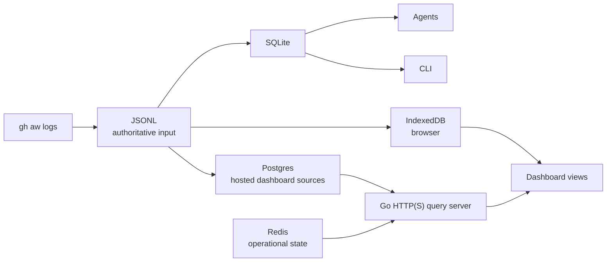
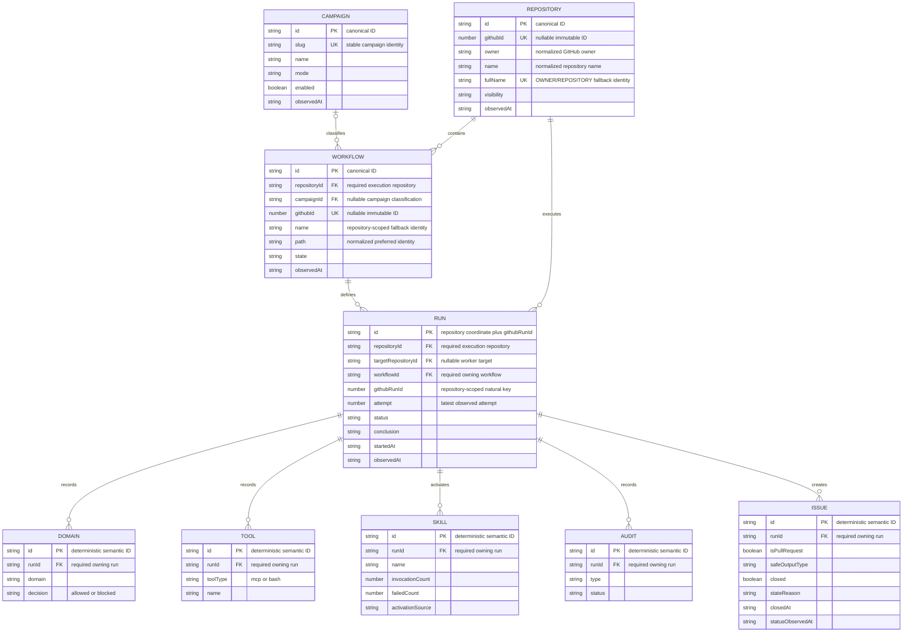

# Central Agentic Ops Dashboard Data Architecture Specification

**Version:** 1.8.2
**Status:** Working Draft
**Repository:** `githubnext/gh-aw-cao`
**Target implementation:** Dashboard data subsystem
**Date:** 2026-09-24

Implementers changing canonical data, ingestion, storage, or query execution
should read `docs/dashboard-data-model.md` first, then this specification and
the production boundary under `dashboard/site/src/data/`. Computation changes
must also follow `specs/computations.md`.

| Browser storage | IndexedDB keeps all available run summaries and expires detailed run-linked records after 30 days. |
| --- | --- |

IndexedDB SHALL retain all available canonical Repository, Workflow, and Run
summaries so dashboard trends and run history can cover the complete published
source. It SHALL retain detailed Domain, Tool, Audit, and Issue records for the
bounded 30-day operational window. Expiring run-linked records MUST NOT remove
their retained Run or the Run's structural parents.

---

## Abstract

This specification defines a new dashboard-side data architecture for Central Agentic Ops.

The implementation SHALL introduce a clean architectural boundary between existing upstream data collection/publication and dashboard application state.

Existing GitHub, gh-aw, activity snapshot, log, SQL, and generated JSON representations SHALL be treated as input sources.

The dashboard SHALL normalize those sources into a new canonical domain model:

```text
Repository
  └── Workflow
       └── Run
            ├── Domain
            ├── Tool
            ├── Skill
            ├── Friction
            ├── Audit
            └── Issue
```

The static deployment SHALL maintain this canonical model in IndexedDB. The
Go server profile SHALL transactionally replace current dashboard sources in
Postgres and SHALL execute Dashboard Language queries server-side. Redis SHALL
hold only operational caches, queues, and sessions, not dashboard entities.

PostgreSQL is the default operational adapter in a PostgreSQL-only deployment.
Redis remains an explicit alternative, not a mandatory dashboard data store.
The typed operational interface MAY use bounded volatile memory under the
explicit single-process exception,
as defined in [`server-operational-storage.md`](server-operational-storage.md).
The PostgreSQL operational adapter MUST own separate `cao_operational_*` tables
and MUST NOT extend the canonical entity/query adapter or its generated schema.
Dashboard storage, SQL execution, query-cache
identity, fixed expiry, and canonical ingestion remain unchanged.

The Go query boundary MAY cache expensive queries with compact output through
the selected operational adapter
using cache-aside lookup by a query ETag (SHA-256 of the query contract, parameters,
pagination, schema version, and current authorization class). It MUST NOT key
these results by ingestion revision or invalidate them on ingestion or data
egress. Results SHALL expire five minutes after admission, without sliding
renewal; their original evidence revision and evaluation time MUST remain
visible. Cache hits MUST NOT imply newly evaluated evidence or charge the
original execution's query-plan work. Admission MUST bound each encoded result,
total adapter-specific result/index accounting bytes, and entry count, retiring expired and then
oldest entries atomically. Current authentication and authorization MUST still
be enforced before cache lookup. Canonical entity APIs and readiness probes
MUST NOT use this result cache. Query ETags identify internal cache entries;
they do not change the HTTP query response contract.

The Go server SHALL apply a configurable whole-node Redis memory-pressure budget
to query-result, marketplace, and repository-memory caches. The default SHALL be
200,000,000 bytes; the effective budget MUST NOT exceed 80% of provider-reported
`maxmemory` when it is nonzero. Cache admission MUST atomically check actual
Redis usage and decline or reclaim disposable cache allocation under pressure
on providers supporting scripted memory introspection. Cached reads MUST reserve
conservative outgoing allocation before copying or returning a payload, separate
from the stored-cache limit. Providers prohibiting atomic memory introspection
MUST explicitly disable disposable-cache admission and serving rather than
permit concurrent callers to spend independently sampled headroom. Protected
operations SHALL remain enabled when only optional cache capabilities are
unsupported.
Startup and cancellation-scoped periodic maintenance SHALL reclaim disposable
caches without requiring cache traffic. Maintenance MUST NOT evict sessions,
queues, quota state, revocation retries, non-cache keys, or other namespaces,
and MUST NOT modify Redis configuration. Pressure scans SHALL traverse the
namespace once and refresh final memory evidence before reporting unreclaimable
pressure. If protected state prevents attainment,
the server MUST report pressure rather than imply the budget was enforced.
This budget is not a cluster-wide, process-RSS or persistence-disk limit.

IndexedDB and Postgres dashboard sources SHALL be reconstructable from
authoritative inputs and MUST NOT become authoritative evidence storage.

Domain records SHALL contain allowed and blocked firewall observations. Tool
records SHALL contain MCP and Bash execution events. Skill records SHALL contain
separately extracted skill activity, and Friction records SHALL contain
precomputed avoidable execution-cost attribution. Audit records SHALL contain
all other execution observations.
Issue records SHALL contain both issues and pull requests, distinguished by an
`isPullRequest` flag. Every record in these six tables SHALL reference its
owning Run.

The architecture SHALL support eventual consistency, idempotent conversion,
large datasets, bounded-memory ingestion, integrity verification, interruption
recovery, browser storage failures, schema evolution, Node.js testing, and
real-browser testing. Derived projections MAY use immutable generations and
atomic activation, but the canonical entity stores use bounded incremental
reconciliation and MUST NOT be described as generation-atomic.

Dashboard views SHALL consume only bounded results from the canonical query
layer and SHALL NOT parse upstream source formats directly. Redis endpoints and
credentials MUST NOT be exposed to browser code.

Row-local canonical table-to-source mappings MAY execute in bounded batches
when a retained table exceeds a Dashboard Language query's row limits. Each
batch MUST retain the complete join inputs and share the mapping's execution
budget; a failed batch MUST make the whole source unavailable rather than
publish a partial success. Aggregation, prediction, temporal expansion, sorting,
unions, and limited queries MUST NOT be partitioned this way. This adapter
batching MUST NOT raise or bypass the input and output limits of dashboard
queries or truncate canonical evidence.

The MCP tool inventory SHALL aggregate calls by tool and workflow before
materializing its shared intermediate. Its final tool totals MUST preserve
observation counts, distinct calling workflows, request and response byte
totals, and exclusion of the internal safe-output server. Detail views MAY
retain separate observation-grain queries subject to the ordinary query limits.

Views that require a hosted runtime provider SHALL declare their configured
backend prerequisite. Static deployments SHALL explain that the telemetry is
hosted-only and MUST NOT query, synthesize, or subscribe to those providers.
Hosted deployments SHALL continue to enforce provider authorization and expose
unavailable evidence honestly; selecting the hosted backend grants no authority.

---

# 1. Status of This Document

This document is a Draft implementation specification.

It defines the target architecture for a clean dashboard data subsystem.

The implementation SHALL fully replace dashboard-side source-shaped/view-shaped state, caches, direct reads, and fallback rendering with the canonical subsystem defined here.

Development MAY proceed incrementally from the source-adapter boundary inward. The completed implementation MUST NOT retain a shadow, dual-read, alias, compatibility-cache, or fallback path to the replaced browser data system.

Functioning upstream collectors and Pages deployment MAY remain as authoritative data producers. This allowance does not permit the legacy browser data architecture to remain active.

---

# 2. Requirements Notation

The key words **MUST**, **MUST NOT**, **REQUIRED**, **SHALL**, **SHALL NOT**, **SHOULD**, **SHOULD NOT**, **RECOMMENDED**, **NOT RECOMMENDED**, **MAY**, and **OPTIONAL** in this document are to be interpreted as described in RFC 2119.

---

# 3. Architectural Decision

## 3.1 Clean Dashboard-Side Start

The new dashboard data layer SHALL be designed independently of existing dashboard presentation structures.

Existing dashboard source schemas SHALL be treated as source inputs.

They SHALL NOT define the new canonical domain model.

The architectural boundary SHALL be:

```text
EXISTING / UPSTREAM

GitHub
gh-aw
activity snapshots
logs
SQL
published dashboard JSON
        |
        v
====================================
NEW DASHBOARD DATA ARCHITECTURE
====================================
        |
        v
source adapters
        |
        v
canonical normalization
        |
        v
canonical model
        |
        v
IndexedDB
        |
        v
query layer
        |
        v
views
```

## 3.2 Upstream Stability

The initial implementation SHOULD NOT rewrite working:

* GitHub collection;
* workflow discovery;
* activity collection;
* gh-aw log generation;
* policy enforcement;
* Pages deployment;
* existing source publication.

Those components SHALL initially be treated as data producers.

## 3.3 Source Inputs

The current dashboard source JSON MAY be used to bootstrap the new architecture.

However:

> Existing source representations are inputs. They are not the new product contract.

Accepting an existing representation at an adapter boundary MUST NOT expose that representation directly to views or preserve a second browser state path.

---

# 4. Core Invariants

The following requirements are architectural invariants.

## INV-001 — Canonical model

The dashboard MUST have one canonical internal domain model.

## INV-002 — Source independence

The canonical model MUST NOT mechanically mirror any single source representation.

## INV-003 — Views are source-agnostic

Views MUST NOT parse:

* raw logs;
* GitHub responses;
* SQL rows;
* firewall files;
* current source JSON schemas.

## INV-004 — IndexedDB is derived state

IndexedDB MUST be disposable and reconstructable.

The local Redis projection MUST also be disposable, generation-scoped, and
reconstructable from the deployed dashboard artifact.

## INV-005 — Authoritative inputs remain external

Deletion of IndexedDB MUST NOT cause permanent information loss.

## INV-006 — Deterministic normalization

Identical authoritative observations MUST normalize to identical logical entities.

## INV-007 — Idempotent ingestion

Reprocessing identical input MUST NOT create duplicate entities or run-linked records.

## INV-008 — Eventual consistency

Partial observations MAY arrive at different times and MUST converge toward a coherent canonical state.

## INV-009 — Fail-safe ingestion status

An incomplete ingestion MUST NOT be recorded as current. Bounded canonical
writes MAY already have committed before a later shard or validation failure;
the failed phase MUST remain retryable, and record-dependent subscribers MUST
retain their last complete result until that phase succeeds.

## INV-010 — Bounded processing

Correctness MUST NOT require loading the complete historical dataset into browser memory.

The local server profile MUST push compatible selection, range filtering,
aggregation, ordering, and limiting into Redis before bounded Go fallbacks.

## INV-011 — Test parity

Node tests and browser runtime SHOULD exercise the same canonical and persistence interfaces.

## INV-012 — Full replacement

Views MUST read only through the canonical query boundary. The completed
implementation MUST NOT fall back to a legacy cache, source object, alias, or
renderer data path.

---

# 5. Target Architecture


```mermaid
flowchart LR
  logs["gh aw logs"] --> source["JSONL<br/>authoritative input"]
  source --> sqlite["SQLite"]
  sqlite --> agents["Agents"]
  sqlite --> cli["CLI"]
  source --> indexeddb["IndexedDB<br/>browser"]
  indexeddb --> views["Dashboard views"]
  source --> postgres["Postgres<br/>hosted dashboard sources"]
  postgres --> go["Go HTTP(S) query server"]
  redis["Redis<br/>operational state"] --> go
  go --> views
```

The SQLite and IndexedDB projections SHALL be independently reconstructable
from authoritative external inputs. Neither projection SHALL become the source
for the other. Publishing SQLite MAY support headless consumers, but browser
ingestion SHALL continue to use the published JSONL and inventory inputs.

The deployed dashboard payload SHALL publish only compacted normalized
run-information and run-record JSONL shards for browser ingestion. Raw Activity
JSONL MAY remain in the private Activity cache for audit and rebuild operations,
but MUST NOT be copied into the dashboard artifact or listed in its deployed
payload manifest. The browser MUST fail closed when compacted run-information
shards are absent; it MUST NOT fall back to raw Activity JSONL.
A phase that has no records SHALL still publish exactly one consolidated shard
containing only its metadata header (`records: 0`), so a collection that
observed no agentic workflow runs is explicit. Such a header-only shard
satisfies the run-information requirement above; its absence does not.

Published phase shards SHALL be consolidated across source shards before
publication. A canonical record observed by more than one Activity source shard
SHALL be published exactly once, keyed by `(collection, id)`, applying the same
precedence as canonical ingestion: discovery owns repository and workflow
inventory fields, and every other collection is last-observation-wins. Per-shard
normalization output MAY be retained as an incremental cache, but that cache
SHALL live outside the published phase directories and MUST NOT be copied into
the dashboard artifact or listed in the deployed payload manifest.

Consolidated shards SHALL be partitioned deterministically so that unchanged
history remains byte-identical between publications. Structural collections
SHALL occupy a single leading partition that sorts before time-based partitions,
preserving run-information-before-run-record ingestion order. Because the
browser's skip receipt is keyed on payload content hash rather than shard name,
a partition whose records are unchanged MUST retain its content hash so the
browser reuses its cached ingestion instead of redownloading the shard.
Within each time partition, publishers SHALL serialize collections in canonical
collection order and records in canonical ID order after resolving observation
precedence. Reordering non-conflicting source observations MUST NOT change the
published partition's bytes. Published normalized shards SHOULD be bounded to
1 MiB, including the metadata header and UTF-8 encoding. A record that exceeds
the budget by itself MUST remain intact in a dedicated shard; publishers MUST
NOT truncate or split canonical records to satisfy the byte budget.

The local SQLite projection and browser IndexedDB projection SHALL use the same
adapters, identities, normalization, object-store definitions, and relationship
validation. The local SQLite file implements the IndexedDB subset used by the
canonical storage API. It additionally mirrors Campaign and the six experiment-evidence
stores into queryable relational tables within the same write transaction;
these mirrors are derived from canonical records, not an independent ingestion
or acquisition path. It MAY use a different retention window when explicitly
created as a historical archive.

The `gh-aw-cao.dashboard-sql-export` contract is a separate, static source
interchange. Its producer-owned relational tables or views SHALL be serialized
to JSON and adapted before canonical normalization. The SQL export contract
MUST NOT be confused with the local SQLite projection.

IndexedDB and the Activity SQLite database SHALL retain all available canonical
Repository, Workflow, and Run summaries. They SHALL retain detailed Domain,
Tool, Audit, Issue, and Operational Value records for the bounded 30-day operational window.
Expiring run-owned records MUST NOT remove their retained Run or the Run's
structural parents.

## 5.1 Implemented storage profile

The implementation profile defined by this specification is:

| Layer | Version | Physical structure |
| --- | ---: | --- |
| Canonical model | 29 | Campaign, Repository, Workflow, Run, Domain, Tool, Skill, Friction, Audit, Issue, Operational Value, Marketplace Package, Experiment, Experiment Assignment, Grader, Grader Observation, Eval, and Eval Observation records |
| Browser IndexedDB | 38 | Eighteen canonical entity stores and `transactions` |
| Local SQLite projection | IndexedDB 38 | `__idb_databases`, `__idb_stores`, `__idb_indexes`, and `__idb_records` for the same logical stores, plus a `campaigns` table and six transactional relational evidence mirrors without duplicate record documents |
| Go server Postgres sources | Canonical model 17 | Fresh TypeSpec-defined entity and input tables with query-required native columns, compact presence bits, entity-owned relational child values, and transactional diagnostics/revision state; no stored JSON documents or duplicate scalar row formats |
| Static SQL export | 3 | Versioned JSON interchange produced from upstream SQL tables or views |

## 5.2 Go server profile

The Go server profile SHALL be implemented independently of the existing
Node.js dashboard preview server. It SHALL:

* ingest `inventory-sources.json`, `payload-hashes.json`, and compacted
  `gh-aw-logs-runs/*.jsonl` and `gh-aw-logs-records/*.jsonl` from a deployed
  dashboard artifact;
* verify every manifested shard hash and require run-information shards before
  activating a new generation;
* replace current Postgres sources, diagnostics, and revision atomically and
  preserve the prior committed state when ingestion fails, without persistent
  generations;
* initialize the fresh physical schema defined by `server/spec/storage.tsp`
  and emitted as `server/internal/postgresx/schema.sql`; preserve only fields
  consumed by declared queries plus identity/storage keys, use native SQL
  scalar types and relational child values, and never persist JSON/JSONB or
  serialized canonical row documents;
* provide no legacy conversion, backfill, old-layout import, or dual-format
  canonical storage path; incompatible database layouts require a fresh
  database rebuilt from authoritative deployed inputs;
* serve the built dashboard and its query API over HTTP on loopback by default,
  or HTTPS only when the operator provides a certificate and key;
* keep Postgres and Redis credentials exclusively in the Go process; use Redis
  for operational state only;
* validate Dashboard Language before executing proven equivalent, bounded,
  parameterized SQL plans in a repeatable-read Postgres transaction; evaluate
  unsupported shapes in the bounded Go query engine without exposing raw SQL;
* keep active browser views subscribed to revision changes and return fresh,
  bounded query payloads after successful ingestion.

The default local profile is loopback-only. The separate hosted profile requires
GitHub OAuth and explicit organization/team authorization; neither profile
grants database access to clients.

`gh-aw-cao-dashboard-data` is the logical database name. Every implemented
store uses `id` as its key path. The implemented secondary indexes are:

| Store | Indexes |
| --- | --- |
| `campaigns` | `bySlug -> slug` |
| `repositories` | none |
| `workflows` | `byRepository -> repositoryId`, `byCampaign -> campaignId` |
| `runs` | `byRepository -> repositoryId`, `byWorkflow -> workflowId`, `byConclusion -> conclusion`, `byEvent -> event`, `byEventConclusion -> [event, conclusion]` |
| `domains` | `byRun -> runId`, `byQuerySummary -> _queryKeys.byQuerySummary`, `byQueryDomain -> _queryKeys.byQueryDomain` |
| `tools` | `byRun -> runId`, `byQuerySummary -> _queryKeys.byQuerySummary`, `byQueryMcpIdentity -> _queryKeys.byQueryMcpIdentity`, `byTypeStatusRun -> [type, status, runId]`, `byTypeStatusRunSummary -> [type, status, runId, summary]` |
| `audits` | `byRun -> runId`, `byQuerySummary -> _queryKeys.byQuerySummary`, `byTypeStatusRun -> [type, status, runId]`, `byTypeStatusRunSummary -> [type, status, runId, summary]` |
| `issues` | `byRun -> runId`, `byQuerySummary -> _queryKeys.byQuerySummary` |
| `skills`, `friction` | `byRun -> runId` |
| `operationalValues` | `byRepository -> repositoryId`, `byValue -> valueId` |
| `marketplacePackages` | `byRegistry -> registryId`, `byRepository -> repository` |
| `experiments`, `graders`, `evals` | `byWorkflow -> workflowId` |
| `experimentAssignments` | `byRun -> runId`, `byExperiment -> experimentId` |
| `graderObservations` | `byRun -> runId`, `byGrader -> graderId` |
| `evalObservations` | `byRun -> runId`, `byEval -> evalId` |
| `transactions` | `byCreatedAt -> createdAt` |

The `_queryKeys` fields are disposable physical index projections, not canonical
evidence. They encode nullable raw `summary`, `domain`, or
`[source, type, mcpServer, mcpTool]` components without parsing computed labels.
Canonical write APIs SHALL prepare these keys after pruning redundant fields;
canonical read APIs SHALL remove them. Equivalent native query plans MAY
evaluate declared row-local expressions on distinct indexed keys, read only
matching observations, and obtain grouped event counts from indexes before
materializing bounded results. Such plans MUST preserve observation grain,
run attempts, null and missing values, ordering, provenance, pagination, and
unavailable inputs. Unsupported plans retain normal fail-closed execution, and
an oversized selected scope MUST NOT be truncated or have its limits raised.

Physical IndexedDB upgrades SHALL rebuild every store because all browser state
is disposable. The SQLite-backed implementation SHALL preserve exactly the same
logical database version, store names, key paths, indexes, and record values.
The metadata tables are an emulation detail and MUST NOT be presented as
canonical domain tables.

Every canonical storage implementation MUST persist Campaign as a first-class
entity, including campaigns with no Workflows or Runs. IndexedDB SHALL use the
`campaigns` object store; SQLite and Postgres SHALL expose a physical `campaigns`
table. The key SHALL be `id` in IndexedDB, `(database_name, id)` in SQLite, and
`(namespace, id)` in Postgres. Campaign data MUST NOT be reconstructed from
Workflow classifications or stored only as incidental Workflow fields.

The local SQLite `campaigns` table SHALL mirror the canonical object store
transactionally. It SHALL expose `slug`, `name`, `description`, `icon`, `mode`,
`enabled`, `experimental`, `version`, `current_version`, `min_version`,
`update_state`, `readme_path`, `readme`, `worker_count`, `inventory_warnings`,
`max_repositories`, `rollout_percent`, `ai_credit_allowance`,
`monthly_ai_credit_budget`, `campaign_link`, and `intelligence_declaration`.
Boolean columns SHALL use SQLite integers; numeric columns SHALL use INTEGER
or REAL as appropriate. Structured links and declarations SHALL use JSON TEXT.
`observed_at` and JSON TEXT `provenance` SHALL preserve observation metadata.
The complete canonical observation SHALL be stored only in `__idb_records.value`;
relational mirrors MUST NOT duplicate it in `record_json`. Partial records MAY
omit observation metadata; the
mirror MUST NOT fabricate it. A `(database_name, slug)` index SHALL support
the same campaign lookup as IndexedDB's `bySlug` index.

Creating or rebuilding a SQLite mirror for an existing logical database SHALL
populate it from that database's canonical Campaign records without changing their IDs,
values, or logical schema version. Inserts, updates, replacement, deletion,
and rollback SHALL keep the mirror consistent with the object store. Store or
database deletion SHALL remove only the corresponding database's mirror rows.
Campaigns SHALL remain exempt from run-detail retention.
The SQLite doctor SHALL diagnose a missing Campaign table or required column
and restore the table from retained canonical records inside its backed-up
repair transaction.

The Postgres table SHALL use the query-required native fields declared in
`server/spec/storage.tsp`, with presence bits preserving missing versus null
values and the existing fresh-schema contract. Its generated DDL and Go
bindings MUST include `campaigns` and `$campaigns`, respectively. Storage
conformance tests MUST verify Campaign persistence, stable identity on refresh,
and deletion in each implementation.

The local SQLite evidence mirrors are `experiments`,
`experiment_assignments`, `graders`, `grader_observations`, `evals`, and
`eval_observations`, each keyed by `(database_name, id)`. Definitions expose
`workflow_id`, `name`, and `first_observed_at`/`last_observed_at`; assignments
expose `run_id`, `experiment_id`, and `variant`; grader observations expose
`run_id`, `grader_id`, `value`, `status`, and optional `experiment_id`/`variant`,
`audit_id`, and `evaluator_digest`; eval observations expose `run_id`,
`eval_id`, `eval_result`, `status`, and optional `experiment_id`/`variant`,
`audit_id`, and `timestamp`. Requested and resolved models SHALL be obtained from
the owning Run in query projections, not copied into Eval observations.
Optional inclusion and exclusion fields,
`observed_at` and `provenance` preserve observation metadata without requiring
queries to parse Audit JSON. The full record is available by joining
`__idb_records` on `database_name`, the canonical `store_name`, and
`record_key = json_quote(id)`; mirrors MUST NOT store another complete JSON copy.
Relationship-key indexes follow
the corresponding IndexedDB indexes. Store deletion and retention SHALL remove
mirror rows in the same SQLite transaction.
Outdated mirror layouts SHALL be rebuilt transactionally from
`__idb_records`, preserving every logical database's scope, rather than
converting or trusting the obsolete mirror's stored document. Failed rebuilds
MUST roll back both DDL and data changes. The SQLite doctor SHALL diagnose
missing or unexpected columns in all seven mirrors and use its backed-up
repair transaction to restore the current layout.

## 5.2 Completeness and archives

The scheduled Activity collection SHALL be treated as a rolling operational
snapshot, not as a complete historical archive. Completeness SHALL be reported
separately for:

* run-summary coverage from `workflow_runs` envelopes;
* enriched artifact coverage from `run` envelopes; and
* the requested historical time range.

Repeated source observations are expected when cached JSONL is refreshed.
Ingestion SHALL report repeated raw and enriched observations, deduplicate them
by the canonical identities defined in this specification, and MUST NOT create
duplicate canonical records.

A full-detail local archive SHALL use a separate SQLite file with a retention
window that covers the requested history. A later rolling Activity refresh MUST
NOT silently shorten that archive to the dashboard's default detail window.

Expired or unavailable GitHub Actions artifacts SHALL be reported as missing
enrichment. Their run summaries MAY still be present and MUST NOT be described
as fully enriched runs.

## 5.3 Maintenance inventory

Campaign inventory inputs MAY report `campaign-version`,
`campaign-current-version`, and `campaign-update-state` for an installed gh-aw
starter campaign. `campaign-update-state` MUST be `update-available`,
`up-to-date`, or `unknown`; missing or incomparable version evidence MUST
normalize to `unknown`. The campaign slug remains the stable identity, and a
refresh MUST enrich the existing Campaign record rather than create a
version-specific Campaign.

Campaign inventory inputs MAY also report a normalized
`campaign-intelligence-declaration` object from the Campaign-owned
`.github/cao/intelligence/<campaign>.json` materialized declaration. The canonical
Campaign record MUST preserve that envelope as `intelligenceDeclaration`
without reinterpreting Campaign descriptions, READMEs, workflow execution, or
policy as semantic declarations. The database projection MUST return the same
object without field loss. A malformed, mismatched, unsupported, or conflicting
declaration MUST fail inventory construction closed. The declaration is
descriptive evidence and MUST NOT grant rollout, target, credential, tool, or
write authority.

Workflow inventory inputs SHALL continue to report `gh-aw-version`,
`gh-aw-current-version`, and `gh-aw-update-state` as compiler evidence.
Repository maintenance projections MUST group that evidence by canonical
Repository identity. A repository requires an upgrade when at least one
workflow reports `update-available`; mixed workflow versions MUST remain
visible and MUST NOT be collapsed to a fabricated single version.

The SQLite Campaign projection and the IndexedDB `campaigns` object store MUST
preserve the same three campaign-maintenance fields with identical missing-data
semantics. Both projections remain disposable and reconstructable from campaign
inventory inputs. Schema migration MUST rebuild these derived records, and a
failed refresh MUST NOT publish a complete maintenance query payload. Campaign
and repository maintenance actions MUST use these canonical query results and
MUST NOT inspect upstream manifests or browser storage directly.

## 5.4 Activity acquisition and source roles

Activity acquisition SHALL use one runtime observation path:

```text
cao.json repository scope
  -> one gh aw logs --repo call per resolved repository
  -> repository-specific --cached-jsonl wildcard shards
  -> canonical JSONL ingestion
  -> SQLite and IndexedDB projections
  -> Dashboard Language queries
```

`cao.json` and its resolved control settings SHALL define collection authority
and repository scope. They MUST NOT be treated as evidence that a Workflow or
Run exists, executed, or executed in a campaign target repository.

Inventory inputs SHALL provide static declarations and maintenance evidence:
Campaign configuration, enrolled Repository metadata, declared control-plane
Workflow metadata, and bounded GitHub Actions workflow registry metadata for
each resolved Repository. Registry metadata MAY enrich Workflow path, display
name, active or disabled state, native identifier, and link without an observed
Run. Repository-owned registry Workflows MUST remain standalone and MUST NOT
inherit Campaign membership, worker status, admission, or rollout authority from
repository enrollment. Cached gh-aw JSONL SHALL provide observed runtime
evidence: Repository, Workflow, Run, Domain, Tool, Audit, and Issue observations.
A declared or registered Workflow MAY exist without an observed Run. Queries MUST
preserve that distinction and registry coverage metadata rather than fabricate
runtime or inventory completeness. Deleted registry entries SHALL NOT appear as
current Workflows, and local compilation SHALL NOT convert missing or unknown
registry evidence into an active runtime state.

Each resolved Repository SHALL have an independent `--cached-jsonl` wildcard
prefix in the shared shard directory. Repeated collection SHALL reuse known
shards, and canonical ingestion SHALL skip a shard whose content hash already
exists in the Transaction ledger. Repository collection MAY be serial to bound
concurrent GitHub API pressure and reuse shared analysis state. The consolidated
The `gh-aw-logs-shards/` directory SHALL retain the authoritative collection
transport. Dashboard publication SHOULD additionally provide
`gh-aw-logs-normalized/` JSON payloads containing content-addressed canonical
batches generated from those shards. Browsers SHALL prefer those payloads to
avoid source adaptation and normalization, use their `payload-hashes.json`
identities to skip unchanged downloads and imports, and fall back to the source
JSONL shards when normalized payloads are unavailable.

### 5.4.1 Canonical join contract

#### 5.4.1.1 Campaign resource navigation projections

Campaign resource pages SHALL resolve one campaign slug from the active route and
apply it as an equality predicate inside the dashboard query worker. Generated
issue and pull-request views SHALL select retained Outcome observations by
`outcome-category`; workflow-run views SHALL join canonical Run and Workflow
records through Workflow identity; repository views SHALL group the canonical
Repositories reached through campaign-classified Workflows. Missing campaign
relationships MUST produce an honest empty or unavailable result and MUST NOT
fall back to unscoped records.

The local SQLite projection and browser IndexedDB projection SHALL expose
equivalent Campaign-to-Workflow, Workflow-to-Run, and Workflow-to-Repository
relationships to these queries. Campaign resource navigation is presentation
configuration, not canonical operational evidence, and MUST NOT be persisted as
mutable browser state. Both projections remain disposable and reconstructable;
no schema migration is required for navigation-only changes.

The cached JSONL source does not expose immutable Repository and Workflow IDs
for every envelope. Until it does, Repository identity SHALL use normalized
`OWNER/REPOSITORY`; Workflow identity SHALL be scoped to that Repository and
use authoritative workflow path when available, otherwise a source-namespaced
workflow name. Run identity SHALL use normalized execution-repository
coordinates plus GitHub run ID. `attempt` SHALL remain a required observation
field used for source deduplication and diagnostics, but it SHALL NOT be part of
the canonical Run ID.

The mandatory execution joins are:

```text
Workflow.repositoryId -> Repository.id
Run.repositoryId      -> Repository.id
Run.workflowId        -> Workflow.id
Domain.runId           -> Run.id
Tool.runId             -> Run.id
Audit.runId            -> Run.id
Issue.runId            -> Run.id
```

`Run.repositoryId` SHALL identify the repository where GitHub Actions executed
the run. Campaign targets, dispatch envelopes, safe-output destinations, and
other repository-shaped payload fields MUST NOT override it. An inventory
Workflow and a runtime Workflow SHALL converge only when their canonical
Repository and workflow-path identities match.

Dashboard source projections MAY expose `organization` and `repository` as
denormalized join keys. Dashboard Language queries SHALL perform all selection,
grouping, aggregation, and joins in the data Web Worker. The Repositories view
SHALL begin with Repository inventory, aggregate Workflow and Run facts by
`organization` and `repository`, and left-join those results so an enrolled
Repository remains visible when it has no retained runtime observations.

## 5.5 Token-optimization evidence contract

The `optimization-token-optimizer` operation has one bounded task: evaluate one
assigned, evidence-complete token-efficiency opportunity for one target
Repository and Workflow, then measure whether an accepted intervention lowers
AI Credit (AIC) per comparable accepted outcome without reducing reliability or
outcome quality.

Activation requires a complete assignment, an authorized target Repository, an
authoritative Workflow identity, a frozen evidence window, an assignment Run,
and an experiment identity. The required effect is one immutable opportunity
observation and, when maintainers accept a recommendation, one intervention
whose experiment can mature into a comparison. A complete analysis with no
defensible opportunity is a no-op, not a zero-value intervention. Success is a
matured comparison with positive verified attainment. Uncertainty remains
explicit when evidence is incomplete, incomparable, unmatured, or unavailable.

### 5.5.1 Authoritative sources and grain

Token-optimization evidence SHALL enter through the Activity publication and
the existing source-adapter boundary. An optimizer or dashboard MUST NOT
independently redownload the same run corpus when the Activity generation is
complete for its scope and window.

The current source authority for gh-aw runtime fields is
[`logs-jsonl.schema.json`](https://github.com/github/gh-aw/blob/main/schemas/logs-jsonl.schema.json).
Its schema revision SHALL be retained in provenance. The adapter SHALL apply the
following source contract:

| Evidence | Authoritative input and grain | Required handling |
| --- | --- | --- |
| Invocation AIC and raw token classes | API-proxy token-usage record collected through enriched gh-aw artifacts; one API invocation | Emit one invocation-grain usage observation. Never repeat its AIC across token-class rows. |
| Run/model usage aggregate | `run.token_usage_summary`, including `by_model`; one Run or Run-and-model aggregate | Preserve aggregate grain. It MUST NOT fabricate invocation rows. Prefer complete invocation evidence for invocation queries, otherwise expose aggregate-only completeness. Never add aggregate and invocation AIC together. |
| Turns and requests | `run.turns` and `run.token_usage_summary.total_requests`; one Run | Keep turns and model requests distinct. Absence is unknown, not zero. |
| Cache evidence | Invocation token-usage fields or `token_usage_summary` cache fields at their declared grain | Preserve cache-read and cache-write tokens separately. `cache_efficiency` is a source observation, not a replacement for either token class. |
| Tool activity | `run.mcp_tool_usage.tool_calls[]`, with the documented audit fallback; one tool call | Preserve server, tool, status, timestamp, sizes, and correlation identity. A configured tool inventory is separate static evidence and MUST NOT be inferred from observed calls. |
| Run reliability | Canonical Run status and conclusion from `workflow_runs` and enriched `run` envelopes; one Run attempt | Failure rate uses distinct completed attempts only. Missing conclusions do not enter either numerator or denominator. |
| Experiment assignment | `run.experiments.assignments`; one experiment assignment per Run | Preserve experiment name and variant exactly. Cumulative counts are diagnostics and MUST NOT create assignments. |
| Accepted target outcome | Safe-output lifecycle plus authoritative GitHub disposition or the accepted-evidence rule of the frozen evaluator; one durable target-workflow outcome | Creating a safe output does not establish acceptance. Accepted identity and disposition MUST be distinct from the producing Run. |
| Recommendation disposition | Safe-output lifecycle, explicit supersession relation, implementation Run or pull request, and authoritative GitHub disposition; one optimizer recommendation | Preserve `applied`, `superseded`, `outdated`, `duplicate`, `unapplied`, `failed-start`, or `rejected`. A generated issue, assignment attempt, or open state alone does not establish acceptance or implementation. |
| Optimization overhead | Invocation or non-overlapping Run-aggregate AIC for auditor, optimizer, verifier, and replacement recommendations attributable to one frozen opportunity and intervention lineage | Deduplicate by Run attempt, preserve cost grain, and exclude unrelated repositories, workflows, opportunities, and portfolio dispatches. |
| Outcome quality | Frozen grader or eval observation with evaluator digest; one outcome or stable opportunity | Compare only observations produced by the same definition and evaluator digest. Missing quality evidence is unknown. |
| Operational grader | Current gh-aw `operational-value` grader result; one ordered metric array per Run | Preserve metric IDs, order, native finite values or `null`, unit, and direction without normalization, clamping, replay, inferred maturity, or local baselines. This run-scoped evidence is distinct from campaign-defined, repository-scoped Operational Value records. |
| Workflow declaration | Workflow inventory at the exact reviewed source revision | Supply configured tools, model, trigger, budget, and campaign classification. Static declarations MUST NOT prove runtime use. |

Source provenance for every observation SHALL include collection scope, source
kind, source identifier, source schema revision, observed time, generation,
completeness, and freshness. A later source observation MAY enrich the same
canonical fact but MUST NOT erase a known value with an absent field.

### 5.5.2 Identities and relationships

The canonical opportunity identity SHALL encode the six fields frozen by the
token-optimization observation contract:

```text
token-opportunity:
  <percent-encoded targetRepo>:
  <percent-encoded workflowPath>:
  <evidenceWindowStart>:
  <evidenceWindowEnd>:
  <assignmentRunId>:
  <percent-encoded experimentId>
```

Percent encoding SHALL use uppercase RFC 3986 hexadecimal escapes over UTF-8.
Timestamps SHALL use normalized RFC 3339 UTC seconds. `targetRepo` SHALL be the
normalized `OWNER/REPOSITORY` coordinate until an immutable GitHub Repository ID
is published; `workflowPath` SHALL be the normalized path in that Repository.
Display names MUST NOT participate in identity. A control repository is
provenance, not target identity, so observations collected by multiple control
repositories converge only when all six identity fields match.

An intervention identity SHALL be
`token-intervention:<opportunity-id>:<percent-encoded intervention-id>`, where
`intervention-id` is the immutable safe-output identity or reviewed experiment
change identity. A comparison identity SHALL be
`token-comparison:<intervention-id>:<evaluator-digest>:<evidence-cutoff>`.
Experiment variants SHALL relate to the same intervention through the frozen
experiment identity and SHALL retain `control` or `optimized` as roles separate
from their producer-defined variant names.

The mandatory relationships are:

```text
Opportunity.targetRepositoryId -> Repository.id
Opportunity.targetWorkflowId   -> Workflow.id
Opportunity.assignmentRunId    -> Run.id
Opportunity.experimentId       -> Experiment.id
Intervention.opportunityId      -> Opportunity.id
Intervention.safeOutputId       -> Outcome.id, when published
Intervention.supersedesId       -> Intervention.id, when replacing an earlier recommendation
Intervention.supersededById     -> Intervention.id, inverse when known
Comparison.interventionId       -> Intervention.id
Comparison.operationalValueId   -> OperationalValue.observationId
Comparison.controlVariant       -> ExperimentAssignment.variant
Comparison.optimizedVariant     -> ExperimentAssignment.variant
```

Repeated collection of the same source observation SHALL be deduplicated before
normalization. Multiple source observations for one canonical opportunity SHALL
retain distinct provenance observation IDs while enriching one opportunity.
Two records with different frozen windows, assignment Runs, or experiments are
different opportunities even when they recommend the same change.

### 5.5.3 Measures, comparability, and evidence states

AIC is the primary cost measure. The canonical raw-token measures remain
`input-tokens`, `output-tokens`, `cache-read-tokens`, `cache-write-tokens`, and
`reasoning-tokens`. Provider conventions may overlap, so these fields MUST NOT
be summed into a synthesized total. Turns, requests, tool calls, duration, and
cache efficiency remain separate diagnostics.

Target-workflow outcomes and optimizer recommendations are different entities.
`accepted-target-outcome-count` is the denominator for target-workflow
efficiency. `recommendation-disposition` determines whether the proposed
intervention was actually applied. Superseded, outdated, duplicate, unapplied,
failed-start, and rejected recommendations MUST NOT count as accepted target
outcomes or successful interventions.

For one experiment variant:

```text
AIC per accepted outcome =
  sum of distinct attributable invocation AIC
  / count of distinct accepted outcome identities
```

When complete invocation evidence is unavailable, a producer MAY use distinct
Run-level `total_aic` values and SHALL mark the cost grain `run-aggregate`.
Invocation and aggregate AIC MUST NOT be mixed in one numerator. A zero or
missing accepted-outcome count, a non-positive baseline denominator, or
unattributable AIC makes the comparison unavailable rather than zero.

Control and optimized variants are comparable only when all of the following
hold:

1. both variants belong to the frozen experiment and target Workflow;
2. the workload comparison key and acceptance rule were declared before result
   evaluation and are identical for both variants;
3. both variants meet the frozen minimum comparable sample size;
4. each variant has at least one distinct accepted outcome;
5. AIC and completed-Run conclusion evidence is complete for every included Run;
6. outcome-quality evidence uses the same definition and evaluator digest; and
7. the later of fourteen days after assignment or the minimum-sample threshold
   has been reached without passing the evidence cutoff;
8. recommendation disposition is authoritative and implementation completion
   is known; and
9. optimization-overhead AIC is complete for distinct optimizer-family Run
   attempts attributable to the same opportunity and intervention lineage.

Reliability SHALL be the completed-Run failure rate for each variant and SHALL
remain separate from cost. Outcome quality SHALL retain the frozen grader or
eval value and SHALL remain separate from both reliability and cost. Workload
comparison keys MUST NOT contain prompt text, response text, tool arguments, or
raw repository content.

`evidence-state` SHALL use exactly:

| State | Meaning |
| --- | --- |
| `complete` | Required evidence is authoritative, comparable, and mature. |
| `incomplete` | A required observation within an otherwise accessible source is absent or partial. |
| `incomparable` | Both evidence sets exist but violate one or more frozen comparability rules. |
| `unmatured` | Valid evidence has not reached time or sample maturation. |
| `unavailable` | A required source, identity, or attribution cannot be accessed or established. |

Only `complete` evidence MAY produce gross or net realized savings. Every other state SHALL
produce null attainment and a non-sensitive missing reason. Complete comparable
evidence scores zero when AIC per accepted outcome does not decrease,
completed-Run failure rate increases, outcome quality decreases, the
recommendation was not applied, implementation did not complete, or net savings
are non-positive. Otherwise:

```text
gross realized savings AIC =
  max(
    baseline AIC per accepted outcome - optimized AIC per accepted outcome,
    0
  )
  * optimized accepted-outcome count

optimization overhead AIC =
  sum of distinct auditor, optimizer, verifier, and replacement-recommendation
  Run AIC attributable to this opportunity and intervention lineage

net realized savings AIC =
  gross realized savings AIC - optimization overhead AIC

verified net gain ratio =
  net realized savings AIC
    / (baseline AIC per accepted outcome
        * optimized accepted-outcome count)
```

`gross-realized-savings-aic` measures the non-negative counterfactual target
Workflow AIC avoided for the optimized variant's accepted output volume.
`optimization-overhead-aic` measures only optimizer-family work attributable to
the same frozen opportunity and intervention lineage. It includes superseded
replacement recommendations in that lineage, but excludes unrelated portfolio
discovery and recommendations for other targets. `net-realized-savings-aic` is
gross savings less that overhead and MAY be negative for diagnostics.

`verified-net-gain` is a token-optimization comparison diagnostic, not a gh-aw
operational-grader metric. It retains the native ratio produced by the formula
without clamping or rescaling. Gross, overhead, and net values are null unless evidence is complete. A non-applied
recommendation, failed implementation start, reliability or quality regression,
or non-positive net result records zero verified net gain. The underlying gross
and overhead measurements remain visible so zero does not hide optimizer cost.

### 5.5.4 Opportunity and intervention vocabulary

`opportunity-kind` SHALL use this initial closed vocabulary:

| Value | Evidence boundary |
| --- | --- |
| `avoidable-agent-invocation` | A deterministic gate can safely avoid an agent invocation or turn. |
| `deterministic-data-gathering` | Observed reasoning-loop work can move to deterministic preprocessing. |
| `unused-tool-schema` | Declared tool schema is unused across the complete observation window. |
| `unbounded-context-growth` | Measured context grows beyond a declared bounded-read or working-set expectation. |
| `poor-cache-utilization` | Comparable stable context has materially low observed cache reuse. |
| `blocked-tool-retry-loop` | Correlated denied or failed operations cause repeated attempts without progress. |
| `model-or-subagent-mismatch` | Observed task shape and quality evidence support a cheaper bounded execution tier. |
| `avoidable-trigger-frequency` | Equivalent scheduled or event work can be safely batched or skipped. |
| `duplicated-work-across-repositories` | Privacy-safe resource fingerprints establish equivalent repeated work across Workflow executions. |

An opportunity kind is an evidence-backed classification, not a conclusion
derived from high cost alone. The producer SHALL preserve the evidence rule and
confidence used for classification.

`intervention-state` SHALL use exactly `proposed`, `accepted`, `running`,
`verified`, `regressed`, `inconclusive`, or `rejected`. `proposed-savings-aic`
is an estimate attached to a proposal.

`recommendation-disposition` SHALL use exactly `applied`, `superseded`,
`outdated`, `duplicate`, `unapplied`, `failed-start`, or `rejected`. Disposition
does not replace lifecycle state: for example, an intervention MAY be terminal
and `rejected` because its recommendation disposition is `duplicate`.
Supersession SHALL use explicit `supersedes-intervention-id` and
`superseded-by-intervention-id` relations emitted by the safe-output producer;
dashboard code MUST NOT infer lineage by parsing titles, bodies, or comments.

`recommendation-churn-count` is the count of distinct terminal non-applied
recommendations in one opportunity/intervention lineage.
`recommendation-churn-rate` is that count divided by all distinct terminal
recommendations in the lineage and is null when the denominator is zero.
`gross-realized-savings-aic`, `optimization-overhead-aic`,
`net-realized-savings-aic`, and `verified-net-gain` require a complete matured
comparison. Queries and views MUST NOT combine, coalesce, or label proposed
savings as gross or net realized value.

### 5.5.5 Canonical projection, SQL, and IndexedDB parity

Token-optimization observations SHALL use compact canonical Audit records in the
optimizer Run rather than new source-shaped object stores:

```text
optimization.opportunity.observed
optimization.intervention.updated
optimization.comparison.observed
```

The Audit payload SHALL contain only the stable IDs, enums, numeric measures,
evidence state, missing reason, timestamps, and relationship IDs defined above.
Repository, Workflow, Run, Outcome, experiment assignment, usage, and
operational-value facts remain in their existing canonical domains. Dashboard
logical sources SHALL be materialized from these canonical facts in the data
Web Worker; views and components MUST NOT reconstruct relationships.

The IndexedDB Audit representation SHALL use camel-case fields:
`opportunityId`, `opportunityKind`, `interventionId`, `lifecycleObservationId`,
`previousInterventionState`, `interventionState`,
`previousRecommendationDisposition`, `recommendationDisposition`,
`safeOutputId`, `implementationChangeId`, `implementationRunIds`,
`optimizerRunAttempt`, `optimizerWorkflowPath`, `optimizerWorkflowName`, `acceptedAt`,
`implementationStartedAt`, `implementationCompletedAt`, `rejectedAt`,
`supersededAt`, `missingReason`, `supersedesInterventionId`,
`supersededByInterventionId`, `comparisonId`, `experimentId`, `evidenceState`,
`costGrain`, `proposedSavingsAic`, `grossRealizedSavingsAic`,
`optimizationOverheadAic`, `netRealizedSavingsAic`, `verifiedNetGain`,
`recommendationChurnCount`, `recommendationChurnRate`,
`baselineAicPerAcceptedOutcome`, `optimizedAicPerAcceptedOutcome`,
`acceptedTargetOutcomeCount`, `baselineFailureRate`, `optimizedFailureRate`,
`outcomeQualityPreserved`, and the relationship IDs applicable to that Audit.

The `gh-aw-cao.dashboard-sql-export` representation SHALL emit the same Audits
with equivalent snake-case columns. Each SQL-export row SHALL retain
`entity_kind=audit`, `source_id`, `observed_at`, `github_run_id`, `run_attempt`, and the
applicable `optimization_*` columns. SQL and IndexedDB adapters SHALL normalize
to byte-identical canonical IDs and equivalent units, nullability, enums,
relationships, and query results. SQL tables, SQL text, and database credentials
MUST NOT be shipped to the browser.

Browser IndexedDB remains disposable. Migration of any identity, enum, or
measure semantics in this section SHALL increment the canonical schema and
rebuild token-optimization projections from authoritative inputs. A failed
rebuild MUST NOT create a successful ingestion receipt or publish a compatible
derived projection. A historical SQLite archive MAY use longer retention but
MUST apply the same adapter and normalization rules.

The browser SHALL retain active interventions until they reach a terminal state
and SHALL retain the resulting compact comparison for at least the existing
30-day operational window. To remain bounded, a non-terminal intervention with
no authoritative observation for 90 days SHALL become `inconclusive` with
`evidence-state=incomplete`; the browser MAY then prune it under normal
relationship-safe retention. Historical backfills belong in a separate SQLite
archive, not browser IndexedDB.

Dashboard Language SHALL expose `token-efficiency-opportunities`,
`token-efficiency-interventions`, and `token-efficiency-comparisons`. All
selection, filtering, joins, workload grouping, aggregation, calculation,
ranking, ordering, and pagination SHALL execute as declarative queries in the
data Web Worker with an explicit abort-scoped subscription. JavaScript-derived
sources and main-thread compatibility calculations are prohibited.

### 5.5.6 Failure handling and data minimization

Normalization SHALL fail closed for an invalid source schema, malformed frozen
identity, unresolved mandatory relationship, duplicate canonical comparison,
unknown enum value, cyclic or cross-opportunity supersession, mixed AIC grain,
overhead attribution to an unrelated opportunity, or non-finite measure. An individual
opportunity with incomplete, incomparable, unmatured, or unavailable evidence
MAY remain queryable in that explicit state; it MUST NOT produce realized
savings or a healthy result.

Prompts, model responses, tool arguments, raw logs, credentials, safe-output
bodies, and artifact bodies MUST NOT enter token-optimization logical sources.
Cross-Run duplication MAY use a producer-generated resource fingerprint only
when it is:

* an HMAC over a normalized resource class and identifier;
* keyed before publication with a secret that is never published;
* stable only within the declared control-plane collection scope; and
* unable to reveal a path, URL, query, prompt, argument, or repository content.

Cross-repository duplication MUST remain unknown when a common scoped
fingerprint is unavailable. Hashing low-entropy identifiers without a secret is
not an acceptable privacy boundary.

---

# 6. Canonical Domain Model

## 6.1 Core Entities

Version 1 SHALL define:

```text
Campaign
Repository
Workflow
Run
Domain
Tool
Audit
Issue
```

The model MAY later add:

```text
Artifact
Outcome
Evaluation
Metric
```

without changing the core execution hierarchy.

## 6.2 Entity Relationship Diagram


```mermaid
erDiagram
  CAMPAIGN o|--o{ WORKFLOW : classifies
  REPOSITORY ||--o{ WORKFLOW : contains
  REPOSITORY ||--o{ RUN : executes
  WORKFLOW ||--o{ RUN : defines
  RUN ||--o{ DOMAIN : records
  RUN ||--o{ TOOL : records
  RUN ||--o{ SKILL : activates
  RUN ||--o{ AUDIT : records
  RUN ||--o{ ISSUE : creates

  CAMPAIGN {
    string id PK "canonical ID"
    string slug UK "stable campaign identity"
    string name
    string mode
    boolean enabled
    string observedAt
  }
  REPOSITORY {
    string id PK "canonical ID"
    number githubId UK "nullable immutable ID"
    string owner "normalized GitHub owner"
    string name "normalized repository name"
    string fullName UK "OWNER/REPOSITORY fallback identity"
    string visibility
    string observedAt
  }
  WORKFLOW {
    string id PK "canonical ID"
    string repositoryId FK "required execution repository"
    string campaignId FK "nullable campaign classification"
    number githubId UK "nullable immutable ID"
    string name "repository-scoped fallback identity"
    string path "normalized preferred identity"
    string state
    string observedAt
  }
  RUN {
    string id PK "repository coordinate plus githubRunId"
    string repositoryId FK "required execution repository"
    string targetRepositoryId FK "nullable worker target"
    string workflowId FK "required owning workflow"
    number githubRunId "repository-scoped natural key"
    number attempt "latest observed attempt"
    string status
    string conclusion
    string startedAt
    string observedAt
  }
  DOMAIN {
    string id PK "deterministic semantic ID"
    string runId FK "required owning run"
    string domain
    string decision "allowed or blocked"
  }
  TOOL {
    string id PK "deterministic semantic ID"
    string runId FK "required owning run"
    string toolType "mcp or bash"
    string name
  }
  SKILL {
    string id PK "deterministic semantic ID"
    string runId FK "required owning run"
    string name
    number invocationCount
    number failedCount
    string activationSource
  }
  AUDIT {
    string id PK "deterministic semantic ID"
    string runId FK "required owning run"
    string type
    string status
  }
  ISSUE {
    string id PK "deterministic semantic ID"
    string runId FK "required owning run"
    boolean isPullRequest
    string safeOutputType
    boolean closed
    string stateReason
    string closedAt
    string statusObservedAt
  }
```

The ERD shows structural fields and query keys, not every optional observation
field. `PK`, `FK`, and `UK` denote primary, foreign, and unique keys. Nullable
GitHub IDs are preferred immutable identities when present. When cached JSONL
does not expose them, Repository falls back to normalized `fullName`, Workflow
falls back to `(repositoryId, path)` or a source-namespaced
`(repositoryId, name)`, and Run uses
`(executionRepositoryCoordinate, githubRunId)`. These composite values are
encoded into the canonical string `id`; the individual components are not
independently unique.

Repository and Workflow references on Run MAY be denormalized for browser query
efficiency, but remain mandatory canonical relationships. Every Domain, Tool,
Audit, and Issue MUST reference exactly one Run. Partial observations MAY exist
during normalization; all mandatory relationships MUST resolve before a
complete batch is reconciled or a streamed record phase is marked current.

## 6.3 Campaign

A Campaign represents one installed campaign independently of execution
activity. Its stable slug defines a deterministic, source-namespaced canonical
`id`, such as `campaign:dashboard-sources:dependabot`. Version, name, mode, and
observation time are mutable evidence, not identity.

```js
{
  id: "campaign:dashboard-sources:dependabot",
  slug: "dependabot",
  name: "Dependabot",
  mode: "review",
  enabled: true,
  version: "v1",
  currentVersion: "v2",
  updateState: "update-available",
  observedAt: "2026-10-02T00:00:00Z"
}
```

**CAM-001** — Every implementation MUST define the Campaign store/table and
persist campaigns even when they have no workflows.

**CAM-002** — Refreshing mutable inventory fields MUST enrich the existing
Campaign rather than create a version-specific record.

**CAM-003** — Campaign records have no mandatory execution parent and MUST NOT
be deleted merely because Runs or run-owned details expire.

**CAM-004** — Stored mode, enablement, scope, and budgets are descriptive
evidence, not control-plane authority. Their presence MUST NOT authorize live
work or widen reviewed policy.

---

# 7. Repository

A Repository represents one GitHub repository.

Example:

```js
{
  id: "github:repository:123456",
  githubId: 123456,

  owner: "githubnext",
  name: "gh-aw-cao",
  fullName: "githubnext/gh-aw-cao",

  visibility: "public",

  observedAt: "...",
  updatedAt: "...",

  generation: "..."
}
```

### Requirements

**REP-001** — Immutable GitHub repository ID SHOULD define identity when available.

**REP-002** — Repository rename MUST NOT produce a second logical repository when immutable identity remains unchanged.

**REP-003** — Repository name MUST NOT be the sole canonical identity when GitHub ID is known.

---

# 8. Workflow

Example:

```js
{
  id: "github:workflow:98765",

  repositoryId: "github:repository:123456",
  githubId: 98765,

  name: "Dashboard",
  path: ".github/workflows/cao-dashboard.yml",

  state: "active",

  observedAt: "...",
  updatedAt: "...",

  generation: "..."
}
```

### Requirements

**WF-001** — Workflow MUST reference Repository.

**WF-002** — GitHub workflow ID SHOULD be preferred for identity.

**WF-003** — Workflow filename MUST NOT be treated as immutable identity.

---

# 9. Run

Example:

```js
{
  id: "github:run:githubnext/gh-aw-cao:123456789",

  repositoryId: "...",
  targetRepositoryId: "...",
  workflowId: "...",

  githubRunId: 123456789,
  attempt: 1,

  event: "workflow_dispatch",

  status: "completed",
  conclusion: "success",

  createdAt: "...",
  startedAt: "...",
  completedAt: "...",

  agentId: "copilot",
  modelId: "gpt-5.4",
  agenticDurationSeconds: 10,
  firewallAllowedCalls: 4,
  firewallBlockedCalls: 2,
  mcpToolCalls: 2,
  mcpResponseBytes: 192,
  operationalGrader: 0.8,
  highPriorityAuditItems: 1,
  mediumPriorityAuditItems: 2,

  headSha: "...",
  headBranch: "main",

  generation: "..."
}
```

### Requirements

**RUN-001** — Source observations MUST preserve and deduplicate by attempt.
Canonical Run normalization SHALL converge those observations onto the
repository-scoped GitHub run identity and retain the winning observation's
`attempt`.

**RUN-002** — Canonical identity SHALL incorporate normalized execution
Repository coordinates and GitHub run ID. Attempt MUST NOT create a second
canonical Run.

**RUN-003** — Later observations MAY enrich incomplete Run records.

**RUN-004** — A completed Run SHOULD retain immutable `agentId`, `modelId`,
`agenticDurationSeconds`, `firewallAllowedCalls`, `firewallBlockedCalls`,
`mcpToolCalls`, `mcpResponseBytes`, `operationalGrader`,
`highPriorityAuditItems`, and `mediumPriorityAuditItems` values when the
corresponding source evidence is available at import time.

**RUN-005** — An unavailable aggregate MUST remain `null`. An observed evidence
class with no matching calls or audit items SHALL produce zero. Duration is
measured in seconds, and MCP response size is measured in bytes.

**RUN-006** — A worker Run SHOULD preserve its canonical
`targetRepositoryId`. Missing target association MUST remain null and MUST NOT
default to the execution Repository. Orchestrator Runs MUST leave
`targetRepositoryId` null.

---

# 10. Run Detail

Jobs and agent interaction contexts MAY remain upstream observations or
published logical sources, but they are not canonical entities and MUST NOT be
persisted in canonical SQLite or IndexedDB tables. Job-shaped performance data
MAY be projected directly from authoritative inputs. Run detail MUST be projected from Run and its Domain, Tool, Skill, Friction,
Audit, and Issue records.

Canonical Run records SHALL retain scalar query metrics and separately keyed
experiment, grader, and eval evidence rather than copying the original nested
payload. Unconsumed `tokenUsage`, `ambientContext`, `workingSet`,
`behaviorFingerprint`, `taskDomain`, `comparison`, `agenticAssessments`,
`graders`, `context`, `data`, `logsPayload`, `logsPath`, and `auditPath` remain
upstream, not in the derived Run. The unused GitHub run `number` and
`intentionalFailure` fields and duplicate `aic` SHALL NOT be persisted;
`githubRunId`, `attempt`, `classification`, `failureKind`, and `aicTotal` retain
their distinct meanings. Workflow `ghAwMetadata` and `ghAwManifest` remain
upstream declarations. Pruning SHALL occur during normalization and at the
storage write boundary, including ingestion of previously published shards.
Unknown evidence fields MUST NOT be removed by a speculative query-only
allowlist. Source provenance, explicit nulls, immutable Run aggregates, and
historical execution metadata SHALL be preserved.

## 10.1 Query-reconstructible fields

The editable TypeSpec storage contract SHALL retain facts rather than
materialized display or relationship projections. Workflow campaign names,
icons, README paths, AI-credit allowances, worker counts, and warning counts
SHALL come from the owning Campaign through declarative joins. The gh-aw
Workflow SHALL retain only an optional `campaignId` foreign key to Campaign;
the campaign slug SHALL also be projected from that parent, not copied into
Workflow. PostgreSQL SHALL enforce `(namespace, campaign_id)` against
`campaigns(namespace, id)`, and canonical relationship validation SHALL reject
an unresolved nonnull Campaign reference. The gh-aw
version label SHALL be computed from the installed and current versions.
These values MUST NOT be copied into Workflow storage.

Grader and Eval observations SHALL obtain their original source IDs from
the definition's `sourceGraderId` or `sourceEvalId`. Names and display names
are independently observed facts and MAY differ from those IDs. Each result SHALL retain one event `timestamp`;
`result-timestamp` and `observed-at` query outputs MAY project that same value.
The redundant observation-level `sourceGraderId`, `sourceEvalId`, and
`resultTimestamp` fields MUST NOT be stored. Eval `answer` duplicates `evalResult`; requested and
resolved models belong to the Run and SHALL be joined at query time.
SQLite mirrors MUST NOT materialize assignment/result first/last observation
ranges from `observed_at`; range facts belong to definitions only.

Repository `fullName`, Run `repositoryFullName`, and Audit `targetRepo`
SHALL be reconstructed from their retained owner and repository components.
Ingestion MAY accept source-shaped copies to preserve their underlying facts
before pruning them, but conflicting copies MUST fail explicitly rather than
erase independent evidence. Missing coordinate components SHALL yield a
missing query value, not a fabricated `/` coordinate.

This rule does not remove primary/foreign keys, namespace isolation, ordering,
presence bits, partition keys, provenance, physical lookup indexes, or
independently observed historical execution facts. Similar values at different
grains are not necessarily reconstructible: Run status and conclusion,
requested and resolved models, friction and total Run costs, token classes,
call and outcome events, and execution and dispatched-target repositories
retain their separate meanings. Browser schema upgrades SHALL rebuild the
disposable stores; PostgreSQL requires a fresh schema matching TypeSpec.
Retained row counts SHALL be calculated from namespace-scoped entity tables
in the same read snapshot, not persisted in `cao_quality`.

---

# 11. Run-Owned Record Classification

A Run's observations SHALL be classified into:

```text
Domain — firewall-allowed and firewall-blocked network activity
Tool — MCP and Bash calls
Skill — extracted skill invocation usage
Friction — precomputed avoidable execution-cost attribution
Audit — lifecycle, agent, policy, grader, and other audit observations
Issue — issue and pull-request safe outputs
```

The canonical browser database and the SQLite-backed IndexedDB interchange
also retain six separate experiment-evidence collections: `experiments`,
`experimentAssignments`, `graders`, `graderObservations`, `evals`, and
`evalObservations`. Definitions reference a Workflow; observations and
assignments reference both a definition and the producing Run. Every row has
a stable ID and original source provenance. These collections are published
through run-information (experiment definitions and assignments) and record
(grader and eval definitions and observations) shards and
resolved directly by Dashboard Language queries. The SQLite adapter mirrors
them into six transactional relational tables with the corresponding
snake-case names, without requiring another API. These tables expose typed
relationship keys and observed values (variant, grader value/status, eval
result, requested/resolved model, first/last observation times, and optional
inclusion, exclusion reason, and audit identity); absent evidence stays NULL
rather than being inferred from a successful run.
Explicit grader and eval IDs SHALL be stored once on their definitions as
`sourceGraderId` and `sourceEvalId` and exposed through definition joins;
canonical definition keys also include the owning Workflow
to avoid collisions when two workflows reuse an ID. A grader result links
to an experiment variant only when its explicit experiment identity matches
an assignment for the same Run.
An `experimentAssignments`, `graderObservations`, or `evalObservations` record
MUST reference a definition (`experiments`, `graders`, or `evals` respectively)
whose `workflowId` equals the `workflowId` of the Run named by the record's
`runId`; a record whose definition belongs to a different Workflow is not a
valid evidence relationship and MUST be excluded from every ingestion path,
including Activity's pre-publication consolidation, before the canonical
browser database, SQLite mirror, or Postgres store accepts it.
Repeated definitions keep the earliest and latest observed timestamps across
runs and normalized shards; later collection of an older run cannot erase the
latest definition. Browser shard ingestion writes bounded batches before its
versioned receipt, so a failed shard is replayed idempotently on retry, but
the entire shard is not an atomic transaction.
The hosted dashboard ingester admits the same six canonical collections and
projects those query definitions from the verified shards rather than trusting
inventory or report-derived rows.

Only explicit `run.experiments.assignments` and `run.graders.results` evidence
can populate their respective entities; cumulative experiment counts alone do
not establish an assignment. A supplied `run.evals[]` entry is accepted only with
an explicit ID, `YES`/`NO`/`UNKNOWN` answer, valid optional timestamp and
matching optional run identity. This explicit shape is supported by the legacy
report contract, but no retained gh-aw fixture currently establishes its
presence in collected audit data. `evals.jsonl` is read by a separate
reporting path, not by the normalized Activity shard input. Until trustworthy
eval evidence appears in that existing input, populating Eval observations
from actual gh-aw audit remains blocked; the projection stays empty rather
than introducing a second acquisition path. Tests of the explicit eval shape
use synthetic inputs and do not establish that gh-aw emits it. Invalid eval
candidates remain run-linked Audit observations without an inferred answer
or score; valid entries also produce a run-linked Audit observation and their
canonical Eval observation references that Audit's stable identity.

Records MUST remain independently addressable and MUST NOT be stored as one
ever-growing array inside the Run record. Issues and pull requests share the
Issue table; pull requests set `isPullRequest=true`.

## 11.1 First-pass Audit curation

Audit is an evidence table, not a second Run summary table. JavaScript canonical
ingestion, normalized Activity publication, and Go/Postgres ingestion SHALL apply
the same versioned, fail-closed curation rules. Existing IndexedDB, SQLite, and
Postgres databases SHALL apply those rules during maintenance, including when
the input payload hashes have not changed. Cleanup MUST precede size-based Run
eviction, use bounded cursor scans or namespace-scoped SQL, and publish any
changed database revision so active worker/hosted query subscriptions refresh.

IndexedDB Audit cleanup SHALL queue deletion keys in bounded batches within the
scan transaction, flushing the final partial batch before commit. Deleting each
row through its cursor invalidates Chromium's cursor prefetch and can stall a
deployed-data refresh; batching MUST preserve the same eligibility and reference
checks without materializing the Audit collection.

The first pass MAY discard only the following source/type/status/summary tuples:

| Source | Type | Status | Summary |
|---|---|---|---|
| `gh-aw-logs` | `workflow_run_comparison` | `unavailable` | `No baseline comparison` |
| `gh-aw-logs` | `workflow_run_working_set` | `observed` | `Working set measured` |
| `agent` | `agent.session` | `completed` | Empty string |
| `audit` | `audit.observability` | `low` | `1 anomalous event pattern(s) detected` |
| `audit` | `audit.recommendation` | `low` | `Monitor workflow performance over time` |

It MAY additionally discard these Run-backed copies only when the owning Run
exists and the applicable fields agree:

| Source/type | Required agreement |
|---|---|
| `gh-aw-logs` / `workflow_run_started` | Valid timestamp equals `startedAt` (or `createdAt` when start is unavailable), and status equals Run status. |
| `gh-aw-logs` / `workflow_run_completed` | Valid timestamp equals `completedAt`, status equals Run conclusion, and summary equals the nonempty Run classification or conclusion. |
| `gh-aw-logs` / `workflow_run_failed` | Status is `failure`; Run conclusion is `failure` or Run failure kind is nonempty; summary equals that failure kind or `workflow run failed`. |
| `gh-aw-logs` / `workflow_run_usage` | Status is `observed`; summary is `AIC N`, and finite nonnegative `N` equals the nonnull Run `aicTotal`. |
| `gh-aw-logs` / `workflow_run_safe_outputs` | Status is `observed`; summary is `N safe output items`, and nonnegative safe-integer `N` equals nonnull Run `safeItemsCount`. |
| `audit` / `audit.finding` | Status is `critical`, code is `workflow_failed`, summary is `Workflow Failed`, and Run conclusion is `failure`. |

Eligible rows MUST contain no additional nonnull evidence beyond shared record
identity, provenance, ordering, timestamps, source/type/status/summary, and the
specified failure code. Unexpected sources, statuses, summaries, invalid
numbers/timestamps, conflicting explicit attempts, and missing/null Run facts
MUST retain the Audit. Absence after curation MUST NOT establish zero source
activity, a successful outcome, or complete import coverage. Transport record
counts and checksums MUST still validate every input record; retained counts
SHALL reflect only rows actually stored. Database health diagnostics MUST permit
an empty Audit collection when the retained Run hierarchy is valid.

Numeric summary matching SHALL consume the entire string, without trailing
whitespace, and SHALL retain summaries longer than 1,024 ASCII characters or
scientific exponents longer than three digits. These shared conservative bounds
MUST prevent a malformed numeric summary from aborting existing-database cleanup.

This first pass MUST preserve grader/eval audits and their referenced identities,
safe-output events, security/policy evidence, specific findings and diagnostics,
and runtime facts that are missing from the Run. Behavior and assessment copies
remain retained because their complete comparison facts are not present in the
query-minimal native Postgres Run representation. Implementations MUST NOT add
duplicate Run payloads or speculative native columns merely to prune them.

---

# 12. Run-Owned Records

## 12.1 Shared Record Fields

Every Domain, Tool, Skill, Friction, Audit, and Issue MUST directly reference
its owning Run.
Records MAY retain common source evidence such as `sequence`, `timestamp`,
`source`, `type`, `status`, `correlationId`, and `payloadRef`.

Issue records SHALL preserve the safe-output action and canonical GitHub entity
type. The SQLite interchange SHALL expose these values as nullable
`safe_output_type` and `github_entity_type` columns. Missing entity-type
evidence MUST remain absent rather than be inferred as a generic issue.

Issue lifecycle fields SHALL use `state`, `closed`, `stateReason`, `closedAt`,
and `statusObservedAt`, without duplicate `issueState`, `issueClosed`,
`issueStateReason`, `issueClosedAt`, or `issueStatusObservedAt` copies.
Tool and Skill membership is determined by their separate collections; the
unused `isSkill` flag SHALL NOT be persisted or projected.

The current Tool collection and TypeSpec `tools` table are event-grain facts,
not a configured-tool inventory or one row per invocation. A `tool.call` and
its correlated result or error SHALL retain separate identities, timestamps,
status, and size evidence.

A future physical normalization MAY factor repeated observed tool identity
into a namespace-scoped dictionary and reference it from tool-event facts.
Dictionary identity MUST distinguish server, tool name, type, versions, and
missing values. It MUST NOT infer configured definitions from runtime use.
Existing logical Tool query payloads and observation ordering MUST be preserved
through the SQL query boundary. A `toolCalls` invocation table requires an
explicit correlation and aggregation contract before collapsing events;
renaming the current facts alone does not establish invocation grain.
This dictionary/invocation split is not implemented by the current storage profile.

Example:

```js
{
  id: "domain:01J...",

  runId: "github:run:githubnext/gh-aw-cao:123456789",

  sequence: 17,
  timestamp: "...",

  source: "firewall",
  type: "firewall.request.blocked",

  actor: {
    type: "system",
    name: "firewall"
  },

  summary: "Outbound request blocked",

  correlationId: null,
  payloadRef: null,
  domain: "example.com",
  decision: "blocked",
  requestCount: 1,

  generation: "..."
}
```

## 12.2 Canonical Record Types

Initial run-owned record families SHOULD include:

```text
message.user
message.agent
message.system

tool.call
tool.result
tool.error

mcp.call
mcp.result
mcp.error

gateway.request
gateway.response
gateway.retry
gateway.error

firewall.request.allowed
firewall.request.blocked
firewall.policy.matched
firewall.error

safe-output.requested
safe-output.validated
safe-output.executed
safe-output.rejected

work-item.updated
finding.detected
finding.updated

github-api.request
github-api.response
github-api.rate-limited
github-api.error

runtime.started
runtime.completed
runtime.error
```

## 12.3 Correlation

Related records SHOULD use `correlationId`.

Example:

```text
tool.call      correlationId=abc
gateway.request correlationId=abc
firewall.request.allowed correlationId=abc
gateway.response correlationId=abc
tool.result    correlationId=abc
```

## 12.4 Ordering

Canonical record order MUST NOT depend solely on ingestion order.

Ordering SHOULD use:

```text
source sequence
```

when available.

Otherwise:

```text
source timestamp
+
deterministic tie-breaker
```

MUST be used.

---

# 13. Transaction Log Principle

A Run timeline MAY resemble:

```text
001 runtime.started
002 message.user
003 message.agent
004 tool.call
005 gateway.request
006 firewall.request.allowed
007 gateway.response
008 tool.result
009 message.agent
010 safe-output.requested
011 safe-output.validated
012 safe-output.executed
013 runtime.completed
```

The same records SHALL support different projections.

### Conversation

```text
message.user
message.agent
tool.call
tool.result
```

### Security

```text
firewall.policy.matched
firewall.request.blocked
safe-output.rejected
```

### Network

```text
gateway.request
firewall.request.allowed
gateway.response
```

### Debugging

All run-owned records.

Views MUST NOT maintain independent copies of these datasets.

---

# 14. Source Adapters

## 14.1 Purpose

Adapters translate external representations into source-neutral observations.

Initial adapters SHOULD support:

```text
current dashboard source JSON
gh-aw log JSON
SQL exports conforming to the dashboard SQL export contract
```

Future adapters MAY include direct GitHub API representations.

## 14.2 Adapter Boundary

Adapters MAY understand source-specific names and structures.

Everything downstream of adapters SHOULD NOT.

## 14.3 SQL

SQL SHALL be treated as another source representation. The static dashboard SHALL NOT connect directly to a database.

Database owners SHALL map source-specific tables to the versioned `gh-aw-cao.dashboard-sql-export` interchange contract. A trusted workflow or offline tool SHALL serialize that result to JSON before Pages publication.

The IndexedDB model MUST NOT be produced by mechanically copying SQL tables.

```text
source-specific SQL tables
    |
    v
dashboard export view
  |
  v
static JSON publication
  |
  v
SQL-export adapter
    |
    v
canonical model
```

The version 3 JSON document SHALL contain:

```js
{
  contract: "gh-aw-cao.dashboard-sql-export",
  schema_version: 3,
  source: "stable-source-name",
  generation: "immutable-generation-id",
  exported_at: "RFC3339 timestamp",
  rows: []
}
```

Each row SHALL contain `entity_kind`, `source_id`, and `observed_at`. The
remaining nullable columns are defined by entity kind. GitHub-backed
relationships SHALL use immutable GitHub repository, workflow, and run IDs.
Domains, Tools, Audits, and Issues SHALL carry `github_run_id` and
`run_attempt`; normalization uses the execution Repository coordinates and
`github_run_id` for the canonical `runId`, while `run_attempt` preserves source
grain and validation context.

The relational interchange SHALL consist of one manifest row and denormalized entity rows. A producer MAY expose these as tables or views. Database-specific extraction queries and credentials remain upstream concerns and MUST NOT be shipped to the browser.

Token-optimization Audit rows SHALL additionally follow Section 5.5.5. SQL
producers SHALL NOT flatten invocation and Run-aggregate AIC into one repeated
measure or substitute display names for canonical relationship IDs.

## 14.4 Cached gh-aw JSONL

The normative mapping for cached schema-v2 and schema-v4 activity shard input is
defined in [Cached gh-aw JSONL Mapping](dashboard-gh-aw-jsonl-mapping.md).

---

# 15. Normalization

Normalization SHOULD be deterministic and side-effect free.

Preferred API:

```js
const observations = parseSource(input);

const batch = normalize(observations);
```

Example result:

```js
{
  repositories: [],
  workflows: [],
  runs: [],
  domains: [],
  tools: [],
  audits: [],
  issues: []
}
```

Persistence SHALL occur separately:

```js
await writer.write(batch);
```

## 15.1 Missing Data

A missing canonical data point MUST NOT immediately be treated as zero, empty, or unavailable.

Before classifying it as missing, an implementation agent SHALL inspect the current [`gh aw logs` schema](https://github.com/github/gh-aw/blob/main/schemas/logs.schema.json) and determine whether any field in the applicable output variant contains an authoritative observation that can be normalized into the canonical model. This inspection SHALL include nested and aggregate structures, not only fields whose names match the canonical property.

This discovery and normalization SHALL run in the activity-campaign JavaScript invoked by `.github/workflows/cao-activity.yml`, before the activity snapshot is published. The workflow YAML orchestrates that JavaScript and MUST NOT embed source-field mappings.

When the schema exposes suitable data, the activity-campaign source adapter SHOULD normalize it. The mapping MUST:

1. be explicit, deterministic, and covered by a fixture-based test;
2. preserve source provenance and the schema revision used to establish the mapping;
3. respect the field's scope, units, nullability, and required or optional status;
4. distinguish an absent field from an explicit `null`, empty collection, zero, and `false`; and
5. avoid deriving run-level facts from summaries unless the schema defines that attribution.

The `gh aw logs` schema is a discovery surface for source adapters, not a canonical dashboard contract. Views MUST NOT read its fields directly, and similarity of field names alone is insufficient evidence for a mapping.

If the schema defines a suitable field but the collected log does not contain it, the activity-campaign source adapter MUST preserve the data point as unknown and record why it is missing, including whether the cause is an unsupported schema variant, an older producer, an unavailable artifact, an uncollected optional field, or invalid source data. If no semantically valid field exists, the data point MUST remain explicitly unknown rather than being guessed or coerced.

Token-optimization evidence SHALL use the more specific completeness and
comparability rules in Section 5.5. An aggregate `token_usage_summary` does not
prove invocation coverage, a safe-output creation does not prove acceptance,
and an experiment name without assignments does not prove comparable variants.

---

# 16. Canonical Identity

IDs MUST be deterministic whenever stable upstream identifiers exist.

Examples:

```text
github:repository:<id>

github:workflow:<id>

github:run:<normalized-owner>/<normalized-repository>:<github-run-id>
```

Run-owned records SHOULD use stable source identifiers where available.

Otherwise deterministic IDs MAY be derived from stable source coordinates or content identifiers.

Random IDs MUST NOT be introduced during ingestion when doing so would break idempotence.

---

# 17. Provenance

Canonical records SHOULD retain source provenance when useful.

Example:

```js
{
  provenance: {
    source: "gh-aw-log",
    sourceId: "...",
    observedAt: "...",
    sourceRevision: "..."
  }
}
```

This SHOULD allow debugging questions such as:

```text
Which observation established this conclusion?

Did the firewall or the agent report this failure?

Which source supplied this timestamp?
```

---

# 18. Eventual Consistency

The canonical model SHALL be eventually consistent.

The system MUST support observation sequences such as:

```text
T0 run discovered
T1 runtime event discovered
T2 firewall data discovered
T3 usage discovered
T4 run completes
T5 safe-output result arrives
```

No source MUST provide a fully populated logical entity in one operation.

Later observations MAY enrich existing records.

---

# 19. Conflict Resolution

When observations disagree:

1. source precedence SHOULD be explicitly defined;
2. newer authoritative observations SHOULD supersede older observations;
3. arbitrary ingestion order MUST NOT be the sole deciding rule.

Unknown or incomplete information SHOULD remain explicitly unknown rather than being guessed.

---

# 20. Published Source Generations

## 20.1 Principle

Published dashboard inputs SHOULD eventually be represented as immutable generations.

A generation SHALL contain:

```text
manifest
+
immutable chunks
```

Example:

```json
{
  "version": 2,
  "schemaVersion": 1,
  "generation": "2026-09-09T05:00:00Z",
  "createdAt": "2026-09-09T05:00:00Z",

  "datasets": [
    {
      "kind": "audits",
      "path": "audits/audits-0042.json",
      "sha256": "...",
      "bytes": 3920211,
      "records": 5000,
      "minTimestamp": "...",
      "maxTimestamp": "..."
    }
  ]
}
```

## 20.2 Migration Requirement

Chunked publication SHALL NOT be required for the first canonical-data milestone.

Initial implementation MAY consume today's source files.

Recommended transition:

```text
current source JSON
        ↓
new adapters
        ↓
canonical model
```

Then later:

```text
chunked generation
        ↓
same adapters/model
```

---

# 21. Immutable Chunks

Large datasets SHOULD eventually be partitioned:

```text
sources/
  manifest.json

  repositories/
    repositories-0001.json

  workflows/
    workflows-0001.json

  runs/
    runs-0001.json
    runs-0002.json

  domains/
    domains-0001.json

  tools/
    tools-0001.json

  audits/
    audits-0001.json

  issues/
    issues-0001.json
```

Published chunks MUST be immutable within a generation.

---

# 22. Chunk Metadata

Every production chunk SHOULD identify:

```text
kind
path
SHA-256 digest
byte size
record count
```

Where useful it MAY also identify:

```text
minimum key
maximum key
minimum timestamp
maximum timestamp
```

---

# 23. Chunk Size

Chunks MUST be bounded.

Initial tuning targets SHOULD be approximately:

```text
1,000–10,000 source records
```

or approximately:

```text
1–8 MiB per uncompressed source chunk
```

whichever threshold is reached first.

These are operational defaults, not correctness requirements.

Benchmark data MAY change them.

---

# 24. Large Payloads

Large diagnostic payloads SHOULD NOT be duplicated into hot run-owned record rows.

Prefer:

```js
{
  id: "...",
  runId: "...",
  type: "tool.result",
  summary: "...",

  payloadRef: {
    chunk: "payloads/run-123-004.json",
    key: "record-442"
  }
}
```

IndexedDB SHOULD contain data required for:

```text
filtering
sorting
navigation
aggregation
timeline rendering
correlation
```

Raw payloads MAY remain in immutable source chunks.

---

# 25. IndexedDB Role

IndexedDB SHALL be a materialized browser projection.

The governing rule is:

> IndexedDB is cacheable derived state, not authority.

A completely empty IndexedDB MUST be recoverable.

---

# 26. Database Definition

The canonical browser database SHALL use:

```js
const DATABASE_NAME = "gh-aw-cao-dashboard-data";
const DATABASE_VERSION = 38;
```

The name MAY be scoped by deployment path to prevent unrelated dashboard
deployments on the same origin from sharing derived state. A version upgrade
SHALL recreate the stores in Section 5.1 rather than migrate stale derived
rows.

---

# 27. Object Stores

IndexedDB version 38 SHALL define:

```text
campaigns
repositories
workflows
runs
domains
tools
skills
friction
audits
issues
operationalValues
marketplacePackages
experiments
experimentAssignments
graders
graderObservations
evals
evalObservations
transactions
```

Future physical versions MAY include:

```text
payloadCache
searchIndex
```

---

# 28. Core Indexes

Indexes SHOULD initially reflect known query paths.

### campaigns

```text
slug
```

### repositories

```text
none; shipped views enumerate the bounded repository inventory or address a
record by primary key
```

### workflows

```text
repositoryId
```

### runs

```text
repositoryId
workflowId
conclusion
```

Runtime computations are evaluated by request-scoped queries (§73); no
computation-result indexes are part of the canonical IndexedDB schema.

### run-linked tables

```text
domains: runId
tools: runId
skills: runId
friction: runId
audits: runId
issues: runId
experimentAssignments: runId, experimentId
graderObservations: runId, graderId
evalObservations: runId, evalId
experiments, graders, evals: workflowId
```

### operational values

```text
repositoryId
valueId
```

These indexes correspond to the shipped campaign lookup, repository/workflow
navigation, failed-run, and run-detail access paths. Presentation-level
Dashboard Language fields are projected after canonical reads and do not by
themselves justify canonical secondary indexes. Indexes SHOULD NOT be added
speculatively.

Every secondary index increases storage and write amplification.

---

# 29. Canonical Browser Reconciliation

Canonical entity rows SHALL use `id` as the primary key and SHALL NOT carry a
canonical generation key in IndexedDB version 30. Ingestion serializes writers,
normalizes source observations, validates complete in-memory batches where the
input mode permits it, and reconciles each store in bounded transactions.

Normalized JSONL streaming MAY commit bounded batches before the complete shard
has been received. Therefore a database read during ingestion MAY observe an
intermediate state. Query subscriptions that depend on the unfinished phase
MUST retain their prior complete payload until the phase succeeds.

Published inventory metadata that no activity shard observes — marketplace
packages — SHALL be committed before any activity shard is downloaded, and the
worker SHALL publish that inventory phase as soon as the commit lands. Only
subscriptions whose resolved canonical sources are entirely satisfied by that
phase SHALL be published from it, so an inventory-only page such as Marketplace
renders without waiting for historical run ingestion. The complete inventory
payload SHALL still be committed after shard ingestion, so inventory continues
to resolve shared structural records last and the converged canonical state is
unchanged.

---

# 30. Ingestion Receipts and Retry

The `transactions` store SHALL record content-addressed ingestion receipts and
failures. A source shard MAY be skipped only when its payload identity,
ingestion version, and adaptation context match a successful receipt.

An interrupted or failed shard MUST remain retryable. A failed receipt MUST NOT
be interpreted as source freshness, completeness, or successful activation.
The ingestion lock is coordination state in the same store and MUST NOT be
treated as durable evidence.

---

# 31. Query-only derived results

Derived query results SHALL be computed from canonical records on demand.
No derived-result generation, metadata pointer, or persistent projection
store is required. Canonical ingestion transactions remain the authority
for atomic source-data updates.

---

# 32. Bounded Ingestion

The complete source dataset MUST NOT be materialized in memory.

Processing SHALL occur incrementally:

```text
fetch chunk
    |
verify
    |
parse
    |
normalize
    |
batch write
    |
checkpoint
    |
release source objects
```

---

# 33. Write Batches

A million-record import MUST NOT use one giant IndexedDB transaction.

Canonical records SHOULD be committed in bounded batches.

Because browser IndexedDB is reconstructable cache state, implementations
SHOULD request `relaxed` durability for these bounded write transactions when
the browser supports the transaction option, and MUST retain a compatibility
path for implementations that reject it. Implementations MAY call
`transaction.commit()` after synchronously enqueueing a complete write batch.

Reconciliation SHOULD derive removals from the already loaded prior snapshot.
When no prior snapshot is available, it SHOULD traverse primary keys with a
key-only cursor rather than materializing every stored key.

An initial target MAY be:

```text
500–5,000 records per write transaction
```

The final value SHOULD be determined through load tests.

---

# 34. Ingestion Checkpoints

Every completed source chunk SHOULD create a durable checkpoint.

Example:

```js
{
  id: [
    "2026-09-09T05:00:00Z",
    "audits/audits-0042.json"
  ],

  generation: "2026-09-09T05:00:00Z",
  chunk: "audits/audits-0042.json",

  digest: "...",
  status: "committed",
  recordCount: 5000,

  committedAt: "..."
}
```

On restart, a chunk MAY be skipped only when:

```text
generation matches
AND
digest matches
AND
checkpoint status == committed
```

---

# 35. Web Worker Ingestion

Large:

```text
fetching
hashing
JSON parsing
normalization
IndexedDB writes
```

SHOULD occur in a Web Worker.

The main thread SHOULD remain available for:

```text
rendering
navigation
querying
progress UI
user input
```

Progress MAY be communicated as:

```js
{
  phase: "indexing",
  generation: "...",
  completedChunks: 42,
  totalChunks: 180,
  completedRecords: 210000
}
```

Low-overhead diagnostics SHOULD report transaction duration, request count,
records written, records deleted, keys or records scanned, records returned,
committed batches, aborted transactions, and unchanged shard skips. Diagnostic
collection MUST NOT add full-store reads to the measured workload.

Browser import progress MUST reserve at least 10% of the determinate range for
each post-shard stage: retention maintenance, inventory preparation, and active
query refresh. These allocations MUST NOT shrink as the shard count grows.
Both the first-load dialog and the top loading bar MUST consume the same
worker-owned weighted progress, and MUST NOT report completion before query
refresh finishes.

---

# 36. Integrity Validation

Before activation, a generation MUST pass validation.

## 36.1 Manifest

Verify:

```text
supported manifest version
supported source schema
required fields
valid paths
```

## 36.2 Chunks

Verify:

```text
digest
parse success
record-count plausibility
```

## 36.3 Canonical records

Verify:

```text
valid canonical IDs
required fields
expected entity types
```

## 36.4 Relationships

Verify required relationships such as:

```text
Workflow -> Repository
Run -> Workflow
Domain, Tool, Audit, and Issue -> Run
```

Where eventually consistent partial relationships are intentionally allowed, that behavior MUST be explicit.

## 36.5 Completeness

All required chunks MUST have committed checkpoints.

---

# 37. Storage Quota

The browser SHOULD inspect available storage before large ingestion:

```js
const storage = await navigator.storage.estimate();
```

The browser MAY request persistent storage:

```js
await navigator.storage.persist();
```

Correctness MUST NOT depend on persistent storage being granted.

---

# 38. Quota Failure

`QuotaExceededError` MUST be handled explicitly.

When storage is insufficient:

1. the failed bounded transaction MUST abort;
2. unpublished derived projection generations MAY be removed;
3. expendable payload/search caches MAY be removed;
4. the canonical retention set MAY be reduced by evicting complete oldest Run
   subtrees;
5. ingestion MAY retry with the smaller relationship-safe batch; and
6. the dashboard SHOULD surface a storage diagnostic.

A quota failure MUST NOT create a successful ingestion receipt or publish an
incomplete derived projection generation.

---

# 39. Storage Recovery Order

When space is required, cleanup SHOULD proceed in this order:

```text
1. unpublished derived projection generations
2. superseded derived projection generations
3. payload cache
4. search indexes
5. oldest complete Run subtrees
```

Canonical storage capping MUST remove a Run and all of its run-owned records
together. It MUST NOT leave orphaned Domain, Tool, Audit, or Issue records.

---

# 40. Browser Eviction

The application MUST remain correct if browser storage is:

```text
evicted
manually cleared
lost in private browsing
unavailable
corrupted
```

Recovery SHALL consist of rebuilding from published authoritative inputs.

---

# 41. Retention

Enterprise-scale deployments SHOULD support local data tiers.

Example:

```text
HOT
recent runs and run-owned records
fully indexed

WARM
summaries indexed
details fetched on demand

COLD
published chunks only
not retained locally
```

Exact periods SHALL remain a product/configuration decision.

The architecture MUST NOT require every browser to retain unlimited execution history.

Ingestion SHALL upsert each collected batch onto the records already retained
instead of replacing them, so a partial collection or worker restart never drops
observations the browser still retains. The implementation retains records
observed within the last 30 days; records observed outside that window SHALL be
pruned during the next ingestion.

Retention pruning MUST remain relationship-safe: a retained record SHALL be
dropped when a mandatory parent no longer survives, and structural parents that
neither the current collection nor any retained descendant references SHALL be
collected.

Token-optimization retention SHALL also satisfy Section 5.5.5 so an active
intervention is not pruned before maturation and compact terminal evidence
remains bounded.

---

# 42. Search

IndexedDB indexes SHALL NOT be treated as a full-text search engine.

If full-text search over run-owned records is required, the implementation
SHOULD build a dedicated derived search index.

The search index MUST also be disposable and rebuildable.

---

# 43. Query Layer

Views SHALL use a stable query API.

Example:

```js
repositories.list();
repositories.get(id);

workflows.forRepository(repositoryId);

runs.forRepository(repositoryId);
runs.forWorkflow(workflowId);
runs.recentFailures();

domains.forRun(runId);
tools.forRun(runId);
audits.forRun(runId);
issues.forRun(runId);
```

Dashboard code SHOULD NOT directly scatter IndexedDB transaction logic through views.

Token-optimization pages SHALL query only the three database tables defined in
Section 5.5.5 and their declarative derivatives. They MUST NOT scan Audit
payloads, join source rows, calculate comparability, or rank opportunities in a
presenter or component.

---

# 44. Repository Structure

The completed implementation SHALL use the stable data namespace.

Example:

```text
dashboard/
  data/
    model/
      ids.mjs
      schema.mjs

    adapters/
      dashboard-sources.mjs
      gh-aw-logs.mjs
      sql.mjs

    normalize/
      repositories.mjs
      workflows.mjs
      runs.mjs
      domains.mjs
      tools.mjs
      audits.mjs
      issues.mjs

    storage/
      indexeddb.mjs
      schema.mjs
      generations.mjs
      checkpoints.mjs

    ingest/
      manifest.mjs
      chunks.mjs
      integrity.mjs
      worker.mjs
      coordinator.mjs

    queries/
      repositories.mjs
      workflows.mjs
      runs.mjs
      domains.mjs
      tools.mjs
      audits.mjs
      issues.mjs
```

Temporary parallel namespaces such as `data-v2` or table names such as `canonical-runs` MUST NOT remain after migration. Published source documents MAY remain inputs at the ingestion boundary, but presentation MUST receive only active-generation query results under stable table and query contracts.

After migration, implementations MUST NOT fall back to direct rendering of published source objects, a parallel whole-source browser cache, empty compatibility projections, or main-thread reprocessing after a worker failure. An unavailable or invalid requested generation MUST fail explicitly without bypassing normalization, validation, or activation.

---

# 45. Implementation Sequence

## Phase 1 — Canonical model

Implement only:

```text
Repository
Workflow
Run
Domain
Tool
Audit
Issue

canonical IDs
canonical timestamps
provenance
relationships
```

Do not redesign views.

### Exit criteria

* model definitions exist;
* IDs are deterministic;
* fixture tests pass.

---

## Phase 2 — Source adapters

Implement adapters for current real source inputs.

Priority:

```text
1. current dashboard sources
2. gh-aw logs JSON
3. versioned static SQL export
```

Adapters MUST produce source-neutral normalization inputs.

### Exit criteria

Real fixtures convert into canonical entities without UI involvement.

---

## Phase 3 — Pure normalization tests

Before IndexedDB, assert canonical objects directly.

Example:

```text
logs fixture
    |
adapter
    |
normalizer
    |
expected-model fixture
```

### Exit criteria

Normalization is deterministic and idempotent.

---

## Phase 4 — IndexedDB

Implement:

```text
stores
indexes
generation-aware keys
queries
```

Start with native IndexedDB semantics.

### Exit criteria

Canonical fixtures can be persisted and queried.

---

## Phase 5 — Node integration tests

Use an IndexedDB-compatible Node implementation such as `fake-indexeddb`.

Test:

```text
real fixture
   ↓
adapter
   ↓
normalization
   ↓
IndexedDB
   ↓
query layer
   ↓
assertions
```

### Exit criteria

The full new data path is testable without a browser.

---

## Phase 6 — Authoritative browser cutover

Make the canonical query layer authoritative for every view and remove the replaced browser cache, direct-source reads, aliases, and fallback behavior.

The integration MUST NOT fabricate canonical run-owned records from view-shaped summaries. Adapter-derived identities MUST remain explicitly namespaced when immutable upstream IDs are unavailable.

Compare:

```text
expected fixture semantics
vs
canonical query output
```

### Exit criteria

Every view reads the canonical query boundary, update failures are explicit,
and no legacy browser path remains.

---

## Phase 7 — Derived projection generation safety

Implement:

```text
projection-specific staging generations
metadata compatibility validation
atomic metadata publication
stale-generation cleanup
```

### Exit criteria

Interrupted or failed materialization cannot publish a partial derived
projection.

---

## Phase 8 — Scalable ingestion

Add:

```text
worker processing
bounded batches
checkpoints
quota handling
```

### Exit criteria

Large data can be processed without full-memory materialization.

---

## Phase 9 — Chunked publication

Only after the canonical path is proven, evolve upstream publication toward:

```text
manifest
immutable chunks
digests
```

### Exit criteria

Source ingestion is resumable and independently verifiable.

---

## Phase 10 — View conformance

Verify every dashboard view reads canonical queries after the authoritative cutover.

Views MUST NOT retain fallback source parsing once migrated.

---

## Phase 11 — Delete legacy dashboard data layer

When all supported views use the canonical query interface:

```text
remove replaced browser plumbing
rename data-v2 -> data
remove unused old view-shaped models
```

---

# 46. Node Testing

The new storage abstraction MUST run under Node tests.

A development-only IndexedDB implementation MAY provide the browser API.

Example:

```js
import "fake-indexeddb/auto";
```

Production browser code MUST use native browser IndexedDB.

The same application storage API SHOULD be exercised in both environments.

---

# 47. Required Model Tests

### T-MODEL-001 — Repository identity

Repository rename retains canonical identity.

### T-MODEL-002 — Workflow identity

Workflow path change does not incorrectly duplicate a known workflow.

### T-MODEL-003 — Run attempts

Repeated attempts remain visible in source evidence, and normalization
converges them to one repository-scoped Run identity with the winning
observation's attempt.

### T-MODEL-004 — Run-owned record composition

One Run may own:

```text
tool
domain
audit
issue
```

records.

### T-MODEL-005 — Record ordering

Out-of-order source observations result in deterministic canonical ordering.

### T-MODEL-006 — Partial entities

Incomplete entities can be enriched by later authoritative observations.

### T-MODEL-007 — Idempotence

Ingesting identical observations twice does not duplicate logical data.

### T-MODEL-008 — Unknown record

Unknown non-critical records do not invalidate the complete source dataset.

### T-MODEL-009 — Token opportunity identity

Equivalent frozen assignments from repeated collections and different control
repositories converge to one opportunity. A changed window, assignment Run, or
experiment produces a distinct opportunity.

### T-MODEL-010 — Token evidence comparability

Complete matched variants produce a native verified gain ratio. Incomplete,
incomparable, unmatured, and unavailable fixtures produce null attainment.
Reliability or outcome-quality regression produces zero.

### T-MODEL-011 — Token measure grain

Invocation and Run-aggregate fixtures never double count AIC. Raw token classes
remain separately named and are never synthesized into a total.

### T-MODEL-012 — Token observation idempotence

Repeated source observations preserve distinct provenance while producing one
canonical opportunity, intervention, and comparison identity.

---

# 48. Required Persistence Tests

### T-IDB-001 — Fresh database

A new IndexedDB database initializes correctly.

### T-IDB-002 — Query indexes

Required query paths return expected results.

### T-IDB-003 — Duplicate writes

Idempotent writes preserve record count.

### T-IDB-004 — Interrupted reconciliation

Interrupted bounded writes remain retryable and do not create a successful
ingestion receipt.

### T-IDB-005 — Derived projection activation

Changing a derived projection metadata pointer exposes either generation A or
B, never mixed projection records.

---

# 49. Required Failure Tests

### T-FAIL-001 — Interrupted ingestion

Stop processing after N chunks.

Restart.

Expected:

Committed chunks are reused and remaining chunks continue.

### T-FAIL-002 — Corrupt chunk

Modify chunk content without updating its digest.

Expected:

Generation never activates.

### T-FAIL-003 — Quota exceeded

Cause IndexedDB write failure.

Expected:

The failed transaction aborts, no successful receipt is written, and retry may
reduce storage by evicting complete oldest Run subtrees.

### T-FAIL-004 — Invalid schema

Provide unsupported source schema.

Expected:

Current active data remains available.

### T-FAIL-005 — Broken relationships

Provide invalid mandatory relationships.

Expected:

Generation validation fails.

### T-FAIL-006 — Browser termination before activation

Terminate after staging finishes but before activation.

Expected:

Previous generation remains active.

### T-FAIL-007 — Browser termination after activation

Terminate immediately after activation.

Expected:

New active-generation pointer remains internally valid.

### T-FAIL-008 — Malformed token-optimization evidence

Provide invalid identity fields, an unknown opportunity or intervention enum,
mixed AIC grains, an unresolved mandatory relationship, or a duplicate
comparison identity.

Expected:

The invalid comparison produces no realized savings. Generation activation
fails for structural corruption; evidence-level incompleteness remains visible
with its explicit non-complete state.

---

# 50. Browser Tests

Node-based IndexedDB tests SHALL NOT be the sole conformance test.

The implementation MUST include native browser tests.

At minimum:

```text
Chromium
```

SHALL be tested.

Where supported:

```text
Firefox
WebKit
```

SHOULD also be tested.

Required browser scenarios:

```text
cold start
reload using existing database
full rebuild
generation replacement
corrupt staging data
IndexedDB deletion
interrupted ingestion
```

---

# 51. Large-Data Tests

Synthetic tests SHOULD cover progressive scales.

### Baseline

```text
100 repositories
10,000 runs
100,000 run-owned records
```

### Enterprise candidate

```text
10,000 repositories
1,000,000 run-owned records
```

Additional tests MAY exceed these numbers.

The point is not an arbitrary maximum.

The goal is to measure behavior before declaring production scale.

---

# 52. Performance Measurements

Large-data tests SHOULD measure:

```text
normalization throughput
IndexedDB write throughput
cold-start duration
incremental update duration
query latency
peak memory
database size
chunk latency
activation latency
garbage-collection duration
```

Regression thresholds SHOULD be introduced after baseline measurements exist.

---

# 53. Low-Memory Requirements

Large ingestion MUST NOT require one giant JSON object graph.

The implementation SHOULD be validated under a constrained-memory browser environment.

Tests SHOULD demonstrate:

```text
bounded chunk processing
memory release between chunks
responsive main thread
page-scoped worker query results
no whole-dashboard structured clone
lazy run-owned record detail loading
```

---

# 54. Schema Versioning

The implementation SHALL distinguish:

```text
source schema version
canonical model version
IndexedDB structural version
```

These versions MUST NOT be assumed to advance together.

Example:

```text
source schema: 5
canonical schema: 2
IndexedDB version: 3
```

---

# 55. Schema Migration

Simple IndexedDB structural changes MAY use normal version upgrades.

For substantial canonical semantic changes, rebuilding derived state SHOULD be preferred over complex in-place migrations.

Because IndexedDB is not authoritative:

> Rebuildability is more important than preserving stale derived rows.

Physical schema upgrades SHALL rebuild the database. Derived projections that
use generations SHOULD keep the published generation available until compatible
replacement metadata is committed.

---

# 56. Error Taxonomy

Stable ingestion error categories SHOULD include:

```text
SOURCE_FETCH_FAILED
SOURCE_CORRUPT
CHECKSUM_MISMATCH

SCHEMA_UNSUPPORTED
NORMALIZATION_FAILED
RELATIONSHIP_INVALID

TRANSACTION_ABORTED
QUOTA_EXCEEDED

GENERATION_INCOMPLETE
GENERATION_VALIDATION_FAILED

MIGRATION_FAILED
```

Errors SHOULD identify:

```text
generation
phase
source kind
chunk where applicable
human-readable detail
underlying cause where safe
```

---

# 57. Security Model

The data architecture SHALL NOT weaken existing access boundaries.

IndexedDB is NOT an authorization layer.

Any information fetched into the browser MUST already be authorized for the dashboard user.

Sensitive data MUST NOT be made safe merely by hiding it from a view.

---

# 58. Data Minimization

The canonical model SHOULD retain the fields required for dashboard behavior.

Large or highly sensitive raw payloads SHOULD remain out of the hot canonical store unless operationally required.

Do not duplicate source payloads merely because storage is available.

Token-optimization projections SHALL additionally enforce Section 5.5.6.

---

# 59. Full Rebuild Requirement

The following operation MUST always be valid:

```text
delete IndexedDB
        |
reload dashboard
        |
fetch current authoritative generation
        |
rebuild canonical model
        |
dashboard becomes usable
```

This is a primary disaster-recovery path.

---

# 60. Agent Implementation Contract

An implementation agent SHOULD receive:

1. this specification;
2. representative current dashboard JSON;
3. current dashboard source-schema specification;
4. real gh-aw log JSON;
5. representative firewall data;
6. representative safe-output data;
7. the versioned dashboard SQL export contract;
8. representative SQL and exported JSON rows;
9. expected canonical fixtures;
10. tests to satisfy.

The implementation instruction SHOULD be:

> Implement the canonical dashboard data subsystem before modifying dashboard presentation behavior.

Agents SHOULD work in this order:

```text
model
→ adapters
→ normalization
→ tests
→ IndexedDB
→ queries
→ generations
→ browser ingestion
→ views
```

---

# 61. Definition of Done — Canonical Foundation

The foundation is complete when:

* Repository, Workflow, Run, Domain, Tool, Audit, and Issue exist;
* canonical IDs are deterministic;
* run-owned records support multiple producers;
* real fixtures normalize correctly;
* duplicate ingestion is idempotent;
* no dashboard view is required for testing.

---

# 62. Definition of Done — New Data Subsystem

The subsystem is complete when:

* IndexedDB persistence works;
* query API works;
* Node tests exercise IndexedDB interfaces;
* native browser tests pass;
* interrupted canonical writes retry without a successful receipt;
* derived projection generation isolation works where materialized;
* recovery from empty IndexedDB works.

---

# 63. Definition of Done — Enterprise-Hardened

The implementation MUST NOT be described as enterprise-hardened until all of the following have passed:

```text
million-record load test
bounded-memory ingestion
real-browser IndexedDB testing
interruption recovery
chunk integrity rejection
quota-exceeded recovery
atomic generation activation
schema rebuild/upgrade
out-of-order run-owned records
duplicate ingestion
repository rename
workflow rename
run-attempt handling
known-good rollback behavior
```

---

# 64. Explicit Non-Goals for Initial Implementation

The first implementation SHOULD NOT attempt to solve:

```text
unlimited local historical retention
browser-side authoritative state
live browser SQL integration
full-text search
UI redesign
perfect source chunking
complex data migrations
multi-browser synchronization
```

Those concerns SHALL NOT delay establishment of the canonical model.

---

# 65. Cutover Principle

Before browser cutover, build and validate the canonical subsystem without connecting it to presentation:

```text
CURRENT SOURCES
        |
        +----------------> new adapters
                              |
                              v
                         canonical model
                              |
                              v
                           IndexedDB
```

At cutover, views SHALL switch directly to the canonical query layer:

```text
published inputs
  |
  v
 ingestion adapters
  |
  v
canonical queries
        |
        v
      views
```

The replaced browser data plumbing SHALL be deleted in the same completed implementation:

```text
old dashboard-side data plumbing
        |
        X delete
```

---

# 66. Architectural Rules for Code Review

A dashboard data change SHOULD be rejected if it:

* introduces raw log parsing into a view;
* creates a second canonical representation;
* relies on ingestion order for identity;
* makes IndexedDB authoritative;
* exposes an unpublished derived projection generation;
* requires a full dataset in memory;
* silently drops unknown observations;
* introduces random IDs for otherwise stable entities;
* bypasses normalization;
* directly mirrors SQL without domain justification;
* deletes known-good data before validating its replacement.

---

# 67. Recommended First Pull Requests

Implementation SHOULD be decomposed into small reviewable changes.

### PR 1 — Canonical domain model

```text
IDs
entity definitions
pure normalizers
fixtures
tests
```

### PR 2 — Current-source adapters

```text
current dashboard JSON
gh-aw log fixture
SQL fixture
```

### PR 3 — IndexedDB persistence

```text
schema
stores
indexes
query API
Node IndexedDB tests
```

### PR 4 — Authoritative browser cutover

```text
native IndexedDB
background ingestion
canonical query integration
replaced browser data-path deletion
```

### PR 5 — Derived projection generation isolation

```text
projection generations
metadata publication transaction
failure tests
```

### PR 6 — Enterprise ingestion

```text
worker
checkpoints
bounded transactions
quota handling
load tests
```

### PR 7 — Chunked publication

```text
manifest
immutable chunks
digests
```

### PR 8+ — View migration

One coherent dashboard surface at a time.

---

# 68. Final Architecture

```text
                  EXISTING SYSTEM

 GitHub / gh-aw / logs / SQL / activity collectors
                       |
                       v
              authoritative sources
                       |
                       v
==================================================
           CLEAN DASHBOARD DATA BOUNDARY
==================================================
                       |
                       v
                  adapters
                       |
                       v
                normalization
                       |
                       v
            canonical domain model

      Repository → Workflow → Run
                  ├── Domain*
                  ├── Tool*
                  ├── Audit*
                  └── Issue*
                       |
                       v
              generation ingestion
                       |
                       v
             staging IndexedDB state
                       |
                validate completely
                       |
                       v
                 atomic activation
                       |
                       v
                canonical queries
                       |
                       v
                  dashboard views
```

---

# 69. Governing Principles

The implementation SHALL be guided by the following rules:

> **Start clean at the dashboard data boundary.**

> **Existing data formats are inputs, not the new domain contract.**

> **Normalize once, index once, project many times.**

> **IndexedDB is an expendable materialized projection.**

> **Authoritative data must remain capable of rebuilding the browser completely.**

> **Each Run owns ordered Domain, Tool, Audit, and Issue records.**

> **Never replace known-good data with an incomplete generation.**

> **Large datasets must be processed incrementally with bounded memory.**

> **Optimize publication after the canonical model is proven—not before.**

> **Views should flow from the model rather than define it.**

---

# 70. Compliance Checklist

| Requirement                                    | Level                          |
| ---------------------------------------------- | ------------------------------ |
| Clean dashboard-side canonical model           | MUST                           |
| Source adapters                                | MUST                           |
| Deterministic canonical IDs                    | MUST                           |
| Idempotent normalization                       | MUST                           |
| Repository → Workflow → Run hierarchy          | MUST                           |
| Run → Domain, Tool, Audit, and Issue records   | MUST                           |
| Deterministic record classification            | MUST                           |
| IndexedDB derived state                        | MUST                           |
| Full reconstruction after database deletion    | MUST                           |
| Query layer between DB and views               | MUST                           |
| Native browser testing                         | MUST                           |
| Node IndexedDB testing                         | MUST                           |
| Content-addressed ingestion receipts           | MUST                           |
| Retry after interrupted bounded writes         | MUST                           |
| Derived projection generation isolation        | MUST where materialized        |
| Derived projection atomic activation           | MUST where materialized        |
| Bounded ingestion                              | MUST                           |
| Explicit quota handling                        | MUST                           |
| Chunk digest verification                      | MUST when chunking enabled     |
| Resume checkpoints                             | MUST for large-data mode       |
| Web Worker ingestion                           | SHOULD                         |
| Local retention tiers                          | SHOULD for large installations |
| Previous derived-generation retention          | SHOULD where storage permits   |
| Full-text derived search index                 | MAY                            |
| Chunked publishing before canonical model      | SHOULD NOT                     |

---

# 71. References

## Normative

**RFC 2119** — Key words for use in RFCs to Indicate Requirement Levels.

**IndexedDB** — Browser structured database used by the canonical materialized projection.

## Project

**Central Agentic Ops dashboard source schemas** — Existing published dashboard JSON contracts SHALL be treated as source inputs during migration.

**[`gh aw logs` schema](https://github.com/github/gh-aw/blob/main/schemas/logs.schema.json)** — The current command output contract SHALL be inspected for observations that can fill missing canonical data through source adapters.

**gh-aw operational artifacts** — Agent, tool, gateway, firewall, safe-output, and execution observations provide candidate run-owned records.

---

# 72. Request-scoped Overview aggregates

Overview counts and time series SHALL be computed on demand by the declarative
query engine in the data worker from canonical records. Ingestion SHALL NOT
persist daily aggregate records or metadata. Queries MUST preserve the
requested time window, UTC day semantics, and source-quality metadata.
Distinct counts MUST NOT be approximated by summing daily distinct counts.

## 72.1 Indexed run aggregate pushdown

The declarative query planner SHALL push additive run aggregations down to
IndexedDB indexes whenever every grouping and filtering key is a queryable
run key path. The `runs` store exposes `byEvent` and `byEventConclusion` in
addition to `byRepository`, `byWorkflow`, and `byConclusion`; `event` is a
queryable string key path. This path is selected from the declarative query
shape, not the query name. Unsupported shapes execute the canonical query
without reading any derived aggregate store.

## 72.10 Data-worker heap budgets

The data worker's peak heap SHALL be measured against the deployed
dataset rather than synthetic fixtures. Measurement MUST read the heap
of the dedicated-worker isolate itself, because `performance.memory`
and `performance.measureUserAgentSpecificMemory` are unavailable inside
a Chromium dedicated worker; the supported technique is a raw Chrome
DevTools Protocol connection to the worker target followed by
`Runtime.getHeapUsage`.

Measurement MUST fail closed: a run that records no worker heap sample
MUST fail rather than vacuously satisfy its budget. Budgets SHALL bound
Overview rendering, post-render retained heap, and whole-dataset
ingestion separately, because ingestion dominates the peak.

## 72.11 Eager ingestion diagnostics

The worker ingests activity shards lazily and publishes a run-phase
result before later phases complete. For diagnostics and measurement,
the `debug-eager-ingest` parameter SHALL force every published shard to
be ingested before results are published, disable any shard limit, and
suppress run-phase-only publication. It is a diagnostic control only
and MUST NOT change canonical results.

---

# 73. Request-scoped computations

The versioned measures defined by the
[CAO Computations Specification](computations.md) SHALL run as bounded,
request-scoped queries over canonical evidence inside the data worker. The
query boundary owns partition selection, measure evaluation, and bounded
result delivery; views and effects MUST NOT reconstruct measure logic.

Computation results MUST NOT be persisted as separate `computationResults`
or `computationMetadata` stores, or used to grant authority. A missing or
incomplete source MUST produce an explicit unavailable or partial result,
never a healthy zero. Failed runs drill-down SHALL request only the selected
partition and retain an abort-scoped subscription so canonical changes update
its result. An ineligible orchestrator gate MUST NOT imply a healthy worker
set or enumerate unrelated worker partitions.

---

# 74. Change Log

## Version 1.8.2 — Cross-workflow evidence relationship rejection

* Required every `experimentAssignments`, `graderObservations`, and
  `evalObservations` record to reference a definition whose `workflowId`
  matches the owning Run's `workflowId`, and required every ingestion path,
  including Activity's pre-publication consolidation, to exclude a mismatched
  record before the canonical browser database, SQLite mirror, or Postgres
  store accepts it.

## Version 1.8.0 — Indexed run aggregate pushdown and worker heap budgets

* Added §72.9, requiring the declarative planner to push additive run
  aggregations down to IndexedDB indexes based on query shape alone, never on
  query name, alongside the existing materialized projection.
* Added the `byEvent` and `byEventConclusion` run indexes and the `event`
  queryable string key path, raising IndexedDB to version 21.
* Added §72.10, requiring deployed-data measurement of the data worker's heap
  through a raw DevTools Protocol connection to the worker isolate, and
  requiring unmeasured runs to fail rather than pass vacuously.
* Added §72.11, defining `debug-eager-ingest` as a diagnostic control that
  forces full shard ingestion without changing canonical results.

## Version 1.7.0 — Implemented storage alignment

* Defined the canonical model, IndexedDB, SQLite-backed IndexedDB, and SQL
  interchange as four separately versioned contracts.
* Recorded the exact IndexedDB version 20 stores, key paths, and indexes.
* Clarified that local SQLite mirrors IndexedDB logical stores through metadata
  and JSON record tables rather than defining a separate relational domain
  schema.
* Updated SQL export references to version 3.
* Aligned canonical Run identity with repository coordinates plus GitHub run ID
  and retained attempt as source evidence rather than identity.
* Replaced unimplemented canonical generation activation requirements with the
  bounded reconciliation, ingestion receipt, and retry contract.
* Scoped generation activation to materialized derived projections and marked
  the computation projection as a future physical-version contract.

## Version 1.6.0 — Orchestrator-first computation gate

* Required orchestrator runtime evaluation before worker-target enumeration.
* Defined worker-evaluation state in computation metadata.
* Required blocked and indeterminate gates to publish without scanning workers.
* Preserved worker Runs as historical evidence without allowing them to
  override the current orchestrator-gated Campaign result.
* Added ordered orchestrator and worker-target Run indexes with early
  success-boundary termination and ingestion-maintained fingerprints.
* Added canonical worker target identity to Run evidence.

## Version 1.5.0 — Target-aware computation partitions

* Defined worker computation partitions by Campaign, Workflow, and target
  Repository.
* Added target-aware result fields and a Campaign-target index.
* Required per-partition success boundaries and target-scoped invalidation.

## Version 1.4.0 — Materialized computation projection

* Defined generation-scoped computation result and metadata stores.
* Defined native-count, Campaign, scope, and readiness indexes.
* Defined phased runtime, clustering, audit, and action publication.
* Defined lazy selected-partition computation, cache compatibility,
  invalidation, failure preservation, and drill-down behavior.

## Version 1.3.0 — Daily Overview aggregate projection

* Classified Overview sources as additive, snapshot/global, or
  non-additive for daily-aggregate eligibility.
* Defined the daily overview aggregate projection, its storage schema,
  generation/versioning discipline, query-layer eligibility rules,
  diagnostics, and fail-closed behavior.

## Version 1.2.0 — Specialized run-owned records

* Replaced the Event table with Domain, Tool, Audit, and Issue tables.
* Classified MCP, Bash, and skill calls as Tools.
* Unified issues and pull requests using `isPullRequest`.
* Bumped derived browser and SQLite cache contracts without legacy recovery.

## Version 1.1.0 — Run-owned events

* Removed Job and Session from the canonical domain model and persistence.
* Linked every Event directly to its owning Run.
* Updated SQL export, IndexedDB, retention, query, and ingestion contracts.

## Version 1.0.0 — Draft

* Established clean dashboard-side data boundary.
* Classified current dashboard schemas as source inputs.
* Defined the initial canonical execution hierarchy.
* Defined heterogeneous operational transaction logs.
* Defined deterministic source adapters and normalization layer.
* Defined missing-data discovery and normalization from the `gh aw logs` schema.
* Defined IndexedDB as disposable derived state.
* Added generation-aware browser storage.
* Added staging and atomic active-generation replacement.
* Added bounded ingestion and checkpoints.
* Added immutable chunk publication model.
* Added integrity verification.
* Added Web Worker ingestion guidance.
* Added storage quota and eviction recovery.
* Added large-payload indirection.
* Defined token-optimization source authority, canonical identities,
  comparability, SQL/IndexedDB parity, retention, and fail-closed behavior.
* Added retention tiers.
* Added Node and real-browser test requirements.
* Added large-data and failure test suites.
* Added clean migration sequence and PR decomposition.
* Established enterprise-hardening definition of done.
