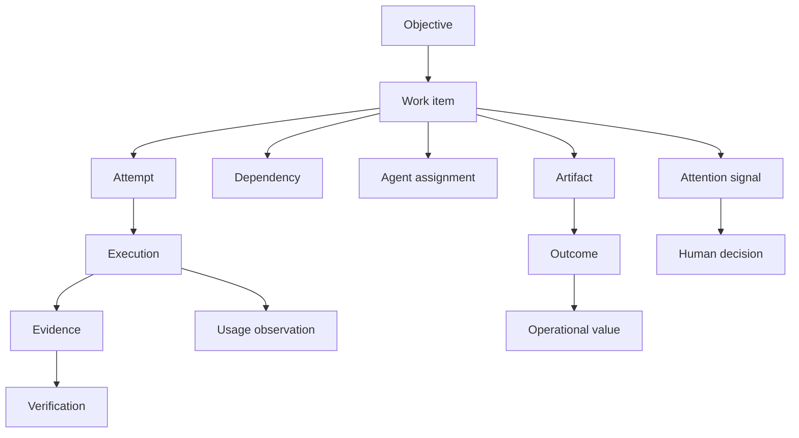

# Central Agentic Ops Dashboard Specification

**Version:** 1.0.0  
**Status:** Working Draft  
**Latest Version:** https://github.com/githubnext/gh-aw-cao/blob/main/specs/dashboard.md  
**Editors:** GitHub Next

## Abstract

This specification defines the product experience and information architecture for the Central Agentic Ops (CAO) dashboard, the central control surface for GitHub Agentic Workflows. The dashboard is designed for people who delegate consequential work to autonomous agents and need to decide what requires attention, understand the state and reason for each work item, take the correct next action, verify outcomes, and inspect evidence without first interpreting workflow-run telemetry. This specification defines a task-centered conceptual model, a progressive-disclosure navigation model, Home and detail-page requirements, human-attention semantics, outcome and operational-value presentation, fleet coordination, cost and capacity treatment, natural-language inquiry, personalization, accessibility, security, product telemetry, and compliance tests. It does not define workflow execution, control-plane authority, or the declarative dashboard file format.

## Status of This Document

This document is a Working Draft and may be updated, replaced, or made obsolete. It is intended for implementation and user-research feedback. Working Draft publication does not imply endorsement by a standards body.

Sections 2 and 4 through 20 are normative. Section 1, Section 3, examples, rationales, references, and appendices identified as informative are non-normative unless they contain an explicit normative requirement.

The GitHub Next project maintains this document. Version numbers follow Semantic Versioning. A breaking change to a normative dashboard contract increments the major version; a backward-compatible capability increments the minor version; and a clarification or editorial correction increments the patch version.

## Table of Contents

1. [Introduction](#1-introduction)
2. [Conformance](#2-conformance)
3. [External Evidence and Design Rationale](#3-external-evidence-and-design-rationale)
4. [Conceptual Model](#4-conceptual-model)
5. [Information Architecture](#5-information-architecture)
6. [Global Dashboard Shell](#6-global-dashboard-shell)
7. [Home Command Surface](#7-home-command-surface)
8. [Operational Attention](#8-operational-attention)
9. [Work Inventory and Work Detail](#9-work-inventory-and-work-detail)
10. [Outcomes and Operational Value](#10-outcomes-and-operational-value)
11. [Agents and Coordination](#11-agents-and-coordination)
12. [Evidence and Provenance](#12-evidence-and-provenance)
13. [Insights, Cost, and Capacity](#13-insights-cost-and-capacity)
14. [Ask CAO](#14-ask-cao)
15. [Domain Adaptation and Personalization](#15-domain-adaptation-and-personalization)
16. [Data Quality, Freshness, and Uncertainty](#16-data-quality-freshness-and-uncertainty)
17. [Presentation, Interaction, Responsive Design, and Accessibility](#17-presentation-interaction-responsive-design-and-accessibility)
18. [Security, Privacy, and Governance](#18-security-privacy-and-governance)
19. [Product Telemetry and Success Measures](#19-product-telemetry-and-success-measures)
20. [Compliance Testing](#20-compliance-testing)
21. [References](#21-references)
22. [Appendices](#22-appendices)
23. [Change Log](#23-change-log)

---

## 1. Introduction

### 1.1 Purpose

CAO centrally governs agentic workflow packages that may discover, analyze, and produce declared safe outputs for many repositories. The dashboard provides the human operating surface for that system. Its primary purpose is not to report that automation ran. Its purpose is to help an authorized operator make a sound decision about autonomous work.

The dashboard is successful when an operator can answer, in order:

1. What needs human attention now?
2. What meaningful work is in progress?
3. Why is each work item in its current state?
4. What is expected to happen next, and who owns that step?
5. What outcome was produced, and was it independently verified or accepted?
6. Is autonomous work recovering and progressing without unnecessary human rescue?
7. Is evidence complete and current enough to support these conclusions?
8. Are measured resources, budgets, and capacity sufficient for authorized work?

### 1.2 Scope

This specification covers:

- the CAO dashboard's conceptual and presentation models;
- the Home, Work, Agents, Evidence, and Insights information architecture;
- attention ranking and autonomous-recovery suppression;
- work state, reason, waiting-on, and next-action semantics;
- separation of runtime status, verification, outcome, and operational value;
- progressive disclosure from work to executions and provenance;
- coordination, dependency, conflict, and handoff presentation;
- conditional cost, AI Credit, quota, and capacity presentation;
- evidence-grounded natural-language inquiry;
- domain vocabulary and role emphasis;
- data-quality, uncertainty, accessibility, security, and privacy behavior; and
- conformance and compliance testing.

This specification does not cover:

- CAO rollout authority, target authority, or credential semantics;
- GitHub Agentic Workflows source syntax or compilation;
- data collection or storage architecture;
- the Dashboard Language document grammar;
- a universal operational-value definition;
- a universal anomaly, risk, autonomy, or progress score; or
- autonomous execution of actions outside established CAO and gh-aw authority.

### 1.3 Design Goals

The dashboard is designed to:

1. organize information around delegated objectives and work items rather than runs;
2. show state, reason, and next action before execution detail;
3. make genuine human intervention obvious while keeping recoverable noise quiet;
4. separate observed facts, derived facts, annotations, inferences, and unknowns;
5. distinguish successful execution from verified and accepted outcomes;
6. expose evidence and provenance through one-step drill-down;
7. preserve domain meaning without creating a different product for each persona;
8. make high-consequence, low-frequency work visible without equating frequency with risk;
9. keep healthy systems calm and make unhealthy systems explain themselves;
10. support desktop and narrow-screen decisions without information loss; and
11. remain useful when optional cost, capacity, outcome, or correlation telemetry is absent.

### 1.4 Core Principle

> At a glance: work, state, reason, and next action. On demand: evidence, provenance, execution, and full trace.

Activity is supporting evidence. Activity alone is not progress, success, outcome, or value.

---

## 2. Conformance

### 2.1 Requirements Notation

> The key words "MUST", "MUST NOT", "REQUIRED", "SHALL", "SHALL NOT", "SHOULD", "SHOULD NOT", "RECOMMENDED", "NOT RECOMMENDED", "MAY", and "OPTIONAL" in this document are to be interpreted as described in [RFC 2119](https://www.ietf.org/rfc/rfc2119.txt).

Requirement identifiers are stable across revisions and are assigned in order of addition, so the identifiers within a subsection are not necessarily contiguous. An identifier is never reused or renumbered once published.

### 2.2 Conformance Classes

This specification defines four conformance classes:

1. **Conforming data provider:** supplies dashboard entities, observations, associations, and data-quality metadata without fabricating unavailable values.
2. **Conforming presenter:** renders the dashboard information architecture and preserves the semantic distinctions defined by this specification.
3. **Conforming interaction provider:** supplies actions, filters, inquiry, personalization, or other interactive behavior while preserving authorization and evidence requirements.
4. **Conforming test suite:** exercises every normative requirement applicable to a claimed class and level.

### 2.3 Compliance Levels

| Level | Name | Required capability |
| --- | --- | --- |
| 1 | Core Orientation | Global shell, Home, attention, work inventory, work detail, evidence, explicit data states, security, and accessibility. |
| 2 | Operational Control | Level 1 plus outcomes, operational value when available, agents, coordination, domain adaptation, and measured Insights. |
| 3 | Assisted Control | Level 2 plus Ask CAO, role emphasis, qualified forecasting, and qualified anomaly analysis. |

- **CAOD-CONF-001:** A conformance claim **MUST** identify the conformance class, this specification version, implementation version, claimed compliance level, and test-suite result.
- **CAOD-CONF-002:** A conforming implementation **MUST** satisfy every `MUST` and `MUST NOT` requirement applicable to its class and claimed level.
- **CAOD-CONF-003:** A Level 2 implementation **MUST** satisfy Level 1. A Level 3 implementation **MUST** satisfy Levels 1 and 2.
- **CAOD-CONF-004:** An implementation that omits an optional capability **MAY** identify supported requirements, but **MUST NOT** claim a level that requires the omitted capability.
- **CAOD-CONF-005:** A conformance claim **MUST NOT** imply conformance to the CAO Control Architecture, Dashboard Language, or Operational Observability Visualization specifications unless those claims are independently tested.

---

## 3. External Evidence and Design Rationale

_This section is informative._

The studies summarized here were conducted independently from CAO using public third-party datasets. They did not study the CAO product, its deployments, or its users. This section records why certain design hypotheses were carried into the specification; it does not make the datasets or their derived taxonomies part of the normative dashboard contract.

### 3.1 Independent Agent-Session Study

An independent agent-session study normalized 15,268 sessions and 1,520,873 events from public software-engineering, multi-agent, human-agent, and web-interaction corpora. None of these sessions was a CAO session. Counts characterize only the acquired corpora and do not establish CAO behavior, CAO user needs, or production prevalence.

The strongest dashboard findings were:

| Finding | Evidence | Design consequence |
| --- | ---: | --- |
| Runtime terminal status and available evaluation disagreed | 1,143 sessions; 1 dataset | Present runtime, verification, and outcome separately. |
| A failure was followed by autonomous recovery without observed human action | 3,327 sessions; 2 datasets | Suppress resolved transient failures from active attention. |
| Post-initial human messages or explicit confirmation actions occurred | 2,251 sessions; 1 dataset | Treat explicit human requests as first-class attention. |
| Merge conflict or rejected confirmation was recorded | 1,396 sessions; 2 datasets | Expose active coordination conflicts with affected work. |
| Explicit verification evidence and source pointers were available | 4,964 sessions; 3 datasets | Keep evidence inspectable on work detail. |
| Communication and confirmation formed an observable waiting phase | 15,172 events; 2 datasets | Summarize waits on Home; retain raw communication in detail. |
| No corpus supplied calibrated percent-complete | 1,520,873 events; 4 datasets | Use phase and evidence unless a valid denominator exists. |
| Credits and capacity were absent; usable cost was not established | All studied corpora | Treat cost and capacity as conditional product telemetry. |

The study could not reliably validate structured `blocked-reason`, `waiting-on`, `dependency`, or `next-action` fields. Section 19 therefore treats these as product hypotheses requiring CAO telemetry and user validation rather than claiming that the external traces already provide or validate them.

### 3.2 Independent GitHub Work-Population Study

An independent work-population study analyzed 30,318,774 public GitHub issue and pull-request threads from 1,474,876 repositories at dataset revision `60317859e1212d37268e2b55e31acd2aecd4ae52`. The corpus did not identify CAO users, observe agent execution, or validate dashboard personas.

The study supports the following design conclusions:

- real GitHub work spans software, documentation, operations, data, security, science, hardware, governance, and other domains;
- documentation/content, feature/change, bug/correctness, and incident/operations work all have material populations;
- low-frequency domains can contain high-consequence work and must not be hidden by prevalence alone;
- overlapping job titles cannot be reliably distinguished from issue and pull-request text, so role emphasis should adapt one shared information model rather than create separate sources of truth; and
- Agentic Operations personas, runtime behavior, model use, intervention, cost, and fleet state are not testable from that corpus.

All 216 seed persona hypotheses were evaluated only at family-level population resolution: 173 were classified as population supported with workflow hypotheses unverified, 33 as partially supported, and 10 as not testable. These classifications do not establish that any represented contributor has a given occupation or would use CAO. The 319 rare or high-consequence scenarios are review candidates, not a calibrated risk model. Human validation of the candidate taxonomy remains pending.

### 3.3 Evidence Boundary

The studies do not establish CAO personas, CAO workflows, production alert thresholds, a universal progress percentage, a universal autonomy score, dollar-cost forecasts, capacity runway, or causal benefits of multi-agent execution. Requirements informed by these studies remain product hypotheses until evaluated with representative CAO users and deployments. This specification therefore requires disclosed policy, complete telemetry, qualified baselines, and product evaluation before presenting those claims.

### 3.4 Design Synthesis

The external evidence motivated one shared task-centered dashboard hypothesis with progressive disclosure:

```text
Attention -> Work -> State + Reason + Next action -> Evidence -> Outcome
												 |
												 +-> Agents + Dependencies + Executions + Usage
```

Candidate persona and domain evidence may inform labels, filters, consequence context, and default emphasis after validation. It does not change the underlying truth model and is not a normative product taxonomy.

---

## 4. Conceptual Model

### 4.1 Entities

| Entity | Definition |
| --- | --- |
| Objective | A human-readable intended result, bounded by scope and acceptance criteria. |
| Work item | The stable unit through which one objective is assigned, tracked, reviewed, and concluded. |
| Attempt | One bounded effort to advance a work item. An attempt may contain one or more executions. |
| Execution | One workflow or agent run. Executions are implementation evidence beneath work. |
| Agent assignment | An observed assignment of an agent, worker, or team to a work item or attempt. |
| Dependency | A work item, repository object, resource, person, policy gate, or external condition that constrains progress. |
| Attention signal | One unresolved, independently interpretable reason that an authorized human may need to act or investigate. |
| Evidence | An observation or artifact supporting a state, reason, verification result, outcome, or decision. |
| Decision | A recorded human or automated disposition with actor, time, authority, and supporting evidence. |
| Artifact | A durable output produced by work, including a report, issue, pull request, patch, measurement, or deployment record. |
| Outcome | The observed disposition or real-world result of an artifact or work item, distinct from execution success. |
| Operational value | Absolute attainment under a named, versioned, evidence-bound definition. |
| Usage observation | A measured resource quantity such as AI Credits, tokens, requests, compute, or estimated currency. |
| Capacity observation | A measured ability to continue work, such as quota remaining or admitted budget. |

### 4.2 Relationships



### 4.3 Identity and Association Requirements

- **CAOD-MODEL-001:** A work item **MUST** have a stable identity that remains unchanged across retries, agents, executions, artifacts, and state transitions.
- **CAOD-MODEL-002:** A work item **MUST** identify its objective, accountable owner when known, applicable repository or scope, domain or work type when declared, current lifecycle state, current phase, and last observation time.
- **CAOD-MODEL-003:** An execution **MUST NOT** be presented as a work item unless one execution is explicitly the complete unit of delegated work.
- **CAOD-MODEL-004:** An execution, agent, dependency, artifact, outcome, and usage observation **MUST** join a work item only through an explicit stable identifier or an authoritative source association.
- **CAOD-MODEL-005:** Temporal proximity, similar names, shared repositories, or declared topology alone **MUST NOT** establish a causal or ownership association.
- **CAOD-MODEL-006:** A missing association **MUST** remain `unknown` or `unattributed`; it **MUST NOT** be assigned to the nearest plausible work item.

### 4.4 Independent State Axes

The following axes are distinct:

| Axis | Canonical values |
| --- | --- |
| Work lifecycle | `proposed`, `active`, `waiting`, `blocked`, `review`, `completed`, `cancelled`, `unknown` |
| Current phase | `queued`, `investigating`, `editing`, `executing`, `verifying`, `coordinating`, `waiting`, `reviewing`, `unknown` |
| Runtime status | `queued`, `in-progress`, `completed`, `unknown` |
| Runtime conclusion | `success`, `failure`, `cancelled`, `timed-out`, `action-required`, `neutral`, `skipped`, `stale`, `startup-failure`, `unknown` |
| Verification | `pass`, `fail`, `error`, `pending`, `unavailable` |
| Outcome | `accepted`, `rejected`, `ignored`, `pending`, `lifecycle`, `lifecycle-close`, `unknown` |
| Maturity | `immature`, `mature`, `expired`, `unknown` |

- **CAOD-MODEL-007:** A data provider and presenter **MUST** preserve the state axes in Section 4.4 independently.
- **CAOD-MODEL-008:** Runtime `success` **MUST NOT** imply verification `pass`, outcome `accepted`, work lifecycle `completed`, or operational value attained.
- **CAOD-MODEL-009:** Work lifecycle `completed` **MUST** identify the completion criterion or source disposition on which it is based.
- **CAOD-MODEL-010:** A presenter **MAY** show one concise primary state, but the primary state **MUST** link to or disclose the independent source states from which it was selected.

### 4.5 State, Reason, and Next Action

The dashboard's minimum work summary is:

```text
WHAT:  Fix authentication bypass
STATE: Verifying
WHY:   3 of 5 required checks passed; security review pending
NEXT:  Security reviewer approves or requests changes
```

- **CAOD-MODEL-011:** Every active, waiting, blocked, or review work item **MUST** expose a concise current reason or explicitly state that the reason is unavailable.
- **CAOD-MODEL-012:** Every active, waiting, blocked, or review work item **MUST** expose a next action or explicitly state that no next action has been determined.
- **CAOD-MODEL-013:** A next action **MUST** identify an action verb, expected actor or system, target, and applicable destination or evidence link when known.
- **CAOD-MODEL-014:** A waiting or blocked work item **MUST** identify the `waiting-on` entity and start time when available.
- **CAOD-MODEL-015:** A reason, next action, or waiting-on value inferred rather than directly supplied **MUST** be labeled `inferred` and identify the derivation rule.

---

## 5. Information Architecture

### 5.1 Primary Navigation

The primary navigation is:

1. **Home:** orientation and intervention;
2. **Work:** complete objective and work-item inventory;
3. **Agents:** assignments, coordination, health, and capacity;
4. **Evidence:** verification, findings, artifacts, decisions, and provenance; and
5. **Insights:** outcomes, operational value, effectiveness, cost, capacity, and longer-horizon analysis.

Settings, Help, dashboard freshness, and identity controls are global utilities, not primary operational destinations.

- **CAOD-IA-001:** A Level 1 presenter **MUST** provide Home, Work, and Evidence destinations.
- **CAOD-IA-002:** A Level 2 presenter **MUST** additionally provide Agents and Insights destinations.
- **CAOD-IA-003:** Primary navigation **MUST** preserve the distinctions between attention, operational investigation, and analytical exploration.
- **CAOD-IA-004:** Run, log, prompt, model, tool-call, and token views **MUST** be subordinate detail destinations rather than the default Home experience.
- **CAOD-IA-005:** A detail route **MUST** preserve a navigable relationship to its parent work item, agent, evidence object, or insight.
- **CAOD-IA-006:** A presenter **MUST** preserve scope, time, and applicable filter state when navigating from a summary to supporting detail.

### 5.2 Progressive Disclosure Levels

| Level | Primary content |
| --- | --- |
| 1. Home | Attention, work, state, reason, next action, outcome pulse, operational pulse. |
| 2. Work detail | Objective, phase, assignments, dependencies, evidence, artifacts, decisions, risk, and attributed usage. |
| 3. Execution detail | Runs, steps, tool calls, models, retries, logs, environment, and raw usage. |
| 4. Provenance | Inputs, commits, policy revision, target authority, model, tools, evidence cutoff, approver, and subsequent changes. |

- **CAOD-IA-007:** Each page **MUST** expose no more than four essential information regions on initial presentation.
- **CAOD-IA-008:** Supplemental regions **MUST** remain discoverable behind user-operated disclosure and **MUST NOT** be omitted from keyboard or assistive-technology access when expanded.
- **CAOD-IA-009:** An analytical Insights view **MUST** begin with one visual or ranked summary that directly answers its stated primary operator question. A conventional statistical chart such as a pie, line, histogram, or swimlane chart **SHOULD** be used for trends, distributions, and comparisons. A semantic visualization as defined in Section 17.1 **MAY** be used for lifecycle, provenance, coordination, attribution, or maturity questions. Home and entity-detail pages **MAY** begin with a ranked list or state summary when that form better supports the primary task.
- **CAOD-IA-010:** A page **MUST NOT** add a chart or semantic visualization when the available evidence cannot support a meaningful comparison, trend, distribution, categorical history, or structural relationship.

---

## 6. Global Dashboard Shell

### 6.1 Required Elements

The shell contains:

- product identity;
- current organization, control repository, and effective scope;
- primary navigation;
- global search;
- data `as-of` time, freshness, and completeness;
- active rollout-mode context when applicable;
- user identity and authorization context; and
- access to Settings and Help.

- **CAOD-SHELL-001:** The shell **MUST** show the effective organization or repository scope on every page.
- **CAOD-SHELL-002:** The shell **MUST** expose data `as-of`, freshness, and completeness without requiring navigation to a diagnostics page.
- **CAOD-SHELL-003:** A `Live` label **MUST** mean that updates are streamed or refreshed within a disclosed bound. It **MUST NOT** mean merely that the page is connected to a network.
- **CAOD-SHELL-004:** Global search **MUST** distinguish navigational results from natural-language answers and from executable actions.
- **CAOD-SHELL-005:** Search results **MUST** respect the current user's repository authorization and dashboard scope.
- **CAOD-SHELL-006:** The shell **MUST NOT** display a healthy global status when a required source is unavailable, partial, stale beyond policy, or unknown.

### 6.2 Scope and Time

- **CAOD-SHELL-007:** Every page **MUST** expose its effective scope and time interval.
- **CAOD-SHELL-008:** Time intervals **MUST** identify exact start and exclusive end timestamps in detail, even when a concise label such as `Last 7 days` is shown.
- **CAOD-SHELL-009:** Filters with a stable representation **SHOULD** be encoded in the URL and restored on reload and shared navigation.
- **CAOD-SHELL-010:** A filter change **MUST** update all dependent summaries or explicitly identify regions that use a different fixed scope.

---

## 7. Home Command Surface

### 7.1 Purpose

Home is an operational command surface, not a marketing page and not an exhaustive monitoring dashboard. It answers what requires attention and what autonomous work is doing now.

### 7.2 Required Initial Regions

Home contains, in this order:

1. **Need attention:** unresolved items requiring action or investigation;
2. **Work in progress:** a bounded list of meaningful work items;
3. **Outcomes:** recent accepted, rejected, pending, or otherwise classified results; and
4. **Operational pulse:** directly observed autonomy, evidence, cost, and capacity facts.

Ask CAO and new-work controls are commands subordinate to these regions and do not count as additional information regions.

- **CAOD-HOME-001:** Home **MUST** place unresolved attention before normal activity, outcomes, aggregate health, cost, and launch controls in reading and focus order.
- **CAOD-HOME-002:** The first viewport **MUST** expose the highest-ranked attention item and at least one current work item when each exists.
- **CAOD-HOME-003:** Home **MUST NOT** require an operator to interpret a chart before discovering that work is waiting for human action.
- **CAOD-HOME-004:** Home **MUST** show work items rather than raw workflow runs as the primary row grain.
- **CAOD-HOME-005:** Each Home work row **MUST** expose work identity, repository or scope, current phase or lifecycle state, reason, next action, and accountable owner when known.
- **CAOD-HOME-006:** Home **MUST** summarize communication waits and **MUST NOT** expose raw conversation or prompt content by default.
- **CAOD-HOME-007:** Home **MUST NOT** show raw run history, token graphs, tool-call counts, full audit logs, dense dependency graphs, model-comparison charts, or repository rankings as essential regions.
- **CAOD-HOME-008:** A presenter **SHOULD** limit each Home list to the five highest-priority or most-recent relevant rows and provide an explicit route to the complete inventory.

### 7.3 Operational Pulse

The operational pulse may include directly observed counts such as active work, waiting for humans, stalled work, verification failures, accepted outcomes, measured AI Credits, or quota status.

Home may also present recent meaningful changes: a bounded set of state-changing events, distinct from an activity feed, that answers what changed since the operator last looked.

- **CAOD-HOME-009:** The operational pulse **MUST** preserve runtime, verification, outcome, operational-value, evidence-quality, budget, and capacity dimensions separately.
- **CAOD-HOME-010:** Home **MUST NOT** present an opaque composite autonomy, health, risk, value, or efficiency score as the primary explanation of system state.
- **CAOD-HOME-011:** When a composite indicator is present, its definition, components, window, and unavailable inputs **MUST** be inspectable, and the component reasons **MUST** be more prominent than the score.
- **CAOD-HOME-012:** Home **MUST NOT** reserve persistent cost or capacity regions when neither an applicable policy nor usable telemetry exists. When present and within policy, cost and capacity **SHOULD** remain compact; an applicable threshold breach **MUST** become an attention item.
- **CAOD-HOME-016:** Home **MAY** present recent meaningful changes as a subregion of Work in progress or Operational pulse, or as a collapsible supplemental surface. It **MUST NOT** become a fifth essential region and **MUST NOT** displace the four required regions of Section 7.2.
- **CAOD-HOME-017:** When present, recent meaningful changes **MUST** be limited to state-changing events such as attention recovered or resolved, a newly accepted or rejected outcome, a verification result change, a handoff, an ownership change, a lifecycle or phase transition, or evidence degradation. Routine execution activity, ordinary agent messages, and unchanged status **MUST NOT** appear.
- **CAOD-HOME-018:** Each recent meaningful change **MUST** identify the affected work or scope, what changed, the observation time, the evidence class, and a route to the supporting evidence.

### 7.4 Healthy and Empty States

- **CAOD-HOME-013:** When no unresolved attention signals exist, Home **MUST** render a positive empty state and identify the evaluated signal classes and effective time interval.
- **CAOD-HOME-014:** A positive empty state **MUST NOT** claim that all systems are healthy when required evidence is partial, stale, unavailable, or unknown.
- **CAOD-HOME-015:** When no work is active, Home **SHOULD** summarize recently completed work and present new-work controls without using warning treatment.

---

## 8. Operational Attention

### 8.1 Attention Eligibility

An attention signal is eligible only when it is unresolved and one of the following applies:

- an authorized human action is explicitly requested;
- verification failed, errored, or contradicts runtime success;
- a policy, security, safety, or authority gate blocks work;
- a dependency or capacity condition blocks progress;
- work exceeded a disclosed stall threshold;
- an unresolved coordination conflict requires interpretation;
- repeated failure exceeded a disclosed retry policy;
- evidence required for a decision is missing, stale, partial, or unattributed;
- an applicable budget, quota, or capacity threshold is breached; or
- a declared high-consequence condition requires review.

Observable autonomous recovery exists only when exact correlation links the failure to a subsequent successful retry or substitute completion, required verification has passed or is not applicable, no human intervention is observed, and no unresolved consequence remains.

- **CAOD-ATTN-001:** Every attention signal **MUST** identify its signal type, affected work or scope, evidence statement, current reason, required or recommended action, expected actor, age, and investigation target.
- **CAOD-ATTN-002:** An informational event, routine completion, healthy execution, ordinary agent message, or generic warning without an action or investigation target **MUST NOT** appear in Need attention.
- **CAOD-ATTN-003:** A failure followed by observable autonomous recovery as defined in Section 8.1 **MUST NOT** remain an active attention item unless the recovery violated a policy or exhausted a threshold.
- **CAOD-ATTN-004:** A recovered failure **MAY** remain visible in work history or Insights and **MUST** be labeled resolved or recovered.
- **CAOD-ATTN-005:** Runtime success with failed or errored verification **MUST** produce a verification attention signal when unresolved.
- **CAOD-ATTN-006:** A coordination conflict **MUST** identify affected work and whether it is active, recovered, or waiting for human disposition.

### 8.2 Ranking

The default ranking is lexicographic, not a hidden weighted score:

1. immediate policy, security, safety, or unauthorized-live-work condition;
2. explicit human action with a due time or blocked dependent work;
3. failed or contradictory verification;
4. unrecovered failure, blocked dependency, or disclosed stall;
5. incomplete authority, provenance, attribution, or required evidence;
6. applicable budget, quota, or capacity breach;
7. unresolved coordination conflict not already ranked above; and
8. lower-urgency investigation signal.

Ties are ordered by declared consequence tier, due time, affected scope, age, and stable signal identity.

- **CAOD-ATTN-007:** A presenter **MUST** use and disclose a deterministic attention ordering rule.
- **CAOD-ATTN-008:** A presenter **MUST NOT** rank attention solely by frequency, model-generated severity, or an undisclosed composite score.
- **CAOD-ATTN-009:** Low-frequency work with a declared high consequence **MUST** remain eligible for high priority.
- **CAOD-ATTN-010:** A model-generated risk or severity label **MUST** be identified as an inference and **MUST NOT** override a direct policy or verification state without an explicit rule.

### 8.3 Action Behavior

- **CAOD-ATTN-011:** Activating an attention row **MUST** navigate directly to the reason action or evidence is required, not to the beginning of an undifferentiated run log.
- **CAOD-ATTN-012:** When exactly one safe action is available and the user is authorized, the row **SHOULD** expose that action directly.
- **CAOD-ATTN-013:** An action **MUST** show target, mode, expected effect, authority basis, and whether confirmation is required before execution.
- **CAOD-ATTN-014:** Dismissal **MUST NOT** resolve the underlying signal. A dismissal **MUST** record actor, time, scope, and rationale and remain distinct from resolution.
- **CAOD-ATTN-015:** The highest-ranked attention signal **SHOULD** initially expose its current reason, requested or recommended action, expected actor, and investigation target without requiring disclosure. Lower-ranked signals **MAY** use compact rows, provided the same fields remain reachable through one interaction.
- **CAOD-ATTN-016:** Presenting attention with additional initial detail for the highest-ranked signal **MUST NOT** change the deterministic ordering rule of Section 8.2 or suppress lower-ranked signals from the ranked list.

---

## 9. Work Inventory and Work Detail

### 9.1 Work Inventory

The Work page is the complete operational inventory. It supports filters for lifecycle state, phase, owner, repository, organization, domain, work type, workflow, package, risk or consequence tier, agent, age, outcome, verification, rollout mode, and attributed usage when those dimensions are available.

- **CAOD-WORK-001:** The default Work view **MUST** group or list by work item and **MUST NOT** default to one row per execution.
- **CAOD-WORK-002:** Each work row **MUST** expose `what`, `state`, `reason`, and `next action`; it **SHOULD** expose scope, owner, current assignments, waiting-on, and latest evidence time.
- **CAOD-WORK-003:** A presenter **MUST** label missing reason, next action, owner, or waiting-on values as unavailable rather than omitting the field in a way that implies none exists.
- **CAOD-WORK-004:** Work filtering, sorting, and grouping **MUST** preserve stable work identity and **MUST NOT** duplicate one work item because it has multiple executions or agents.
- **CAOD-WORK-005:** Completed and cancelled work **MUST** be excluded from the default active view but remain available through filters and direct links.

### 9.2 Progress

- **CAOD-WORK-006:** A presenter **MUST** represent progress as current phase plus observed evidence by default.
- **CAOD-WORK-007:** A percentage **MUST NOT** be shown unless an authoritative source-defined denominator, numerator, measurement time, definition revision, and interpretation are available and the measure is meaningful for the work type.
- **CAOD-WORK-008:** A percentage derived from elapsed steps, tool calls, tokens, turns, or estimated effort **MUST NOT** be labeled percent complete.
- **CAOD-WORK-009:** When a valid denominator exists, the presenter **MUST** expose it, its authoritative source, and its definition revision, such as `3 of 5 required validations passed under verification plan v2`.
- **CAOD-WORK-010:** Phase regression, such as `verifying -> investigating`, **MUST** be represented as an observed transition and **MUST NOT** automatically be labeled lost progress or failure.

### 9.3 Work Detail

The initial Work detail view contains no more than four essential regions:

1. objective and current decision summary;
2. state timeline with reason and transitions;
3. evidence and verification summary; and
4. next action, dependencies, assignments, and accountable owner.

Artifacts, decisions, executions, prompts, tool calls, models, logs, retries, environment, and usage are supplemental or subordinate views.

- **CAOD-WORK-011:** Work detail **MUST** expose objective, scope, acceptance criteria when declared, lifecycle state, phase, reason, next action, owner, and latest observation time.
- **CAOD-WORK-012:** Work detail **MUST** expose state history with source timestamps and the evidence or event responsible for each transition.
- **CAOD-WORK-013:** Work detail **MUST** distinguish directly observed transitions from derived or inferred transitions.
- **CAOD-WORK-014:** Work detail **MUST** expose dependencies and identify whether each dependency is pending, satisfied, failed, unavailable, or unknown.
- **CAOD-WORK-015:** Work detail **MUST** expose all attributed attempts and executions without treating an unattributed execution as part of the work item.
- **CAOD-WORK-016:** A work item with contradictory evidence **MUST** preserve the contradiction and provide a comparison route; it **MUST NOT** silently select one conclusion.
- **CAOD-WORK-017:** A state timeline **MUST** preserve phase and lifecycle regressions in their observed order and **MUST NOT** present history as a forward-only completion sequence.
- **CAOD-WORK-018:** The evidence or event responsible for a transition **MUST** be directly inspectable from the transition in the timeline, without first navigating to an undifferentiated execution log.
- **CAOD-WORK-019:** Waiting, blocked, and in-phase periods **MUST** remain visible as intervals with a start time and either an end time or an explicit ongoing state; they **MUST NOT** be reduced to instantaneous events.
- **CAOD-WORK-020:** An interval during which observation was unavailable **MUST** appear visibly discontinuous from observed intervals and **MUST NOT** be interpolated, bridged, or rendered as a continuation of the preceding state.
- **CAOD-WORK-021:** A state timeline **MUST** distinguish directly observed transitions from derived or inferred transitions in a way that does not depend on color alone.

---

## 10. Outcomes and Operational Value

### 10.1 Outcome Semantics

- **CAOD-OUT-001:** A presenter **MUST** distinguish activity, artifact creation, runtime conclusion, verification, outcome, and operational value.
- **CAOD-OUT-002:** A run count, dispatch count, generated suggestion, opened issue, or created pull request **MUST NOT** be labeled an outcome unless the dashboard identifies the outcome definition used.
- **CAOD-OUT-003:** An outcome **MUST** identify the subject, outcome category, disposition, observation time, evidence source, and maturity when applicable.
- **CAOD-OUT-004:** An outcome summary **MUST** preserve pending, ignored, rejected, accepted, and unknown dispositions rather than reporting only favorable results.
- **CAOD-OUT-005:** Outcome vocabulary **SHOULD** use the active domain schema while preserving the canonical disposition.

Examples of domain labels include:

| Domain | Accepted outcome examples |
| --- | --- |
| Software | Pull request merged, regression fixed, release completed |
| Science | Experiment validated, finding reproduced, hypothesis rejected |
| Security | Finding verified, vulnerability remediated, threat ruled out |
| Infrastructure | Incident mitigated, deployment completed, service objective restored |
| Documentation | Guidance accepted, obsolete content removed, example verified |

### 10.2 Operational Value

- **CAOD-OUT-006:** Operational value **MUST** be presented only under a named, versioned definition with accepted evidence provenance, evidence cutoff, evaluator digest, maturity time, and maturity status.
- **CAOD-OUT-007:** Absolute attainment **MUST** remain distinct from an optional baseline delta.
- **CAOD-OUT-008:** Operational-value observations using different definitions **MUST NOT** be combined into one total or average.
- **CAOD-OUT-009:** Immature or missing evidence **MUST** produce `pending`, `immature`, or `unavailable`, not zero attainment.
- **CAOD-OUT-010:** Temporal association between a workflow and an outcome **MUST NOT** be presented as causal impact.

### 10.3 Home Outcomes Region

- **CAOD-OUT-011:** The Home outcomes region **MUST** use a disclosed time interval and link each aggregate to its underlying work and evidence.
- **CAOD-OUT-012:** Home **SHOULD** show no more than four domain-meaningful outcome categories.
- **CAOD-OUT-013:** When activity-to-outcome conversion is shown, numerator, denominator, eligible population, attribution coverage, and time interval **MUST** be available.
- **CAOD-OUT-014:** A trend comparison **MUST** identify the comparison interval and **MUST NOT** imply significance or causality without a qualified method.
- **CAOD-OUT-015:** A temporal outcome view **SHOULD** distinguish artifact produced, outcome observed, maturity reached, and value measured as separate stages with their own observation times.
- **CAOD-OUT-016:** Pending, immature, and unknown stages **MUST** remain visually and textually distinct from each other and from zero, rejected, and failed states.
- **CAOD-OUT-017:** A stage that has not been reached **MUST NOT** be rendered as reached, skipped, or complete; the view **MUST** identify the outcome definition and maturity policy under which the stages are evaluated.

---

## 11. Agents and Coordination

### 11.1 Agent Inventory

The Agents page answers who or what is assigned, what it is doing, whether it can proceed, and where coordination requires attention. It does not rank agents by raw activity by default.

- **CAOD-AGENT-001:** An agent row **MUST** identify agent or worker identity, current assignments, current observed state, last observation time, and applicable scope.
- **CAOD-AGENT-002:** Model, engine, tools, environment, utilization, retries, and attributed usage **MAY** be shown as supplemental facts and **MUST NOT** replace assignment and work context.
- **CAOD-AGENT-003:** An idle agent **MUST NOT** be labeled unhealthy solely because it has no assignment.
- **CAOD-AGENT-004:** Agent health **MUST** distinguish unavailable telemetry, execution failure, policy denial, waiting, idle, and healthy active work.

### 11.2 Coordination

- **CAOD-AGENT-005:** A coordination view **MUST** expose explicit assignments, handoffs, dependencies, conflicts, and aggregation events when observed.
- **CAOD-AGENT-006:** A handoff **MUST** identify source actor, destination actor, work item, time, and status when available.
- **CAOD-AGENT-007:** A conflict **MUST** preserve each conclusion and its supporting evidence until disposition.
- **CAOD-AGENT-008:** A presenter **MUST NOT** equate conflict with failure when autonomous or human resolution remains active.
- **CAOD-AGENT-009:** Declared package topology **MUST** remain visually and textually distinct from observed execution and coordination.
- **CAOD-AGENT-010:** A worker or output **MUST** join an episode only through exact correlation evidence, and attribution coverage **MUST** expose both numerator and eligible denominator.

### 11.3 Execution Maps

- **CAOD-AGENT-011:** An execution map **MUST** use one monotonic time axis and identify role, subject, duration, and state in text.
- **CAOD-AGENT-012:** Missing interval boundaries **MUST** appear unavailable and **MUST NOT** be rendered as zero-duration success.
- **CAOD-AGENT-013:** The term `critical path` **MUST** be used only when complete causal relationships establish the path; otherwise the view **MUST** use `execution shape`.
- **CAOD-AGENT-014:** An execution map **SHOULD** use a coordination-braid form that presents observed assignments, handoffs, dependencies, conflicts, and aggregation events across actors on one monotonic time axis.
- **CAOD-AGENT-015:** Observed relationships **MUST** be visually and textually distinguishable from declared package topology within the same view.
- **CAOD-AGENT-016:** A handoff, dependency, or conflict **MUST** be directly inspectable at its transition point, exposing source actor, destination actor, work item, time, and status or disposition when available.
- **CAOD-AGENT-017:** Selecting an actor or work item **SHOULD** highlight its related assignments, handoffs, dependencies, and conflicts while preserving the temporal context and the presence of unselected actors and intervals.
- **CAOD-AGENT-018:** A missing interval boundary **MUST** render as a gap or open end and **MUST NOT** be closed at the view boundary, the current time, or a neighboring event to fabricate a duration.

---

## 12. Evidence and Provenance

### 12.1 Evidence Classes

| Class | Meaning |
| --- | --- |
| Observed | Directly supplied by an authoritative source. |
| Derived | Deterministically computed from observed evidence. |
| Annotated | Assigned by a disclosed human, rule, or model classification process. |
| Inferred | Interpretive conclusion whose premises and method are disclosed. |
| Unsupported | Plausible information for which required evidence is absent. |

- **CAOD-EVID-001:** Every material dashboard claim **MUST** be associated with an evidence class, observation time, source identity, effective scope, and available provenance link.
- **CAOD-EVID-002:** Derived, annotated, and inferred claims **MUST** identify their method or definition and version.
- **CAOD-EVID-003:** Unsupported claims **MUST NOT** be presented as observations, metrics, status, or recommendations.
- **CAOD-EVID-004:** Confidence **MUST** identify what it measures and **MUST NOT** be presented as calibrated probability unless calibration evidence is available.
- **CAOD-EVID-005:** A presenter **MUST** preserve contradictory evidence, missing evidence, and minority agent conclusions.
- **CAOD-EVID-013:** When evidence materially disagrees about the same claim, a presenter **SHOULD** provide a side-by-side or split comparison that preserves each claim, its evidence class, its source identity and observation time, and its current disposition, including `unresolved`.
- **CAOD-EVID-014:** A comparison of disagreeing evidence **MUST NOT** present one side as authoritative unless a recorded disposition or an applicable disclosed rule establishes it, and it **MUST** identify that disposition or rule when it does.

### 12.2 Evidence Page

The Evidence page provides searchable access to verification results, graders, evaluations, findings, measurements, artifacts, decisions, contradictions, sources, and provenance.

- **CAOD-EVID-006:** Evidence records **MUST** be filterable by work item, repository, workflow, package, evidence class, verification result, source, time, and domain when those dimensions are available.
- **CAOD-EVID-007:** An evidence record **MUST** identify the claim or state it supports, contradicts, or leaves unresolved.
- **CAOD-EVID-008:** An artifact **MUST** link to its authoritative repository, issue, pull request, run, report, or external source when the association and URL are available.
- **CAOD-EVID-009:** A decision **MUST** identify actor, time, disposition, authority basis when applicable, rationale when supplied, and supporting evidence.
- **CAOD-EVID-010:** Raw logs and messages **MAY** be available from evidence detail but **MUST NOT** be the only representation of a material finding.

### 12.3 Provenance Chain

The preferred provenance chain is:

```text
Authority -> Objective -> Work item -> Execution -> Evidence -> Artifact -> Outcome -> Value
```

- **CAOD-EVID-011:** A presenter **MUST** expose each available link in the provenance chain without fabricating missing links.
- **CAOD-EVID-012:** Policy revision, workflow revision, target authority, input revision, model, engine, tools, evidence cutoff, and approver **SHOULD** be available at provenance depth when applicable.
- **CAOD-EVID-015:** A graphical provenance view **MUST** keep a missing link visually and textually distinguishable from an absent or not-applicable link.
- **CAOD-EVID-016:** Each provenance node and edge **SHOULD** disclose its source identity and observation time.
- **CAOD-EVID-017:** Selecting a provenance link **SHOULD** highlight the evidence that establishes the association, and an association without such evidence **MUST** be shown as unestablished.
- **CAOD-EVID-018:** A broken provenance chain **MUST NOT** be visually bridged, straightened, or otherwise completed; the discontinuity **MUST** remain apparent in the graphical form and in its textual equivalent.

---

## 13. Insights, Cost, and Capacity

### 13.1 Insights Structure

Insights contains longer-horizon analysis, including outcomes, operational value, intervention, recovery, bottlenecks, failure patterns, coordination, cost, capacity, and model or workflow effectiveness.

- **CAOD-INSIGHT-001:** An Insights view **MUST** state the operator question it answers, effective cohort, time interval, source completeness, and evidence class. A view containing derived values **MUST** also identify the derivation method and method version.
- **CAOD-INSIGHT-002:** Home-level summaries **MUST** link to the corresponding Insights investigation when one exists.
- **CAOD-INSIGHT-003:** Charts **MUST** expose a textual or tabular equivalent containing material values.
- **CAOD-INSIGHT-004:** A ranking **MUST** disclose its measure, denominator when applicable, missing-data treatment, and tie-breaking rule.

### 13.2 Distinct Resource Questions

The dashboard keeps these questions separate:

| Question | Required evidence |
| --- | --- |
| Budget: Are we spending more than authorized? | Applicable budget, aligned measurement window, complete measured usage. |
| Capacity: Can authorized work continue? | Current quota or admitted capacity, reset or replenishment model, fresh observations. |
| Efficiency: Are resources producing accepted outcomes? | Attributed usage, eligible work, mature outcomes, and explicit efficiency definition. |

- **CAOD-INSIGHT-005:** AI Credits, raw tokens, API requests, compute, and estimated currency **MUST** remain separate measures.
- **CAOD-INSIGHT-006:** A currency estimate **MUST** identify pricing source, version or date, covered usage, and exclusions.
- **CAOD-INSIGHT-007:** Missing usage **MUST NOT** be treated as zero.
- **CAOD-INSIGHT-008:** Resource usage **MUST** be attributed through explicit work, execution, or outcome associations.
- **CAOD-INSIGHT-009:** A cost-per-outcome metric **MUST** identify eligible usage, mature accepted outcomes, attribution coverage, and the treatment of rejected, pending, and missing outcomes.
- **CAOD-INSIGHT-010:** Retry, repeated execution, no-action output, or failed work **MUST NOT** be labeled waste without an explicit outcome and opportunity-cost model.
- **CAOD-INSIGHT-017:** When an attribution cascade or funnel is presented — for example eligible work, attributable executions, measured outcomes, mature outcomes, and measured value — each stage **MUST** expose its numerator, its eligible denominator, its missing or unattributed population, and its effective scope and time interval.
- **CAOD-INSIGHT-018:** A cascade **MUST NOT** silently drop a population between stages; work excluded by eligibility, missing attribution, or immature evidence **MUST** remain countable and inspectable at the stage where it left the cascade.

### 13.3 Budget, Forecast, and Anomaly Readiness

- **CAOD-INSIGHT-011:** A budget verdict **MUST** require an applicable budget, matching time interval, and complete measured usage for that interval.
- **CAOD-INSIGHT-012:** A runway forecast **MUST** identify current capacity, observed burn interval, replenishment or reset behavior, forecast method and version, parameters, and uncertainty.
- **CAOD-INSIGHT-013:** A rate-limit forecast **MUST NOT** cross a reset boundary or combine different credentials or quota resources.
- **CAOD-INSIGHT-014:** An anomaly label **MUST** require a representative comparable baseline and disclose cohort, lookback interval, sample count, method and version, parameters, and false-alarm interpretation.
- **CAOD-INSIGHT-015:** When a prerequisite is absent, the presenter **MUST** display `not evaluated` or `unavailable` and identify the missing prerequisite.
- **CAOD-INSIGHT-016:** A statistically unusual observation **MUST** remain distinct from a failure, policy breach, or required human action.

---

## 14. Ask CAO

### 14.1 Purpose

Ask CAO is an optional evidence-grounded inquiry and command surface. Example questions include:

```text
What needs me?
Why is this blocked?
What changed since yesterday?
Which work has failed verification?
Where are AI Credits going?
Why did these agents disagree?
Show the evidence for this outcome.
```

### 14.2 Answer Requirements

- **CAOD-ASK-001:** An answer **MUST** be limited to data the user is authorized to view and to the effective dashboard scope unless the user explicitly changes scope.
- **CAOD-ASK-002:** Every factual answer **MUST** identify its effective scope, time interval, data `as-of` time, and supporting evidence links.
- **CAOD-ASK-003:** An answer **MUST** distinguish observed, derived, annotated, inferred, and unavailable content.
- **CAOD-ASK-004:** Ask CAO **MUST NOT** invent a reason, next action, causal relationship, cost, progress percentage, or outcome when required evidence is absent.
- **CAOD-ASK-005:** When evidence is incomplete or contradictory, the answer **MUST** state what cannot be determined and provide the most relevant investigation route.
- **CAOD-ASK-006:** Suggested prompts **SHOULD** reflect the current page and selected work item without exposing hidden data in their labels.

### 14.3 Actions

- **CAOD-ASK-007:** A natural-language response **MUST NOT** itself grant authority or silently execute a repository write.
- **CAOD-ASK-008:** A proposed action **MUST** be rendered as a separate preview containing target, package or workflow, effective mode, expected change, authority basis, and evidence.
- **CAOD-ASK-009:** An action requiring confirmation **MUST** receive explicit confirmation after the preview and **MUST** be reauthorized at execution time.
- **CAOD-ASK-010:** User-supplied text, repository content, evidence, and model output **MUST** be treated as untrusted data and **MUST NOT** override system policy or action constraints.

---

## 15. Domain Adaptation and Personalization

### 15.1 Domain Schemas

The universal CAO model remains stable:

```text
Universal CAO model + domain schema + organization policy + user emphasis
```

A domain schema may define preferred labels for work, evidence, outcome, dependency, risk, and resource units.

- **CAOD-ADAPT-001:** Domain adaptation **MUST** preserve canonical identities, state axes, outcome dispositions, evidence classes, and provenance.
- **CAOD-ADAPT-002:** Domain labels **MUST NOT** change the underlying meaning of a state or measure.
- **CAOD-ADAPT-003:** An inferred domain or work type **MUST** identify its classifier or rule, version, confidence meaning, and `unknown` option.
- **CAOD-ADAPT-004:** A presenter **MUST NOT** infer a user's occupation, seniority, or persona from repository text or activity.
- **CAOD-ADAPT-005:** Rare or high-consequence work **MUST NOT** be hidden solely because its domain has low prevalence.

### 15.2 Role Emphasis

Role emphasis changes default ordering and visible supplemental information, not facts or authority.

| Emphasis | Default focus |
| --- | --- |
| Agentic engineer | Attention, active work, evidence, next action, capacity pulse |
| Reviewer | Waiting for me, risk, verification, evidence, approvals |
| Fleet operator | Failures, stalls, dependencies, agent state, quota and capacity |
| Manager | Outcomes, operational value, risk, intervention rate, spend |
| FinOps or platform owner | Budget, attributed usage, runway, efficiency readiness, capacity |

- **CAOD-ADAPT-006:** Personalization **MAY** change default filters, ordering, density, and supplemental visibility.
- **CAOD-ADAPT-007:** Personalization **MUST NOT** change source values, evidence class, severity, authorization, or the deterministic order of immediate safety and authority signals.
- **CAOD-ADAPT-008:** A user **MUST** be able to identify and reset active personalization.
- **CAOD-ADAPT-009:** Shared URLs **SHOULD** encode portable scope and filters but **MUST NOT** expose private personalization or hidden identifiers.

---

## 16. Data Quality, Freshness, and Uncertainty

### 16.1 Independent Data-State Axes

| Axis | Values |
| --- | --- |
| Availability | `available`, `empty`, `unavailable` |
| Completeness | `complete`, `partial`, `unknown` |
| Freshness | `fresh`, `stale`, `unknown` |

`empty` means a valid query returned no observations. `unavailable` means no usable result exists. Neither means zero unless the measured operation is a count over a valid empty selection.

For a derived region, required inputs are those declared by the measure definition. Availability is `unavailable` if any required input is unavailable, `empty` if every required input is empty, and otherwise `available`. Completeness is `unknown` if any required input has unknown completeness, `partial` if none is unknown and any is partial, and otherwise `complete`. Freshness is `stale` if any required input is stale, `unknown` if none is stale and any has unknown freshness, and otherwise `fresh`.

- **CAOD-DATA-001:** Every consumed source **MUST** provide source identity, source kind, `as-of`, retrieval time, coverage interval when known, completeness, freshness, and an optional provenance link.
- **CAOD-DATA-002:** Availability, completeness, and freshness **MUST** remain independent and visible at page or region level.
- **CAOD-DATA-003:** Derived summaries **MUST** apply the deterministic aggregation rules in Section 16.1 independently to each data-state axis and retain the provenance of contributing observations.
- **CAOD-DATA-004:** An unavailable result **MUST** identify the affected source and **MUST NOT** fabricate observations, links, zero values, or a previous value without a stale label.
- **CAOD-DATA-005:** A partial result **MUST** identify known missing scope or time coverage.
- **CAOD-DATA-006:** A stale result **MUST** retain and expose its original `as-of` time.
- **CAOD-DATA-007:** Unknown **MUST** remain distinct from false, zero, empty, healthy, failed, and not applicable.
- **CAOD-DATA-008:** A positive health, budget, capacity, outcome, or value claim **MUST NOT** be made when a required input is unavailable or unknown.
- **CAOD-DATA-012:** A graphical data-state summary, such as a source-by-axis quilt or matrix, **MAY** be used to survey many sources at once, but it **MUST NOT** collapse availability, completeness, and freshness into one combined `data health` color, state, or score.
- **CAOD-DATA-013:** A graphical data-state summary **MUST** identify the source and axis represented by each element and **MUST** provide a textual equivalent for the same values.

### 16.2 Thresholds

- **CAOD-DATA-009:** Stall, age, risk, budget, capacity, and freshness thresholds **MUST** be versioned, attributable to organization policy or a disclosed default, and inspectable.
- **CAOD-DATA-010:** A threshold **MUST** be evaluated only against a compatible measure and time interval.
- **CAOD-DATA-011:** Changing a threshold **MUST NOT** rewrite historical observations; the dashboard **SHOULD** preserve the policy version used for each derived signal.

---

## 17. Presentation, Interaction, Responsive Design, and Accessibility

### 17.1 Semantic Visualization Primitives

A semantic visualization is a graphical form whose structure encodes operational meaning — lifecycle, provenance, coordination, attribution, or maturity — rather than a statistical distribution, trend, or magnitude comparison. The following primitives are named intents, not layouts, geometries, or style rules. A conforming presenter **MAY** implement them in any visual form that preserves the required distinctions and interactions.

| Primitive | Intent | Dimensions that MUST remain distinct | Interactions that MUST be exposed |
| --- | --- | --- | --- |
| Truth rail | Show the independent truth axes of one subject side by side instead of one merged verdict. | Work lifecycle, current phase, runtime status and conclusion, verification, outcome, and maturity, each including `unknown`, `pending`, and `unavailable` values. | Disclose the source, observation time, and evidence for each axis. |
| State ribbon | Show one work item's observed state history as a continuous interval history. | Phase, lifecycle state, waiting intervals, unavailable intervals, and observed versus inferred transitions. | Inspect the evidence or event responsible for each transition and read exact transition timestamps. |
| Attention stack | Present ranked unresolved attention so the most consequential signal is understood first. | Rank position, signal type, age, expected actor, and resolution status. | Expand any signal to its full attention record and navigate to its investigation target. |
| Provenance spine | Show the chain from authority to value for one subject. | Present links, missing links, and not-applicable links. | Select a link to reveal the evidence establishing that association, its source, and its observation time. |
| Coordination braid | Show observed multi-actor execution and its handoffs, dependencies, conflicts, and aggregation events over one monotonic time axis. | Declared topology versus observed relationships, actor identity, interval boundaries, and unknown boundaries. | Inspect a handoff, dependency, or conflict at its transition point and highlight the relationships of a selected actor or work item. |
| Maturity horizon | Show outcome progression over time from artifact to measured value. | Artifact produced, outcome observed, maturity reached, and value measured, and the pending, immature, and unknown conditions of each. | Disclose the outcome definition, maturity policy, evidence, and observation times for any stage. |

- **CAOD-VIS-001:** A semantic visualization **MUST** preserve every distinction required for its primitive in Section 17.1 and **MUST NOT** merge two required distinctions into one indistinguishable encoding.
- **CAOD-VIS-002:** A semantic visualization **MUST** satisfy the textual or tabular equivalence, non-color-encoding, keyboard-operability, and accessible-name requirements of Section 17.5 that apply to graphical status objects.
- **CAOD-VIS-003:** Whenever a compact combined state is shown, a presenter **MUST** allow an operator to disclose the contributing independent state axes of Section 4.4 in place or through one interaction, without navigating away from the current subject. Disclosed axes **MUST** remain individually labeled, including axes whose value is `unknown`, `pending`, or `unavailable`.
- **CAOD-VIS-004:** A semantic visualization **MUST NOT** fabricate structure to appear complete. Missing intervals, missing links, missing boundaries, and unattributed populations **MUST** be rendered as visible discontinuities, gaps, open ends, or explicit unavailable states.
- **CAOD-VIS-005:** A semantic visualization **SHOULD** disclose the source, evidence class, and observation time of each element it presents, and **MUST** do so for any element used as the basis of an attention signal, verification claim, outcome claim, or operational-value claim.
- **CAOD-VIS-006:** A presenter **MAY** use a conventional statistical chart, a semantic visualization, or a ranked list for any view, provided the chosen form answers the stated operator question and satisfies CAOD-IA-010.

### 17.2 Visual Calmness and Motion

- **CAOD-VIS-007:** Normal, healthy, routine, and resolved states **SHOULD** use lower visual emphasis than unresolved attention, so that the most emphasized content on a page is the content requiring human judgment.
- **CAOD-VIS-008:** Decorative urgency treatment, continuous animation, and saturated status treatment **SHOULD NOT** be used for routine healthy activity, ordinary progress, or mere liveness.
- **CAOD-VIS-009:** Motion **SHOULD** be used only to communicate continuity, transition, selection, or resolution, and its meaning **MUST** also be available without motion.
- **CAOD-VIS-010:** A graphical hover disclosure **MUST** be available on keyboard focus and to assistive technology.
- **CAOD-VIS-011:** Selection or highlighting **MUST NOT** remove, hide, or make unreadable the unselected context; unselected elements **MAY** be de-emphasized but **MUST** remain present, labeled, and reachable.

### 17.3 Interaction

- **CAOD-INT-001:** The complete row **SHOULD** be the investigation target when a row has exactly one destination.
- **CAOD-INT-002:** A state control **MUST** disclose state history; a reason control **MUST** disclose supporting evidence; a cost control **MUST** disclose attribution.
- **CAOD-INT-003:** Loading, empty, unavailable, partial, stale, error, and unauthorized states **MUST** have distinct textual presentations.
- **CAOD-INT-004:** A refresh control **MUST** identify what it refreshes, preserve current context when possible, and announce success or failure.
- **CAOD-INT-005:** Destructive, live, or externally visible actions **MUST** use a confirmation step distinct from navigation and filtering.
- **CAOD-INT-006:** An optimistic visual update **MUST** be identified as pending until authoritative confirmation is observed.
- **CAOD-INT-007:** Inspecting an element of a semantic visualization **MUST** be possible without leaving the current subject context, and **MUST** reach the same evidence available through the corresponding textual route.
- **CAOD-INT-008:** Scrubbing, zooming, or filtering a temporal view **MUST** disclose the resulting interval and **MUST NOT** change the underlying observations or their recorded times.

### 17.4 Responsive Behavior

- **CAOD-RESP-001:** The dashboard **MUST NOT** introduce horizontal page overflow at a 320 CSS pixel viewport.
- **CAOD-RESP-002:** A labeled timeline, matrix, or data table **MAY** scroll within its own region when all essential controls and labels remain reachable.
- **CAOD-RESP-003:** At narrow widths, Home **MUST** preserve the order Attention, Work, Outcomes, and Operational pulse.
- **CAOD-RESP-004:** Responsive reduction **MUST NOT** remove state, reason, next action, data quality, or access to evidence.
- **CAOD-RESP-005:** Text **MUST** wrap or truncate without overlapping adjacent content, and truncated text **MUST** remain available to assistive technology and on keyboard focus.
- **CAOD-RESP-006:** When a semantic visualization cannot be presented at the available width, the presenter **MUST** apply a semantic reduction that preserves the distinctions required by Section 17.1 rather than removing the visualization. Recommended reductions are:

| Primitive | Narrow-width reduction |
| --- | --- |
| Coordination braid | A stacked per-actor timeline retaining handoff, dependency, conflict, and unknown-boundary markers. |
| Provenance spine | A vertical link sequence retaining present, missing, and not-applicable link states. |
| Truth rail | Wrapped labeled state pairs retaining one label and value per axis. |
| State ribbon | A vertical event history retaining interval start and end times, waiting intervals, unavailable intervals, and transition evidence links. |
| Maturity horizon | A vertical stage list retaining stage identity and pending, immature, or unknown conditions. |
| Attention stack | A single-column ranked list retaining rank order, reason, requested action, and investigation target. |

- **CAOD-RESP-007:** A semantic reduction **MUST NOT** reorder ranked attention, reverse a monotonic time axis, or imply a completed sequence where the underlying evidence is incomplete.

### 17.5 Accessibility

- **CAOD-A11Y-001:** A conforming presenter **MUST** meet WCAG 2.2 Level AA for applicable dashboard content and interactions.
- **CAOD-A11Y-002:** Color **MUST NOT** be the only means of conveying state, severity, selection, outcome, freshness, completeness, or evidence class.
- **CAOD-A11Y-003:** Every chart, timeline, and graphical status object **MUST** have an accessible name and textual or tabular equivalent.
- **CAOD-A11Y-004:** Keyboard users **MUST** be able to reach every essential region, filter, disclosure control, investigation target, and action.
- **CAOD-A11Y-005:** Hover-only content **MUST** also be available on focus or as persistent text.
- **CAOD-A11Y-006:** Focus order **MUST** follow reading order and remain stable when supplemental content is expanded.
- **CAOD-A11Y-007:** Motion **MUST** respect reduced-motion preferences and **MUST NOT** be required to understand state changes.
- **CAOD-A11Y-008:** Status changes that do not move focus **MUST** be announced through an appropriate live region without repeatedly announcing routine telemetry.
- **CAOD-A11Y-009:** Under a reduced-motion preference, a semantic visualization **MUST** present its complete state without transitional or ambient animation, and every state, reason, transition, and evidence route **MUST** remain reachable.

---

## 18. Security, Privacy, and Governance

### 18.1 Authority Boundary

The dashboard communicates and invokes capabilities; it does not create authority. CAO policy determines whether and where an operation may run. gh-aw determines how an authorized workflow executes. Live work additionally requires target-owned authority.

- **CAOD-SEC-001:** A dashboard action that dispatches or mutates work **MUST** use the authoritative execution path, which **MUST** enforce the effective CAO resolver result, compiled gh-aw capability, credential reach, dispatch envelope, and target authority applicable at execution time.
- **CAOD-SEC-002:** The presence of a button, suggested action, credential, workflow capability, or previous successful action **MUST NOT** be interpreted as current authority.
- **CAOD-SEC-003:** Review mode **SHOULD** be the default for newly exposed write-capable actions.
- **CAOD-SEC-004:** An authorization failure **MUST** fail closed, identify the failed boundary without exposing a secret, and perform no target mutation.

### 18.2 Content and Link Safety

- **CAOD-SEC-005:** Repository content, labels, summaries, evidence, prompts, model output, and route values **MUST** be treated as untrusted data and rendered as inert text unless sanitized through a context-specific allowlist.
- **CAOD-SEC-006:** User-facing links **MUST** use an allowed HTTPS destination and **MUST NOT** contain credentials.
- **CAOD-SEC-007:** Correlation identifiers, URLs, filters, exported data, and client logs **MUST NOT** contain tokens, private keys, authorization headers, or other credentials.
- **CAOD-SEC-008:** A presenter **MUST NOT** execute instructions found in repository content, evidence, or model output.

### 18.3 Access and Privacy

- **CAOD-SEC-009:** A dashboard deployment **MUST** enforce an audience no broader than the most restrictive data displayed.
- **CAOD-SEC-010:** Private repository identity, run metadata, prompts, messages, findings, and artifacts **MUST NOT** be disclosed to a user lacking corresponding access.
- **CAOD-SEC-011:** Home **SHOULD** summarize or redact free-form content and **MUST NOT** expose secrets, unnecessary personal data, or raw prompts.
- **CAOD-SEC-012:** Export, sharing, notification, and Ask CAO responses **MUST** apply the same authorization and redaction rules as the originating view.
- **CAOD-SEC-013:** Personalization and product telemetry **MUST** use data minimization, a disclosed retention policy, and access controls appropriate to the source data.

---

## 19. Product Telemetry and Success Measures

### 19.1 Required Product Telemetry

To support the state-reason-next-action contract, a conforming Level 1 data provider must supply structured work telemetry.

- **CAOD-TEL-001:** Each work-state observation **MUST** include work identity, lifecycle state, current phase, observed-at time, source, and evidence class.
- **CAOD-TEL-002:** Each non-terminal active observation **MUST** include `reason`, `next-action`, and `next-actor`, or an explicit unavailable value for each.
- **CAOD-TEL-003:** A waiting or blocked observation **MUST** include `waiting-on`, `waiting-since`, dependency identity when applicable, and the threshold policy used to classify a stall, or explicit unavailable values.
- **CAOD-TEL-004:** A retry or recovery observation **MUST** identify the triggering failure, retry attempt, recovery evidence, and whether human intervention occurred.
- **CAOD-TEL-005:** Verification **MUST** identify criterion, result, evaluator or mechanism, evidence pointer, and observation time.
- **CAOD-TEL-006:** Coordination telemetry **MUST** preserve assignments, handoffs, conflicts, dispositions, and exact correlation identifiers when those events occur.
- **CAOD-TEL-007:** Usage and capacity telemetry **MUST** identify unit, quantity, subject, interval, source, completeness, and attribution status.

### 19.2 Product Evaluation

Implementers should evaluate the dashboard with representative users and realistic work rather than relying on visual inspection alone.

- **CAOD-METRIC-001:** A usability evaluation **SHOULD** measure time to identify the highest-priority intervention, correctness of the selected intervention, time from attention to action, and unnecessary-alert rate.
- **CAOD-METRIC-002:** An operational evaluation **SHOULD** measure blocked-work resolution, autonomous-recovery suppression accuracy, verification-failure detection, intervention rate, outcome disposition coverage, and evidence-attribution coverage.
- **CAOD-METRIC-003:** A cost evaluation **SHOULD** measure forecast error, budget-breach detection, attribution coverage, and the percentage of measured usage linked to mature outcomes.
- **CAOD-METRIC-004:** A Home usability study **SHOULD** target correct identification of what matters within 10 seconds, report the task definition and participant population, and treat the target as a product hypothesis rather than a universal human-performance constant.
- **CAOD-METRIC-005:** Evaluation results **MUST** report missing data, sample size, uncertainty, task and domain composition, and known accessibility or recruitment limitations.

---

## 20. Compliance Testing

### 20.1 Test-Suite Requirements

- **CAOD-TEST-001:** A conforming test suite **MUST** exercise every normative requirement applicable to the claimed class and level.
- **CAOD-TEST-002:** Each test result **MUST** record test ID, requirement IDs, implementation version, fixture or dataset digest, pass or fail status, and failure evidence.
- **CAOD-TEST-003:** Tests involving missing data **MUST** distinguish absent, zero, empty, unavailable, partial, stale, unknown, and not applicable.
- **CAOD-TEST-004:** Presenter tests **MUST** include keyboard operation, an assistive-technology semantic inspection, a 320 CSS pixel viewport, and a desktop viewport.
- **CAOD-TEST-005:** Security tests **MUST** use synthetic secrets and untrusted content and **MUST NOT** place real credentials in fixtures or reports.
- **CAOD-TEST-006:** A presenter test suite **MUST** include fixtures for runtime success with failed verification and a pending outcome, a phase regression, a broken provenance chain, materially contradictory evidence, a handoff with an unresolved conflict, an unknown interval boundary, an immature outcome, an autonomous recovery, and partial or stale source data, and **MUST** render each fixture under a reduced-motion preference and at a 320 CSS pixel viewport.

### 20.2 Required Test Procedures

| Test ID | Requirements | Level | Procedure and expected outcome |
| --- | --- | ---: | --- |
| T-CAOD-CONF-001 | CAOD-CONF-001 through 005 | 1-3 | Inspect complete and partial claims; verify class, version, level, results, and no implied cross-specification claim. |
| T-CAOD-MODEL-001 | CAOD-MODEL-001 through 006 | 1 | Supply retries and multi-run work plus ambiguous nearby runs; verify stable work identity and rejection of proximity joins. |
| T-CAOD-MODEL-002 | CAOD-MODEL-007 through 015 | 1 | Supply conflicting runtime, verification, outcome, and work states plus missing reason fields; verify independent axes and explicit unavailable values. |
| T-CAOD-IA-001 | CAOD-IA-001 through 010 | 1-3 | Inspect navigation, detail ancestry, filter preservation, disclosure count, the leading summary of each analytical view for both statistical-chart and semantic-visualization forms, and absence of unsupported charts and diagrams. |
| T-CAOD-SHELL-001 | CAOD-SHELL-001 through 010 | 1 | Change scope, time, source state, and refresh mode; verify labels, URL state, synchronized regions, and accurate `Live` semantics. |
| T-CAOD-HOME-001 | CAOD-HOME-001 through 008 | 1 | Render mixed attention and active work; verify first-viewport order, work-item grain, required row fields, bounded lists, and excluded raw telemetry. |
| T-CAOD-HOME-002 | CAOD-HOME-009 through 018 | 1 | Render healthy, unavailable, idle, composite-score, no-resource-policy, threshold-breach, and recent-meaningful-change fixtures; verify separated pulse dimensions, conditional resource regions, truthful empty states, the four-region cap, and exclusion of routine activity from meaningful changes. |
| T-CAOD-ATTN-001 | CAOD-ATTN-001 through 006 | 1 | Supply human requests, verification contradictions, exactly correlated autonomous recovery, ambiguous recovery, human-assisted recovery, unresolved failures, routine events, and conflicts; verify eligibility and suppression. |
| T-CAOD-ATTN-002 | CAOD-ATTN-007 through 016 | 1 | Shuffle tied attention fixtures; verify deterministic rank, consequence treatment, direct destinations, action previews, dismissal history, and that the highest-ranked signal exposes reason, requested action, expected actor, and investigation target without changing rank order. |
| T-CAOD-WORK-001 | CAOD-WORK-001 through 010 | 1 | Render work with multiple attempts, phase regressions, and versioned and unversioned denominators; verify deduplication, required fields, filters, phase evidence, and rejection of fabricated percentages. |
| T-CAOD-WORK-002 | CAOD-WORK-011 through 021 | 1 | Inspect detail for timeline provenance, dependencies, attributed executions, and contradictory evidence preservation; supply a phase regression, a waiting interval, and an unavailable observation interval, and verify preserved regression order, inspectable transition evidence, interval rendering, and visible discontinuity. |
| T-CAOD-OUT-001 | CAOD-OUT-001 through 017 | 2 | Supply mixed runtime, verification, artifact, outcome, maturity, value-definition, and trend fixtures, including an immature outcome; verify semantic separation, valid aggregation, distinct artifact, outcome, maturity, and value stages, and that pending, immature, and unknown do not collapse into zero or failure. |
| T-CAOD-AGENT-001 | CAOD-AGENT-001 through 010 | 2 | Supply idle, waiting, failed, unavailable, assigned, handoff, conflict, and unattributed fixtures; verify states and exact correlation. |
| T-CAOD-AGENT-002 | CAOD-AGENT-011 through 018 | 2 | Render complete and incomplete execution intervals plus a handoff with an unresolved conflict and an unknown interval boundary; verify monotonic alignment, unavailable boundaries, critical-path terminology, declared-versus-observed distinction, inspectable transitions, selection highlighting that preserves temporal context, and gaps rather than fabricated durations. |
| T-CAOD-EVID-001 | CAOD-EVID-001 through 018 | 1 | Supply each evidence class, materially contradictory evidence, decisions, artifacts, and a broken provenance chain; verify labels, methods, filters, no fabrication, a comparison preserving both claims and dispositions, missing links distinguishable from not-applicable links, evidence highlighted on link selection, and no visual bridging of broken provenance. |
| T-CAOD-INSIGHT-001 | CAOD-INSIGHT-001 through 010, 017 through 018 | 2 | Supply mixed measures and incomplete attribution, including an attribution cascade; verify question context, textual alternatives, separate units, qualified efficiency labels, and per-stage numerator, denominator, missing population, and scope. |
| T-CAOD-INSIGHT-002 | CAOD-INSIGHT-011 through 016 | 3 | Omit and then supply budget, capacity, reset, versioned method, parameter, and baseline prerequisites; verify unavailable states and deterministic qualified verdicts. |
| T-CAOD-ASK-001 | CAOD-ASK-001 through 006 | 3 | Ask factual questions under mixed authorization, missingness, and contradiction; verify grounded links, context, uncertainty, and no invented claims. |
| T-CAOD-ASK-002 | CAOD-ASK-007 through 010 | 3 | Inject action-like untrusted content and request a live write; verify separate preview, confirmation, reauthorization, and inert data handling. |
| T-CAOD-ADAPT-001 | CAOD-ADAPT-001 through 009 | 2-3 | Change domain schema and role emphasis; verify canonical semantics, rare-risk visibility, reset behavior, and unchanged authority and direct severity. |
| T-CAOD-DATA-001 | CAOD-DATA-001 through 013 | 1 | Exercise every combination of required input data-state axes, including partial and stale sources, and threshold revisions; verify deterministic independent aggregation, provenance, visible missing coverage, no false health, and that graphical data-state summaries never collapse availability, completeness, and freshness. |
| T-CAOD-INT-001 | CAOD-INT-001 through 008 | 1 | Exercise state, reason, cost, refresh, pending, destructive, and live interactions plus in-place inspection and temporal scrubbing; verify direct evidence routes, confirmation, preserved subject context, and unchanged underlying observations. |
| T-CAOD-RESP-001 | CAOD-RESP-001 through 007 | 1 | Render every semantic visualization at 320 CSS pixels and desktop with long labels; verify order, no page overflow, contained scrolling, no information loss, applied semantic reductions, and preserved ranking and time direction. |
| T-CAOD-A11Y-001 | CAOD-A11Y-001 through 009 | 1 | Run WCAG 2.2 AA checks, keyboard tasks, a reduced-motion render of each semantic visualization, non-color inspection, chart and diagram alternatives, focus order, and live-region behavior. |
| T-CAOD-VIS-001 | CAOD-VIS-001 through 006; CAOD-MODEL-007 through 010 | 1-2 | Render a fixture with runtime `success`, verification `fail`, and outcome `pending`; verify the truth rail keeps each axis distinct, discloses source and observation time, and never presents one merged verdict. |
| T-CAOD-VIS-002 | CAOD-VIS-003 through 005; CAOD-WORK-017 through 021 | 1 | Render a phase regression, a waiting interval, an autonomous recovery, and an unavailable observation interval; verify preserved regression, interval rendering, inspectable transition evidence, visible discontinuity, and one-interaction axis disclosure from any compact combined state. |
| T-CAOD-VIS-003 | CAOD-VIS-007 through 011 | 1 | Render healthy, routine, and unresolved-attention fixtures; verify lower emphasis for healthy states, absence of ambient animation for mere liveness, keyboard-focus availability of hover disclosures, and preserved unselected context under selection. |
| T-CAOD-SEC-001 | CAOD-SEC-001 through 013 | 1-3 | Test denied and stale resolver results, attempted execution-path bypass, unsafe URLs, HTML, prompt injection, cross-repository access, export, sharing, and redaction; verify fail-closed behavior and no mutation. |
| T-CAOD-TEL-001 | CAOD-TEL-001 through 007 | 1-2 | Validate work, wait, retry, verification, coordination, usage, and capacity records with complete and explicitly unavailable fields. |
| T-CAOD-METRIC-001 | CAOD-METRIC-001 through 005 | 1-3 | Inspect a usability and operational evaluation report for task definitions, required measures, sample composition, uncertainty, and limitations. |
| T-CAOD-TEST-001 | CAOD-TEST-001 through 005 | 1-3 | Inspect the test suite and test reports for complete requirement coverage, required result fields, data-state distinctions, viewport and accessibility coverage, and synthetic-only security fixtures. |

### 20.3 Compliance Checklist

| Capability | Test IDs | Level | Required for class |
| --- | --- | ---: | --- |
| Work and state model | T-CAOD-MODEL-001 through 002 | 1 | Data provider, presenter |
| Navigation and shell | T-CAOD-IA-001, T-CAOD-SHELL-001 | 1 | Presenter |
| Home and attention | T-CAOD-HOME-001 through 002, T-CAOD-ATTN-001 through 002 | 1 | Presenter |
| Work inventory and detail | T-CAOD-WORK-001 through 002 | 1 | Data provider, presenter |
| Evidence and data quality | T-CAOD-EVID-001, T-CAOD-DATA-001 | 1 | Data provider, presenter |
| Outcomes and value | T-CAOD-OUT-001 | 2 | Data provider, presenter |
| Agents and coordination | T-CAOD-AGENT-001 through 002 | 2 | Data provider, presenter |
| Insights and resources | T-CAOD-INSIGHT-001 through 002 | 2-3 | Data provider, presenter |
| Ask CAO | T-CAOD-ASK-001 through 002 | 3 | Interaction provider |
| Adaptation and personalization | T-CAOD-ADAPT-001 | 2-3 | Presenter, interaction provider |
| Interaction and responsive design | T-CAOD-INT-001, T-CAOD-RESP-001 | 1 | Presenter, interaction provider |
| Semantic visualization and calmness | T-CAOD-VIS-001 through 003 | 1-2 | Presenter, interaction provider |
| Accessibility | T-CAOD-A11Y-001 | 1 | Presenter, interaction provider |
| Security and privacy | T-CAOD-SEC-001 | 1-3 | All applicable classes |
| Product telemetry | T-CAOD-TEL-001 | 1-2 | Data provider |
| Evaluation reporting | T-CAOD-METRIC-001 | 1-3 | Test suite |
| Test-suite integrity | T-CAOD-TEST-001 | 1-3 | Test suite |

---

## 21. References

### 21.1 Normative References

- **[RFC 2119]** Bradner, S. *Key words for use in RFCs to Indicate Requirement Levels*. <https://www.ietf.org/rfc/rfc2119.txt>
- **[WCAG 2.2]** W3C. *Web Content Accessibility Guidelines (WCAG) 2.2*. <https://www.w3.org/TR/WCAG22/>
- **[CAO-CONTROL]** GitHub Next. *Central Agentic Ops Control Architecture Specification*. [control-architecture.md](control-architecture.md)
- **[DASHBOARD-LANGUAGE]** GitHub Next. *Dashboard Language Specification*. [../docs/dashboard-language-specification.md](../docs/dashboard-language-specification.md)
- **[OOV]** GitHub Next. *Operational Observability Visualization Specification*. [../docs/operational-observability-visualization-specification.md](../docs/operational-observability-visualization-specification.md)

### 21.2 Informative References

- **[SESSION-STUDY]** GitHub Next. *Central Agentic Ops Agent Session Study Kit*. Prepared 2026-09-05. An independent analysis of external public datasets; it contains no CAO sessions. Primary synthesis artifacts: `outputs/dashboard_requirements.md` and `outputs/evidence_to_ui_traceability.csv`.
- **[PERSONA-STUDY]** GitHub Next. *CAO Common Pile Persona Full Study Kit*. Prepared 2026-09-05. An independent analysis of public GitHub work, not CAO users or runtime behavior. Dataset revision `60317859e1212d37268e2b55e31acd2aecd4ae52`. Primary synthesis artifacts: `outputs/persona_findings.md`, `outputs/evidence_traceability.csv`, and `outputs/limitations.md`.
- **[OPEN-SWE]** NVIDIA. *Open-SWE-Traces*. <https://huggingface.co/datasets/nvidia/Open-SWE-Traces>
- **[COOPERBENCH]** CooperBench. *Team Trajectories*. <https://huggingface.co/datasets/CooperBench/team-trajectories>
- **[COGYM]** SALT-NLP. *Collaborative Gym Real Trajectories*. <https://huggingface.co/datasets/SALT-NLP/cogym-real-trajectories>
- **[WEBLINX]** McGill NLP. *WebLINX*. <https://huggingface.co/datasets/McGill-NLP/weblinx>
- **[COMMON-PILE]** Common Pile. *GitHub Archive*. <https://huggingface.co/datasets/common-pile/github_archive>
- **[GOOGLE-SRE-MONITORING]** Google. *Monitoring Distributed Systems*. <https://sre.google/sre-book/monitoring-distributed-systems/>
- **[NIST-AI-RMF]** NIST. *AI Risk Management Framework*. <https://www.nist.gov/itl/ai-risk-management-framework>
- **[FINOPS]** FinOps Foundation. *FinOps Framework*. <https://www.finops.org/framework/>
- **[VISUAL-MANTRA]** Shneiderman, B. *The Eyes Have It: A Task by Data Type Taxonomy for Information Visualizations*. <https://doi.org/10.1109/VL.1996.545307>

---

## 22. Appendices

### Appendix A: Reference Home Composition

_This appendix is informative._

```text
+----------------------------------------------------------------------------------+
| Central Agentic Ops   Scope   Search / Ask CAO   As of / freshness   User       |
+---------------+------------------------------------------------------------------+
| Home          | Need attention                                                   |
| Work          | 1. Security review required  | 2h | Review evidence             |
| Agents        | 2. Verification contradiction | 4h | Inspect result             |
| Evidence      |                                                                  |
| Insights      | Work in progress                                                 |
|               | Work       Phase       Why                 Next          Owner   |
|               | Auth fix   Verifying   3/5 checks passed   Review result  Team A  |
|               | API v2     Waiting     Quota unavailable   Approve quota  Team B  |
|               |                                                                  |
|               | Outcomes                    Operational pulse                    |
|               | 12 accepted, 2 rejected     4 waiting for humans                |
|               | 3 pending maturity          1 verification failure              |
|               |                              Usage data partial                   |
|               |                                                                  |
|               | Ask CAO...          New work item          Run workflow          |
+---------------+------------------------------------------------------------------+
```

### Appendix B: Example Work Record

_This appendix is informative._

```json
{
	"work-id": "work-auth-bypass-2026-09",
	"objective": "Fix authentication bypass",
	"scope": {
		"repository": "example/identity-service"
	},
	"domain": "software",
	"work-type": "security-remediation",
	"lifecycle-state": "active",
	"current-phase": "verifying",
	"reason": "Three of five required checks passed; security review is pending.",
	"reason-evidence-class": "observed",
	"next-action": "Review the security verification result",
	"next-actor": "security-reviewers",
	"waiting-on": "security-reviewers",
	"waiting-since": "2026-09-05T09:20:00Z",
	"owner": "identity-platform",
	"observed-at": "2026-09-05T10:00:00Z",
	"verification": {
		"result": "pending",
		"passed": 3,
		"required": 5
	},
	"runtime-conclusion": "success",
	"outcome": "pending"
}
```

### Appendix C: Example Attention Suppression

_This appendix is informative._

```text
09:14 Tool call failed
09:15 Retry 1 started
09:16 Retry 1 succeeded
09:17 Verification passed

Home:        no active attention item
Work detail: "Recovered autonomously after one retry"
Insights:    included in recovery-rate analysis
```

If verification subsequently fails, the unresolved verification failure is a new active attention signal. The recovered tool failure remains historical context.

### Appendix D: External Study-to-Design Traceability

_This appendix is informative._

| Study claim | Primary requirements |
| --- | --- |
| R1: verified outcome differs from runtime terminal status | CAOD-MODEL-007 through 010; CAOD-ATTN-005; CAOD-OUT-001 |
| R2: suppress transient recovered failures | CAOD-ATTN-003 through 004; CAOD-TEL-004 |
| R3: explicit human requests are attention | CAOD-ATTN-001; CAOD-HOME-001 |
| R4: expose coordination conflicts | CAOD-ATTN-006; CAOD-AGENT-005 through 008 |
| R5: phase and evidence, not fabricated percentage | CAOD-WORK-006 through 010 |
| R6: inspectable verification evidence | CAOD-WORK-011 through 016; CAOD-EVID-006 through 010 |
| R7: summarize waits; raw messages off Home | CAOD-HOME-006; CAOD-MODEL-014 |
| R8: cost and capacity are conditional telemetry | CAOD-INSIGHT-005 through 016; CAOD-DATA-004 through 008 |
| R9: preserve task and domain context | CAOD-MODEL-002; CAOD-ADAPT-001 through 005 |
| G1: structured reason, waiting-on, dependency, and next action are telemetry gaps | CAOD-TEL-001 through 003 |
| Persona evidence is family-level, not occupation evidence | CAOD-ADAPT-004; CAOD-ADAPT-006 through 009 |
| Rare work may be high consequence | CAOD-ATTN-009; CAOD-ADAPT-005 |
| R1 and R5 require presentation forms that keep independent truth axes and phase history visible | CAOD-IA-009; CAOD-VIS-001 through 006; CAOD-WORK-017 through 021 |
| Persona taxonomy remains pending human validation | CAOD-EVID-002 through 004; CAOD-DATA-007 through 008 |

### Appendix E: Error and Diagnostic Codes

| Code | Meaning |
| --- | --- |
| `CAOD-E001` | Missing or unstable work identity. |
| `CAOD-E002` | Required state, reason, next action, or actor is unavailable. |
| `CAOD-E003` | Runtime, verification, outcome, or value axes were improperly combined. |
| `CAOD-E004` | Association lacks authoritative identity or correlation evidence. |
| `CAOD-E005` | Progress percentage lacks a valid numerator, denominator, or interpretation. |
| `CAOD-E006` | Unavailable, unknown, partial, or stale data was presented as zero, complete, or healthy. |
| `CAOD-E007` | Action or content exceeds current authorization. |
| `CAOD-E008` | Budget, forecast, efficiency, or anomaly claim lacks required evidence. |
| `CAOD-E009` | Essential content is inaccessible at a supported viewport or input mode. |
| `CAOD-E010` | Ask CAO answer lacks evidence, scope, time, or uncertainty disclosure. |
| `CAOD-E011` | Resolved autonomous recovery remains incorrectly active in attention. |
| `CAOD-E012` | A visualization merged required independent distinctions or fabricated a missing interval, link, or boundary. |

### Appendix F: Implementation Relationship

_This appendix is informative._

This specification defines what the CAO dashboard must communicate and how users move from orientation to evidence. The Dashboard Language Specification defines how dashboard documents declare pages, views, sources, filters, links, and data states. The Operational Observability Visualization Specification defines detailed evidence and visual-encoding rules for attention, episodes, overlap, anomalies, and topology. The CAO Control Architecture Specification defines authority and execution boundaries. Implementations should satisfy all applicable specifications without treating one conformance claim as proof of another.

---

## 23. Change Log

### Version 1.0.0 (Working Draft)

- **Added:** Task-centered dashboard model informed by two independent studies of external public datasets, with explicit limits on their applicability to CAO.
- **Added:** Normative Home, attention, work, outcome, agent, evidence, Insights, and Ask CAO requirements.
- **Added:** Explicit separation of runtime, verification, outcome, operational value, cost, and capacity.
- **Added:** Autonomous-recovery suppression and structured state-reason-next-action telemetry requirements.
- **Added:** Domain adaptation, role emphasis, accessibility, security, privacy, and governance requirements.
- **Added:** Three compliance levels, test procedures, evidence traceability, and diagnostic codes.
- **Added:** Semantic visualization primitives — truth rail, state ribbon, attention stack, provenance spine, coordination braid, and maturity horizon — with required distinctions and interactions.
- **Added:** Presentation requirements for state history, provenance graphics, evidence comparison, coordination maps, outcome maturity stages, attribution cascades, and graphical data-state summaries.
- **Added:** Visual-calmness, motion, selection-context, and semantic responsive-reduction requirements, plus compliance tests for semantic visualizations.
- **Changed:** CAOD-IA-009 now requires a leading visual or ranked summary that answers the view's primary operator question, permitting semantic diagrams instead of assuming a conventional statistical chart.
