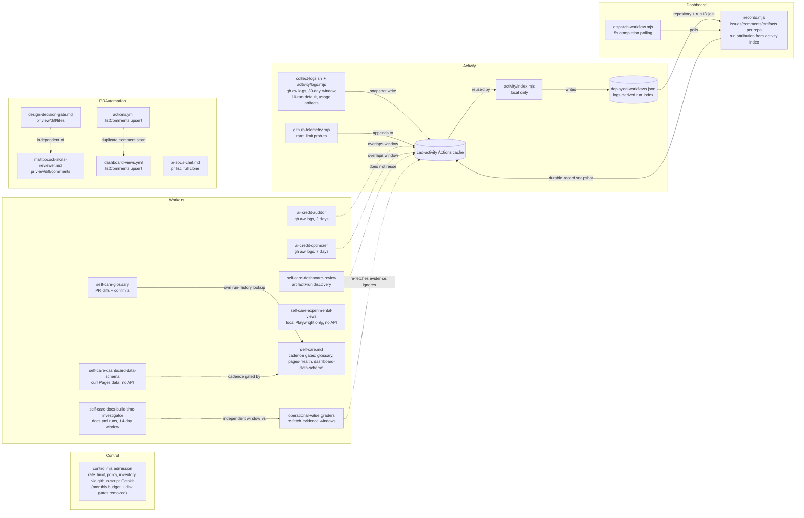

# Central Agentic Ops Data Acquisition Audit

**Version:** 1.0.0  
**Status:** Working Draft  
**Audit date:** 2026-09-10

Historical refresh notes through 2026-09-10

**Audit date:** 2026-09-10 (refreshed: `.github/cao/src/control.mjs`'s admission/precompute steps in `.github/workflows/shared/control.md` now run inside `actions/github-script` and issue their `rate_limit`, contents, workflow-inventory, and repository-lookup reads through the injected Octokit `github.request` client (`githubRequest`/`ghApi` in `control.mjs`) instead of shelling out to `gh api --cache 60s`; the `gh api` path and its 60-second CLI cache remain only as a fallback when the `github` global is unset. The sparse, shallow `actions/checkout` of `.github/cao/src` at `github.workflow_sha` is unchanged and still fetches only the runtime module code — the control policy document (`cao.json`) and other API reads are now Octokit calls rather than a Contents API call issued via the `gh` CLI. This is a transport change, not a change in the number or shape of admission/precompute requests. Earlier refresh: `work-items` and `security-findings` are no longer stored in dedicated browser IndexedDB tables; those logical sources remain in worker memory while canonical work-item and finding data belongs in the Event stream. `activity/collect-logs.sh` now issues the `gh aw logs --audit` invocation directly (streaming its stdout to the Actions log) instead of `activity/logs.mjs` spawning and buffering it; `activity/logs.mjs` reads the shell script's exit-code file and the rewritten cached-JSON snapshot instead of invoking `gh` itself. The default/maximum per-invocation run count was lowered from 200/1000 to 10/200 and the `--timeout` argument (minutes) from 15 to 10, shrinking the bounded window collected per activity run. `.github/cao/src/control.mjs`'s repository-inventory dedup and `dashboard/report/records.mjs`'s repository-state resolution now key on the GitHub repository `id` (falling back to lowercase `full_name`) instead of raw requested name, so a renamed repository that appears under both its old and new name in policy/allow-lists collapses to one entry before per-repository issue/comment/artifact, workflow-discovery, and lock-download requests are issued — removing a duplicate-request path this audit had not previously recorded, not adding one. The monthly AI Credit admission gate was removed from `.github/cao/src/control.mjs` — `applyMonthlyBudget` and its per-workflow `gh aw logs` month-to-date scan no longer exist, `monthly_credit_budget`/`monthly_ai_credits_spent`/`monthly_ai_credits_remaining`/`monthly_budget_error` are now fixed to `0`/`""`, and `githubApiRequestRequirement` no longer adds capacity for it. The runner free-disk-space capacity check was also removed from admission — there is no longer a "Runner disk capacity" admission check, disk-guidance summary text, or associated failure reason; admission now checks only GitHub API capacity before precompute. Both removed checks previously appeared in this audit's `gh aw logs` inventory, duplicate-work list, and bottleneck table; those entries are removed below. Earlier refresh: `activity/logs.mjs` now requests the `agent` artifact family in addition to the existing bounded set, so per-run agent transcripts are downloaded rather than excluded; `dashboard/report/aic-usage.mjs` adds `readRunTimeline`, which reads `gateway.jsonl`, `rpc-messages.jsonl`, firewall `audit.jsonl`, and `copilot-session-state/*/events.jsonl` from the already-downloaded run directory and feeds a new canonical session/event ingestion pipeline (`dashboard/site/src/data/adapters/gh-aw-logs.js`, IndexedDB-backed). This is additional local processing of existing predownloaded artifacts, not a new GitHub API call. Earlier refresh: `activity/logs.mjs` adds per-run Jobs API collection for runs lacking complete job data or not yet completed; completed runs with a matching cached attempt are reused. `dashboard/report/records.mjs` adds uncached repository visibility/default-branch scans and remote workflow commit/contents lookups, blob-SHA-cached raw lock downloads, and one `GET /repos/github/gh-aw/releases/latest` call per run whenever remote workflow repositories are enrolled.)

**Current acquisition state:** The inventory below supersedes historical details in the parenthetical refresh notes above. Activity now requests only compact usage artifacts with audit generation, performs no Actions fallback or Jobs API enrichment, and supplies run attribution to `records.mjs`. Report collection no longer reads repository details, remote workflow inventories, lock sources, gh-aw releases, or Actions run details.

**Refresh ledger:** See [Data Acquisition Audit History](./data-acquisition-audit-history.md) for compact dated refresh notes.

## Abstract

This informative audit inventories the repository's explicit `gh aw logs` calls and the related GitHub API, artifact-download, indexing, and caching paths. It identifies repeated collection and likely GitHub API rate-limit bottlenecks. Generated `*.lock.yml` files were inspected as manifestations but are represented by their editable Markdown or shared source.

## 1. Scope and method

The review covered production JavaScript and shell sources, editable workflow Markdown, conventional Actions workflows, graders, setup utilities, and cache consumers. Tests, examples, and generated lock files were checked for additional call patterns but are not counted as production acquisition paths. Browser fetches of the already-built `dashboard.json`, split `sources/manifest.json` and `sources/*.json` files, or fallback `sources.json` are included only as cache consumers; they do not call GitHub.

The inventory distinguishes:

- **collection**, which obtains GitHub state or gh-aw run data;
- **predownload**, which obtains data before an agent or renderer starts;
- **indexing**, which combines and normalizes collected data; and
- **caching**, which can avoid collection in a later step or run.

## 2. `gh aw logs` inventory

| Caller | Selection | Persistence | Observation |
| --- | --- | --- | --- |
| `.github/workflows/activity.yml` | One call for all compiled workflows checked out in the control repository; 30-day evidence window, **5** runs | `gh-aw-logs.jsonl` and `gh-aw-logs.sqlite` in the shared `cao-activity-v3` cache | The workflow runs `gh aw logs --audit --artifacts usage` directly, then ingests the refreshed JSONL through the canonical Node.js data pipeline. Artifacts remain job-local. |
| `.github/workflows/optimization-ai-credit-auditor.md` | Target repository, two days, at most 100 runs; locally filtered to the preceding 24 hours | `/tmp` for the current run | Overlaps the dashboard usage window and the evaluator's later evidence window. A separate API call first reads the current run's creation time. |
| `.github/workflows/optimization-ai-credit-optimizer.md` | Target repository, seven days, at most 50 runs | `/tmp` for the current run | Overlaps the auditor and dashboard collections. Monitoring workflows are filtered only after download. |
| `.github/workflows/graders/optimization-ai-credit-auditor-operational-value.sh` | Evaluator-defined before/after window, up to 10,000 runs | Evaluator temporary directory | Re-fetches evidence rather than consuming the worker's predownload, which is necessary for maturation but duplicates historical portions of earlier scans. |
| `.github/workflows/graders/optimization-ai-credit-optimizer-operational-value.sh` | Seven-day before/after evidence window, up to 10,000 runs | Evaluator temporary directory | Re-fetches overlapping target history for every evaluation or regrade. |
| `.github/workflows/graders/optimization-agents-md-curator-operational-value.sh` (formerly `ambient-context-agents-md-curator-operational-value.sh`) | Thirty-day before/after evidence around an applied change, up to 10,000 runs | Evaluator temporary directory | Potentially the largest retained-log window and repeated for regrades. |
| `.github/workflows/agentics-maintenance.yml` | Repository activity report, one week, up to 500 runs | Actions cache under `.cache/gh-aw/activity-report-logs` | This conventional maintenance workflow maintains a separate gh-aw log cache and does not reuse the CAO activity snapshot. |

All bounded production log collectors reserve 2,000 GitHub API requests through `--max-github-api-rate-limit -2000`. This is fail-closed protection, not shared coordination: concurrent collectors using the same credential can each begin work and then independently stop at the reserve.

`gh aw forecast` in the auditor and `agentics-maintenance.yml` may read or build gh-aw log caches internally. They are not additional literal `gh aw logs` calls, but they overlap the same run-history domain and must be considered when measuring actual API traffic.

## 3. GitHub API and predownload inventory

### 3.1 Shared control path

| Source | Requests and behavior | Existing mitigation |
| --- | --- | --- |
| `.github/workflows/shared/control.md` | A sparse, shallow `actions/checkout` of `.github/cao/src` at `github.workflow_sha` fetches only the runtime module code; it replaced the earlier pair of Contents API reads for `control.mjs`/`policy.mjs`. Every importing workflow execution still performs one exact-SHA checkout before activation. Admission and precompute now run inside `actions/github-script` steps that pass the injected Octokit client, `context`, and `exec`/`io`/`getOctokit` into `control.mjs` via `setActionsGlobals`. | Exact-SHA provenance is preserved; the checkout uses `fetch-depth: 1` and cone-mode sparse paths, avoiding the two separate Contents API requests previously issued per run for the module code itself. No shared artifact or cross-run checkout reuse exists in this job. |
| `.github/cao/src/control.mjs` | Reads rate limits, control policy (`cao.json`), repository metadata, workflow inventory, repository inventory pages, and safe-output metadata. It does not read target policy or target commits for worker activation. Admission writes a local `admission.json` record (repository, workflow, run, package, role, checks, and any capacity observations already read) to the job-local `RUNNER_TEMP/cao` directory. **Removed:** the runner free-disk-space capacity check (no API calls; it never contributed GitHub requests) and the monthly AI Credit admission gate's per-workflow `gh aw logs` scan (`applyMonthlyBudget`) have both been removed; admission now performs only the GitHub API capacity check before precompute, and `monthly_credit_budget`/`monthly_ai_credits_spent`/`monthly_ai_credits_remaining`/`monthly_budget_error` are fixed outputs (`0`/`""`). | Every read (`rate_limit`, `contents`, `actions/workflows`, `repos/{owner}/{repo}`, and org/user repository-inventory pages) now goes through `githubRequest`, which calls the `github-script`-injected Octokit `github.request(...)` directly; `ghApi`/`gh api --cache 60s` only runs as a fallback when the `github` global is absent (e.g. standalone script invocation or tests). Bounded repository pages and clean rate-limit denial are unchanged. The admission record is a local file write of already-collected data, not an additional GitHub API request. |

The former two-request Contents API bootstrap in `shared/control.md` has been replaced by a single git checkout step for module code only; this is no longer a Contents API cost per run, though it still runs once per importing workflow execution. Policy and other admission/precompute reads moved from the `gh api --cache 60s` CLI path to the `github-script` Octokit client (`github.request`); the CLI cache is no longer the primary path and only helps the fallback branch. Compiled lock files repeat this shared implementation but do not represent extra calls beyond the workflow executions themselves.

`control.mjs` reads `rate_limit` via `github.request("GET /rate_limit")` (falling back to `gh api rate_limit` only if `github` is unset) during each admission and precompute rate-limit-error retry, and uses the returned core limit, remaining count, and reset time directly. The check does not require a repository variable or a write-scoped token.

### 3.2 Activity and dashboard path

| Source | Requests and behavior | Existing mitigation or gap |
| --- | --- | --- |
| `activity/index.mjs` | Performs no GitHub API operations. It reads checked-out workflow sources and locks, local control-plane inventory, and the shared `gh aw logs` snapshot. | Target repositories are policy subjects rather than workflow-discovery roots. Missing usage-artifact metadata is reported by field and bounded sample run IDs instead of triggering fallback Actions API reads. |
| `activity/github-telemetry.mjs` | Runs `gh api rate_limit` after shared log acquisition and around the remaining GitHub-backed dashboard collectors, appending rate-limit and activity-cache-hydration snapshots to a job-local JSONL ledger (`$RUNNER_TEMP/cao-gh/cao-gh.jsonl`). | The local activity-index transform has no telemetry probe because it performs no GitHub operations. The rolling 24-hour ledger remains in the activity cache and the separate 30-day artifact. |
| `dashboard/report/records.mjs` | For every report repository, fetches up to ten pages each of issues and issue comments and the first 100 Actions artifacts. When private inventory is explicitly enabled, it also checks the control repository's Pages privacy state before collection. | Run attribution is joined from `deployed-workflows.json` by runtime repository and run ID. The collector does not request repository details, remote workflow inventories, commits, contents, raw lock sources, gh-aw releases, or Actions run details. A prior confirmed-public durable-record snapshot is retained on rate limit; successful runs still rescan issue/comment history and artifact metadata. |
| `dashboard/report/operational-values.mjs` | Processes operational-value grader results already present in the shared gh-aw logs JSON. | Persistent observations are merged with new results without a second history scan or per-run artifact download. |
| `dashboard/dispatch-workflow.mjs` | Dispatches activity/dashboard workflows and polls every five seconds until discovery and completion. | The dispatch response can eliminate discovery polling when it contains run details. Completion polling still has no ETag or backoff between requests; a 120-minute run can make about 1,440 status requests. A 403 rate-limit response now short-circuits into a `skipped` output that the calling workflow (`dashboard/dashboard.yml`, `.github/workflows/dashboard-build.yml`) uses to skip the downstream build/pages job, so a rate limit stops the chain instead of failing partway through a build. |
| `dashboard/local-server.mjs` | Reads repository default branch, finds the latest dashboard-data artifact, validates its run, then downloads that artifact before serving. Also issues one additional `gh api user` call at startup to populate a local-only `/viewer.json` (login, name, avatar URL) for the account-menu identity display. | One startup predownload plus one startup identity read, no repeated polling. There is no local reuse between server starts; the viewer identity is re-fetched every time the local server starts. |
| `.github/workflows/self-care-dashboard-review.md` (live-mode prefetch) | Direct `gh api` calls for default branch, one unpaginated 100-item artifact list, and run provenance, followed by `gh run download` of the dashboard artifact; the agent then separately queries the workflow registry and the latest 100 runs from the last 24 hours through its own `gh-proxy` toolset. | Bounded per-call limits and a trusted-provenance check exist, but this predownload and history query are independent of `activity/index.mjs` and `records.mjs`; every dispatch re-discovers the same artifact and run metadata rather than reusing the `cao-activity` snapshot. |
| `.github/workflows/activity.yml` and `.github/workflows/dashboard-build.yml` | Activity produces one coherent cache snapshot; the builder restores it and does not recollect. | Correctly centralizes dashboard collection. A live dashboard dispatch still forces an activity refresh even when the scheduled snapshot is fresh. |

### 3.3 Workflow prefetch and grader paths

| Source family | API pattern | Rate-limit concern |
| --- | --- | --- |
| `.github/workflows/aw-doctor.md` (formerly `aw-maintenance.md`) | GitHub Script reads latest release, repository trees and manifests, open issues, commits, and recent workflow runs. | Per-target prefetch repeats latest-release lookup and repository scans. |
| `.github/workflows/aw-maintenance-upgrade.md` | GitHub Script paginates gh-aw releases and searches target issues before agent execution. | A 24-hour Actions cache avoids most release-list calls; target issue search remains per run. |
| `.github/workflows/optimization-agents-md-curator.md` and `optimization-skills-curator.md` (formerly `ambient-context-agents-md-curator.md`/`ambient-context-skills-curator.md`, consolidated under the `AW Optimization` package) | Lists open pull requests, then lists files or review comments for bounded candidate pulls. | N+1 per-pull requests; bounds limit the worst case but no shared target snapshot exists. |
| `.github/workflows/graders/optimization-agents-md-curator-operational-value.sh` | Paginates evidence issues and target pull requests, then reads files for candidate pull requests before collecting logs. | Full issue/PR pagination is repeated for each evaluation. |
| `.github/aw/dependabot/graders/dependabot-release-train-updater-operational-value.sh` | Reads branch protection, the producer run, all target pull requests, files for candidates, pull details, check runs, and commit status. | The per-candidate files/pull/check/status sequence is the largest shell N+1 pattern. |
| `.github/workflows/graders/optimization-ai-credit-auditor-operational-value.sh` | Paginates evidence-branch commits, then reads a full recursive tree and one blob before log collection. | Repeated tree traversal for snapshots that could be addressed directly if the path/commit were recorded. |
| `.github/workflows/graders/aw-failures-investigator-operational-value.sh` and `self-care-docs-build-time-investigator-operational-value.sh` | Read bounded Actions workflow-run pages. | Explicit page bounds keep these predictable; each evaluator invocation still starts cold. |
| EU CRA and software-development-practices graders/runtime copies | Read issues and reactions; EU CRA also reads ledger contents, commits, associated pulls, and reviews. | Package source and installed runtime copies are intentional duplication of code, not simultaneous calls. Evaluations repeat repository history without a shared evidence cache. |
| `.github/workflows/design-decision-gate.md` | Now `/design-gate` slash-command only (no automatic `pull_request` trigger): one `gh pr view` (json fields), one paginated `gh api .../pulls/{n}/files`, and conditionally one `gh pr diff` (skipped above 300 files) per invocation. | Prefetch is a single bounded step per slash-command invocation with an explicit diff-size cutoff; no cross-run cache or reuse of a prior gate's fetched files/diff for the same pull request, and repeated invocations on the same pull request re-fetch identical metadata. |
| `.github/workflows/mattpocock-skills-reviewer.md` | Now `/matt` slash-command only (the automatic `ready_for_review` trigger was removed): one `gh pr view`, one `gh pr diff` (truncated to 3,000 emitted lines, excluding lock/dist/build paths), and one paginated `gh api .../pulls/{n}/comments` per invocation. | Diff line-cap and path exclusion bound payload size, but repeated slash-command invocations on the same pull request still re-fetch the same metadata, diff, and comments from scratch; removing the automatic trigger eliminates the prior per-push/per-readiness-change re-fetch. |
| `.github/workflows/pr-sous-chef.md` | Every 30 minutes (or on `/souschef`): one `gh pr list` across up to 50 open, non-draft pull requests with rollup status fields; the prompt additionally directs "bounded, paginated reads" for checks/review threads on a shortlisted candidate; each selected candidate now also triggers a full `fetch-depth: 0`/`fetch: ["*"]` checkout of the entire repository history to check out the candidate's head branch for fixing. | The list call is a single bounded request per run, but scheduling every 30 minutes rescans the full open-PR queue each time; there is no persisted watermark of previously nudged or already-evaluated pull requests. The workflow was redesigned from an advisory nudge (posting a comment) to fixing blockers and pushing commits via `push_to_pull_request_branch`, which is a new git-history acquisition path (full unshallow clone) not present in the earlier advisory design. |
| `.github/workflows/self-care-open-source-failures.md` | Restores the same `cao-activity` Actions cache used by the dashboard and reads only its persisted `deployed-workflows.json` snapshot; issues remediation issues via the `issues: read` toolset without additional API calls in the prefetch step. | No new GitHub API collection: this worker is a pure consumer of the existing activity snapshot and fails closed (`incomplete`) when the snapshot is missing, stale, or does not cover a full seven-day run-health window. |
| `.github/workflows/self-care-dashboard-performance.md` | Runs Lighthouse/Playwright audits against the built dashboard site; persists only a local round-robin rotation state file (`/tmp/gh-aw/cache-memory/dashboard-performance-rotation.json`, capped at 30 entries) and uploads a run evidence artifact. | No `gh aw logs` calls and no direct GitHub API/REST/GraphQL requests in prefetch or evaluation; no operational-value grader exists yet for this worker, so it adds no new collection or N+1 acquisition path. |
| `.github/workflows/self-care-glossary.md` (new; SelfCare's tenth worker) | Uses the `pull_requests`, `repos`, and `actions` `gh-proxy` toolsets to find the prior successful `self-care-glossary` run (start time as evidence lower bound, 24-hour default, seven-day cap), then inspects up to 50 merged pull requests (with changed-file lists and diffs) and up to 100 default-branch commits in that window. | Bounded per-run counts (50 PRs, 100 commits) and a cap on catch-up window exist, but there is no persisted watermark artifact beyond the workflow's own run history; each run re-derives its lower bound by querying prior runs rather than reusing a stored cursor. Runs at most once every 24 hours, gated by the orchestrator's own recent-run check below. |
| `.github/workflows/self-care-pages-health.md` (SelfCare's eleventh worker) | Runs a deterministic, no-GitHub-API Playwright collector (`dashboard/site/test/performance/pages-health.mjs`) against the deployed Pages dashboard and evaluates the resulting evidence files. Its `github` toolset (`gh-proxy`, `pull_requests`/`repos`/`actions`) is available to the agent but the prefetch step itself issues no `gh api`, `gh aw logs`, or REST/GraphQL calls; only local browser navigation and Lighthouse runs. | No new GitHub collection path: this worker's cost is entirely local browser/Lighthouse traffic to the already-public Pages site plus, if it opens a pull request, the standard `create_pull_request` safe-output write. The orchestrator's six-hour cadence gate (20 most recent runs) is the only run-history read associated with this worker. |
| `.github/workflows/self-care-experimental-views.md` (new; SelfCare's twelfth worker) | Declares a `pull_requests`/`repos`/`actions` `gh-proxy` toolset, but its prefetch and agent instructions issue no `gh api`/`gh aw logs` calls; substantive evidence comes from local Playwright runs (Chromium and WebKit) against the already-built local dashboard site and DOM-size measurements. | No material GitHub collection beyond the standard `create_pull_request` safe-output write, matching `self-care-accessibility-checker.md`/`self-care-primer-brand-checker.md`; the declared toolset is unused capacity, not an active request path. |
| `.github/workflows/self-care-dashboard-data-schema.md` (new; SelfCare's thirteenth worker) | Only in live mode against the control repository, `pre-agent-steps` fetch the already-deployed Pages `sources/manifest.json` then every advertised `sources/{name}.json` file (bounded to 500 unique, pattern-validated source names) via plain `curl`; the agent then compares an inferred schema document against `specs/dashboard-data.md`. No `gh api`/`gh aw logs`/GitHub REST or GraphQL calls anywhere in prefetch or agent instructions. | No GitHub collection: this is unauthenticated static-site traffic to the same public Pages data already served to dashboard browsers, not a GitHub API request. `self-care.md` additionally gates this worker's dispatch behind a 10-run/24-hour cadence check (see below), duplicating the existing `self-care-glossary` cadence-read pattern rather than adding a new collection family. |
| `.github/workflows/actions.yml` (mobile dashboard integration) | On `push`/`pull_request`/schedule, runs Playwright mobile scenarios against the built dashboard (no GitHub API calls in the collector itself), then a `github-script` step reads a paginated `issues.listComments` (up to 100 per page) for the triggering pull request to find and upsert one prior bot comment before creating or updating it. | Single bounded per-event read-then-write comment upsert; only runs on `pull_request` events, so it adds no scheduled or unbounded scan, but each triggering PR event re-lists all its comments rather than caching the found comment ID across pushes to the same PR. |
| `.github/workflows/dashboard-views.yml` (new) | On `push`/`pull_request`, runs an informational Playwright assessment against the already-built static `sources.json`/`dashboard.json` (`fetch(DASHBOARD_DATA_URL)` and a local preview server fetch, no GitHub API calls in the collector). Its comment job then reads a paginated `issues.listComments` (up to 100 per page) for the triggering pull request to find and upsert one prior bot comment, identical in shape to the `actions.yml` mobile-dashboard upsert. | Same bounded read-then-write comment-upsert pattern as `actions.yml`; each triggering pull request event re-lists all its comments from scratch rather than caching a found comment ID across pushes, duplicating that workflow's independent per-event comment scan. |
| `.github/workflows/self-care-code-improvement.md` and `self-care-dashboard-language-refactor.md` | Each run's `pull_requests`/`repos`/`actions` `gh-proxy` toolset reads the three most recently closed pull requests from the same worker workflow (newest first) as positive/negative reuse signal before selecting a refactor candidate. | Bounded to three PRs per run with no paired grader collection found; each run re-lists closed PRs from scratch rather than caching the previously read set, so repeated dispatch cycles re-fetch overlapping PR history. |
| `.github/workflows/self-care-reactive-ui-expert.md` | Uses local git history for at most 20 relevant commits, then reads at most ten recently merged dashboard JavaScript pull requests and three recently closed pull requests from this worker to identify regressions and avoid duplicate reactive UI maintenance. | The pull-request reads are explicitly bounded but overlap across dispatch cycles because the worker keeps no persistent cursor; the local commit scan adds no GitHub API traffic. |
| `.github/workflows/self-care-accessibility-checker.md` and `self-care-primer-brand-checker.md` | Both declare a `repos`/`actions` `gh-proxy` toolset, but neither's prefetch or agent instructions issue any `gh api`/`gh aw logs` calls; all substantive evidence comes from local Playwright/axe-core (accessibility) or the `primer-brand` MCP server (brand checker) against the already-built local dashboard site. | No material GitHub collection beyond the standard `create_issue`/`create_pull_request` safe-output write; the declared toolset is unused capacity, not an active request path. |
| `.github/workflows/self-care-docs-build-time-investigator.md` | The worker's own instructions read only `.github/workflows/docs.yml`, `dashboard-build.yml`, and their Actions runs (`actions: read`) for evidence, capped at the latest 20 completed `docs.yml` runs from the last 14 days; the paired grader (`self-care-docs-build-time-investigator-operational-value.sh`) separately calls `gh api repos/{repo}/actions/workflows/docs.yml/runs` with its own before/after evidence window. | The worker and its grader independently query overlapping `docs.yml` run history without a shared snapshot; the worker persists a `repo-memory`-backed suggestion-rotation ledger to avoid repeating a category, but does not cache the raw run list itself between dispatches. |

| `.github/workflows/self-care.md` (orchestrator) | Before dispatching `self-care-dashboard-data-schema` or `self-care-glossary`, inspects at most the ten most recent workflow runs of each (via the `actions` `gh-proxy` toolset) to enforce a 24-hour dispatch cadence per worker. Before dispatching `self-care-pages-health`, inspects at most the 20 most recent `self-care-pages-health` workflow runs through the same toolset to enforce a six-hour cadence. All three checks fail closed (skip dispatch) when run history is unavailable or ambiguous. Dispatches the eleven regular (non-cadence-gated) workers, including `self-care-experimental-views` and `self-care-reactive-ui-expert`, on every selected repository run. | Each cadence check is bounded (10 or 20 runs) and only gates one worker's dispatch; these are small, independent run-history reads separate from the shared `cao-activity` snapshot. The glossary worker separately re-derives its own evidence-window lower bound from the most recent successful run, so the same "most recent run" fact can be queried twice per worker per dispatch cycle; `self-care-pages-health` and `self-care-dashboard-data-schema` have no equivalent worker-side prior-run lookup, so their cadence checks are each the only run-history read for that worker. `self-care-experimental-views` adds no new run-history read of its own. |

Administrative setup (`.github/cao/setup-github-apps.mjs`), release workflows, CI checks, and e2e scripts also use GitHub APIs. They are interactive or repository-maintenance traffic rather than operational collection, but they share the caller's quota and should not be scheduled concurrently with large audits when they use the same token.

## 4. Cache and index topology

| Cache or index | Producer | Consumer | Reuse boundary |
| --- | --- | --- | --- |
| `cao-activity-v3-*` Actions cache | `.github/workflows/activity.yml` | Next activity run, dashboard builder, and agent jobs | Refreshed `gh-aw-logs.jsonl` and queryable `gh-aw-logs.sqlite`; latest matching key across runs |
| `deployed-workflows.json` local run index | `activity/index.mjs` | Activity collectors | Rebuilt from checked-out metadata and the shared logs snapshot without API fallback |
| Shared gh-aw logs JSONL | `.github/workflows/activity.yml` | Consumers | Persistent activity cache |
| `records.mjs` run map | `activity/index.mjs` via `deployed-workflows.json` | `dashboard/report/records.mjs` | In-memory join by runtime repository and run ID; no run-detail request |
| gh-aw release list | `aw-maintenance-upgrade.md` | Later upgrade runs | 24-hour file cache restored by Actions cache |
| Maintenance activity and forecast logs | `agentics-maintenance.yml` | Later maintenance runs | Separate Actions caches, outside the CAO activity snapshot |
| GitHub API telemetry ledger (`cao-gh.jsonl`) | `activity/github-telemetry.mjs` | Next activity run's dashboard quota history and the `cao-gh` artifact | Rolling 24-hour window retained inside the `cao-activity` cache; trimmed on restore by `prepare`, not a fresh discard per run |
| Dashboard source document | Dashboard data worker | Current browser session and later page queries | Canonical generations in IndexedDB store runs/jobs/sessions/events; `work-items`, `security-findings`, and other noncanonical source rows are retained only in worker memory and reconstructed after reload |
| Dashboard data artifact | Dashboard build | Local server | Predownloaded once per local-server start; no local persistence contract |

The activity snapshot is the shared collection boundary. It persists the bounded gh-aw logs JSON and downloaded artifacts beside derived AIC and operational-value records.

## 5. Duplicate work

1. **Run history is collected by multiple independent systems.** The activity snapshot makes one shared gh-aw logs download, while worker predownloads and graders later collect overlapping target evidence windows. The activity index no longer performs a parallel Actions API scan.
2. **~~Monthly budget admission rescanned package history per execution.~~ (Removed)** The monthly AI Credit admission gate (`applyMonthlyBudget`) and its per-workflow `gh aw logs` month-to-date scan no longer exist in `.github/cao/src/control.mjs`; admission no longer issues any `gh aw logs` calls.
3. **Dashboard durable records rescan stable history every 15 minutes.** Issues and comments are fetched from the beginning, rather than incrementally from the previous snapshot's newest update.
4. **Control bootstrap still runs once per workflow run.** The exact-SHA runtime files are now obtained via one sparse, shallow git checkout instead of two Contents API reads, but each importing run still repeats this checkout independently before the module executes. Admission/precompute API reads (policy, rate limit, workflow inventory, repository lookups) now go through the `github-script`-injected Octokit client rather than the `gh` CLI; this changes transport, not the per-run request count.
5. **Control-repository workflow metadata is local.** The activity index reads the checked-out sources and locks once; it no longer rediscovers registries, trees, manifests, or source content through the API.
6. **Per-candidate grader requests create N+1 traffic.** Dependabot and AW Optimization (formerly ambient-context) evaluators enumerate broad candidate lists and then query files, checks, statuses, or comments one candidate at a time.
7. **Separate maintenance caches overlap the activity cache.** `agentics-maintenance.yml` stores independent activity/forecast log trees that cannot satisfy CAO dashboard or grader collection.
8. **Telemetry probes now persist across runs.** `github-telemetry.mjs` issues a fresh `gh api rate_limit` call before and after each activity phase, independent of the capacity check already performed by `control.mjs` admission/precompute. Its ledger is retained for a rolling 24-hour window through the `cao-activity` cache (rather than deleted each run), so historical rate-limit/cache-hydration entries now survive across scheduled runs for dashboard trend rendering, but the per-run probe count itself is unchanged.
9. **New per-event PR automation prefetch is not shared across workflows.** `design-decision-gate.md` and `mattpocock-skills-reviewer.md` are now both slash-command-only (`/design-gate`, `/matt`) rather than triggered automatically on `pull_request` events; each independently fetches `gh pr view`, a diff, and paginated files or review comments for the same pull request when separately invoked, and neither consumes the other's prefetched evidence, so repeated slash-command re-invocation of either workflow re-fetches identical metadata each time.
10. **`pr-sous-chef.md` polls the full open-PR queue on a fixed schedule.** Every 30 minutes it re-lists up to 50 open, non-draft pull requests with status-rollup fields regardless of whether anything changed since the previous run, and it has no persisted watermark to skip already-evaluated candidates. It was also redesigned from a comment-only advisory nudge to a code-fixing worker that checks out each selected candidate's branch with a full (`fetch-depth: 0`, `fetch: ["*"]`) clone and pushes commits via `push_to_pull_request_branch`, adding a new full-history git acquisition cost per selected candidate that did not exist in the prior advisory design.
11. **`self-care-dashboard-review.md` maintains its own artifact/run discovery path.** Its live-mode prefetch independently calls the artifacts and runs APIs and downloads the dashboard artifact, duplicating metadata already collected by `activity/index.mjs` and `records.mjs`; it does not reuse the `cao-activity` snapshot, so every dispatched review re-discovers the same current artifact and recent run history from scratch.
12. **The `self-care-glossary` and `self-care-dashboard-data-schema` workers and the orchestrator cadence check independently query the same run history shape.** `self-care.md` inspects up to 10 recent runs of each workflow to enforce its own 24-hour dispatch gate, and `self-care-glossary` additionally re-derives its own evidence-window lower bound from the most recent successful run; neither worker reuses the other's or the orchestrator's already-fetched run metadata, and the glossary worker further fetches up to 50 merged-PR diffs/file lists and up to 100 commits per run with no persisted cursor beyond run history itself. `self-care-dashboard-data-schema` has no worker-side prior-run lookup of its own (it issues no GitHub API calls at all), so only the orchestrator's cadence check reads run history for it. `self-care-pages-health` adds a third, independent cadence check (up to 20 recent runs, six-hour gate) with no worker-side prior-run lookup either.
13. **~~Activity fallback re-fetched per-workflow run history.~~ (Removed)** A failed `gh aw logs` refresh now preserves compatible cached JSON and records unavailable/incomplete state without issuing Actions workflow-run fallback calls.
14. **~~Report collection scanned remote workflow listings.~~ (Removed)** Workflow inventory is owned by the checked-out control repository and the logs-derived activity index; `records.mjs` no longer lists target workflows.
15. **`self-care-docs-build-time-investigator.md` and its grader independently rescan the same `docs.yml` run history.** The worker's own instructions fetch up to the latest 20 completed runs (14-day window) for evidence; its paired operational-value grader separately calls the Actions run-list API with its own before/after window over the same workflow, so a producer run and its later regrade issue at least two independent `docs.yml` run-list requests instead of one shared snapshot.
16. **`self-care-code-improvement.md` and `self-care-dashboard-language-refactor.md` re-fetch the same worker's PR history each dispatch.** Each worker reads the three most recently closed pull requests from its own workflow as reuse/rejection evidence; there is no persisted cursor, so every run re-lists this small but overlapping PR set from scratch.
17. **`dashboard-views.yml` duplicates `actions.yml`'s per-PR comment-upsert pattern.** Both workflows independently paginate `issues.listComments` (up to 100 per page) on the same triggering pull request to locate their own bot comment before upserting it; neither shares a found comment ID with the other, so a single pull request event can trigger two independent full comment-list scans for two different marker comments.
18. **~~Activity added per-run Jobs API enrichment.~~ (Removed)** Job observations now remain limited to fields supplied by the shared gh-aw snapshot; missing job data remains unavailable.
19. **~~Report collection added repository-state and lock-source follow-ups.~~ (Removed)** Repository visibility/default-branch, commit, contents, raw lock, and latest-release reads have been deleted from `records.mjs`.
20. **~~The activity collector downloaded broad per-run artifact families.~~ (Fixed)** The bounded `gh aw logs` invocation now requests only the compact `usage` artifact with `--audit`. That bundle supplies the cached run record, `run_summary.json`, `audit.json`, and `aw_info.json`, avoiding heavyweight agent transcripts and separate detection/eval/firewall/MCP artifact families. The report retains bounded normalized audit and agent/runtime/model/version metadata and derives canonical tool-call events from summary data; older caches with raw timeline files remain compatible.
21. **~~Renamed repository aliases previously affected report enrichment.~~ (Superseded)** `records.mjs` no longer resolves repository identities through metadata calls. Durable-output scope uses reviewed policy names, while the control runtime retains its own repository-ID deduplication where required.
22. **The default bounded `gh aw logs` run count was lowered from 200 to 10 (validated maximum from 1000 to 200).** `activity/collect-logs.sh`'s `run_limit` default and `activity/logs.mjs`'s `DEFAULT_RUN_LIMIT`/validation ceiling both dropped; this shrinks the per-run collection window (and therefore the shared snapshot's job/AIC/security/operational-value coverage) rather than changing the number of independent collection paths.

## 6. Rate-limit bottlenecks

| Priority | Bottleneck | Why it matters |
| --- | --- | --- |
| P0 | Five-second workflow completion polling | One long dashboard chain can consume more than a thousand core requests despite doing no new collection work. Multiple dispatchers multiply this linearly. A 403 rate-limit response is now detected and short-circuits the chain (skipping build/pages), which bounds the *failure* cost but does not reduce the request volume of a normal successful run. |
| P0 | Organization code-search partitioning | Authenticated code search has a much lower rate limit than the core REST API. A large organization or partitions still exceeding 1,000 results can exhaust it before ordinary collection begins. |
| P1 | Cold, full issue/comment scans in `records.mjs` | Up to 20 core requests per report repository every 15 minutes, plus one artifact-list request. The cost grows linearly with enrolled repositories. |
| P1 | Repeated `gh aw logs` windows | Dashboard, workers, reports, and graders independently download overlapping Actions/log/artifact data. The 2,000-request reserve causes partial data sooner when they share a credential. |
| P1 | Grader N+1 queries | Pull-file, pull-detail, check-run, status, tree, and blob calls grow with candidates and with every regrade. |
| P2 | Repeated control checkout | One sparse checkout per run is small but still multiplied by every controlled workflow execution; it no longer costs two Contents API requests. Admission/precompute reads (policy, rate limit, workflow inventory, repository lookups) now go through the `github-script` Octokit client rather than the `gh` CLI's 60-second cache, so each run's helper reads are direct Octokit calls with no in-process CLI caching layer between them. |
| P2 | Cold artifact discovery | `records.mjs` and the local server list artifacts independently; operational-value fallback downloads one artifact per run. |
| P2 | Per-phase telemetry rate-limit probes | Up to 8 additional `gh api rate_limit` reads per activity run beyond the admission/precompute capacity check; low absolute cost against the separate `rate_limit` allowance, but still avoidable duplication. The ledger is now retained 24h via the activity cache, so the historical dashboard view no longer needs a fresh full-window probe count each run, but the per-run request volume is unchanged. |
| P2 | Duplicate per-PR review prefetch | `design-decision-gate.md` and `mattpocock-skills-reviewer.md` are now slash-command-only, removing their prior automatic re-fetch on every qualifying push/readiness change; each still independently re-fetches the same pull request's metadata, diff, and paginated files/comments whenever separately invoked, and slash-command reuse still re-fetches identical evidence per invocation. |
| P2 | Fixed-schedule PR queue polling | `pr-sous-chef.md` re-lists up to 50 open pull requests every 30 minutes regardless of change, with no persisted watermark; each fixed candidate now also incurs a full unshallow git checkout. |
| P2 | Duplicate glossary/dashboard-data-schema run-history lookups | `self-care.md`'s cadence gates for `self-care-glossary` and `self-care-dashboard-data-schema` (10 runs each) and `self-care-glossary.md`'s own evidence-window bootstrap independently query recent run history within the same dispatch cycle; low absolute cost but avoidable duplication. `self-care-pages-health.md`'s six-hour cadence gate (up to 20 runs) is a further, similarly bounded but non-overlapping run-history read; neither `self-care-pages-health` nor `self-care-dashboard-data-schema` has a worker-side counterpart to duplicate. |
| P2 | Duplicate `docs.yml` run-history reads | `self-care-docs-build-time-investigator.md` and its operational-value grader each independently query up to 20 (worker) or grader-window-bounded runs of `docs.yml`; low absolute cost but avoidable duplication between producer and evaluator. |
| P2 | Duplicate per-PR comment upsert scans | `actions.yml` and `dashboard-views.yml` each independently paginate the full comment list of the same triggering pull request to find their own marker comment; low per-event cost but two full scans occur on every pull request event instead of one shared lookup. |

The direct activity client retries 403 and 429 responses only when the advertised delay is at most 30 seconds. `records.mjs` instead stops on a confirmed rate limit and retains the prior snapshot. Dispatch polling and most GitHub Script or shell clients have no common rate-limit response policy.

## 7. Recommendations

1. **Replace fixed completion polling with bounded backoff.** Start at the current responsive interval, increase it for long-running jobs, honor `Retry-After` and rate-limit reset headers, and prefer returned run details to discovery polling. **(Partially addressed:** `dispatch-workflow.mjs` now detects a 403 rate-limit response and emits a `skipped` output so `dashboard/dashboard.yml` and `dashboard-build.yml` skip the downstream build/pages job; the fixed five-second interval and lack of proactive backoff on successful polling remain.)
2. **Make the activity snapshot the reusable run-data boundary.** Persist a bounded raw gh-aw log cache beside derived AIC data, with repository, time-window, completeness, and credential-scope metadata. Permit consumers to reuse it only when those bounds satisfy their request.
3. **Increment durable-record collection.** Retain per-repository update watermarks, request only changed issues/comments, and periodically perform a bounded reconciliation scan. Preserve the prior snapshot when completeness cannot be proven.
4. **~~Cache month-to-date package usage.~~ (No longer applicable)** The monthly AI Credit admission gate and its per-workflow `gh aw logs` scan were removed from `.github/cao/src/control.mjs`; there is no month-to-date usage scan left to cache.
5. **~~Reduce activity and report enrichment calls.~~ (Implemented)** Activity workflow discovery now reads checked-out sources and locks, and report run attribution reuses `deployed-workflows.json`. Repository metadata, target workflow, lock-source, release, run-detail, and Jobs API enrichment have been removed.
6. **Batch or narrow grader evidence.** Record immutable evidence identifiers during the producer run, query candidates by time where supported, and reuse one evaluation-local repository snapshot across graders. Keep existing fail-closed completeness rules.
7. **~~Bundle exact-SHA control runtime files.~~ (Implemented)** Control bootstrap now uses one sparse, shallow checkout instead of two Contents API calls, preserving the exact-SHA workflow provenance boundary. Admission/precompute API reads were also migrated from the `gh` CLI to the `github-script`-injected Octokit client, which removes a CLI process spawn per read but does not itself reduce request volume. Remaining opportunity: avoid repeating this checkout across concurrently running importing workflows when feasible.
8. **Instrument request budgets.** Emit request counts by endpoint family, cache hit/miss, pages read, downloaded bytes, remaining core/search quota, and incomplete reason. Use this evidence before changing concurrency or reserve thresholds.
9. **Do not merge caches solely by repository.** Cache keys must retain token/installation scope, private-data policy, exact source SHA where relevant, requested time window, and completeness. A cache hit must never widen repository authority or publish private data.
10. **Fold telemetry probes into existing capacity checks.** `github-telemetry.mjs`'s per-phase `gh api rate_limit` calls duplicate the admission/precompute capacity read; record the already-obtained rate-limit response instead of re-querying it, or reduce probe frequency to once per run. **(Partially addressed:** the ledger is now retained 24h across runs via the activity cache instead of being deleted each run, which fixed the dashboard's quota-history rendering gap, but the per-run probe count is unchanged.)

## API Request Relationships

The diagram highlights the shared `cao-activity` cache as the run-data reuse boundary. Activity indexing and report run attribution are local joins; per-worker predownloads and graders remain the principal paths that independently re-collect overlapping history.

## 8. Suggested implementation order

1. Back off dashboard dispatch polling and add request-count telemetry.
2. Increment `records.mjs` issue/comment collection.
3. ~~Persist and reuse bounded gh-aw logs through the activity cache.~~ **(Implemented)** The activity workflow updates one control-repository logs JSON/artifact snapshot immediately after cache restore and derives the index, AIC, security, and operational-value records from it.
4. ~~Cache month-to-date budget totals against observed run IDs.~~ **(No longer applicable:** the monthly AI Credit admission gate was removed.)
5. Narrow grader N+1 evidence lookups.
6. Optimize control bootstrap only after preserving exact-SHA and fail-closed behavior in tests. **(Done: bootstrap now uses a sparse git checkout instead of Contents API reads.)**

These changes should be delivered separately. This audit records current behavior and does not itself change collection, authority, credentials, or cache semantics.
