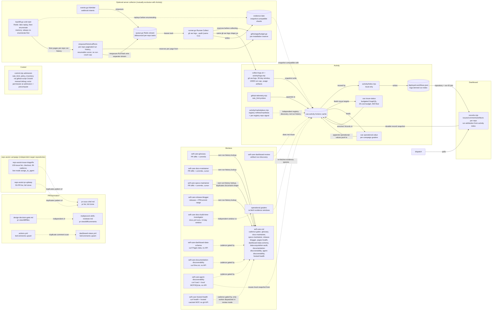

# Central Agentic Ops Data Acquisition Audit

**Version:** 1.0.0  
**Status:** Working Draft  
**Audit date:** 2026-10-09 (refreshed)

The control bootstrap checks out the control repository's `.github` tree at `github.workflow_sha`. The CAO shared runtime keeps its catalog source path under `.github/workflows/shared`, so every control-repository topology uses that single checkout without fetching a second copy.

Historical refresh notes through 2026-09-10

**Audit date:** 2026-09-10 (refreshed: `.github/workflows/shared/control.mjs`'s admission/precompute steps in `.github/workflows/shared/control.md` now run inside `actions/github-script` and issue their `rate_limit`, contents, workflow-inventory, and repository-lookup reads through the injected Octokit `github.request` client (`githubRequest`/`ghApi` in `control.mjs`) instead of shelling out to `gh api --cache 60s`; the `gh api` path and its 60-second CLI cache remain only as a fallback when the `github` global is unset. The sparse, shallow `actions/checkout` of `.github` at `github.workflow_sha` is unchanged and still fetches only the control-plane files — the control policy document (`cao.json`) and other API reads are now Octokit calls rather than a Contents API call issued via the `gh` CLI. This is a transport change, not a change in the number or shape of admission/precompute requests. Earlier refresh: `work-items` and `security-findings` are no longer stored in dedicated browser IndexedDB tables; those logical sources remain in worker memory while canonical work-item and finding data belongs in the run-owned Issue and Audit records. `activity/collect-logs.sh` now issues the `gh aw logs --audit` invocation directly (streaming its stdout to the Actions log) instead of `activity/logs.mjs` spawning and buffering it; `activity/logs.mjs` reads the shell script's exit-code file and the rewritten cached-JSON snapshot instead of invoking `gh` itself. The default/maximum per-invocation run count was lowered from 200/1000 to 10/200 and the `--timeout` argument (minutes) from 15 to 10, shrinking the bounded window collected per activity run. `.github/workflows/shared/control.mjs`'s repository-inventory dedup and `dashboard/report/records.mjs`'s repository-state resolution now key on the GitHub repository `id` (falling back to lowercase `full_name`) instead of raw requested name, so a renamed repository that appears under both its old and new name in policy/allow-lists collapses to one entry before per-repository issue/comment/artifact, workflow-discovery, and lock-download requests are issued — removing a duplicate-request path this audit had not previously recorded, not adding one. The monthly AI Credit admission gate was removed from `.github/workflows/shared/control.mjs` — `applyMonthlyBudget` and its per-workflow `gh aw logs` month-to-date scan no longer exist, `monthly_credit_budget`/`monthly_ai_credits_spent`/`monthly_ai_credits_remaining`/`monthly_budget_error` are now fixed to `0`/`""`, and `githubApiRequestRequirement` no longer adds capacity for it. The runner free-disk-space capacity check was also removed from admission — there is no longer a "Runner disk capacity" admission check, disk-guidance summary text, or associated failure reason; admission now checks only GitHub API capacity before precompute. Both removed checks previously appeared in this audit's `gh aw logs` inventory, duplicate-work list, and bottleneck table; those entries are removed below. Earlier refresh: `activity/logs.mjs` now requests the `agent` artifact family in addition to the existing bounded set, so per-run agent transcripts are downloaded rather than excluded; `dashboard/report/aic-usage.mjs` adds `readRunTimeline`, which reads `gateway.jsonl`, `rpc-messages.jsonl`, firewall `audit.jsonl`, and `copilot-session-state/*/events.jsonl` from the already-downloaded run directory and feeds the canonical run-owned record ingestion pipeline (`dashboard/site/src/data/adapters/gh-aw-logs.js`, IndexedDB-backed). This is additional local processing of existing predownloaded artifacts, not a new GitHub API call. Earlier refresh: `activity/logs.mjs` adds per-run Jobs API collection for runs lacking complete job data or not yet completed; completed runs with a matching cached attempt are reused. `dashboard/report/records.mjs` adds uncached repository visibility/default-branch scans and remote workflow commit/contents lookups, blob-SHA-cached raw lock downloads, and one `GET /repos/github/gh-aw/releases/latest` call per run whenever remote workflow repositories are enrolled.)

**Current acquisition state:** The inventory below supersedes historical details in the parenthetical refresh notes above. Activity requests compact usage artifacts with audit generation, performs no Actions run fallback or Jobs API enrichment, and supplies run attribution to `records.mjs`. Its inventory sidecar now reads the paginated Actions workflow registry for each resolved repository so workflow identity and state do not depend on run telemetry; per-repository failures remain partial evidence. Report collection no longer reads repository details, remote workflow inventories, lock sources, gh-aw releases, or Actions run details. Activity's `gh aw logs` invocation uses `--cached-jsonl` with a trailing wildcard shard prefix; new data lands in a freshly named shard rather than a rescanned single growing file. Ingestion (`activity/cao.mjs`) was restructured from a single carried-forward shard directory (`--input-dir`) into paired `--runs-dir`/`--events-dir` phased shard directories, so compact run properties commit before detailed events; each shard still skips reprocessing when its content hash already matches the transactions table. `cao-activity.yml`'s `REPORT_RUN_LIMIT` and `activity/logs.mjs`'s validated ceiling were raised again, from a 10-run default/200-run ceiling to a 10-run default/10,000-run validated maximum (the workflow now requests `10000`), widening the effective per-run collection window back up. **New:** `activity/collect-logs.sh` now runs `cao issue-status --database ... --input-dir <shard_directory> --graphql-cost-budget 25 --graphql-min-remaining 500` once per activity run after ingestion, adding the first production GraphQL acquisition path to the shared activity snapshot. It batches (50 issues per repository call by default) GitHub GraphQL `issue(number:)` lookups for non-pull-request Issue records already present in the local SQLite projection, prioritizing the staleest `statusObservedAt` targets first, and stops per its own point-cost budget or a remaining-quota floor before enriching matching safe-output records in place with authoritative `state`/`state_reason`/`closed_at`. This is bounded, budgeted, and reuses already-ingested targets rather than rescanning source history, but it is additional per-run GitHub traffic beyond the existing `gh aw logs` call; see §6. **Removed:** the `optimization/collect-token-efficiency.sh` invocation was pulled out of `.github/workflows/cao-activity.yml` entirely (the `bash "$token_efficiency_collector"` step and its file-existence probe no longer exist in that workflow). The script still exists at `optimization/collect-token-efficiency.sh` (installed to `optimization/collect-token-efficiency.sh` by the Optimization campaign manifest) and is still exercised directly by unit tests, but no production workflow now calls it, so its `token-efficiency-observation`/`token-efficiency-lifecycle-claim` artifact listing and per-artifact `GET /actions/runs/{id}` plus archive-download traffic no longer occurs during scheduled activity collection. **Removed:** `optimization-ai-credit-auditor.md`, `optimization-ai-credit-optimizer.md`, `optimization-agents-md-curator.md`, and `optimization-skills-curator.md` (and their `.github/workflows/graders/*-operational-value.sh` evaluators) no longer exist anywhere in the repository; all legacy per-workflow operational graders under the former shared `.github/workflows/graders/` path were deleted in favor of per-campaign `<campaign>/.github/graders/` scripts feeding the new `cao operational-value` collector (`activity/operational-value.mjs`, invoked by `cao-activity.yml`'s "Compute repository operational value" step), which discovers one `operational-value.mjs` module per campaign directory, reads the already-ingested activity SQLite projection, and reserves its own `--max-github-api-rate-limit -2000` budget when a module needs live `gh api`/`gh aw` reads (for example `optimization/operational-value/optimization-token-optimizer.mjs`, which downloads the deployed dashboard snapshot only when no local activity database is available). These entries superseded the auditor/optimizer/curator rows and their grader rows below. **New:** an optional server-side, webhook-driven collector profile (`specs/server-ingestion.md`, `server/internal/collect/`, `server/internal/githubapp/`) now exists as an alternative to the Actions profile; it is off unless an operator configures a GitHub App, and when enabled it acquires evidence with the same `gh aw logs --audit` invocation and `activity/cao.mjs compact-jsonl` step the Actions profile uses, driven by verified webhooks instead of a schedule. See §3.4 for its enrollment, collection, cold-start, and rate-limit-governance acquisition paths. **New:** three additional SelfCare workers (`self-care-docs-maintainer`, `self-care-release-blogger`, `self-care-server-go-logging`) were added; see §3.3 for their bounded pull-request/commit/release evidence reads. **New:** `cao issue-status` now runs deferred, after `gh aw logs` collection and before phased-shard generation, under its own freshly minted `issues: read`-scoped GitHub App token (`steps.issue-status-app-token`, falling back to the same PAT/token chain as other steps) rather than the log-collection step's token; `activity/collect-logs.sh` skips its own inline `issue-status` invocation whenever `REPORT_DEFER_ISSUE_STATUS=1` is set (`cao-activity.yml` always sets it), so the enrichment now runs exactly once, as a dedicated workflow step, instead of inline inside the collection script. The `gh aw logs` invocation's own rate-limit reserve (`REPORT_MAX_GITHUB_API_RATE_LIMIT`) was also raised from `-2000` to `-4000`, doubling the request headroom that step's own collection stops short of exhausting; the separate `-2000` reserve used by operational-value collection is unchanged. This is a token-scoping and step-ordering change, not a new request family: the batched, budgeted (`25`-cost/`500`-floor) GraphQL shape from the prior refresh is unchanged. **New:** `activity/agent-catalog.mjs`, `activity/cli-usage.mjs`, and `activity/mcp-server.mjs` add a read-only agent catalog, CLI query-discovery help text, and an MCP server exposing named Dashboard Language queries; all three execute already-defined queries against the already-ingested local SQLite/IndexedDB projection through the same `query-executor.js` path the dashboard uses and issue no GitHub API or `gh aw logs` calls of their own. **New:** a nineteenth SelfCare worker, `self-care-agent-discoverability`, starts an in-run read-only `cao_catalog`/`cao_query` MCP server over the restored activity SQLite snapshot and audits the published `/cao/` dashboard route with a bounded HTTP/MCP/CLI call budget; it adds no GitHub API acquisition and is gated by the same 24-hour cadence family as `self-care-glossary`/`self-care-dashboard-data-schema`. Its addition also raised `self-care.md`'s `dispatch_max`/`safe-outputs.dispatch-workflow.max` from 18 to 19 and `worker_credits_per_target` from 4750 to 5000; these are dispatch-capacity and credit-budget changes, not new request families. **Corrected:** the previously undocumented `self-care-documentation-discoverability` worker (added before this audit's prior refresh, weekly-cadence-gated, curl-only `llms.txt`/`resources.json` prefetch) is now recorded in §3.3, §5, and the diagram; it was omitted from earlier refreshes despite already dispatching in production. **New:** a new `repo-assist` campaign (`repo-assist.md` orchestrator plus `repo-assist-issue-triage`/`repo-assist-issue-fix`/`repo-assist-maintenance`/`repo-assist-pr-upkeep` workers) now targets arbitrary enrolled repositories on a weekly schedule; each worker lists up to 100 open issues or 50 open `[repo-assist:` pull requests from scratch every dispatch with no persisted watermark, and three of the four workers perform a full unshallow git checkout of the target repository per selected candidate, duplicating the fixed-schedule, no-cursor pattern this audit already records for `pr-sous-chef.md`. See §3.3, §5 item 28, §6, and the diagram. **New:** the optional server-side collector profile (§3.4) gained durable per-delivery-GUID deduplication and in-place Redis-stream replacement (`AdmitDelivery`/`EnqueueDelivery`/`StreamReplaceAndAck`) for at-least-once webhook redelivery; this is Redis-side durability hardening with no change to the GitHub request family, count, or per-installation rate-limit governance already recorded there. **New:** `activity/marketplace.mjs` and the hosted Go resolver (`server/internal/marketplace/resolve.go`) each add one further `GET /repos/{owner}/{repository}` call per configured registry to derive best-effort, public-only popularity (stars/forks) and maintenance-freshness signals per package; this is one additional bounded request per registry (≤32 registries) layered on the existing per-registry ref/tree/manifest reads, not a new unbounded scan, and the hosted path reuses the existing registry-and-revision Redis TTL cache. See §3.2. **New:** `dependabot-update-planner.md` moved its Dependabot-alert collection from an inline agent-turn `list_dependabot_alerts` tool call to a `pre-steps` `github-script` prefetch that pages the same `GET /repos/{owner}/{repo}/dependabot/alerts` endpoint before the agent starts and materializes the complete result to a file; the agent now reads that file instead of calling the tool directly. This is a request-timing and provenance change (plus an added public-repository verification gate) with the same bounded pagination shape as before, not a new request family. See §3.3. **New:** the optional server-side collector's cold start (`server/internal/collect/backfill.go`) now enumerates each enrolled repository's complete historical workflow-run list, not only its repository roster: after installation/repository enumeration, `enqueueHistoricalRuns` pages `GET /repos/{owner}/{repo}/actions/runs` (100/page, newest-first) per repository, reserving one core-quota unit per page against the same per-installation `githubapp/budget.go` governance the live collector uses, and durably queues one deduplicated `collect:run-tasks` Redis-stream entry per discovered run/attempt. A persisted per-repository page cursor (`collect:run-backfill-cursors`) makes this resumable across process restarts, and a repository is marked complete only after a verification pass finds no new run identities, guarding against runs inserted ahead of an in-progress page walk. This replaces the prior audit's enumeration-only description of this cold-start path with a materially larger, paginated, per-repository historical-run discovery; it is additional GitHub REST traffic layered on top of installation/repository enumeration, bounded only by installation-level quota and a per-repository completion cursor, not by any fixed run-count ceiling. See §3.4, §5 item 29, §6, and the diagram. **New:** `self-care-specs-maintainer.md` (SelfCare's twentieth worker) was added: only in live mode against the control repository, it maintains a `(merged_at, number)` cache-memory cursor and inspects at most 30 pull requests merged into the default branch since that cursor (or the preceding seven days on a cache miss), with changed-file lists and diffs, to find merged behavior changes missing a corresponding `specs/` update. This duplicates the bounded, cursor-narrowed-on-hit/full-window-on-miss merged-PR evidence pattern already recorded for `self-care-docs-maintainer` (§3.3, §5 item 12) rather than adding a new request shape; `self-care.md`'s `dispatch_max`/`safe-outputs.dispatch-workflow.max` rose from 19 to 20 to add its 24-hour cadence gate. See §3.3 and §5 item 12. **New:** `self-care-redis-query-optimization.md` (SelfCare's twenty-first worker) was added: via its `pull_requests`/`repos`/`actions` `gh-proxy` toolset it reads the most recent open and three most recently closed pull requests from this worker as reuse/rejection evidence before selecting a Redis-backed query bottleneck; all benchmark measurement is local (synthetic fixtures against a dedicated Redis Stack instance), so the only GitHub reads are this small bounded PR-history lookup. This duplicates the bounded, no-persisted-cursor PR-reuse-signal shape already recorded for `self-care-code-improvement`/`self-care-dashboard-language-refactor` (§5 item 16) rather than adding a new request shape, and no operational-value grader exists yet for this worker. `self-care.md`'s `dispatch_max`/`safe-outputs.dispatch-workflow.max` rose from 20 to 21 to add it as a non-cadence-gated worker. See §3.3 and §5 item 16. **Changed:** `repo-assist.md`'s schedule was shortened from weekly to every six hours, quadrupling the dispatch frequency of its fixed-schedule, no-watermark open-issue/pull-request queue rescan (§5 item 28) without adding a cursor. Separately, `repo-assist-issue-triage.md` gained a `live`-mode-only `assign_to_agent` delegation outcome: after posting a triage comment with verified change scope and acceptance tests, it may call `assign_to_agent` once to assign the existing target-repository issue to Copilot under a dedicated `custom-instructions` prompt; this is a new live-mode write capability triggered by existing bounded issue evidence, not a new GitHub read/collection path, and the tool is never called in `review` mode. See §3.3 and §5 item 28. **Fixed:** `server/internal/collect/runner.go`'s `Runner.Validate` now additionally requires at least one compiled `.lock.yml` file under `<CatalogRoot>/.github/workflows/` (`validateWorkflowCatalog`), and `server/Dockerfile` now copies the repository's compiled `.github/workflows/*.lock.yml` files into the hosted collector image's catalog root; `gh aw logs` discovers agentic workflow identity from these local files before querying runs, so the hosted server-side collector profile (§3.4) previously had no compiled-workflow catalog to discover against and every `Runner.Collect` would have failed validation before its `gh aw logs` call. This closes a cold-start reachability gap in the already-documented request shape rather than adding a new request family. See §3.4. **New:** a twenty-second SelfCare worker, `self-care-hosted-health` (previously undocumented; added before this refresh), evaluates `cao.githubnext.com` production health only for the control repository, in both `review` and `live` mode. Its `pre-agent-steps` issue three bounded `curl` HTTP health checks (`/api/readiness`, `/api/health`, `/api/v1/health`), then, only when the target is `githubnext/gh-aw-cao`, call the hosted `cao` MCP (`cao_catalog`, one bounded `cao_query`) and a read-only OTEL MCP (`StreamList`, `StreamSchema`, `GetLatestTraces`, bounded aggregate `SearchSQL`) over OIDC-scoped credentials; no `gh api`/`gh aw logs`/GitHub REST or GraphQL calls are issued. `self-care.md`'s `dispatch_max`/`safe-outputs.dispatch-workflow.max` rose from 21 to 22 to add it, and it is gated by its own four-hour cadence check (20 most recent runs) independent of the 24-hour cadence family; it is the only worker dispatched in `review` mode. See §3.3 and the diagram. **Changed:** `.github/workflows/shared/control.mjs`'s `loadWorkflowInventory` now paginates `GET /repos/{owner}/{repo}/actions/workflows` (100/page, up to 101 pages, erroring past 10,000 workflows) instead of issuing one unpaginated `per_page=100` call; this widens, not narrows, per-repository request volume for admission/precompute workflow-identity reads on any repository with more than 100 declared workflows. See §3.1. **Fixed:** `server/internal/collect/events.go` adds a `repository` webhook intent (`created`/`unarchived`/`archived`/`deleted` actions) that the optional server-side collector profile now admits through the same per-repository issue-status admission and enqueue path as `issue-status`, and `backfill.go`'s cold-start repository enumeration now excludes archived repositories from collection seeding; this is new webhook-driven intent handling layered on the existing admission/enqueue request shape (§3.4), not an additional GitHub API call, and reduces, not increases, cold-start collection volume by skipping archived repositories. **New:** `cao mode live <campaign>` (operator CLI, not a scheduled workflow) now runs a best-effort live-write credential preflight (`activity/authentication.mjs`'s `checkLiveWriteAuthentication`) before writing the policy change: one `gh repo view`, two paginated `actions/variables`/`actions/secrets` listings, and up to two `actions/variables/{name}` reads. See §3.4. **New:** the optional server-side collector (§3.4) gained a selectable, explicitly volatile single-process memory operational-storage adapter (`specs/server-operational-storage.md`, `server/internal/operational/`) alongside the default Redis adapter; `server/internal/collect/backfill.go`'s `Backfill.Run` now accepts a `ReconstructScope` flag that, when set, always re-enumerates every GitHub App installation and its repositories (`Client.ListInstallations`/`Client.ListRepositories`, both paginated 100/page) via `reconstructScope` (`server/internal/collect/volatile_recovery.go`) before replaying the evidence lake, instead of replaying first and skipping enumeration when the lake is already populated. The memory adapter's launcher wiring (`server/internal/server/collecting.go`) sets `ReconstructScope` unconditionally for a volatile store, so every process restart under the memory adapter re-issues a full installation/repository enumeration against the same per-installation rate-limit budget `githubapp/budget.go` governs, even when cold-start would otherwise be a zero-GitHub-request lake replay; the Redis adapter's restart behavior is unchanged. This is a new, adapter-conditional request family layered on the already-documented cold-start enumeration (§3.4, §5 item 29), not a change to the per-request pagination shape or the live per-repository collection call. See §3.4 and §5 item 31. **Removed:** `self-care-redis-query-optimization.md` (the former twenty-first SelfCare worker) was retired; `self-care.md` no longer lists it in `safe-outputs.dispatch-workflow.workflows`, and its `dispatch_max`/`safe-outputs.dispatch-workflow.max` dropped from 22 to 21, returning `self-care-hosted-health` to the twenty-first and final worker. This removes the bounded one-open/three-closed-PR reuse-signal read this audit previously recorded for that worker; no replacement request family was added. **Changed:** `activity/collect-logs.sh` now ingests with a separate, narrower `--retention-days` detail window (`REPORT_DETAIL_WINDOW_DAYS`, default seven days) distinct from the `--run-retention-days` window (still the 30-day `REPORT_RUN_WINDOW_DAYS`); `activity/cao.mjs`'s `ingest-jsonl` command derives both bounds through the new `sqliteRetention` helper (`activity/sqlite-retention.mjs`), which also sets a seven-day default retention window for run-linked Postgres/IndexedDB/SQLite tables server-side and in the dashboard client. This narrows how long detailed per-event records are retained after ingestion; it does not change the `gh aw logs` request shape, window, or run-count ceiling documented above.

**Refresh ledger:** See [Data Acquisition Audit History](./data-acquisition-audit-history.md) for compact dated refresh notes.

## Abstract

This informative audit inventories the repository's explicit `gh aw logs` calls and the related GitHub API, artifact-download, indexing, and caching paths. It identifies repeated collection and likely GitHub API rate-limit bottlenecks. Generated `*.lock.yml` files were inspected as manifestations but are represented by their editable Markdown or shared source.

## 1. Scope and method

The review covered production JavaScript and shell sources, editable workflow Markdown, conventional Actions workflows, graders, setup utilities, cache consumers, and the optional Go server's collection package (`server/internal/collect/`, `server/internal/githubapp/`). Tests, examples, and generated lock files were checked for additional call patterns but are not counted as production acquisition paths. Browser fetches of the already-built `dashboard.json`, split `sources/manifest.json` and `sources/*.json` files, or fallback `sources.json` are included only as cache consumers; they do not call GitHub.

The inventory distinguishes:

- **collection**, which obtains GitHub state or gh-aw run data;
- **predownload**, which obtains data before an agent or renderer starts;
- **indexing**, which combines and normalizes collected data; and
- **caching**, which can avoid collection in a later step or run.

## 2. `gh aw logs` inventory

| Caller | Selection | Persistence | Observation |
| --- | --- | --- | --- |
| `.github/workflows/cao-activity.yml` | One call for all compiled workflows checked out in the control repository; 30-day evidence window, **10,000** runs (`REPORT_RUN_LIMIT`; the underlying `activity/collect-logs.sh`/`activity/logs.mjs` default is unchanged at 10) | `gh-aw-logs-shards/` wildcard shards and `gh-aw-logs.sqlite` in the shared `cao-activity-v4` cache | The workflow (via `activity/collect-logs.sh`) runs `gh aw logs --cached-jsonl "<prefix>*" --audit --artifacts usage --max-github-api-rate-limit -4000` (reserve raised from `-2000`), writing new data to a freshly named shard instead of rescanning the carried-forward shard set. Ingestion (`activity/cao.mjs`) writes paired `--runs-dir`/`--events-dir` phased shard directories instead of one `--input-dir` directory, so compact run properties commit before detailed events; each shard still skips reprocessing when its content hash already matches the transactions-table record. **Changed:** `cao issue-status --database ... --graphql-cost-budget 25 --graphql-min-remaining 500` now runs as its own workflow step, deferred until after log collection (`REPORT_DEFER_ISSUE_STATUS=1` suppresses `collect-logs.sh`'s former inline invocation), under a freshly minted `issues: read`-scoped GitHub App token distinct from the log-collection token (see §2.1 and §6). **Removed:** the prior `optimization/collect-token-efficiency.sh` invocation was pulled out of this workflow; the activity run no longer lists `token-efficiency-observation`/`token-efficiency-lifecycle-claim` artifacts or downloads them (see §5 item 23 and §6). |
| `.github/workflows/agentics-maintenance.yml` | Repository activity report, one week, up to 500 runs | Actions cache under `.cache/gh-aw/activity-report-logs` | This conventional maintenance workflow maintains a separate gh-aw log cache and does not reuse the CAO activity snapshot. |

**Removed:** `optimization-ai-credit-auditor.md` and `optimization-ai-credit-optimizer.md` no longer exist. They were briefly renamed to `cao-evolution-ai-credit-auditor.md`/`cao-evolution-ai-credit-optimizer.md` and then deleted entirely when the `Optimization` campaign bundle was assembled; no workflow under either name, nor any other workflow, now collects a two-day or seven-day AI-credit-scoped `gh aw logs` window. This removes the overlap this audit previously recorded between those two workflows, the dashboard usage window, and their graders' later evidence windows.

### 2.1 Budgeted GraphQL issue-status enrichment

`activity/cao.mjs`'s `issue-status` command runs as its own `cao-activity.yml` workflow step ("Enrich issue statuses"), deferred until after `gh aw logs` collection and before phased-shard generation, under a freshly minted `issues: read`-scoped GitHub App token (`steps.issue-status-app-token`, falling back to the same PAT/token chain other steps use) rather than the log-collection step's token; `activity/collect-logs.sh` itself skips its former inline invocation whenever `REPORT_DEFER_ISSUE_STATUS=1` is set, which `cao-activity.yml` always sets. It remains the first production GraphQL acquisition path feeding the shared activity snapshot:

- It reads non-pull-request Issue records already ingested into the local SQLite projection, deduplicates by `repository#number`, and sorts targets by staleness of `statusObservedAt` (oldest first).
- It batches lookups per repository (default 50 issues per GraphQL call, `issue(number:) { state stateReason closedAt url }`), stopping when a per-run point-cost budget (`--graphql-cost-budget`, default/configured `25`) or a remaining-quota floor (`--graphql-min-remaining`, default/configured `500`) would be crossed.
- Matching safe-output source records are enriched in place with authoritative `state`/`closed`/`state_reason`/`closed_at`; issues that fail to resolve or that exceed the budget are left unchanged rather than retried.
- This reuses already-collected targets (no new issue discovery scan) and is independently budgeted from the `gh aw logs` `--max-github-api-rate-limit -4000` reserve, but it is additional per-run GitHub GraphQL traffic layered on top of the existing REST collection.

The `gh aw logs` step's own rate-limit reserve was raised from `-2000` to `-4000` in `cao-activity.yml`, so that collection step now stops only when core-quota headroom is within 4,000 requests of exhaustion (double the prior 2,000). The independent `-2000` reserve used by operational-value collection (`activity/operational-value.mjs`, invoked separately in the same workflow) is unchanged. This is fail-closed protection, not shared coordination: concurrent collectors using the same credential can each begin work and then independently stop at their own reserve.

Dependabot operational-value collection also bounds Dependabot-alert pagination with `CAO_DEPENDABOT_ALERTS_MAX_PAGES`, which defaults to 1,000 pages. This guard is independent of the rate-limit reserve: a repeated or excessive alerts `Link` chain fails closed before it can consume unbounded API requests.

`gh aw forecast` in the auditor and `agentics-maintenance.yml` may read or build gh-aw log caches internally. They are not additional literal `gh aw logs` calls, but they overlap the same run-history domain and must be considered when measuring actual API traffic.

## 3. GitHub API and predownload inventory

### 3.1 Shared control path

| Source | Requests and behavior | Existing mitigation |
| --- | --- | --- |
| `.github/workflows/shared/control.md` | A sparse, shallow `actions/checkout` of the control repository's `.github` tree at `github.workflow_sha` obtains the running lock and canonical shared runtime. Admission and precompute run inside `actions/github-script` steps that pass the injected Octokit client, `context`, and `exec`/`io`/`getOctokit` into `control.mjs` via `setActionsGlobals`. **Changed:** the "Emit control-plane dispatcher telemetry" step moved from the `agent` job's `post-steps` (where `/tmp/gh-aw/agent/control-precompute.json` was already on local disk) into a `safe-outputs.steps` entry in the separate `safe_outputs` job. Because that job runs on a fresh runner, it now downloads the `cao-control-precompute` Actions artifact itself (`actions/download-artifact`, `continue-on-error: true`) via one new "Download CAO dispatcher precompute artifact" step, gated on `github.job == 'safe_outputs' && env.CAO_ROLE == 'orchestrator'`, before re-reading the same precompute JSON to emit the identical OTLP span. | Exact-SHA provenance is preserved; the checkout uses `fetch-depth: 1` and cone-mode sparse paths. No second runtime checkout, shared artifact, or cross-run checkout reuse exists in this job. The new artifact download is a bounded, single, orchestrator-only Actions-storage request (not a GitHub REST/GraphQL quota call) and fails open (`continue-on-error: true`, telemetry step gated on download success) rather than blocking safe-output processing; it adds one Actions API request per orchestrator run, not a new collection or discovery path. |
| `.github/workflows/shared/control.mjs` | Reads rate limits, control policy (`cao.json`), repository metadata, workflow inventory, repository inventory pages, and safe-output metadata. It does not read target policy or target commits for worker activation. Admission writes a local `admission.json` record (repository, workflow, run, campaign, role, checks, and any capacity observations already read) to the job-local `RUNNER_TEMP/cao` directory. **Removed:** the runner free-disk-space capacity check (no API calls; it never contributed GitHub requests) and the monthly AI Credit admission gate's per-workflow `gh aw logs` scan (`applyMonthlyBudget`) have both been removed; admission now performs only the GitHub API capacity check before precompute, and `monthly_credit_budget`/`monthly_ai_credits_spent`/`monthly_ai_credits_remaining`/`monthly_budget_error` are fixed outputs (`0`/`""`). **Changed:** `loadWorkflowInventory` now paginates `GET /repos/{owner}/{repo}/actions/workflows` (100/page) up to 101 pages instead of issuing one unpaginated `per_page=100` call, throwing if a 101st page still returns results (more than 10,000 workflows). | Every read (`rate_limit`, `contents`, `actions/workflows`, `repos/{owner}/{repo}`, and org/user repository-inventory pages) now goes through `githubRequest`, which calls the `github-script`-injected Octokit `github.request(...)` directly; `ghApi`/`gh api --cache 60s` only runs as a fallback when the `github` global is absent (e.g. standalone script invocation or tests). Bounded repository pages and clean rate-limit denial are unchanged. The admission record is a local file write of already-collected data, not an additional GitHub API request. The new pagination loop stops at the first short page (fewer than 100 results), so a repository with 100 or fewer declared workflows is unaffected; only repositories exceeding 100 workflows now issue additional admission/precompute requests that the prior single-page call silently truncated. |

The former two-request Contents API bootstrap in `shared/control.md` has been replaced by one exact-SHA git checkout of the control repository's `.github` tree. Campaign installation places the runtime in that tree, so no external runtime checkout is required. Policy and other admission/precompute reads moved from the `gh api --cache 60s` CLI path to the `github-script` Octokit client (`github.request`); the CLI cache is no longer the primary path and only helps the fallback branch. Compiled lock files repeat this shared implementation but do not represent extra calls beyond the workflow executions themselves.

`control.mjs` reads `rate_limit` via `github.request("GET /rate_limit")` (falling back to `gh api rate_limit` only if `github` is unset) during each admission and precompute rate-limit-error retry, and uses the returned core limit, remaining count, and reset time directly. The check does not require a repository variable or a write-scoped token.

**Manual worker debug admission:** `validateDebugLaunch` adds one
`GET /repos/{control-owner}/{control-repo}/collaborators/{actor}/permission`
read in admission and repeats it during authorized-run precompute. The normal
successful path makes two permission reads; a request failing earlier can make
fewer. Both reads use the injected Octokit
client, with an uncached `gh api` fallback when that client is absent.
Permission evidence is deliberately not reused between the two gates so
precompute can detect a revoked grant.

This acquisition is restricted to a single human-launched `workflow_dispatch`
worker with explicit `safe_output_mode: debug`. It introduces no scheduled
campaign collection, actor enumeration, repository discovery, or additional
dispatch. Campaign/default/target/worker policy cannot select debug. Event
inputs and sender identity are read from the existing Actions context or event
file; debug provenance and staged-output flags are local artifact writes, not
new GitHub requests. The ordinary policy and rate-limit reads remain unchanged,
and debug does not look up review-destination metadata because its staged
output destination is the admitted target.

### 3.2 Activity and dashboard path

| Source | Requests and behavior | Existing mitigation or gap |
| --- | --- | --- |
| `activity/inventory-sources.mjs` | Reads repository metadata for explicit allow-list entries or bounded repository inventory pages for allowed owners, then paginates `GET /repos/{owner}/{repository}/actions/workflows` for every resolved repository. | Repository scope comes only from resolved control policy. Workflow registry pagination is bounded to 100 items per page and 10,000 workflows per repository. Per-repository failures remain explicit partial or unavailable source metadata; registry rows never grant campaign ownership, worker status, admission, or rollout authority. |
| `activity/marketplace.mjs` | For each configured marketplace registry, resolves one ref through `GET /repos/{owner}/{repository}/commits/{ref}`, reads one recursive Git tree, then reads at most 500 package `aw.yml` blobs. **New:** adds one further `GET /repos/{owner}/{repository}` call per registry to derive public-only stars/forks popularity and commit-date-based maintenance status/freshness signals, published per package. GitHub App authentication adds one installation-token exchange. The hosted Go resolver (`server/internal/marketplace/resolve.go`) performs the equivalent reads, including the new per-registry repository-signal call, on a cache miss. | Registry count is limited to 32, manifests to 500 per registry and 256 KiB each, and failures are isolated per registry. The new signal call is best-effort (failures or private/non-public repositories degrade fields to `"unknown"`/`null` without aborting resolution) and response bodies are capped at 64 KiB in the Go resolver. Hosted results use a registry-and-revision-isolated Redis TTL cache, so the signal call is not repeated within the cache TTL. Registry endpoints and secret references are explicit policy; credential values remain resolver-side and are redacted from diagnostics. |
| `activity/index.mjs` | Performs no GitHub API operations. It reads checked-out workflow sources and locks, local control-plane inventory, and the shared `gh aw logs` snapshot. | Target repositories are policy subjects rather than workflow-discovery roots. Missing usage-artifact metadata is reported by field and bounded sample run IDs instead of triggering fallback Actions API reads. |
| `activity/github-telemetry.mjs` | Runs `gh api rate_limit` after shared log acquisition and around the remaining GitHub-backed dashboard collectors, appending rate-limit and activity-cache-hydration snapshots to a job-local JSONL ledger (`$RUNNER_TEMP/cao-gh/cao-gh.jsonl`). | The local activity-index transform has no telemetry probe because it performs no GitHub operations. The rolling 24-hour ledger remains in the activity cache and the separate 30-day artifact. |
| `dashboard/report/records.mjs` | For every report repository, fetches up to ten pages each of issues and issue comments and the first 100 Actions artifacts. When private inventory is explicitly enabled, it also checks the control repository's Pages privacy state before collection. | Run attribution is joined from `deployed-workflows.json` by runtime repository and run ID. The collector does not request repository details, remote workflow inventories, commits, contents, raw lock sources, gh-aw releases, or Actions run details. A prior confirmed-public durable-record snapshot is retained on rate limit; successful runs still rescan issue/comment history and artifact metadata. |
| `dashboard/report/operational-values.mjs` | Processes operational-grader results from the upstream `operational-value` protocol already present in the shared gh-aw logs JSON. | Persistent observations are merged with new results without a second history scan or per-run artifact download. These are run-scoped grader records, not campaign-defined repository operational values. |
| `dashboard/local-server.mjs` | Reads repository default branch, finds the latest dashboard-data artifact, validates its run, then downloads that artifact before serving. Also issues one additional `gh api user` call at startup to populate a local-only `/viewer.json` (login, name, avatar URL) for the account-menu identity display. | One startup predownload plus one startup identity read, no repeated polling. There is no local reuse between server starts; the viewer identity is re-fetched every time the local server starts. |
| `.github/workflows/self-care-dashboard-review.md` (prefetch now gated only on target repository, not mode) | Direct `gh api` calls for default branch, one unpaginated 100-item artifact list, and run provenance, followed by `gh run download` of the dashboard artifact; the agent then separately queries the workflow registry and the latest 100 runs from the last 24 hours through its own `gh-proxy` toolset. | Bounded per-call limits and a trusted-provenance check exist, but this predownload and history query are independent of `activity/index.mjs` and `records.mjs`; every dispatch re-discovers the same artifact and run metadata rather than reusing the `cao-activity` snapshot. **Changed:** `#14009` widened the "Build expected control-plane inventory" and "Download and grade the live dashboard artifact" steps' `if:` condition from `inputs.target_repo == 'githubnext/gh-aw-cao' && (inputs.safe_output_mode || 'review') == 'live'` to just `inputs.target_repo == 'githubnext/gh-aw-cao'`, so this artifact/run discovery and download now also runs once per dispatch in `review` mode, not only in `live` mode. |
| `.github/workflows/cao-activity.yml` and `.github/workflows/cao-dashboard.yml` | Activity produces one coherent cache snapshot; the dashboard workflow restores it and does not recollect. | Correctly centralizes dashboard collection. |

### 3.3 Workflow prefetch and grader paths

| Source family | API pattern | Rate-limit concern |
| --- | --- | --- |
| `.github/workflows/cao-evolution-failures-investigator.md` | GitHub Script and bounded `gh` calls read recent workflow runs, failed job logs, and existing failure issues for one dispatched repository. | Discovery is bounded to five pages, with detailed logs limited to five failed runs and 50 lines per failed job. |
| `.github/workflows/dependabot-update-planner.md` | **Changed:** a `pre-steps` `github-script` step now fetches all open Dependabot alerts for the validated `target_repo` (paginated `GET /repos/{owner}/{repo}/dependabot/alerts`, 100/page, up to 100 pages) before the agent starts, materializing the complete result to `/tmp/gh-aw/agent/dependabot-alerts.json`; the agent reads that file instead of calling `list_dependabot_alerts` inline during its own turn. | Same bounded pagination shape and per-run cost as the prior inline tool call; this is a request-timing change (predownload before agent start) plus a public-repository verification gate, not a new request family or an additional call. |
| `.experimental/optimization/.github/graders/optimization-ai-credit-auditor-operational-value.sh` and `optimization-ai-credit-optimizer-operational-value.sh` | Paginates evidence-branch commits, then reads a full recursive tree and one blob before log collection. | Repeated tree traversal for snapshots that could be addressed directly if the path/commit were recorded. **Dormant:** the `optimization-ai-credit-auditor.md`/`optimization-ai-credit-optimizer.md` producer workflows they grade no longer exist (see §2), so these two scripts are unreachable by any production run; they remain only under `.experimental/`. |
| `dependabot/.github/graders/dependabot-update-planner-operational-value.sh` | Reads one bound parent, its native sub-issue list, and at most 100 comments and 100 timeline events for each of at most 12 child tasks. | No search or unbounded candidate sequence; a bounded campaign-label issue listing is used only to bind a newly created parent when its number was unavailable to the producer run. |
| `cao-evolution/.github/graders/cao-evolution-failures-investigator-operational-value.sh` and `self-care/.github/graders/self-care-docs-build-time-investigator-operational-value.sh` | Read bounded Actions workflow-run pages. | Explicit page bounds keep these predictable; each evaluator invocation still starts cold. |

**Removed:** `optimization-agents-md-curator.md`, `optimization-skills-curator.md` (formerly `ambient-context-agents-md-curator.md`/`ambient-context-skills-curator.md`), and their `optimization-agents-md-curator-operational-value.sh` grader no longer exist anywhere in the repository. All per-workflow operational-value evaluators that previously lived under the shared `.github/workflows/graders/` path have moved to per-campaign `<campaign>/.github/graders/*-operational-value.sh` scripts (see §2's `cao operational-value` description); the `.github/workflows/graders/` directory itself no longer exists.
| EU CRA and software-development-practices graders | Read issues and reactions; EU CRA also reads ledger contents, commits, associated pulls, and reviews. | Workflow-import grader copies and the canonical campaign runtime are intentional duplication of code, not simultaneous calls. Evaluations repeat repository history without a shared evidence cache. |
| `.github/workflows/design-decision-gate.md` | Now `/design-gate` slash-command only (no automatic `pull_request` trigger): one `gh pr view` (json fields), one paginated `gh api .../pulls/{n}/files`, and conditionally one `gh pr diff` (skipped above 300 files) per invocation. | Prefetch is a single bounded step per slash-command invocation with an explicit diff-size cutoff; no cross-run cache or reuse of a prior gate's fetched files/diff for the same pull request, and repeated invocations on the same pull request re-fetch identical metadata. |
| `.github/workflows/mattpocock-skills-reviewer.md` | Now `/matt` slash-command only (the automatic `ready_for_review` trigger was removed): one `gh pr view`, one `gh pr diff` (truncated to 3,000 emitted lines, excluding lock/dist/build paths), and one paginated `gh api .../pulls/{n}/comments` per invocation. | Diff line-cap and path exclusion bound payload size, but repeated slash-command invocations on the same pull request still re-fetch the same metadata, diff, and comments from scratch; removing the automatic trigger eliminates the prior per-push/per-readiness-change re-fetch. |
| `.github/workflows/pr-sous-chef.md` | Every 30 minutes (or on `/souschef`): one `gh pr list` across up to 50 open, non-draft pull requests with rollup status fields; the prompt additionally directs "bounded, paginated reads" for checks/review threads on a shortlisted candidate; each selected candidate now also triggers a full `fetch-depth: 0`/`fetch: ["*"]` checkout of the entire repository history to check out the candidate's head branch for fixing. | The list call is a single bounded request per run, but scheduling every 30 minutes rescans the full open-PR queue each time; there is no persisted watermark of previously nudged or already-evaluated pull requests. The workflow was redesigned from an advisory nudge (posting a comment) to fixing blockers and pushing commits via `push_to_pull_request_branch`, which is a new git-history acquisition path (full unshallow clone) not present in the earlier advisory design. |
| `.github/workflows/self-care-open-source-failures.md` | Restores the same `cao-activity` Actions cache used by the dashboard and reads only its persisted `deployed-workflows.json` snapshot; issues remediation issues via the `issues: read` toolset without additional API calls in the prefetch step. | No new GitHub API collection: this worker is a pure consumer of the existing activity snapshot and fails closed (`incomplete`) when the snapshot is missing, stale, or does not cover a full seven-day run-health window. |
| `.github/workflows/self-care-dashboard-performance.md` | Runs Lighthouse/Playwright audits against the built dashboard site; persists only a local round-robin rotation state file (`/tmp/gh-aw/cache-memory/dashboard-performance-rotation.json`, capped at 30 entries) and uploads a run evidence artifact. | No `gh aw logs` calls and no direct GitHub API/REST/GraphQL requests in prefetch or evaluation; no operational grader exists yet for this worker, so it adds no new collection or N+1 acquisition path. |
| `.github/workflows/self-care-glossary.md` (new; SelfCare's tenth worker) | Uses the `pull_requests`, `repos`, and `actions` `gh-proxy` toolsets to find the prior successful `self-care-glossary` run (start time as evidence lower bound, 24-hour default, seven-day cap), then inspects up to 50 merged pull requests (with changed-file lists and diffs) and up to 100 default-branch commits in that window. | Bounded per-run counts (50 PRs, 100 commits) and a cap on catch-up window exist, but there is no persisted watermark artifact beyond the workflow's own run history; each run re-derives its lower bound by querying prior runs rather than reusing a stored cursor. Runs at most once every 24 hours, gated by the orchestrator's own recent-run check below. |
| `.github/workflows/self-care-pages-health.md` (SelfCare's eleventh worker) | Runs a deterministic, no-GitHub-API Playwright collector (`dashboard/site/test/performance/pages-health.mjs`) against the deployed Pages dashboard and evaluates the resulting evidence files. Its `github` toolset (`gh-proxy`, `pull_requests`/`repos`/`actions`) is available to the agent but the prefetch step itself issues no `gh api`, `gh aw logs`, or REST/GraphQL calls; only local browser navigation and Lighthouse runs. | No new GitHub collection path: this worker's cost is entirely local browser/Lighthouse traffic to the already-public Pages site plus, if it opens a pull request, the standard `create_pull_request` safe-output write. The orchestrator's six-hour cadence gate (20 most recent runs) is the only run-history read associated with this worker. |
| `.github/workflows/self-care-dashboard-data-schema.md` (SelfCare's thirteenth worker) | Only in live mode against the control repository, `pre-agent-steps` fetch the already-deployed Pages `sources/manifest.json` then every advertised `sources/{name}.json` file (bounded to 500 unique, pattern-validated source names) via plain `curl`; the agent then compares an inferred schema document against `specs/dashboard-data.md`. No `gh api`/`gh aw logs`/GitHub REST or GraphQL calls anywhere in prefetch or agent instructions. | No GitHub collection: this is unauthenticated static-site traffic to the same public Pages data already served to dashboard browsers, not a GitHub API request. `self-care.md` additionally gates this worker's dispatch behind a 10-run/24-hour cadence check (see below), duplicating the existing `self-care-glossary` cadence-read pattern rather than adding a new collection family. |
| `.github/workflows/self-care-docs-maintainer.md` (new) | Reads a bounded `evidence-watermark.json` cache-memory cursor (composite `(merged_at, number)` plus a last-inspected default-branch commit SHA), then via `pull_requests`/`repos`/`actions` `gh-proxy` toolsets inspects at most 30 pull requests merged into the default branch since that cursor (or the preceding seven days on a cache miss) with their changed-file lists and diffs, plus at most 100 default-branch commits from `saved_sha..head` (or the 100 most recent on a cache miss) for ADR files. | Bounded per-run counts (30 PRs, 100 commits) and a persisted composite cursor limit re-scanning to genuinely new evidence on a cache hit; a cache miss still re-derives a full seven-day/100-commit window. `self-care.md` gates dispatch behind the same 10-run/24-hour cadence check used for `self-care-glossary`. |
| `.github/workflows/self-care-specs-maintainer.md` (new; SelfCare's twentieth worker) | Reads a bounded `evidence-watermark.json` cache-memory cursor (composite `(merged_at, number)` plus pending supporting pull request numbers), then via its `pull_requests`/`repos`/`actions` `gh-proxy` toolset inspects at most 30 pull requests merged into the default branch since that cursor (or the preceding seven days on a cache miss) with their changed-file lists and diffs, to find merged behavior that a `specs/` document does not yet describe. | Same bounded (30-PR), cursor-narrowed-on-hit/full-seven-day-window-on-miss merged-PR evidence shape as `self-care-docs-maintainer`, with no shared cursor or evidence cache between the two workers; `self-care.md` gates dispatch behind the same 10-run/24-hour cadence check and raised `dispatch_max`/`safe-outputs.dispatch-workflow.max` from 19 to 20 to add it. |
| `.github/workflows/self-care-release-blogger.md` (new) | Via `pull_requests`/`repos`/`actions` `gh-proxy` toolsets, lists at most the 20 most recent releases (including pre-releases) of the target repository, then — only when a release published in the preceding 24 hours qualifies — compares it against the previous release tag to inspect at most 50 pull requests and 100 commits in that range. | Bounded per-run counts (20 releases, 50 PRs, 100 commits) with no persisted cursor beyond the release-publication check itself; `self-care.md` gates dispatch behind the same 10-run/24-hour cadence check used for `self-care-glossary`/`self-care-docs-maintainer`, so a run that finds no qualifying release still repeats the release listing on the next eligible tick. |
| `.github/workflows/self-care-server-go-logging.md` (new) | Via a `pull_requests`/`repos` `gh-proxy` toolset, reads the three most recently closed pull requests from this workflow (using a bounded `cache-memory` rotation file for round-robin source-file selection) to avoid repeating accepted or rejected refactors. No release, commit-range, or Actions-run reads. | Same bounded three-PR reuse-signal pattern as `self-care-code-improvement.md`/`self-care-dashboard-language-refactor.md`; each run re-lists this small PR set from scratch with no shared cache across the three workers. |
| `.github/workflows/self-care-documentation-discoverability.md` (previously undocumented; SelfCare's eighteenth worker before `self-care-agent-discoverability` was added) | Only in live mode against the control repository, `pre-agent-steps` fetch the deployed Pages `llms.txt`, `llms-small.txt`, `agent/resources.json`, and two referenced resource documents via plain `curl` (falling back to a local `npm run docs:build` when any fetch fails); the agent then navigates only through links exposed by those documents for ten fixed tasks, permitting at most one targeted repository search per task as a recorded fallback. No `gh api`/`gh aw logs`/GitHub REST or GraphQL calls in prefetch; the agent's declared `repos`/`issues` `gh-proxy` toolset is used only for its `create-issue`/`update-issue`/`close-issue` safe outputs. | No GitHub collection beyond the standard issue safe-output write: this is unauthenticated static-site traffic to the same public Pages entry point already served to external agents. `self-care.md` gates this worker's dispatch behind its own seven-day/10-run cadence check (see below), independent of the 24-hour cadence family. |
| `.github/workflows/self-care-agent-discoverability.md` (new; SelfCare's nineteenth worker) | Only in live mode against the control repository, starts an in-run read-only `cao_catalog`/`cao_query` MCP server over the restored activity SQLite snapshot, then fetches the published `/cao/` dashboard route and follows its discovered entry points for seven fixed agent-routing tasks, bounded to at most 25 HTTP fetches, 8 MCP calls, and 5 local CLI commands. No `gh api`/`gh aw logs`/GitHub REST or GraphQL calls; all traffic is unauthenticated static-site HTTP to the same public Pages content plus local MCP/CLI reads of the already-restored activity snapshot. | No new GitHub collection path: the MCP server and CLI reuse the already-ingested `cao-activity` snapshot rather than issuing new API requests; the bounded fetch/call/command budget keeps each run's HTTP and local-process cost predictable. `self-care.md` gates dispatch behind the same 10-run/24-hour cadence check used for `self-care-glossary`/`self-care-docs-maintainer`/`self-care-release-blogger`/`self-care-dashboard-data-schema`/`self-care-data-acquisition-audit`. |
| `.github/workflows/actions.yml` (mobile dashboard integration) | On `push`/`pull_request`/schedule, runs Playwright mobile scenarios against the built dashboard (no GitHub API calls in the collector itself), then a `github-script` step reads a paginated `issues.listComments` (up to 100 per page) for the triggering pull request to find and upsert one prior bot comment before creating or updating it. | Single bounded per-event read-then-write comment upsert; only runs on `pull_request` events, so it adds no scheduled or unbounded scan, but each triggering PR event re-lists all its comments rather than caching the found comment ID across pushes to the same PR. |
| `.github/workflows/dashboard-views.yml` (new) | On `push`/`pull_request`, runs an informational Playwright assessment against the already-built static `sources.json`/`dashboard.json` (`fetch(DASHBOARD_DATA_URL)` and a local preview server fetch, no GitHub API calls in the collector). Its comment job then reads a paginated `issues.listComments` (up to 100 per page) for the triggering pull request to find and upsert one prior bot comment, identical in shape to the `actions.yml` mobile-dashboard upsert. | Same bounded read-then-write comment-upsert pattern as `actions.yml`; each triggering pull request event re-lists all its comments from scratch rather than caching a found comment ID across pushes, duplicating that workflow's independent per-event comment scan. |
| `.github/workflows/self-care-code-improvement.md` and `self-care-dashboard-language-refactor.md` | Each run's `pull_requests`/`repos`/`actions` `gh-proxy` toolset reads the three most recently closed pull requests from the same worker workflow (newest first) as positive/negative reuse signal before selecting a refactor candidate. | Bounded to three PRs per run with no paired grader collection found; each run re-lists closed PRs from scratch rather than caching the previously read set, so repeated dispatch cycles re-fetch overlapping PR history. |
| `.github/workflows/self-care-reactive-ui-expert.md` | Uses local git history for at most 20 relevant commits, then reads at most ten recently merged dashboard JavaScript pull requests and three recently closed pull requests from this worker to identify regressions and avoid duplicate reactive UI maintenance. | The pull-request reads are explicitly bounded but overlap across dispatch cycles because the worker keeps no persistent cursor; the local commit scan adds no GitHub API traffic. |
| `.github/workflows/self-care-dashboard-debug-logging.md` | Uses local source and tests, at most 20 relevant local commits, ten recently merged dashboard JavaScript pull requests, and three recently closed pull requests from this worker to select non-duplicate instrumentation. | The bounded pull-request reads support evidence and deduplication; the worker adds no dashboard data-collection path and never reads browser IndexedDB as an authority. |
| `.github/workflows/self-care-accessibility-checker.md` and `self-care-primer-brand-checker.md` | Both declare a `repos`/`actions` `gh-proxy` toolset, but neither's prefetch or agent instructions issue any `gh api`/`gh aw logs` calls; all substantive evidence comes from local Playwright/axe-core (accessibility) or the `primer-brand` MCP server (brand checker) against the already-built local dashboard site. | No material GitHub collection beyond the standard `create_issue`/`create_pull_request` safe-output write; the declared toolset is unused capacity, not an active request path. |
| `.github/workflows/self-care-docs-build-time-investigator.md` | The worker's own instructions read only `.github/workflows/docs.yml`, `cao-dashboard.yml`, and their Actions runs (`actions: read`) for evidence, capped at the latest 20 completed `docs.yml` runs from the last 14 days; the paired grader (`self-care-docs-build-time-investigator-operational-value.sh`) separately calls `gh api repos/{repo}/actions/workflows/docs.yml/runs` with its own before/after evidence window. | The worker and its grader independently query overlapping `docs.yml` run history without a shared snapshot; the worker persists a `repo-memory`-backed suggestion-rotation ledger to avoid repeating a category, but does not cache the raw run list itself between dispatches. |
| `.github/workflows/self-care-hosted-health.md` (previously undocumented; SelfCare's twenty-first and final worker) | Only for the control repository, in `review` or `live` mode, `pre-agent-steps` issue three bounded `curl` calls (`/api/readiness`, `/api/health`, `/api/v1/health`) to `cao.githubnext.com`, then — only when `target_repo` is `githubnext/gh-aw-cao` — call the hosted `cao` MCP (`cao_catalog` once, one bounded `cao_query`) and a read-only `otel` MCP (`StreamList`, `StreamSchema`, `GetLatestTraces`, bounded aggregate `SearchSQL`, at most 100 rows) over OIDC-scoped bearer credentials. No `gh api`/`gh aw logs`/GitHub REST or GraphQL calls anywhere in prefetch or agent instructions; the declared `repos`/`issues` `gh-proxy` toolset is used only for the `create_issue` safe output. | No GitHub collection beyond the standard issue safe-output write: all substantive evidence is unauthenticated-to-GitHub HTTP/MCP traffic to the separately hosted `cao.githubnext.com` service. A local `cache-memory` JSON file stores only coarse aggregate counts/latency across evaluations (no raw traces); `self-care.md` gates dispatch behind its own four-hour cadence check (20 most recent runs), independent of the 24-hour cadence family, and this worker is the only one dispatched in `review` mode. |

| `.github/workflows/self-care.md` (orchestrator) | Before dispatching `self-care-agent-discoverability`, `self-care-dashboard-data-schema`, `self-care-data-acquisition-audit`, `self-care-docs-maintainer`, `self-care-glossary`, `self-care-release-blogger`, or `self-care-specs-maintainer`, inspects at most the ten most recent workflow runs of each (via the `actions` `gh-proxy` toolset) to enforce a 24-hour dispatch cadence per worker. Before dispatching `self-care-documentation-discoverability`, inspects at most its ten most recent runs to enforce a seven-day cadence. Before dispatching `self-care-pages-health`, inspects at most the 20 most recent `self-care-pages-health` workflow runs through the same toolset to enforce a six-hour cadence. Before dispatching `self-care-hosted-health` (in either `review` or `live` mode), inspects at most its 20 most recent runs to enforce a four-hour cadence. All checks fail closed (skip dispatch) when run history is unavailable or ambiguous. Dispatches the eleven regular (non-cadence-gated) workers, including `self-care-reactive-ui-expert` and `self-care-server-go-logging`, on every selected `live`-mode repository run; in `review` mode only `self-care-hosted-health` is ever dispatched. | Each cadence check is bounded (10 or 20 runs) and only gates one worker's dispatch; these are small, independent run-history reads separate from the shared `cao-activity` snapshot. The glossary, docs-maintainer, release-blogger, and specs-maintainer workers each separately re-derive their own evidence-window lower bound from prior run/PR/release history, so the same "most recent run" fact can be queried twice per worker per dispatch cycle; `self-care-pages-health`, `self-care-hosted-health`, `self-care-dashboard-data-schema`, `self-care-data-acquisition-audit`, `self-care-documentation-discoverability`, and `self-care-agent-discoverability` have no equivalent worker-side prior-run lookup, so their cadence checks are each the only run-history read for that worker. |
| `.github/workflows/repo-assist.md` (new orchestrator) and its four workers `repo-assist-issue-triage`/`repo-assist-issue-fix`/`repo-assist-maintenance`/`repo-assist-pr-upkeep` | A `repo-assist` campaign targets arbitrary enrolled repositories (not only the control repository) **every six hours** (shortened from weekly). Each worker's `gh-proxy` toolset (`repos`, `issues`, `pull_requests`, `actions`) lists up to 100 open issues (triage, issue-fix) or up to 50 open `[repo-assist:` pull requests (pr-upkeep) from scratch every dispatch, with no persisted watermark of previously inspected or skipped items. `repo-assist-issue-fix`, `repo-assist-maintenance`, and `repo-assist-pr-upkeep` also perform a full, unshallow (`fetch-depth: 0`, `fetch: ["*"]`) checkout of the target repository before making or repairing a change; `repo-assist-issue-triage` uses a shallow (`fetch-depth: 1`) checkout. In `live` mode, `repo-assist-issue-triage` may additionally call `assign_to_agent` once per selected issue to delegate a confidently bounded fix to Copilot after posting a triage comment with verified scope and acceptance tests; this is a new write capability, not an additional read. | Each list call is a single bounded request per run (100 issues or 50 PRs), but the six-hourly schedule (quadrupled from weekly) rescans the same open-issue/PR queues four times as often with no cursor, duplicating the `pr-sous-chef.md` pattern (§5 item 10) on a second, independent campaign; the full unshallow clone is incurred by three of the four workers on every selected candidate rather than only when a fix is attempted. |

### 3.4 Optional server-side collection profile

`specs/server-ingestion.md` defines an **optional**, mutually exclusive alternative to the Actions profile: the Go server acquires evidence directly from a GitHub App, driven by webhooks, instead of ingesting the `cao-activity.yml` snapshot. It is off unless an operator sets `CAO_COLLECT_APP_ID` (`server/internal/server/collectenv.go`); when unset, the server behaves exactly as the Actions-profile consumer already described elsewhere in this audit.

| Source | Requests and behavior | Existing mitigation or bound |
| --- | --- | --- |
| `server/internal/collect/events.go` (`Admitter.Admit`/`AdmitDelivery`) | Verified webhook deliveries (`workflow_run` completed, `installation`, `installation_repositories`) are mapped to enroll/unenroll/collect/remove-installation intents and applied to a Redis enrollment set; a `workflow_run` for an unenrolled repository is rejected (`ErrNotEnrolled`) rather than triggering discovery. **New:** `AdmitDelivery` additionally reserves a per-delivery-GUID key (`ReserveDelivery`, 30-second lease) before admitting a non-collect intent, then marks the delivery durably remembered (`RememberDelivery`) only after admission succeeds, so a redelivered webhook for the same GUID is recognized as a duplicate (`Admission.Duplicate`) instead of re-applying the intent; collect intents are deduplicated atomically with enqueue via `Queue.EnqueueDelivery` (below). No GitHub API call is made during admission itself. **New:** a `repository` webhook intent (`created`/`unarchived`/`archived`/`deleted` actions) is now parsed and admitted through the same per-repository issue-status-shaped admission and enqueue path `issue-status` uses, recording the repository's numeric ID and lifecycle state on the enqueued task; this adds a new recognized event type to the existing admission pipeline, not a new GitHub API call, since the lifecycle state arrives in the webhook payload itself. | Enrollment is scope, never authority; admission fails closed on an unrecognized or unenrolled repository. An admission-only deployment (`AdmitOnly`) holds no App private key and cannot call GitHub at all. Delivery deduplication is durable (survives process restarts) rather than in-memory, closing a prior at-least-once double-admission gap without adding GitHub requests. |
| `server/internal/collect/queue.go` (`Queue.Enqueue`/`EnqueueDelivery`) | Collection tasks are keyed per repository in a Redis stream with a 90-second debounce, so a burst of webhook events for one repository collapses into one queued task. **New:** `EnqueueDelivery` atomically combines delivery-GUID deduplication with stream append in one Redis operation (`StreamEnqueueDelivery`); acknowledged tasks are now removed from the stream (`StreamAckAndDelete`) instead of only marked delivered, and a deferred, retried, or blocked-requeue task replaces its stream entry in place (`StreamReplaceAndAck`) rather than acknowledging the old entry and appending a new one. | `MaxLength` is now enforced only as admission backpressure (rejecting new appends once exceeded) rather than trimming outstanding work, so retried or in-flight tasks are never silently dropped to satisfy the length bound; a lease held by another worker is requeued rather than duplicated (`ErrRepositoryBusy`). |
| `server/internal/collect/runner.go` (`Runner.Collect`) | Per leased task, reserves installation rate-limit budget, mints a short-lived installation token, then runs the identical `gh aw logs --audit --cached-jsonl <prefix>* --artifacts usage --start-date -<N>d --count <limit>` invocation and `activity/cao.mjs compact-jsonl` step the Actions profile uses (defaults: 30-day window, 10,000-run count ceiling, 1,200 MB storage cap). **Fixed:** `Runner.Validate` now additionally requires `<CatalogRoot>/.github/workflows/` to contain at least one `.lock.yml` file (`validateWorkflowCatalog`), and `server/Dockerfile` now copies the compiled `.github/workflows/*.lock.yml` files into the server image's catalog root alongside `activity/cao.mjs`. `gh aw logs` resolves agentic workflow identity from these local compiled workflows before querying runs; the hosted collector image previously omitted them, so every `Runner.Collect` invocation failed validation before issuing its `gh aw logs` call. This is a cold-start-correctness fix that makes the already-documented request shape reachable in the hosted deployment, not a new request family. | The reserve computed by `Budget.Reserve` is passed to `gh aw logs --max-github-api-rate-limit -<reserve>`, so the CLI itself stops before exhausting the installation's budget; a fresh shard prefix avoids rescanning carried-forward shards, matching the Actions-profile shard behavior in §2. Workflow-catalog validation fails closed (`runnerValidationStageWorkflowCatalog`) before any token is minted or subprocess is run, so a misconfigured image cannot silently skip discovery. |
| `server/internal/githubapp/budget.go` (`Budget.Reserve`/`Observe`/`Park`) | Tracks per-installation remaining core-rate-limit headroom and reset time in Redis, shared across worker processes; refuses to reserve when recorded headroom is at or below a floor (default 1,000) or the installation is parked after a `Retry-After`/secondary-rate-limit response. | Fails closed on unknown or low headroom rather than optimistically spending; jittered park expiry de-synchronizes concurrent workers resuming after a rate-limit response. |
| `server/internal/collect/backfill.go` (`Backfill.Run`) | Cold start first replays the on-disk evidence lake with zero GitHub requests when populated and `ReconstructScope` is unset; only when replay is unavailable does it call `Client.ListInstallations`/`Client.ListRepositories` (both paginated, 100 per page) to enumerate every App installation and its repositories, then seeds one collection task per enrolled repository ordered by most-recently-pushed first. **New:** with the memory operational-storage adapter (`server/internal/operational/`, §3.4 narrative), `server/internal/server/collecting.go` sets `ReconstructScope = true` unconditionally, so `Backfill.Run` always calls `reconstructScope` (`server/internal/collect/volatile_recovery.go`) to re-enumerate every installation and repository before replaying the lake, instead of skipping enumeration on a populated-lake fast path; the Redis adapter leaves `ReconstructScope` unset and keeps the original replay-first behavior. **Changed:** archived repositories are now excluded from collection seeding (`normalizeEnumeratedRepositories` still records the normalized name for dedup purposes but skips adding an `enrolledRepository` entry when `Archived` is true); this reduces, not adds, cold-start request/task volume by skipping repositories unlikely to need active collection. It then runs `enqueueHistoricalRuns`, which pages `GET /repos/{owner}/{repo}/actions/runs` (100 per page, newest-first) once per enrolled, installation-owned repository via `Client.ListWorkflowRuns`, reserving one core-quota unit per page from the same per-installation `githubapp/budget.go` bucket the live webhook collector uses, and durably enqueues one deduplicated `RunTask` (keyed by repository/run/attempt) per discovered run onto a separate `collect:run-tasks` Redis stream. | A persisted per-repository page cursor (`collect:run-backfill-cursors`) makes paging resumable across restarts and process crashes; a repository's cursor is marked complete only after a verification pass that restarts from page one finds zero newly queued identities, guarding against a run inserted ahead of an in-progress walk shifting page offsets. One installation's or one page's enumeration failure is logged and skipped without aborting the rest of the cold start, but there is no fixed run-count ceiling — a repository with a long run history pages until its cursor completes, bounded only by the per-installation quota reserve. The memory adapter's forced re-enumeration still serializes with webhook enrollment mutations (`withMutationLock`) and still fails closed on ambiguous shard-prefix collisions before mutating scope; it is bounded by the same per-installation quota reserve, not a separate budget. |
| `server/internal/collect/recovery.go` (`DeliveryReplayer.Recover`) | Optional gap recovery lists App webhook deliveries newest-first (bounded to 200 per pass by default) back to a persisted delivery-GUID cursor, and requests redelivery only of failed (non-2xx) deliveries. | Explicitly avoids a routine sweep of enrolled repositories ("orders of magnitude more requests" per its own doc comment); redelivered events flow back through the same deduplicating admission path. |

This profile's live collection shape mirrors the Actions profile's `gh aw logs` call per repository (§2) rather than adding a new request family; its novelty is *when* and *how often* that call runs (event-driven and debounced per repository, versus one shared scheduled batch) and its own Redis-backed, per-installation rate-limit governance layered independently of the Actions profile's own `--max-github-api-rate-limit` reserve (now `-4000` for the `gh aw logs` step; §2, §2.1). `specs/server-ingestion.md` requires exactly one profile per deployment, so this is additive capability, not concurrent duplicate collection against the same repository. **New:** durable per-delivery deduplication and in-place stream replacement (`AdmitDelivery`/`EnqueueDelivery`/`StreamReplaceAndAck`) close an at-least-once redelivery gap in admission and retry bookkeeping; this is Redis-side durability hardening with no change to the GitHub request family, count, or per-installation rate-limit governance described above. **New:** cold-start backfill is no longer limited to a one-time repository-roster enumeration; `enqueueHistoricalRuns`'s paginated per-repository historical-run discovery (above) has no equivalent in the Actions profile, which relies solely on `gh aw logs`'s own bounded run-history window (§2) and never walks a repository's complete Actions run history. This is a genuinely new request family unique to the optional server-side profile's cold start, not a mirrored shape; see §5 item 29 and §6. **New:** `specs/server-operational-storage.md` adds a selectable, explicitly volatile single-process memory adapter (`server/internal/operational/`) alongside the default Redis adapter for the same OAuth, webhook-admission, collection, quota, and backfill services; all operational state (enrollment, delivery markers, queued tasks, backfill cursors) is lost on process restart under this adapter. To recover safely, `collect.go` wires `Backfill.ReconstructScope = true` only for the memory adapter, which forces `Backfill.Run` to call `reconstructScope` (`volatile_recovery.go`) and perform a complete fresh `ListInstallations`/`ListRepositories` enumeration before every lake replay — including on a restart with an already-populated lake, where the Redis adapter would otherwise skip enumeration entirely. This is a new, adapter-conditional GitHub request family: a deployment selecting memory re-pays the full installation/repository enumeration cost on every process restart (for example, every redeploy), not only on a genuinely empty evidence lake; see §3.4 and §5 item 31. **New:** gh-aw upgraded to v0.91.5 (`#16663`), moving `.github/workflows/shared/control.md`'s "Emit control-plane dispatcher telemetry" step from the `agent` job's `post-steps` into the `safe_outputs` job via `safe-outputs.steps`; the relocated step now downloads the `cao-control-precompute` Actions artifact itself (one `actions/download-artifact` call, orchestrator-only, `continue-on-error: true`) instead of reading the file the `agent` job already had on local disk. This adds one small, bounded Actions-artifact-storage request per orchestrator run (not a GitHub REST/GraphQL collection call) and does not change the OTLP span content, cadence, or any `gh aw logs`/REST/GraphQL acquisition path; see §3.1.

Administrative setup (`.github/workflows/shared/setup-github-apps.mjs`), release workflows, CI checks, and e2e scripts also use GitHub APIs. They are interactive or repository-maintenance traffic rather than operational collection, but they share the caller's quota and should not be scheduled concurrently with large audits when they use the same token.

**New:** `cao mode live <campaign>` (`activity/cao.mjs`'s `setCaoCampaignMode`, operator CLI only, not invoked by any scheduled or dispatched workflow) now runs a best-effort live-write credential preflight (`activity/authentication.mjs`'s `checkLiveWriteAuthentication`) before writing the `live` policy change. It issues one `gh repo view` call, then (via `setup-github-apps.mjs`'s `repositoryState`) two paginated `GET /repos/{owner}/{repo}/actions/variables` and `GET /repos/{owner}/{repo}/actions/secrets` listings (100/page), and up to two further `GET /repos/{owner}/{repo}/actions/variables/{name}` reads to resolve the configured auth mode and write-role App/PAT variable value. Failures (missing `gh`, no repository match, or any API error) are swallowed and treated as "best-effort unknown," only emitting a warning in CI; this is a one-time, operator-triggered administrative check, not a new per-run or per-dispatch collection path, so it does not change §5/§6 duplicate-work or bottleneck counts.

## 4. Cache and index topology

| Cache or index | Producer | Consumer | Reuse boundary |
| --- | --- | --- | --- |
| `cao-activity-v4-*` Actions cache | `.github/workflows/cao-activity.yml` | Next activity run, dashboard builder, and agent jobs | Carried-forward `gh-aw-logs-shards/` wildcard shards and queryable `gh-aw-logs.sqlite`; latest matching key across runs |
| `deployed-workflows.json` local run index | `activity/index.mjs` | Activity collectors | Rebuilt from checked-out metadata and the shared logs snapshot without API fallback |
| Shared gh-aw logs JSONL | `.github/workflows/cao-activity.yml` | Consumers | Persistent activity cache; internally carried as per-run `gh-aw-logs-shards/` wildcard shards and reconsolidated into bounded published shards each run, so only new or changed shards are re-ingested instead of the whole rolling window. After a successful collection, `activity/collect-logs.sh` runs `cao compact-jsonl --input-dir <shard_directory> --group <repo>=<shard_prefix>` once per activity run, retaining runs whose workflow path ends in `.lock.yml` and their associated records while merging each repository's accumulated shard files into ordered, size-bounded files before the shard directory is persisted. This is a local file-consolidation step with no additional `gh`/GitHub API traffic; it excludes non-agentic Actions workflows and limits browser parsing memory and cache-entry/file-count bloat without changing the acquisition request shape. |
| `records.mjs` run map | `activity/index.mjs` via `deployed-workflows.json` | `dashboard/report/records.mjs` | In-memory join by runtime repository and run ID; no run-detail request |
| Maintenance activity and forecast logs | `agentics-maintenance.yml` | Later maintenance runs | Separate Actions caches, outside the CAO activity snapshot |
| GitHub API telemetry ledger (`cao-gh.jsonl`) | `activity/github-telemetry.mjs` | Next activity run's dashboard quota history and the `cao-gh` artifact | Rolling 24-hour window retained inside the `cao-activity` cache; trimmed on restore by `prepare`, not a fresh discard per run |
| Dashboard source document | Dashboard data worker | Current browser session and later page queries | Canonical generations in IndexedDB store campaigns/repositories/workflows/runs/domains/tools/audits/issues; `work-items`, `security-findings`, and other rows not materialized as database tables are retained only in worker memory and reconstructed after reload |
| Dashboard data artifact | Dashboard build | Local server | Predownloaded once per local-server start; no local persistence contract |

The activity snapshot is the shared collection boundary. It persists the bounded gh-aw logs JSON and downloaded artifacts beside derived AIC and operational-value records.

## 5. Duplicate work

1. **Run history is collected by multiple independent systems.** The activity snapshot makes one shared gh-aw logs download, while worker predownloads and graders later collect overlapping target evidence windows. The activity index no longer performs a parallel Actions API scan.
2. **~~Monthly budget admission rescanned campaign history per execution.~~ (Removed)** The monthly AI Credit admission gate (`applyMonthlyBudget`) and its per-workflow `gh aw logs` month-to-date scan no longer exist in `.github/workflows/shared/control.mjs`; admission no longer issues any `gh aw logs` calls.
3. **Dashboard durable records rescan stable history every 15 minutes.** Issues and comments are fetched from the beginning, rather than incrementally from the previous snapshot's newest update.
4. **Control bootstrap still runs once per workflow run.** Each importing run repeats one sparse, shallow checkout of the control repository's `.github` tree before the canonical shared runtime executes. Admission/precompute API reads (policy, rate limit, workflow inventory, repository lookups) now go through the `github-script`-injected Octokit client rather than the `gh` CLI; this changes transport, not the per-run request count.
5. **Control-repository workflow metadata is local.** The activity index reads the checked-out sources and locks once; it no longer rediscovers registries, trees, manifests, or source content through the API.
6. **Per-candidate grader requests create N+1 traffic.** Dependabot and Optimization (formerly ambient-context) evaluators enumerate broad candidate lists and then query files, checks, statuses, or comments one candidate at a time.
7. **Separate maintenance caches overlap the activity cache.** `agentics-maintenance.yml` stores independent activity/forecast log trees that cannot satisfy CAO dashboard or grader collection.
8. **Telemetry probes now persist across runs.** `github-telemetry.mjs` issues a fresh `gh api rate_limit` call before and after each activity phase, independent of the capacity check already performed by `control.mjs` admission/precompute. Its ledger is retained for a rolling 24-hour window through the `cao-activity` cache (rather than deleted each run), so historical rate-limit/cache-hydration entries now survive across scheduled runs for dashboard trend rendering, but the per-run probe count itself is unchanged.
9. **New per-event PR automation prefetch is not shared across workflows.** `design-decision-gate.md` and `mattpocock-skills-reviewer.md` are now both slash-command-only (`/design-gate`, `/matt`) rather than triggered automatically on `pull_request` events; each independently fetches `gh pr view`, a diff, and paginated files or review comments for the same pull request when separately invoked, and neither consumes the other's prefetched evidence, so repeated slash-command re-invocation of either workflow re-fetches identical metadata each time.
10. **`pr-sous-chef.md` polls the full open-PR queue on a fixed schedule.** Every 30 minutes it re-lists up to 50 open, non-draft pull requests with status-rollup fields regardless of whether anything changed since the previous run, and it has no persisted watermark to skip already-evaluated candidates. It was also redesigned from a comment-only advisory nudge to a code-fixing worker that checks out each selected candidate's branch with a full (`fetch-depth: 0`, `fetch: ["*"]`) clone and pushes commits via `push_to_pull_request_branch`, adding a new full-history git acquisition cost per selected candidate that did not exist in the prior advisory design.
11. **`self-care-dashboard-review.md` maintains its own artifact/run discovery path, and this now runs in review mode too.** Its prefetch independently calls the artifacts and runs APIs and downloads the dashboard artifact, duplicating metadata already collected by `activity/index.mjs` and `records.mjs`; it does not reuse the `cao-activity` snapshot, so every dispatched review re-discovers the same current artifact and recent run history from scratch. `#14009` removed the `(inputs.safe_output_mode || 'review') == 'live'` guard from the inventory-build and artifact-download steps, so this API traffic now occurs on every dispatch against the target repository regardless of `safe_output_mode`, not only in `live` mode as previously recorded.
12. **The `self-care-glossary`, `self-care-docs-maintainer`, `self-care-specs-maintainer`, `self-care-release-blogger`, and `self-care-dashboard-data-schema` workers and the orchestrator cadence check independently query the same run history shape.** `self-care.md` inspects up to 10 recent runs of each of the first four workflows to enforce its own 24-hour dispatch gate, and each of those four workers additionally re-derives its own evidence-window lower bound (a prior successful run, a `cache-memory` cursor, or a release-publication timestamp respectively); no worker reuses the other's or the orchestrator's already-fetched history. The glossary worker fetches up to 50 merged-PR diffs/file lists and up to 100 commits per run; the docs-maintainer and specs-maintainer workers each fetch up to 30 merged PRs (with diffs/file lists) with their own independent cache-memory cursor that narrows a cache-hit query but not a cache-miss (seven-day) one; the release-blogger worker lists up to 20 releases and, when one qualifies, up to 50 PRs and 100 commits in the release range. `self-care-dashboard-data-schema`, `self-care-data-acquisition-audit`, `self-care-documentation-discoverability`, and `self-care-agent-discoverability` have no worker-side prior-run lookup of their own (none issues GitHub API calls in prefetch), so only the orchestrator's cadence check reads run history for each. `self-care-pages-health` adds a further, independent cadence check (up to 20 recent runs, six-hour gate) with no worker-side prior-run lookup either.
13. **~~Activity fallback re-fetched per-workflow run history.~~ (Removed)** A failed `gh aw logs` refresh now preserves compatible cached JSON and records unavailable/incomplete state without issuing Actions workflow-run fallback calls.
14. **~~Report collection scanned remote workflow listings.~~ (Removed)** Workflow inventory is owned by the checked-out control repository and the logs-derived activity index; `records.mjs` no longer lists target workflows.
15. **`self-care-docs-build-time-investigator.md` and its grader independently rescan the same `docs.yml` run history.** The worker's own instructions fetch up to the latest 20 completed runs (14-day window) for evidence; its paired operational grader separately calls the Actions run-list API with its own before/after window over the same workflow, so a producer run and its later regrade issue at least two independent `docs.yml` run-list requests instead of one shared snapshot.
16. **`self-care-code-improvement.md` and `self-care-dashboard-language-refactor.md` re-fetch the same worker's PR history each dispatch.** Each worker reads the three most recently closed pull requests from its own workflow as reuse/rejection evidence; there is no persisted cursor, so every run re-lists this small but overlapping PR set from scratch. **(Removed:** the former `self-care-redis-query-optimization` worker that duplicated this shape was retired; see §2 and §5 item 30.)
17. **`dashboard-views.yml` duplicates `actions.yml`'s per-PR comment-upsert pattern.** Both workflows independently paginate `issues.listComments` (up to 100 per page) on the same triggering pull request to locate their own bot comment before upserting it; neither shares a found comment ID with the other, so a single pull request event can trigger two independent full comment-list scans for two different marker comments.
18. **~~Activity added per-run Jobs API enrichment.~~ (Removed)** Job observations now remain limited to fields supplied by the shared gh-aw snapshot; missing job data remains unavailable.
19. **~~Report collection added repository-state and lock-source follow-ups.~~ (Removed)** Repository visibility/default-branch, commit, contents, raw lock, and latest-release reads have been deleted from `records.mjs`.
20. **~~The activity collector downloaded broad per-run artifact families.~~ (Fixed)** The bounded `gh aw logs` invocation now requests only the compact `usage` artifact with `--audit`. That bundle supplies the cached run record, `run_summary.json`, `audit.json`, and `aw_info.json`, avoiding heavyweight agent transcripts and separate detection/eval/firewall/MCP artifact families. The report retains bounded normalized audit and agent/runtime/model/version metadata and derives canonical tool-call events from summary data; older caches with raw timeline files remain compatible.
21. **~~Renamed repository aliases previously affected report enrichment.~~ (Superseded)** `records.mjs` no longer resolves repository identities through metadata calls. Durable-output scope uses reviewed policy names, while the control runtime retains its own repository-ID deduplication where required.
22. **The `gh aw logs` run-count ceiling has been raised twice since the earlier 200-run cap.** After the default was lowered from 200 to 10 and the validated maximum from 1,000 to 200, `activity/logs.mjs`'s validation ceiling and `.github/workflows/cao-activity.yml`'s `REPORT_RUN_LIMIT` were both raised again: the default stays 10 but the validated maximum is now 10,000, and the workflow explicitly requests `REPORT_RUN_LIMIT: "10000"`. This widens the effective per-run collection window back up rather than reducing it further.
23. **~~`activity/collect-logs.sh` gained a new, uncached `gh api` collection path for token-efficiency worker evidence.~~ (Removed)** The `optimization/collect-token-efficiency.sh` invocation (and its file-existence probe) was removed from `.github/workflows/cao-activity.yml`; scheduled activity collection no longer lists `token-efficiency-observation`/`token-efficiency-lifecycle-claim` Actions artifacts or issues per-artifact `GET /actions/runs/{id}` and archive-download calls. The script itself remains at `optimization/collect-token-efficiency.sh` (installed at `optimization/collect-token-efficiency.sh`) and is still exercised by unit tests, but no production workflow currently invokes it, so this N+1 traffic pattern is dormant rather than deleted.
24. **`cao issue-status` remains a budgeted GraphQL collection path for issue-status enrichment, now deferred and separately token-scoped.** The workflow runs `cao issue-status` as its own step against every non-pull-request Issue already in the local projection, batching lookups per repository and stopping at a configured GraphQL cost budget (`25`) or remaining-quota floor (`500`). It now runs after `gh aw logs` collection (not inline inside `activity/collect-logs.sh`) under a freshly minted `issues: read` GitHub App token distinct from the log-collection token, and the log-collection step's own rate-limit reserve was raised from `-2000` to `-4000`. This is bounded and reuses already-collected targets rather than performing a new discovery scan, but it is additional per-run GitHub traffic layered on top of the existing `gh aw logs` REST collection; see §2.1 and §6.
25. **The former shared `.github/workflows/graders/` operational-value evaluators were replaced by per-campaign scripts and a new collector.** `optimization-agents-md-curator-operational-value.sh`, both AI-credit graders, and several other legacy per-workflow graders under the shared path were deleted; surviving graders now live under `<campaign>/.github/graders/*-operational-value.sh` and are invoked by `cao operational-value` (`activity/operational-value.mjs`) from within `cao-activity.yml`, which reads the already-ingested SQLite projection and reserves its own rate-limit budget only when a module needs live reads. This consolidates discovery of grader scripts but does not by itself change per-grader request shapes recorded elsewhere in this section.
26. **A new optional server-side collection profile duplicates the Actions profile's acquisition shape per enrolled repository, by design.** The webhook-driven collector (`server/internal/collect/`, §3.4) reuses the same `gh aw logs --audit` invocation and `activity/cao.mjs compact-jsonl` step as `cao-activity.yml`, but keys collection per repository via debounced Redis-stream tasks instead of one shared scheduled batch; a deployment that runs both profiles simultaneously against the same repository would be a fatal misconfiguration under `specs/server-ingestion.md` §2.1, not a duplicate-work bottleneck, because the two profiles are mutually exclusive per deployment.
27. **A new read-only agent catalog/MCP surface reads only already-ingested local data, adding no GitHub acquisition path.** `activity/agent-catalog.mjs`, `activity/cli-usage.mjs`, and `activity/mcp-server.mjs` expose named Dashboard Language queries for CLI and MCP-client discovery, executing them through the same `query-executor.js` path the dashboard uses against the already-ingested local SQLite/IndexedDB projection; no new `gh api`/`gh aw logs` calls are issued by this surface.
28. **A `repo-assist` campaign duplicates `pr-sous-chef.md`'s fixed-schedule, no-watermark queue rescan on a second, independent campaign, now at four times the frequency.** `repo-assist-issue-triage`/`repo-assist-issue-fix` each list up to 100 open issues, and `repo-assist-pr-upkeep` lists up to 50 open `[repo-assist:` pull requests, from scratch every dispatch with no persisted cursor of previously inspected or skipped items; the schedule was shortened from weekly to every six hours, quadrupling this rescan frequency without adding a cursor. Three of the four workers additionally perform a full unshallow (`fetch-depth: 0`, `fetch: ["*"]`) checkout of the target repository per selected candidate, mirroring the git-history acquisition cost `pr-sous-chef.md` added (§5 item 10) rather than reusing it. `repo-assist-issue-triage` also gained a `live`-mode `assign_to_agent` delegation step that assigns an existing, already-selected issue to Copilot after a triage comment; this is a new write path layered on the same bounded issue evidence, not an additional read.
29. **The optional server collector's cold-start backfill now walks every enrolled repository's complete historical workflow-run list, with no fixed per-repository run-count ceiling.** `backfill.go`'s `enqueueHistoricalRuns` pages `GET /repos/{owner}/{repo}/actions/runs` (100/page) per repository until a persisted cursor (`collect:run-backfill-cursors`) reaches completion, consuming one core-quota reservation per page from the same per-installation budget (`githubapp/budget.go`) the live webhook collector shares; a large App install base with long-lived repositories can therefore consume substantially more cold-start request volume than the prior audit's enumeration-only description recorded, bounded only by quota headroom and the per-repository completion cursor rather than by any run-count cap. See §3.4 and §6.
30. **A previously undocumented SelfCare worker, `self-care-hosted-health`, adds no GitHub collection but is gated by its own independent cadence check.** Its evidence is bounded `curl` health checks plus hosted `cao`/`otel` MCP calls against the separately hosted `cao.githubnext.com` service, not GitHub; `self-care.md`'s four-hour cadence gate (up to 20 runs) duplicates the shape of its sibling cadence gates (item 12) without any worker-side counterpart, and it is the only worker ever dispatched when the resolved mode is `review`. **Corrected:** the former `self-care-redis-query-optimization` worker was retired (dispatch list and `dispatch_max`/`safe-outputs.dispatch-workflow.max` dropped from 22 to 21), so `self-care-hosted-health` is now the twenty-first and final SelfCare worker rather than the twenty-second.
31. **The optional server collector's new memory operational-storage adapter re-pays full cold-start enumeration on every process restart, not only on a genuinely empty evidence lake.** `server/internal/collect/backfill.go`'s `Backfill.Run` normally skips `ListInstallations`/`ListRepositories` enumeration when the on-disk evidence lake already replays successfully; the memory adapter's launcher wiring (`server/internal/server/collecting.go`) sets `ReconstructScope = true` unconditionally, forcing a full `reconstructScope` enumeration (paginated, 100/page, across every installation and repository) before every lake replay. A deployment that selects memory for its operational store therefore repeats this enumeration cost on every restart (for example, every redeploy), whereas the default Redis adapter and a populated lake together make that cold-start request family a one-time, genuinely-empty-lake-only event. This is new, adapter-conditional request volume layered on the already-documented cold-start enumeration (item 26, §3.4), not a change to the per-request pagination shape, the live per-repository `gh aw logs` call, or `enqueueHistoricalRuns`'s separate run-history discovery (item 29).

## 6. Rate-limit bottlenecks

| Priority | Bottleneck | Why it matters |
| --- | --- | --- |
| P0 | Five-second workflow completion polling | One long dashboard chain can consume more than a thousand core requests despite doing no new collection work. Multiple dispatchers multiply this linearly. A 403 rate-limit response is now detected and short-circuits the chain (skipping build/pages), which bounds the *failure* cost but does not reduce the request volume of a normal successful run. |
| P0 | Organization code-search partitioning | Authenticated code search has a much lower rate limit than the core REST API. A large organization or partitions still exceeding 1,000 results can exhaust it before ordinary collection begins. |
| P1 | Cold, full issue/comment scans in `records.mjs` | Up to 20 core requests per report repository every 15 minutes, plus one artifact-list request. The cost grows linearly with enrolled repositories. |
| P2 | ~~Uncached token-efficiency artifact collection in `activity/collect-logs.sh`~~ (Removed) | The `optimization/collect-token-efficiency.sh` invocation was removed from `cao-activity.yml`; this bottleneck no longer occurs during scheduled activity collection. The script remains present but unused by any production workflow. |
| P1 | Repeated `gh aw logs` windows | Dashboard, workers, reports, and graders independently download overlapping Actions/log/artifact data. The 2,000-request reserve causes partial data sooner when they share a credential. |
| P1 | Grader N+1 queries | Pull-file, pull-detail, check-run, status, tree, and blob calls grow with candidates and with every regrade. |
| P2 | Repeated control checkout | One sparse checkout per run is multiplied by every controlled workflow execution; campaign installation removes the former Contents API bootstrap and external runtime checkout. Admission/precompute reads (policy, rate limit, workflow inventory, repository lookups) now go through the `github-script` Octokit client rather than the `gh` CLI's 60-second cache, so each run's helper reads are direct Octokit calls with no in-process CLI caching layer between them. |
| P2 | Cold artifact discovery | `records.mjs` and the local server list artifacts independently; operational-value fallback downloads one artifact per run. |
| P2 | Per-phase telemetry rate-limit probes | Up to 8 additional `gh api rate_limit` reads per activity run beyond the admission/precompute capacity check; low absolute cost against the separate `rate_limit` allowance, but still avoidable duplication. The ledger is now retained 24h via the activity cache, so the historical dashboard view no longer needs a fresh full-window probe count each run, but the per-run request volume is unchanged. |
| P2 | Duplicate per-PR review prefetch | `design-decision-gate.md` and `mattpocock-skills-reviewer.md` are now slash-command-only, removing their prior automatic re-fetch on every qualifying push/readiness change; each still independently re-fetches the same pull request's metadata, diff, and paginated files/comments whenever separately invoked, and slash-command reuse still re-fetches identical evidence per invocation. |
| P2 | Fixed-schedule PR queue polling | `pr-sous-chef.md` re-lists up to 50 open pull requests every 30 minutes regardless of change, with no persisted watermark; each fixed candidate now also incurs a full unshallow git checkout. |
| P2 | Duplicate glossary/docs-maintainer/release-blogger/dashboard-data-schema/data-acquisition-audit/agent-discoverability run-history lookups | `self-care.md`'s 24-hour cadence gates for `self-care-glossary`, `self-care-docs-maintainer`, `self-care-release-blogger`, `self-care-dashboard-data-schema`, `self-care-data-acquisition-audit`, and `self-care-agent-discoverability` (10 runs each), its separate seven-day gate for `self-care-documentation-discoverability` (10 runs), and each of the first three workers' own evidence-window bootstrap (prior run, cache-memory cursor, or release timestamp) independently query recent history within the same dispatch cycle; low absolute cost but avoidable duplication. `self-care-pages-health.md`'s six-hour cadence gate (up to 20 runs) and `self-care-hosted-health.md`'s four-hour cadence gate (up to 20 runs) are further, similarly bounded but non-overlapping run-history reads; `self-care-dashboard-data-schema`, `self-care-data-acquisition-audit`, `self-care-documentation-discoverability`, `self-care-agent-discoverability`, and `self-care-hosted-health` have no worker-side counterpart to duplicate. |
| P2 | Duplicate `docs.yml` run-history reads | `self-care-docs-build-time-investigator.md` and its operational grader each independently query up to 20 (worker) or grader-window-bounded runs of `docs.yml`; low absolute cost but avoidable duplication between producer and evaluator. |
| P2 | Duplicate per-PR comment upsert scans | `actions.yml` and `dashboard-views.yml` each independently paginate the full comment list of the same triggering pull request to find their own marker comment; low per-event cost but two full scans occur on every pull request event instead of one shared lookup. |
| P2 | Budgeted GraphQL issue-status enrichment | `cao issue-status` adds one bounded GraphQL request family per activity run against the separate GraphQL point-budget rate limit, now issued from a dedicated `issues: read` App token after `gh aw logs` collection rather than inline within it; its own `25`-point cost budget and `500`-point remaining floor bound the worst case, but it is still additional per-run traffic rather than reuse of an existing call. |
| P2 | Optional server-collector cold-start enumeration | `server/internal/collect/backfill.go` falls back to paginated `ListInstallations`/`ListRepositories` calls (100/page) across every App installation only when the evidence lake is empty or unavailable (Redis adapter); bounded per installation and skip-on-failure, but a large App install base still costs one enumeration pass per cold start with no persisted partial-progress cursor across installations. The memory operational-storage adapter forces this same enumeration pass unconditionally on every process restart via `ReconstructScope`, regardless of lake population, so a deployment selecting memory repeats this cost on every redeploy rather than once on genuine first start; see §5 item 31. |
| P1 | Optional server-collector cold-start historical run backfill | `enqueueHistoricalRuns` pages every enrolled repository's complete `GET /repos/{owner}/{repo}/actions/runs` history (100/page) with no fixed run-count ceiling, bounded only by a per-repository Redis-persisted completion cursor and the shared per-installation quota reserve; a cold start against a large App install base with long-lived repositories can consume substantially more request volume than the repository-roster enumeration above, and a verification pass that restarts from page one on any newly discovered identity can revisit already-paged history within one backfill run. |
| P2 | Fixed-schedule queue polling on a second campaign, now four times as often | `repo-assist.md`'s workers re-list up to 100 open issues or 50 open pull requests every six-hour dispatch (shortened from weekly) regardless of change, with no persisted watermark, and three of its four workers add a full unshallow git checkout per selected candidate; this duplicates `pr-sous-chef.md`'s pattern (above) on an independent campaign rather than reusing it. |

The direct activity client retries 403 and 429 responses only when the advertised delay is at most 30 seconds. `records.mjs` instead stops on a confirmed rate limit and retains the prior snapshot. Dispatch polling and most GitHub Script or shell clients have no common rate-limit response policy. The optional server-collector profile has its own independent policy: `Runner.execute` propagates subprocess failure without an internal retry, and `Queue.Retry` applies jittered exponential backoff (bounded by `MaxAttempts`, default 5) before dead-lettering a task.

## 7. Recommendations

1. **~~Replace fixed completion polling with bounded backoff.~~ (Implemented)** The dashboard builder and publisher now run in one workflow, eliminating the dispatch and completion-polling path.
2. **Make the activity snapshot the reusable run-data boundary.** Persist a bounded raw gh-aw log cache beside derived AIC data, with repository, time-window, completeness, and credential-scope metadata. Permit consumers to reuse it only when those bounds satisfy their request.
3. **Increment durable-record collection.** Retain per-repository update watermarks, request only changed issues/comments, and periodically perform a bounded reconciliation scan. Preserve the prior snapshot when completeness cannot be proven.
4. **~~Cache month-to-date campaign usage.~~ (No longer applicable)** The monthly AI Credit admission gate and its per-workflow `gh aw logs` scan were removed from `.github/workflows/shared/control.mjs`; there is no month-to-date usage scan left to cache.
5. **~~Reduce activity and report enrichment calls.~~ (Implemented)** Activity workflow discovery now reads checked-out sources and locks, and report run attribution reuses `deployed-workflows.json`. Repository metadata, target workflow, lock-source, release, run-detail, and Jobs API enrichment have been removed.
6. **Batch or narrow grader evidence.** Record immutable evidence identifiers during the producer run, query candidates by time where supported, and reuse one evaluation-local repository snapshot across graders. Keep existing fail-closed completeness rules.
7. **~~Bundle exact-SHA control runtime files.~~ (Implemented)** The campaign installs the runtime beside the shared control component, so control bootstrap uses one sparse, shallow checkout of the control repository instead of Contents API calls or a second external checkout while preserving the exact-SHA workflow provenance boundary. Admission/precompute API reads were also migrated from the `gh` CLI to the `github-script`-injected Octokit client, which removes a CLI process spawn per read but does not itself reduce request volume. Remaining opportunity: avoid repeating this checkout across concurrently running importing workflows when feasible.
8. **Instrument request budgets.** Emit request counts by endpoint family, cache hit/miss, pages read, downloaded bytes, remaining core/search quota, and incomplete reason. Use this evidence before changing concurrency or reserve thresholds.
9. **Do not merge caches solely by repository.** Cache keys must retain token/installation scope, private-data policy, exact source SHA where relevant, requested time window, and completeness. A cache hit must never widen repository authority or publish private data.
10. **Fold telemetry probes into existing capacity checks.** `github-telemetry.mjs`'s per-phase `gh api rate_limit` calls duplicate the admission/precompute capacity read; record the already-obtained rate-limit response instead of re-querying it, or reduce probe frequency to once per run. **(Partially addressed:** the ledger is now retained 24h across runs via the activity cache instead of being deleted each run, which fixed the dashboard's quota-history rendering gap, but the per-run probe count is unchanged.)

## API Request Relationships

```mermaid
flowchart LR
  subgraph Control
    control["control.mjs admission<br/>rate_limit, policy, inventory via github-script Octokit<br/>manual debug: actor permission at admission + precompute"]
  end
  subgraph Activity
    logsmjs["collect-logs.sh + activity/logs.mjs<br/>gh aw logs, 30-day window,<br/>10000-run cap, usage artifacts"]
    issuestatus["cao issue-status<br/>budgeted GraphQL,<br/>25-cost budget, 500 floor"]
    indexmjs["activity/index.mjs<br/>local only"]
    runindex[("deployed-workflows.json<br/>logs-derived run index")]
    telemetry["github-telemetry.mjs<br/>rate_limit probes"]
    opval["cao operational-value<br/>per-campaign graders"]
    marketplace["activity/marketplace.mjs<br/>registry ref/tree/manifests<br/>+ per-registry repo signal"]
    cache[("cao-activity Actions cache")]
  end
  subgraph Dashboard
    records["records.mjs<br/>issues/comments/artifacts per repo<br/>run attribution from activity index"]
  end
  subgraph Workers
    reviewpf["self-care-dashboard-review<br/>artifact+run discovery"]
    glossary["self-care-glossary<br/>PR diffs + commits"]
    docsmaint["self-care-docs-maintainer<br/>PR diffs + commits, cursor"]
    specsmaint["self-care-specs-maintainer<br/>PR diffs + commits, cursor"]
    blogger["self-care-release-blogger<br/>releases + PR/commit range"]
    docsbt["self-care-docs-build-time-investigator<br/>docs.yml runs, 14-day window"]
    schemaworker["self-care-dashboard-data-schema<br/>curl Pages data, no API"]
    docdiscover["self-care-documentation-discoverability<br/>curl llms.txt, no API"]
    agentdiscover["self-care-agent-discoverability<br/>curl /cao/ + local MCP/SQLite, no API"]
    hostedhealth["self-care-hosted-health<br/>curl health + hosted cao/otel MCP, no gh API"]
    selfcare["self-care.md<br/>cadence gates: glossary, docs-maintainer,<br/>specs-maintainer, release-blogger, pages-health,<br/>dashboard-data-schema, data-acquisition-audit,<br/>documentation-discoverability, agent-discoverability,<br/>hosted-health"]
    graders["operational graders<br/>re-fetch evidence windows"]
  end
  subgraph PRAutomation
    ddg["design-decision-gate.md<br/>pr view/diff/files"]
    mattpocock["mattpocock-skills-reviewer.md<br/>pr view/diff/comments"]
    soschef["pr-sous-chef.md<br/>pr list, full clone"]
    mobileci["actions.yml<br/>listComments upsert"]
    dashviews["dashboard-views.yml<br/>listComments upsert"]
  end
  subgraph RepoAssist["repo-assist campaign (independent target repositories)"]
    raissue["repo-assist-issue-triage/fix<br/>100-issue list, checkout, 6h cadence,<br/>live-mode assign_to_agent"]
    rapr["repo-assist-pr-upkeep<br/>50-PR list, full clone"]
  end
  subgraph ServerCollector["Optional server collector (mutually exclusive with Activity)"]
    webhook["events.go Admitter<br/>webhook intents"]
    queue[("queue.go Redis stream<br/>debounced per-repo tasks")]
    runner["runner.go Runner.Collect<br/>gh aw logs --audit (same CLI)"]
    budget["githubapp/budget.go<br/>per-installation reserve"]
    lake[("evidence lake<br/>snapshot-compatible shards")]
    backfill["backfill.go cold start<br/>Redis: lake replay, then enumerate<br/>memory: always re-enumerate first"]
    runbackfill["enqueueHistoricalRuns<br/>per-repo paginated run history,<br/>resumable cursor, no run-count cap"]
  end
  logsmjs -->|snapshot write| cache
  cache -->|reused by| indexmjs
  cache -->|feeds issue targets| issuestatus
  issuestatus -->|enriches records in| cache
  cache -->|feeds| opval
  opval -->|appends operational-values.jsonl to| cache
  indexmjs -->|writes| runindex
  runindex -->|repository + run ID join| records
  records -->|durable record snapshot| cache
  telemetry -->|appends to| cache
  marketplace -.->|independent registry discovery, not run history| cache
  dispatch -->|polls| records
  reviewpf -.->|does not reuse| cache
  glossary -->|own run-history lookup| selfcare
  docsmaint -->|own run-history lookup| selfcare
  specsmaint -->|own run-history lookup, duplicates docsmaint shape| selfcare
  blogger -->|own run-history lookup| selfcare
  schemaworker -.->|cadence gated by| selfcare
  docdiscover -.->|cadence gated by| selfcare
  agentdiscover -.->|cadence gated by| selfcare
  agentdiscover -.->|reuses local snapshot from| cache
  hostedhealth -.->|cadence gated by, only worker dispatched in review mode| selfcare
  docsbt -.->|independent window vs| graders
  graders -.->|re-fetches evidence, ignores| cache
  ddg -.->|independent of| mattpocock
  mobileci -.->|duplicate comment scan| dashviews
  raissue -.->|duplicates pattern of| soschef
  rapr -.->|duplicates pattern of| soschef
  webhook -->|enqueues| queue
  queue -->|leases task| runner
  runner -->|reserves before collecting| budget
  runner -->|same gh aw logs shape as| logsmjs
  runner -->|writes| lake
  backfill -.->|replays before enumerating| lake
  backfill -->|then pages per-repo run history| runbackfill
  runbackfill -->|reserves per page from| budget
  runbackfill -->|enqueues RunTask onto separate stream| queue
  lake -.->|snapshot-compatible with| cache
```

The diagram highlights the shared `cao-activity` cache as the run-data reuse boundary. Activity indexing and report run attribution are local joins; per-worker predownloads and graders remain the principal paths that independently re-collect overlapping history. The two-day/seven-day AI-credit-auditor and AI-credit-optimizer workers previously shown here no longer exist and have been removed from the diagram. The optional server collector is a separate, mutually exclusive acquisition boundary: it reuses the same `gh aw logs` CLI shape as Activity but writes to its own evidence lake rather than the shared Actions cache; the dotted edge to `cache` denotes format compatibility, not a shared reuse path, since only one profile runs per deployment. `runbackfill` is cold start's new paginated per-repository historical-run discovery (§3.4, §5 item 29): it runs after repository-roster enumeration, shares the live collector's per-installation quota reserve, and feeds a separate `RunTask` stream rather than the debounced repository-collection stream `webhook`/`runner` use. `backfill`'s enumeration step is adapter-conditional (§5 item 31): the default Redis adapter enumerates only when the lake is unpopulated, while the memory adapter forces enumeration before every replay, including on an already-populated lake after a restart.

## 8. Suggested implementation order

1. Back off dashboard dispatch polling and add request-count telemetry.
2. Increment `records.mjs` issue/comment collection.
3. ~~Persist and reuse bounded gh-aw logs through the activity cache.~~ **(Implemented)** The activity workflow updates one control-repository logs JSON/artifact snapshot immediately after cache restore and derives the index, AIC, security, and operational-value records from it.
4. ~~Cache month-to-date budget totals against observed run IDs.~~ **(No longer applicable:** the monthly AI Credit admission gate was removed.)
5. Narrow grader N+1 evidence lookups.
6. Optimize control bootstrap only after preserving exact-SHA and fail-closed behavior in tests. **(Done: bootstrap now uses exact-SHA sparse git checkouts instead of Contents API reads.)**

These changes should be delivered separately. This audit records current behavior and does not itself change collection, authority, credentials, or cache semantics.
