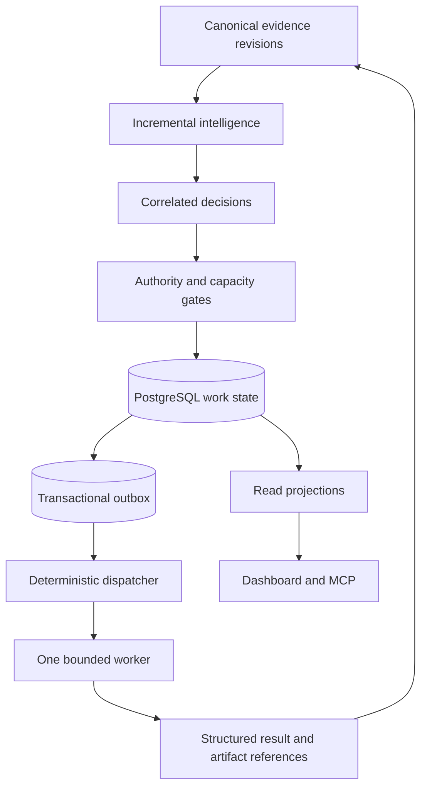

# Central Agentic Ops State-Mediated Coordination Specification

**Version:** 0.1.0  
**Status:** Working Draft  
**Latest Version:** https://github.com/githubnext/gh-aw-cao/blob/main/specs/state-mediated-coordination.md  
**Editors:** GitHub Next

## Abstract

This specification defines a state-mediated coordination architecture for
Central Agentic Ops (CAO). It replaces repeated portfolio discovery, direct
agent-to-agent communication, and non-transactional competing claims with
incremental intelligence, deterministic decision coalescing, transactional
work admission, bounded execution envelopes, and durable result references.
PostgreSQL is the coordination authority. Redis and notifications may
accelerate delivery but do not own durable state. The architecture makes agent
work proportional to changed actionable evidence and admitted work rather than
to repository count, campaign count, ledger length, or agent count.

## Status of This Document

This document is a Working Draft and may be updated, replaced, or made
obsolete. It proposes amendments to the Intelligence Specification, Control
Architecture Specification, Dashboard Data Architecture Specification, and
the historical Work/Claim ADR. It does not alter those documents until their proposed
changes are separately adopted.

Sections 2 through 13 are normative. Section 1, appendices, references, and
the change log are informative unless they contain an explicit normative
statement.

## Table of Contents

1. [Introduction](#1-introduction)
2. [Conformance](#2-conformance)
3. [Terminology](#3-terminology)
4. [Architecture](#4-architecture)
5. [Canonical Coordination Model](#5-canonical-coordination-model)
6. [Incremental Intelligence](#6-incremental-intelligence)
7. [Decision and Work Admission](#7-decision-and-work-admission)
8. [Assignment and Execution](#8-assignment-and-execution)
9. [Communication Protocol](#9-communication-protocol)
10. [Reliability and Recovery](#10-reliability-and-recovery)
11. [Security, Authority, and Privacy](#11-security-authority-and-privacy)
12. [Observability and Resource Governance](#12-observability-and-resource-governance)
13. [Migration and Proposed Amendments](#13-migration-and-proposed-amendments)
14. [Compliance Testing](#14-compliance-testing)
15. [Appendices](#15-appendices)
16. [References](#16-references)
17. [Change Log](#17-change-log)

## 1. Introduction

### 1.1 Purpose

CAO coordinates many campaigns across many repositories. Repeating discovery
and ranking in each campaign approaches $O(CR)$ work for $C$ campaigns and $R$
repositories. Direct communication among $A$ agents may approach $O(A^2)$
messages. Both forms repeat context acquisition and consume agent capacity
without necessarily producing additional repository outcomes.

This specification defines a target in which coordination cost approaches
$O(\Delta E + W)$, where $\Delta E$ is changed evidence and $W$ is admitted
work. Each admitted work item still requires at least one request and one
result; the architecture eliminates avoidable discovery, handoff, polling, and
duplicate analysis around those necessary interactions.

### 1.2 Scope

This specification covers:

- incremental evidence and intelligence processing;
- deterministic correlation, suppression, and decision coalescing;
- transactional conversion of authorized decisions into work;
- worker assignment, leases, retries, and fencing;
- durable change publication and filtered consumption;
- bounded agent request and result contracts;
- artifact-reference communication;
- communication and resource budgets; and
- migration from direct dispatch and Git-backed competing claims.

This specification does not define:

- authority beyond the CAO control policy and compiled gh-aw workflow;
- a universal operational-value score;
- a replacement for GitHub Actions execution records;
- a requirement to use agents for deterministic computations; or
- unrestricted collaboration or conversation among agents.

### 1.3 Design Goals

1. Invoke an agent only when changed evidence requires bounded judgment.
2. Compute portfolio discovery, policy gates, deduplication, and scheduling
   deterministically.
3. Persist facts once and communicate references instead of repeating payloads.
4. Preserve a complete Decision-to-Work-to-Attempt-to-Outcome trace.
5. Recover through durable state and idempotency rather than conversational
   retries.
6. Preserve fail-closed authority and independently revalidate workers.
7. Avoid full database generations, snapshots, and whole-ledger scans.

## 2. Conformance

### 2.1 Requirements Notation

> The key words "MUST", "MUST NOT", "REQUIRED", "SHALL", "SHALL NOT", "SHOULD", "SHOULD NOT", "RECOMMENDED", "NOT RECOMMENDED", "MAY", and "OPTIONAL" in this document are to be interpreted as described in [RFC 2119](https://www.ietf.org/rfc/rfc2119.txt).

### 2.2 Conformance Classes

1. **Conforming Intelligence Producer:** Computes fingerprinted measures and
   decisions according to Sections 5 through 7.
2. **Conforming Coordination Store:** Provides transactional work, attempt,
   lease, event, outbox, and cursor semantics according to Sections 5, 7, 8,
   and 10.
3. **Conforming Dispatcher:** Assigns admitted work and dispatches bounded
   workers according to Sections 8 through 11.
4. **Conforming Worker:** Processes one bounded execution envelope and emits a
   structured result according to Sections 8, 9, and 11.
5. **Conforming Observer:** Reads current projections or events without
   reconstructing authoritative state independently.

An implementation claiming a conformance class MUST satisfy every applicable
MUST and MUST NOT. A partially conforming implementation MAY report individual
test results but MUST NOT claim that conformance class.

### 2.3 Compliance Levels

| Level | Name | Required conformance |
| --- | --- | --- |
| 1 | Durable Coordination | Intelligence Producer and Coordination Store |
| 2 | Bounded Execution | Level 1, Dispatcher, and Worker |
| 3 | Adaptive Portfolio | Level 2 plus measured suppression, capacity governance, and outcome feedback |

## 3. Terminology

**Evidence revision:** A new or corrected canonical fact for one stable
subject. It is not a full copy of the canonical database.

**Evidence watermark:** A monotonic position within one source partition. A
watermark indicates consumption progress and MUST NOT imply a globally
consistent database generation.

**Input fingerprint:** A collision-resistant digest over canonical evidence
references, computation versions, and relevant configuration that fully
determine a derived result.

**Decision:** A deterministic, bounded recommendation produced by shared
intelligence after correlation and portfolio selection. A Decision does not
grant authority.

**Work:** Durable, authorized execution intent admitted from a Decision or
another trusted deterministic producer.

**Attempt:** One execution try for a Work item. An Attempt freezes the worker
identity and worker source revision.

**Lease:** A time-bounded exclusive right to dispatch or reconcile one
Attempt. A Lease is mutable coordination state, not historical evidence.

**Fencing token:** A monotonically increasing value that prevents an expired
lease holder from committing a later state transition.

**Work event:** An immutable audit fact describing a Work or Attempt
transition.

**Outbox record:** A durable notification record committed in the same
transaction as the state change it announces.

**Execution envelope:** The bounded, immutable input delivered to one worker.

**Artifact reference:** A content-addressed or otherwise immutable reference
to data stored outside an execution envelope.

## 4. Architecture

### 4.1 Required Topology



**CAO-SMC-001:** PostgreSQL MUST be the durable authority for coordination
state.

**CAO-SMC-002:** Implementations MUST NOT create full canonical-data copies to
represent generations, snapshots, publication cycles, or coordination epochs.

**CAO-SMC-003:** Redis, `LISTEN`/`NOTIFY`, and equivalent mechanisms MAY be
used for wake-up hints, caches, rate limits, or disposable acceleration. Their
loss MUST NOT lose accepted Work, Attempts, results, or consumer progress.

**CAO-SMC-004:** Agents MUST NOT communicate directly with other agents as the
normal coordination path. They MUST exchange state through typed records,
bounded envelopes, and immutable artifact references.

**CAO-SMC-005:** Deterministic code MUST own policy evaluation, correlation,
deduplication, capacity admission, assignment, retries, and state reduction.

### 4.2 Write and Read Models

The write model MUST preserve normalized authoritative state and immutable
audit events. Read projections MAY denormalize current state for Dashboard
Language, MCP, reporting, and operational inspection.

A consumer MUST NOT reconstruct a competing authoritative state machine from
events when a canonical current-state projection exists. Rebuilding a
projection for disaster recovery MAY replay events using the same versioned
reducer as the production writer.

### 4.3 Partitioning

Evidence, derived computations, and outbox delivery SHOULD be partitioned by
the narrowest stable ownership key that preserves correctness, such as
repository, campaign, or source. A partitioning scheme MUST preserve global
constraints through transactional admission or an explicitly versioned
portfolio computation.

## 5. Canonical Coordination Model

### 5.1 Required Records

The Coordination Store MUST represent at least:

| Record | Durability | Purpose |
| --- | --- | --- |
| Evidence change | Durable | Identifies changed canonical input |
| Derived result | Reconstructable | Stores a fingerprinted measure or analysis |
| Decision | Reconstructable and auditable | Stores one correlated portfolio recommendation |
| Work | Durable | Stores one authorized execution intent |
| Attempt | Durable | Stores one execution try and frozen worker revision |
| Lease | Ephemeral but transactional | Coordinates one active dispatcher |
| Work event | Durable and immutable | Audits state transitions |
| Outbox record | Durable until acknowledged | Publishes committed changes |
| Consumer cursor | Durable | Records partition progress |

### 5.2 Stable Identity

**CAO-SMC-010:** A Decision identifier MUST be stable for the same decision
class, subject, operation, and correlation group.

**CAO-SMC-011:** A Work intent key MUST be derived from at least:

```text
(subject, operation, effective_policy_sha, evidence_fingerprint)
```

An implementation MAY include campaign or authority-partition identifiers
when they materially alter execution intent.

**CAO-SMC-012:** The Coordination Store MUST enforce uniqueness of active or
successfully completed Work by intent key. Duplicate admission MUST return the
existing Work identity without creating another executable item.

**CAO-SMC-013:** Identifiers MUST NOT depend on record insertion order,
timestamps, Git merge order, or lexicographic selection among competing
records.

### 5.3 State

Work MUST use a finite state machine equivalent to:

```text
admitted -> ready -> running -> succeeded
                    |       -> failed -> ready
                    |       -> review-required
                    |       -> exhausted
         -> blocked
         -> cancelled
         -> expired
```

The transition and corresponding Work event MUST be committed atomically.
Historical events MUST NOT substitute for an indexed current-state row on the
dispatch path.

### 5.4 Provenance

Every Decision, Work, Attempt, and result MUST preserve identifiers for its
upstream record, input fingerprint, policy revision, computation version, and
originating authority. Unknown provenance MUST remain unknown and MUST NOT be
inferred from temporal proximity.

## 6. Incremental Intelligence

### 6.1 Change Processing

**CAO-SMC-020:** An Intelligence Producer MUST consume changed partitions from
durable cursors or an equivalent lossless change mechanism.

**CAO-SMC-021:** A change MUST invalidate only derived results whose declared
dependencies intersect that change, except where a versioned global
computation requires broader recomputation.

**CAO-SMC-022:** A computation with an unchanged input fingerprint MUST reuse
its prior result and MUST NOT invoke an agent solely to reproduce that result.

**CAO-SMC-023:** Implementations MUST NOT require every campaign or agent to
scan all repositories, all evidence, or the complete event ledger.

### 6.2 Correlation and Suppression

One underlying condition SHOULD produce one Decision with multiple supporting
signals. Correlation MUST occur before agent invocation and before Work
admission.

The Intelligence Producer MUST suppress or defer a candidate when:

- equivalent active Work already exists;
- unchanged evidence previously produced a terminal result;
- a declared backoff or cooldown is active;
- required evidence, authority, or capacity is unavailable;
- a higher-priority Decision subsumes the same intervention; or
- the expected information gain does not justify its declared resource floor.

Suppression MUST remain inspectable and MUST identify the rule, relevant
record, and next reconsideration condition.

### 6.3 Agent Eligibility

An agent MAY be invoked for repository-specific interpretation, synthesis,
experimentation, or remediation where deterministic rules are insufficient.
An agent SHOULD NOT be invoked for filtering, joining, counting, policy
intersection, retry calculation, queue selection, or unchanged-result replay.

Parallel or ensemble agents MAY be used only when a declared decomposition or
independent-sampling policy defines:

- the distinct contribution expected from each agent;
- a finite fan-out and round limit;
- a deterministic aggregator or verifier;
- a resource budget; and
- a stopping condition.

Free-form peer conversation MUST NOT be the system of record.

## 7. Decision and Work Admission

### 7.1 Decision Contract

An executable Decision MUST include:

```json
{
  "decisionId": "optimize:githubnext/gh-aw:token-usage",
  "decisionVersion": "1.0.0",
  "subject": { "repository": "githubnext/gh-aw" },
  "operation": "optimization-token-optimizer",
  "evidenceFingerprint": "sha256:...",
  "evidenceReferences": ["cao-evidence://..."],
  "effectivePolicySha": "...",
  "recommendedMode": "review",
  "resourceCeiling": { "aiCredits": 1000, "attempts": 2 },
  "successCondition": { "contract": "operational-value", "version": "1" },
  "expiresAt": "2026-10-08T00:00:00Z"
}
```

The contract MAY contain additional typed fields. It MUST NOT contain secrets,
credentials, complete prompt transcripts, or authority not present in the
referenced policy.

### 7.2 Admission Transaction

**CAO-SMC-030:** Decision-to-Work conversion MUST be performed by trusted
deterministic code in one database transaction.

The transaction MUST:

1. validate the Decision schema and provenance;
2. resolve and intersect current policy and requested bounds;
3. reject expired, revoked, incomplete, or unauthorized Decisions;
4. enforce portfolio and subject capacity;
5. insert or return the unique Work intent;
6. append the corresponding Work event; and
7. insert an outbox record.

An agent MUST NOT directly insert Work, Attempt, Lease, event, outbox, or
cursor rows. An agent MAY request admission through a bounded safe output whose
trusted implementation performs this transaction.

### 7.3 Policy Changes

A Work item MUST preserve the policy revision under which it was admitted.
Before dispatch, the current policy MUST be intersected with the admitted
envelope. A later policy MAY narrow, block, cancel, or require review. It MUST
NOT widen the admitted envelope.

## 8. Assignment and Execution

### 8.1 Attempt Creation

The Dispatcher MUST create an Attempt before dispatch. Attempt creation MUST
freeze the worker repository, workflow identity, and source SHA resolved from
trusted workflow inventory. The agent MUST NOT choose the worker SHA.

Retries MUST create new Attempts associated with the same Work. They MUST NOT
create competing Work or immutable Claims requiring hash-based conflict
resolution.

### 8.2 Queue Claiming

A Dispatcher MAY claim ready Work using PostgreSQL row locking with `FOR
UPDATE SKIP LOCKED` or equivalent transactional semantics. Selection MUST use
a deterministic priority and tie-break order before locking.

A Lease MUST contain an owner, expiration, and fencing token. Only the current
fencing token may commit dispatch-sensitive transitions. Expired lease holders
MUST be rejected even if their external work later completes.

### 8.3 Execution Envelope

A worker MUST receive exactly one envelope containing:

- `work_id`, `attempt_id`, and correlation identifier;
- one target repository;
- one requested operation;
- one frozen worker workflow and source revision;
- one effective mode and output destination;
- evidence and artifact references;
- evidence fingerprint and policy provenance;
- resource and time ceilings;
- output contract and success condition; and
- control repository and run provenance.

The worker MUST NOT discover other targets, select unrelated work, dispatch
another worker, widen authority, or reconstruct portfolio ranking.

### 8.4 Result Contract

A worker result MUST include its Work and Attempt identifiers, disposition,
structured findings, produced artifact references, consumed resources, output
references, and observed success evidence. Large or reusable payloads MUST be
stored once and referenced by immutable identity.

The result MUST distinguish completion of execution from acceptance of an
outcome and attainment of operational value.

## 9. Communication Protocol

### 9.1 State-Mediated Communication

All cross-component coordination MUST use one of:

- a committed canonical record;
- a committed outbox record carrying identifiers;
- a bounded execution envelope; or
- an immutable artifact reference.

Prompts and messages SHOULD contain the minimum context needed to perform the
bounded operation. A component SHOULD dereference only the records required by
that operation.

### 9.2 Outbox and Consumers

Every state change requiring downstream processing MUST create its outbox
record in the same transaction. Delivery MAY be at least once. Consumers MUST
be idempotent by outbox identity and business identity.

Consumer cursors MUST be durable and partition-specific. Consumers MUST NOT
advance a cursor until all preceding required records in that partition are
committed or explicitly dead-lettered. Notifications MAY wake consumers but
MUST NOT replace outbox polling and recovery.

### 9.3 Prohibited Communication

Implementations MUST NOT:

- broadcast full portfolio state to every agent;
- use agent conversation as a lock, lease, queue, or retry mechanism;
- require agents to poll one another for completion;
- copy large artifacts into multiple handoff messages when a stable reference
  is available; or
- infer completion from silence or elapsed time.

## 10. Reliability and Recovery

### 10.1 Delivery Semantics

The architecture MUST assume that dispatch and external safe outputs may be
observed more than once. Exactly-once external effects MUST NOT be assumed.
Safe-output execution MUST use an idempotency key derived from Work, Attempt,
and output identity.

### 10.2 Retry and Backoff

Retry policy MUST be deterministic and MUST define eligible failures, maximum
attempts, backoff, expiration, and escalation. Policy or authorization failures
MUST NOT be retried as transient failures.

When retries are exhausted, Work MUST transition to `exhausted` or
`review-required`. It MUST NOT remain indefinitely dispatchable.

### 10.3 Recovery Cases

| Failure | Required recovery |
| --- | --- |
| Transaction commits; notification is lost | Outbox polling delivers the record |
| Dispatcher fails before external dispatch | Lease expiry makes the Work claimable |
| External dispatch succeeds; acknowledgement is lost | Correlation and idempotency reconcile the existing Run |
| Worker result is delivered twice | Result identity makes the second delivery a no-op |
| Policy narrows before worker start | Worker revalidation narrows or rejects execution |
| Redis or notification service is lost | Durable PostgreSQL state continues processing |

## 11. Security, Authority, and Privacy

### 11.1 Authority

The CAO control policy remains the persistent non-secret rollout authority.
The compiled gh-aw workflow remains the execution-capability authority.
Intelligence confidence, priority, operational value, credential reach, and
database possession MUST NOT grant authority.

Every worker MUST independently revalidate the least-permissive intersection
of admitted policy, current policy, worker ceilings, credential reach, and
compiled capabilities before model invocation and safe-output execution.

### 11.2 Access Control

Database roles SHOULD separate evidence ingestion, intelligence production,
admission, dispatch, worker results, and read-only observation. Row-level
security SHOULD restrict subject and control-repository scope. Privileged
operations MUST fail closed when identity or scope is unavailable.

### 11.3 Sensitive Data

Records, events, envelopes, logs, and artifact references MUST NOT contain
tokens, private keys, authorization headers, or credential-bearing URLs.
Implementations SHOULD minimize stored prompt and response content and SHOULD
define retention independently for operational state, audit evidence, and
debug data.

## 12. Observability and Resource Governance

### 12.1 Required Metrics

A Level 2 implementation MUST measure:

- changed evidence partitions processed;
- derived-result cache hits and invalidations;
- Decisions correlated, suppressed, admitted, and rejected;
- duplicate admissions prevented;
- ready Work age and queue depth;
- Work-to-Attempt and Attempt-to-Run latency;
- lease expiration and fencing rejection;
- retry, dead-letter, and reconciliation counts;
- agent invocations, turns, tool calls, tokens, AI Credits, and artifact bytes;
- reused evidence and artifacts; and
- outcomes and operational-value dispositions.

### 12.2 Communication Budgets

Every operation class SHOULD declare maximum agent fan-out, coordination
rounds, prompt bytes, artifact bytes, tool calls, execution attempts, and total
AI Credits. Exceeding a hard budget MUST stop, defer, or require explicit
review; it MUST NOT silently increase fan-out.

### 12.3 Scaling Evaluation

Compliance evaluation SHOULD demonstrate that unchanged repositories do not
cause new agent invocations and that adding idle workers does not increase
message volume. Tests SHOULD report cost against changed evidence and admitted
Work, not only total repository count.

## 13. Migration and Proposed Amendments

### 13.1 Migration Sequence

Implementations SHOULD migrate in this order:

1. Add fingerprinted intelligence results and stable Decision identities,
   publishing advisory Decisions without admission or dispatch.
2. Add PostgreSQL Work, Attempt, Lease, event, outbox, and cursor tables.
3. Shadow-admit Work without dispatch and compare it with existing direct
   dispatch selections.
4. Enable queue-driven dispatch for one low-risk review-only campaign.
5. Reconcile Runs and outcomes through stable Work and Attempt identifiers.
6. Disable direct dispatch for that campaign before enabling queue execution
   elsewhere.
7. Export immutable audit events to repository memory only when portability or
   long-term archival requires it.
8. Remove post-hoc timestamp matching after stable correlation is complete.

Migration MUST NOT execute both direct and queue-driven dispatch for the same
intent unless an explicit test mode suppresses external effects on one path.

### 13.2 Intelligence Specification

The [Intelligence Specification](intelligence.md) should be revised to:

- replace `generation-scoped` derived results with input fingerprints,
  evidence watermarks, and independently recomputable partitions;
- define the Decision-to-Work admission contract from Section 7;
- require correlation and suppression before agent invocation;
- route bounded worker execution through durable Work rather than direct
  dispatch; and
- include communication-efficiency and duplicate-analysis measures.

### 13.3 Work/Claim ADR

The [Work/Claim ADR](../adr/work-claim.md) is superseded as a description of
current behavior by [the work-queue specification](work-queue.md). This
Working Draft proposes a further, unimplemented coordination architecture that
would:

- replace `repo-memory.ledger` as the live coordination authority with
  PostgreSQL;
- retain repository-memory JSONL only as an optional audit export;
- replace agent-authored immutable Claims with deterministic Work admission,
  Attempts, transactional Leases, and fencing tokens;
- replace SHA-based conflict selection with database uniqueness and locking;
- replace whole-ledger effective-state reduction on the dispatch path with
  indexed current-state projections; and
- preserve Decision-to-Work-to-Attempt-to-Run provenance.

### 13.4 Control Architecture Specification

The [Control Architecture Specification](control-architecture.md) should be
revised so an orchestrator or trusted intelligence producer MAY request Work
admission instead of directly dispatching a worker. The revision should retain
all current authority intersections and worker revalidation while moving
cross-campaign discovery, ranking, capacity, and dispatch selection into
deterministic shared services.

### 13.5 Dashboard Data Architecture Specification

The [Dashboard Data Architecture Specification](dashboard-data.md) should add
canonical Decision, Work, Attempt, and result projections. Dashboard Language
queries SHOULD consume those projections through the existing worker query
boundary. The dashboard MUST NOT read the operational outbox, acquire leases,
or reconstruct authoritative queue state.

## 14. Compliance Testing

### 14.1 Test Procedure

A compliance suite MUST record the implementation revision, specification
version, claimed class, and claimed level. It MUST use isolated fixtures,
exercise concurrent consumers, and report every applicable test as passed or
failed.

### 14.2 Required Tests

| Test ID | Procedure | Expected result | Level |
| --- | --- | --- | --- |
| T-SMC-001 | Reprocess an unchanged evidence partition | Fingerprint is reused; no agent is invoked | 1 |
| T-SMC-002 | Admit the same Decision concurrently | One Work item exists; all callers receive its identity | 1 |
| T-SMC-003 | Change one repository's evidence | Only declared dependent partitions are invalidated | 1 |
| T-SMC-004 | Remove Redis and drop notifications | Accepted Work remains durable and processable | 1 |
| T-SMC-005 | Run two dispatchers against ready Work | Each Work item receives at most one current lease | 2 |
| T-SMC-006 | Commit using an expired fencing token | Transition is rejected | 2 |
| T-SMC-007 | Lose dispatch acknowledgement after Run creation | Existing Run is correlated; no duplicate effect occurs | 2 |
| T-SMC-008 | Narrow policy after admission | Worker executes within narrower policy or is rejected | 2 |
| T-SMC-009 | Inspect a worker envelope | One target and operation are present; credentials and portfolio state are absent | 2 |
| T-SMC-010 | Deliver one result twice | Second delivery is an idempotent no-op | 2 |
| T-SMC-011 | Exceed the declared retry limit | Work becomes exhausted or review-required | 2 |
| T-SMC-012 | Add idle workers without adding Work | Agent message and invocation counts do not increase | 3 |
| T-SMC-013 | Produce correlated signals for one condition | One Decision contains the supporting signals | 3 |
| T-SMC-014 | Repeat terminal analysis with unchanged inputs | Suppression rule prevents duplicate Work and agent analysis | 3 |
| T-SMC-015 | Inspect dashboard data access | Current projections are queried; outbox and leases are not used | 3 |

### 14.3 Compliance Checklist

A conforming deployment:

- [ ] uses PostgreSQL as the durable coordination authority;
- [ ] creates no full database generations or coordination snapshots;
- [ ] uses stable Decision and Work identities;
- [ ] enforces transactional Work uniqueness;
- [ ] consumes evidence and events incrementally through durable cursors;
- [ ] reuses unchanged fingerprinted results;
- [ ] performs correlation and suppression before agent invocation;
- [ ] assigns one bounded operation to each worker;
- [ ] uses Attempts, Leases, and fencing rather than competing Claims;
- [ ] communicates large results by immutable reference;
- [ ] publishes changes through a transactional outbox;
- [ ] treats notifications and Redis as disposable acceleration;
- [ ] retries only under deterministic bounded policy;
- [ ] preserves CAO and gh-aw authority boundaries; and
- [ ] measures communication cost and avoided duplicate work.

## 15. Appendices

### Appendix A: Example Admission Transaction

The following SQL is informative and omits schema-specific details:

```sql
BEGIN;

INSERT INTO work_items (intent_key, decision_id, state, policy_sha)
VALUES ($1, $2, 'ready', $3)
ON CONFLICT (intent_key) DO NOTHING;

INSERT INTO work_events (work_id, event_type, payload)
SELECT id, 'admitted', $4
FROM work_items
WHERE intent_key = $1
  AND NOT EXISTS (
    SELECT 1 FROM work_events
    WHERE work_id = work_items.id AND event_type = 'admitted'
  );

INSERT INTO coordination_outbox (event_key, aggregate_id, event_type)
VALUES ($5, (SELECT id FROM work_items WHERE intent_key = $1), 'work-ready')
ON CONFLICT (event_key) DO NOTHING;

COMMIT;
```

### Appendix B: Example Queue Claim

The following SQL is informative:

```sql
WITH candidate AS (
  SELECT id
  FROM work_items
  WHERE state = 'ready'
    AND available_at <= CURRENT_TIMESTAMP
  ORDER BY priority DESC, created_at, id
  FOR UPDATE SKIP LOCKED
  LIMIT 1
)
UPDATE work_items AS work
SET state = 'running',
    lease_owner = $1,
    lease_expires_at = CURRENT_TIMESTAMP + $2::interval,
    fencing_token = fencing_token + 1
FROM candidate
WHERE work.id = candidate.id
RETURNING work.*;
```

### Appendix C: Error Codes

| Code | Meaning | Recovery |
| --- | --- | --- |
| `SMC-INVALID-DECISION` | Decision schema or provenance is invalid | Correct the producer; do not retry unchanged input |
| `SMC-AUTHORITY-DENIED` | Policy does not authorize the Work | Fail closed; require reviewed policy change |
| `SMC-DUPLICATE-INTENT` | Equivalent Work already exists | Return the existing Work identity |
| `SMC-CAPACITY-DEFERRED` | Capacity is temporarily unavailable | Reconsider at the recorded availability time |
| `SMC-LEASE-STALE` | Lease expired or fencing token is obsolete | Discard the transition and reacquire Work |
| `SMC-RETRY-EXHAUSTED` | Attempt limit was reached | Require review or terminal disposition |
| `SMC-RESULT-CONFLICT` | Result conflicts with a committed terminal result | Preserve evidence and require deterministic reconciliation |

### Appendix D: Security Considerations

Queue records and artifact references can expose repository identity,
operational priorities, and findings even when they contain no credentials.
Implementations should apply least privilege, encrypt network and persistent
storage, audit privileged reads and transitions, validate artifact integrity,
bound retention, and prevent untrusted payloads from selecting SQL, workflow
revisions, output destinations, or credentials.

## 16. References

### 16.1 Normative References

- **[RFC 2119]** Bradner, S. [Key words for use in RFCs to Indicate Requirement Levels](https://www.ietf.org/rfc/rfc2119.txt). March 1997.
- **[PostgreSQL 18 SELECT]** [Locking clauses and `SKIP LOCKED`](https://www.postgresql.org/docs/18/sql-select.html#SQL-FOR-UPDATE-SHARE).
- **[PostgreSQL 18 NOTIFY]** [Asynchronous notification](https://www.postgresql.org/docs/18/sql-notify.html).
- **[CAO Control Architecture]** [Central Agentic Ops Control Architecture Specification](control-architecture.md).
- **[CAO Intelligence]** [Central Agentic Ops Intelligence Specification](intelligence.md).

### 16.2 Informative References

- **[Anthropic Multi-Agent Research]** [How we built our multi-agent research system](https://www.anthropic.com/engineering/multi-agent-research-system).
- **[Scaling Agent Systems]** Kim et al. [Towards a Science of Scaling Agent Systems](https://arxiv.org/abs/2512.08296).
- **[Publisher-Subscriber]** Microsoft. [Publisher-Subscriber pattern](https://learn.microsoft.com/en-us/azure/architecture/patterns/publisher-subscriber).
- **[Competing Consumers]** Microsoft. [Competing Consumers pattern](https://learn.microsoft.com/en-us/azure/architecture/patterns/competing-consumers).
- **[CQRS]** Microsoft. [Command and Query Responsibility Segregation pattern](https://learn.microsoft.com/en-us/azure/architecture/patterns/cqrs).
- **[Work/Claim ADR]** [Ledger-Backed Work and Claim Orchestration in CAO](../adr/work-claim.md).

## 17. Change Log

### Version 0.1.0 (Working Draft)

- **Added:** State-mediated coordination architecture and conformance model.
- **Added:** Incremental intelligence, fingerprinting, and suppression requirements.
- **Added:** Transactional Decision-to-Work admission and stable intent identity.
- **Added:** Attempt, Lease, fencing, outbox, and bounded worker contracts.
- **Added:** Migration plan and proposed amendments to related specifications.

---

*Copyright © 2026 GitHub Next. All rights reserved.*